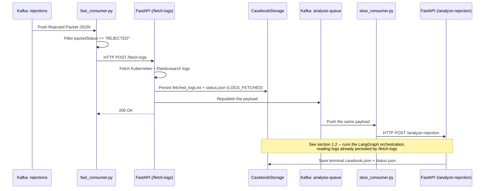
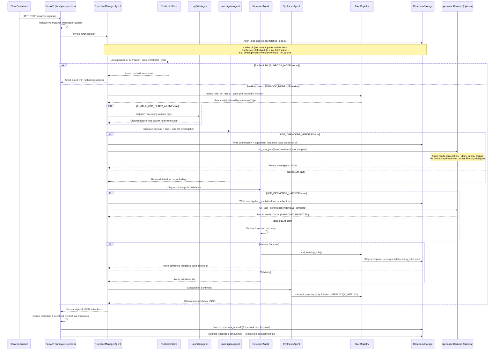
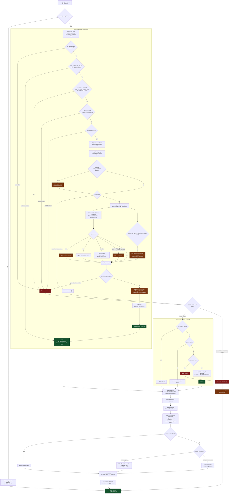
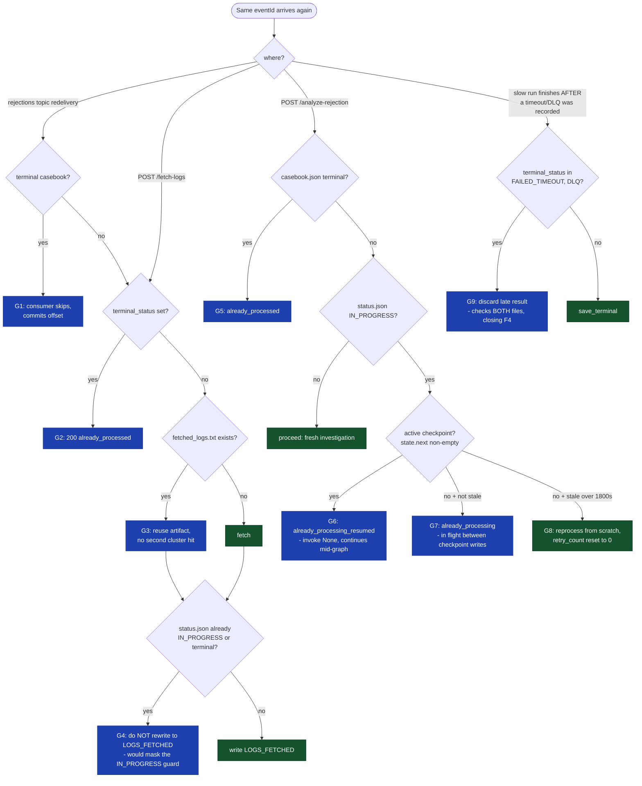
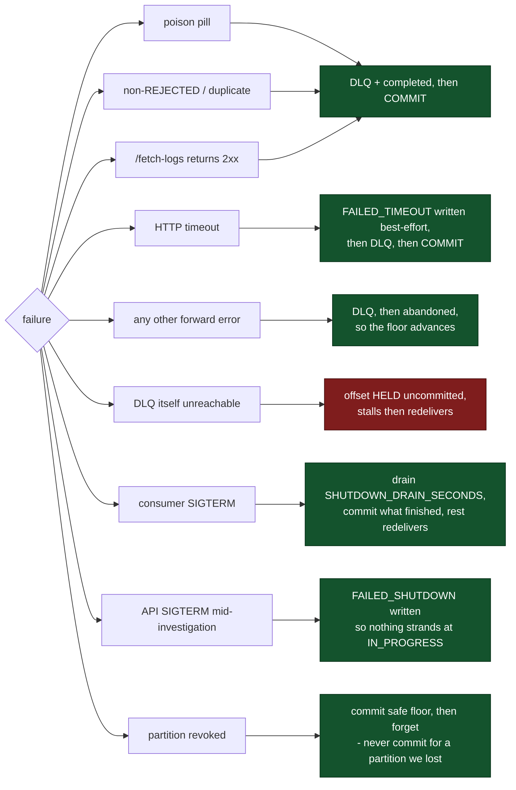

# Agentic Resident CRM: Deep Dive and Architecture

## Overview
**Agentic Resident CRM** is an AI-driven service that investigates two kinds of
packet failure in the UIDAI biometric enrolment/update pipeline and produces a
structured JSON casebook for each, explaining why it failed and what should be
done next.

**Two parallel lanes** share one codebase -- log pipeline, storage abstraction,
consumer scaffolding, and confidence policy -- but solve different problems:

- **Rejection lane** (`/fetch-logs` -> `/analyze-rejection`): a packet was
  *processed* and *rejected* by a business rule (e.g.
  `RESIDENT_MAN_DEDUP_REJECT_TD`). A deterministic LangGraph `StateGraph` runs
  a cache-first log fetch, an optional runbook short-circuit (zero LLM calls
  when a served runbook matches), then an Investigator -> Reviewer ->
  Synthesis agent chain that correlates the reason code with the DB rule and
  the reduced log trace. A reviewer-validated learning loop stages corrections
  to `pending_rules.jsonl` for human promotion -- nothing reaches the
  Investigator's prompt without an operator running `promote_rules.py`.
- **Dead-letter topic (DLT) lane** (`/fetch-dlt-logs` -> `/analyze-dlt`): a
  packet *crashed* -- an unhandled exception, not a business rejection.
  `dlt_consumer.py` consumes the Spring `@RetryableTopic` dead-letter topic,
  fingerprints the failure from its stack trace, corroborates that trace
  against the service's own pod logs (the mis-cast detector), and writes an
  advisory casebook. An opt-in replay precheck joins the stack trace to
  `release` in Bitbucket through the running pod's image version and may
  **park** a replay -- the "ON HOLD" state -- until the fix that would resolve
  it has actually deployed (section 4.4.1). Everything in this lane is off by
  default (`DLT_ENABLED=false`).

Each lane is split into two independently-scalable stages -- bounded
Kubernetes/Elasticsearch log fetch (fast) and unbounded LLM analysis (slow) --
connected by a second Kafka topic, so an LLM backlog can never stall log
collection and let short-retention pod logs rotate away before a packet is
even fetched (section 3.11). Replay actions are human-gated unless
`ENABLE_AUTO_REPLAY=true`. Section 1 has the complete flow with every branch
and duplicate-arrival guard; section 4.4 covers the DLT lane in full.

---

## 1. High-Level Workflow

Ingestion is split into two independently-scalable stages -- fetching
Kubernetes/Elasticsearch logs (bounded, fast I/O) and running the LLM
investigation (unbounded, slow) -- so a backlog in the LLM stage can never
stall log collection and let short-retention Kubernetes logs rotate away
before a packet is even fetched. See section 3.11 for the full design.

### 1.1 Two-Stage Ingestion



### 1.2 Analysis Workflow (inside POST /analyze-rejection)



### 1.3 Complete Flow -- Every Path

Sections 1.1 and 1.2 show the happy path. This section is the normative
reference: every branch, degradation, and duplicate-arrival case the code
actually implements. Where a diagram and the prose disagree, the code wins --
each node below is annotated with the module that owns it.

Five views, because one diagram covering all of it would be unreadable:

| View | Answers |
| --- | --- |
| 1.3.1 Master flow | What happens to a packet from Kafka to terminal casebook |
| 1.3.2 Log acquisition | Where logs come from, and what happens when they do not arrive |
| 1.3.3 LangGraph state machine | Runbook modes, the retry loop, synthesis repair, abstention |
| 1.3.4 Idempotency | What happens when the same packet arrives twice |
| 1.3.5 Offset and failure matrix | Which failures commit, which redeliver, which stall |

#### 1.3.1 Master flow

```mermaid
flowchart TD
    classDef term fill:#7f1d1d,stroke:#450a0a,color:#ffffff
    classDef skip fill:#1e40af,stroke:#1e3a8a,color:#ffffff
    classDef good fill:#14532d,stroke:#052e16,color:#ffffff
    classDef store fill:#334155,stroke:#0f172a,color:#ffffff
    classDef dlq fill:#78350f,stroke:#451a03,color:#ffffff

    K1(["Kafka: rejections topic"])

    subgraph FAST["fast_consumer.py -- CONSUMER_ROLE=fast, kafkaConsumer.py"]
        K1 --> POLL["poll, enable_auto_commit=false"]
        POLL --> SEM{"worker slot free?<br/>_queue_semaphore"}
        SEM -->|"no: block BEFORE parsing"| POLL
        SEM -->|yes| TRK["OffsetTracker.dispatched tp, offset"]
        TRK --> VAL{"decode utf-8, json.loads,<br/>MessagePayload validate"}
        VAL -->|"invalid: poison pill"| PP["publish_to_dlq raw string"]
        VAL -->|valid| RJ{"packetStatus == REJECTED?"}
        RJ -->|no| SK1["skip: non-rejected packet"]
        RJ -->|yes| D1{"terminal casebook exists?<br/>storage.exists terminal_only"}
        D1 -->|"yes: DUPLICATE"| SK2["skip: already processed"]
        D1 -->|no| SUB["worker pool submit"]
    end

    PP --> RC1["record_completion -- offset commits"]
    SK1 --> RC1
    SK2 --> RC1

    SUB --> POST1["POST /fetch-logs<br/>FAST_CONSUMER_TIMEOUT_SECONDS=90"]

    subgraph FL["POST /fetch-logs -- routes.py, sync, no LLM"]
        POST1 --> AUTH1{"X-API-Key valid?<br/>hmac.compare_digest"}
        AUTH1 -->|no| E403["403"]
        AUTH1 -->|yes| RL1{"rate limit<br/>exempt CIDR or under RATE_LIMIT?"}
        RL1 -->|no| E429["429"]
        RL1 -->|yes| T1{"terminal_status in<br/>TERMINAL_STATUSES?"}
        T1 -->|"yes: DUPLICATE"| AP1["200 already_processed"]
        T1 -->|no| ART{"fetched_logs.txt exists?"}
        ART -->|"yes: reuse artifact"| STAT
        ART -->|no| FETCH["fetch_and_persist_logs<br/>see 1.3.2"]
        FETCH --> FOK{"logs returned?"}
        FOK -->|"yes or 'Log fetching disabled.'"| SAVEA["save_artifact fetched_logs.txt"]
        FOK -->|"None: breaker open or pipeline raised"| NOSAVE["persist nothing<br/>slow side will retry live"]
        SAVEA --> STAT
        NOSAVE --> STAT
        STAT{"status.json is<br/>absent or LOGS_FETCHED?"}
        STAT -->|yes| WSTAT["write status.json = LOGS_FETCHED"]
        STAT -->|"no: IN_PROGRESS or terminal"| KEEP["leave status.json untouched<br/>must not mask the IN_PROGRESS guard"]
        WSTAT --> PUB
        KEEP --> PUB
        PUB{"publish_to_analysis_queue"}
        PUB -->|raises| E500["500 -- offset NOT committed"]
        PUB -->|ok| Q200["200 queued_for_analysis"]
    end

    E403 --> DLQ1
    E429 --> DLQ1
    E500 --> DLQ1["_dlq_and_abandon:<br/>publish DLQ, then release the floor"]
    AP1 --> RC1
    Q200 --> RC1

    Q200 --> K2(["Kafka: packet-analysis-queue"])

    subgraph SLOW["slow_consumer.py -- CONSUMER_ROLE=slow, same module"]
        K2 --> POLL2["identical guards:<br/>poison pill, REJECTED, terminal dedupe"]
        POLL2 --> POST2["POST /analyze-rejection<br/>PACKET_TIMEOUT_SECONDS=300"]
    end

    subgraph AN["POST /analyze-rejection -- _investigate_packet, async"]
        POST2 --> T2{"casebook.json terminal?"}
        T2 -->|"yes: DUPLICATE"| AP2["already_processed"]
        T2 -->|no| CKPT["agent.get_state thread_id=eventId<br/>has_active_checkpoint = bool state.next"]
        CKPT --> IP{"status.json == IN_PROGRESS?"}
        IP -->|no| STUB
        IP -->|yes| STALE{"age exceeds MAX_IN_PROGRESS_AGE_SECONDS<br/>default 1800s?"}
        STALE -->|"no + active checkpoint"| RES["already_processing_resumed<br/>invoke None, resumes graph"]
        STALE -->|"no + no checkpoint"| BUSY["already_processing -- skip"]
        STALE -->|"yes + no checkpoint"| STUB["write status.json = IN_PROGRESS"]
        STALE -->|"yes + active checkpoint"| RES
        STUB --> INV["run_in_executor _agent_invoke_executor<br/>asyncio.wait_for AGENT_INVOKE_TIMEOUT_SECONDS"]
        RES --> INV
        INV --> GRAPH["LangGraph -- see 1.3.3"]
        GRAPH --> OUT{"outcome"}
        OUT -->|"asyncio.TimeoutError"| FT["save_terminal FAILED_TIMEOUT"]
        OUT -->|"unhandled exception"| DQ["publish_to_dlq +<br/>save_terminal DLQ"]
        OUT -->|"returned a state"| PARSE{"parse_synthesis<br/>against the contract"}
        PARSE -->|invalid| FSP["FAILED_SYNTHESIS_PARSE<br/>evidence kept, verdict replaced"]
        PARSE -->|valid| LOGSZ{"raw logs present?"}
        LOGSZ -->|"none / 'Log fetching disabled.'"| NOLOG["rejection_logs.path =<br/>'No logs found'"] --> BUILD
        LOGSZ -->|yes| ART2["save_artifact supported_logs.txt<br/>through CasebookStorage -- no size threshold"]
        ART2 --> BUILD["build casebook<br/>rejection_logs.path = 'supported_logs.txt'"]
        FSP --> BUILD
        BUILD --> LATE{"terminal_status in<br/>PROTECTED_TERMINAL_STATUSES<br/>FAILED_TIMEOUT, DLQ?"}
        LATE -->|"yes: another actor won"| DISC["discard late result"]
        LATE -->|no| SAVE["save_terminal<br/>casebook.json + status.json together"]
    end

    AP2 --> RC2["record_completion -- offset commits"]
    FT --> CLEAN["cleanup_casebook_dir<br/>removes local working files"]
    DQ --> CLEAN
    SAVE --> CLEAN
    CLEAN --> RC2
    RES --> RC2
    BUSY --> RC2
    DISC --> RC2

    class PP,DLQ1,DQ,FT dlq
    class SK1,SK2,AP1,AP2,BUSY,DISC,KEEP,NOSAVE skip
    class SAVE,Q200,RC1,RC2,CLEAN good
    class SAVEA,WSTAT,STUB,ART2 store
    class E403,E429,E500,FSP term
```



#### 1.3.2 Log acquisition -- source chain and every failure mode

`LOG_SOURCE` is an ordered chain, default `kubernetes,elastic`. Fallback fires
when a source fails **or** returns zero records -- both mean "we did not get
logs here". Sources are never merged; one wins per fetch.



> **Why an empty result is not a failure.** `FetchResult.ok` separates
> *could-not-look* from *looked-and-found-nothing*. Collapsing the two would let
> the Investigator conclude "no errors occurred" when the truth is "we could not
> read the logs". Every gap above is rendered into a banner placed **before** the
> trace, and `apply_confidence_policy` caps confidence at
> `SYNTHESIS_GAP_CONFIDENCE_CEILING` (0.6) whenever that banner is present.

#### 1.3.3 LangGraph state machine

Nodes are compiled once and cached (`get_agent`); the checkpointer is keyed on
`thread_id = eventId`, which is what makes a resume possible.

```mermaid
stateDiagram-v2
    [*] --> fetch_logs

    fetch_logs: fetch_logs_node
    note right of fetch_logs
        Cache-first: fetched_logs.txt from /fetch-logs.
        Artifact PRESENT - whatever its content, including
        the disabled/no-logs sentinels - means a fetch was
        already attempted. Absent falls back to a live
        fetch, which is what keeps /process-rejection and
        local_run.py working unchanged.
    end note

    fetch_logs --> runbook_lookup

    state runbook_lookup {
        [*] --> mode_check
        mode_check: RUNBOOK_MODE?
        mode_check --> agents_off: off (default) - counted as no lookup
        mode_check --> resolve: shadow or serve
        resolve --> miss_norc: no errorReasonCode
        resolve --> miss_none: no runbook file
        resolve --> miss_fp: rule_fingerprint mismatch (DB rule changed)
        resolve --> miss_err: any exception - never propagates
        resolve --> shadow_path: mode=shadow OR code not in RUNBOOK_SERVE_ALLOWLIST
        resolve --> hit: mode=serve AND code allowlisted
    }

    hit --> [*]: SHORT-CIRCUIT - zero LLM calls, synthesis = runbook resolution
    miss_norc --> route
    miss_none --> route
    miss_fp --> route
    miss_err --> route
    agents_off --> route
    shadow_path --> route: runbook answer carried as shadow_runbook_resolution

    route: check_runbook_hit
    route --> filter_logs: ENABLE_LOG_FILTER_AGENT=true
    route --> investigate: otherwise

    filter_logs --> investigate: skipped when logs<br/>empty or disabled

    investigate: investigator_node
    note left of investigate
        First pass sends a PROJECTED payload, the logs, and
        the DB rule. Retry sends prior analysis + reviewer
        feedback + the LOGS AGAIN - the reviewer's most
        common rejection is unsupported citations, so the
        retry must keep the evidence.

        When USE_OPENCODE_HARNESS=true (and not a retry):
        writes context.json + supported_logs.txt to the local
        casebook dir, then calls opencode_runner.run_task_json
        with the RejectionInvestigator harness prompt template.
        The agent reads those files plus the docs_cache/ DROA
        corpus via Glob/Grep/Read, and writes investigation.json.
        Falls back to direct LLM on harness failure. Harness
        prompts live in src/prompts/harness/ as .md templates
        with {{var}} placeholders, loaded by prompt_loader.py.
    end note

    investigate --> review
    review: reviewer_node - retry_count += 1

    state review_decision <<choice>>
    review --> review_decision
    review_decision --> synthesize: verdict starts with APPROVED
    review_decision --> escalate: retry_count reached MAX_INVESTIGATION_RETRIES, default 3
    review_decision --> investigate: rejected - loop back

    note right of review
        A rejection may also call add_learning_rule, which
        is validated (injection markers, identifiers, length)
        and queued to pending_rules.jsonl. Nothing reaches
        the Investigator prompt without a human typing
        "promote".

        When USE_OPENCODE_HARNESS=true: writes
        investigation_text.txt to the local casebook dir,
        then calls opencode_runner.run_task_json with the
        RejectionReviewer harness prompt template. The agent
        cross-references claims against supported_logs.txt,
        context.json, and the docs_cache/ corpus. Falls back
        to direct LLM on harness failure.
    end note

    state synthesize {
        [*] --> parse1
        parse1: parse_synthesis
        parse1 --> policy: valid
        parse1 --> repair: invalid - one repair attempt
        repair --> parse2
        parse2 --> policy: valid
        parse2 --> unrepairable: still invalid
        policy: apply_confidence_policy
        policy --> capped: gap banner present - cap at GAP_CONFIDENCE_CEILING
        policy --> abstain: confidence below SYNTHESIS_CONFIDENCE_THRESHOLD, 0 disables this
        policy --> ok
        capped --> ok
        abstain --> ok: action forced to MANUAL_REVIEW
        unrepairable --> ok: action forced to MANUAL_REVIEW
    }

    escalate: escalate_node - MANUAL_REVIEW plus full transcript
    synthesize --> [*]
    escalate --> [*]

    note left of synthesize
        Shadow comparison runs here: the runbook's action is
        compared against the agents' and RETURNED as
        shadow_comparison, so accuracy_report --shadow can
        answer "would this runbook have been right?" -
        the gate for promoting it to serve.
    end note
```



Every LLM node is wrapped in `@llm_breaker` over `@retry_transient`: three
tenacity attempts on transient provider errors, then the breaker opens after
three consecutive failures and fails fast for 60s.

#### 1.3.4 Idempotency -- the same packet arriving twice

There are **nine** distinct duplicate-arrival guards. They exist at different
layers because a duplicate can enter at any of them.



| Guard | Location | Trigger | Result |
| --- | --- | --- | --- |
| G1 | `kafkaConsumer._handle_one_message` | terminal casebook exists | skip, commit offset |
| G2 | `routes.fetch_logs` | `terminal_status` in `TERMINAL_STATUSES` | `already_processed` |
| G3 | `routes.fetch_logs` | `fetched_logs.txt` present | reuse, no refetch |
| G4 | `routes.fetch_logs` | status is `IN_PROGRESS`/terminal | leave status alone |
| G5 | `_investigate_packet` | `casebook.json` terminal | `already_processed` |
| G6 | `_investigate_packet` | `IN_PROGRESS` + active checkpoint | `already_processing_resumed` |
| G7 | `_investigate_packet` | `IN_PROGRESS`, fresh, no checkpoint | `already_processing` |
| G8 | `_investigate_packet` | `IN_PROGRESS` stale, no checkpoint | reprocess, `retry_count=0` |
| G9 | `_investigate_packet` | `PROTECTED_TERMINAL_STATUSES` set | discard late result |

> **`retry_count` is reset explicitly on G8.** `thread_id` is the `eventId`, so a
> redelivered "fresh" invocation can otherwise resume a persisted checkpoint whose
> `retry_count` is already at `MAX_INVESTIGATION_RETRIES` and escalate instantly
> without doing any work.

> **Scope limit.** G3/G4 rely on `filelock` (local backend) or last-writer-wins
> (S3). Neither coordinates across pods, which is why `config_validator` refuses
> to boot with `API_REPLICA_COUNT > 1` unless both `CASEBOOK_STORAGE_BACKEND=s3`
> and `CHECKPOINT_BACKEND=postgres` are set.

#### 1.3.5 Offset and failure matrix

Offsets are never committed per message. `OffsetTracker` commits only the
**low-water mark**: the highest offset below which every dispatched message has
completed. Offsets 10, 11, 12 dispatched together with 12 finishing first
commits nothing until 10 and 11 land.



The one deliberate stall is `G1`. If the DLQ publish fails there is nowhere left
to escalate to, so the offset stays dispatched: commits freeze for that
partition rather than advancing past a message that would then exist nowhere.
It self-heals on redelivery once the broker is reachable.

---

## 2. Directory Structure

The repository follows standard Python backend architecture for modularity and scalability:

```text
agentic-resident-crm/
├── .agents/
│   └── AGENTS.md                   # Agentic configurations and behavioral rules
├── AGENTS.md                        # opencode agent instructions (Rejection Investigator)
├── README.md                       # Copy of this document for the repo landing page. Regenerate
│                                   #   it from ARCHITECTURE.md; it currently lags by one revision.
├── .env.example                    # Annotated env-var template (the .env itself is gitignored)
├── agent_policy_context.md         # Foundational business logic & rules mapping for AI agents
├── DLT_PLAN.md                     # Dead-letter topic (DLT) analysis lane: engineering design
├── KUBERNETES_LOGS_PLAN.md         # Kubernetes log source: engineering design
├── RUNBOOK_PLAN.md                 # Standard runbook implementation plan
├── REMEDIATION_PLAN_2026_08_21.md  # 2026-08-21 codebase audit remediation programme
├── start.py                        # Process supervisor: spawns main_api.py + fast_consumer.py + slow_consumer.py
├── local_run.py                    # CLI: POST a local packet JSON to the running API
├── rules.csv                       # Rules DB export consumed by check_drift.py (gitignored;
│                                   #   operator-generated, not checked in)
├── reason_codes.csv                # 760 reject codes -> description, category, failure class
│                                   #   (generated from the BusinessReasonCode Java source by
│                                   #    src/tools/parse_reason_codes.py; the .txt source is an
│                                   #    input, not a runtime dependency, and is not kept here)
├── Dockerfile                      # Container image build (Python 3.14 + Node.js for opencode CLI)
├── .dockerignore                   # Excludes .venv, local_casesheets, docs_cache, etc. from image
├── entrypoint.sh                   # Container entrypoint: writes opencode provider config, then start.py
├── pyproject.toml                  # Project metadata, dependencies, ruff/pytest config
├── requirements.txt                # Pinned runtime dependencies
├── version.json                    # Image/service version tag
├── opencode.json                   # opencode (Rejection Investigator agent) configuration
├── tests/
│   ├── conftest.py                 # Test-suite isolation from the developer's .env
│   ├── manual_payload_demo.py      # Manual demo: parse a real rejection payload, print extracts
│   ├── test_end_to_end.py          # End-to-end contract test (audit G22a, N4)
│   ├── test_fetch_analyze_split.py # Fetch/analyze consumer split (two topics, two consumers)
│   ├── test_api_concurrency.py     # API concurrency (REMEDIATION_PLAN phase 2)
│   ├── test_resilience.py          # Resilience / idempotency / DLQ regression tests
│   ├── test_shutdown_lifecycle.py  # Shutdown and lifecycle (REMEDIATION_PLAN phase 4)
│   ├── test_atomic_replace.py      # Windows-lock regression tests for atomic replace
│   ├── test_multipod_state.py      # Multi-pod correctness (REMEDIATION_PLAN phase 5)
│   ├── test_cleanups.py            # Cleanup correctness and observability (REMEDIATION phase 6)
│   ├── test_evidence_integrity.py  # Evidence integrity (REMEDIATION_PLAN phase 1)
│   ├── test_context_line_attribution.py # Context-line attribution: this packet's lines vs noise
│   ├── test_reducer_noise_floor.py # Stage 2.5 noise floor and the Stage 4 collapse fix
│   ├── test_phase0_fixes.py        # Phase 0 correctness regression tests
│   ├── test_phase1_fixes.py        # Phase 1 reliability regression tests
│   ├── test_phase2_fixes.py        # Phase 2 optimization regression tests
│   ├── test_phase_a_fixes.py       # Phase A regression tests (ENHANCEMENT_PLAN section 5)
│   ├── test_phase_b_fixes.py       # Phase B regression tests (ENHANCEMENT_PLAN section 5)
│   ├── test_phase_c_fixes.py       # Phase C regression tests (ENHANCEMENT_PLAN section 5)
│   ├── test_phase_d_fixes.py       # Phase D regression tests (ENHANCEMENT_PLAN section 5)
│   ├── test_phase_e_fixes.py       # Phase E regression tests (ENHANCEMENT_PLAN section 5)
│   ├── test_phase_f_fixes.py       # Phase F regression tests (ENHANCEMENT_PLAN section 5)
│   ├── test_audit_phase1.py        # Phase 1 regression tests (AUDIT_2026_08.md section 6)
│   ├── test_audit_phase2.py        # Phase 2 regression tests (AUDIT_2026_08.md section 6)
│   ├── test_audit_phase3.py        # Phase 3 regression tests (AUDIT_2026_08.md section 6)
│   ├── test_runbooks.py            # Runbook store, validator, and serving tests
│   ├── test_operator_tools.py      # Operator CLIs must read through CasebookStorage
│   ├── test_log_sources.py         # LogSource Protocol and ElasticLogSource tests
│   ├── test_log_source_chain.py    # Fallback chain (LOG_SOURCE) tests
│   ├── test_log_snapshot.py        # Evidence snapshot persistence and pruning tests
│   ├── test_redaction.py           # PII redaction tests
│   ├── test_prompt_gap_guidance.py # Prompt evidence-gap banner tests
│   ├── test_es_diagnostic.py       # ES diagnostic tool tests
│   ├── test_fetch_pod_logs_cli.py  # fetch_pod_logs CLI tests
│   ├── test_k8s_discovery.py       # Kubernetes pod/namespace discovery tests
│   ├── test_k8s_multi_service.py   # Multi-service fan-out, dedupe, partial failure
│   ├── test_k8s_gaps.py            # Kubernetes evidence gap detection tests
│   ├── test_k8s_parser.py          # Kubernetes log line parser tests
│   ├── test_k8s_retrieval.py       # Kubernetes pod log retrieval tests
│   ├── test_k8s_retry.py           # Kubernetes HTTP retry logic tests
│   ├── test_k8s_mockfile.py        # Offline mock log file for the K8s source
│   ├── test_dlt_stacktrace.py      # DLT lane: headers, `Caused by:` parsing, fingerprint
│   ├── test_dlt_classify.py        # DLT lane: failure taxonomy A/B/C/U
│   ├── test_dlt_reason_codes.py    # DLT lane: reason-code catalog parse, store, use
│   ├── test_dlt_payload.py         # DLT lane: payload identifier extraction, case identity
│   ├── test_dlt_abis_payload.py    # DLT lane: EnrolmentEventResponse schema, refId resolution
│   ├── test_dlt_multi_structure.py # DLT lane: several original topics from one prompt set
│   ├── test_dlt_consumer.py        # DLT lane: message-adapter seam and consumer
│   ├── test_dlt_fetch.py           # DLT lane: /fetch-dlt-logs, log window, evidence
│   ├── test_dlt_corroborate.py     # DLT lane: trace-vs-log verdicts
│   ├── test_dlt_reuse.py           # DLT lane: group records and the reuse policy
│   ├── test_dlt_analysis.py        # DLT lane: /analyze-dlt with a mocked LLM
│   ├── test_dlt_analysis_replay.py # DLT lane: auto-replay and precheck, end to end
│   ├── test_dlt_auto_replay.py     # DLT lane: auto-replay confidence gate
│   ├── test_dlt_report.py          # DLT lane: operator CLI and observability wiring
│   ├── test_dlt_sample.py          # DLT lane: corpus capture tooling (Phase 0 gate)
│   ├── test_dlt_lane_parity.py     # DLT lane parity (REMEDIATION_PLAN phase 3)
│   ├── test_code_check_probe.py    # C0: the probe's own decisions about what it reads
│   ├── test_dlt_deployed.py        # C1: running image version, and every way it degrades
│   ├── test_dlt_versions.py        # C3: version parsing and ordering (never lexical)
│   ├── test_dlt_bitbucket.py       # C4: source adapter against recorded responses, no network
│   ├── test_dlt_code_check.py      # C5: the four verdicts and all three asymmetries
│   ├── test_dlt_parked.py          # C7: parking, release, expiry, and the cap
│   └── fixtures/dlt/                # Recorded DLT corpus fixtures (CSV + JSON)
├── src/
│   ├── main_api.py                 # FastAPI entry point (uvicorn, port 8000)
│   ├── fast_consumer.py            # Fast consumer entry point: rejections topic -> /fetch-logs
│   ├── slow_consumer.py            # Slow consumer entry point: analysis queue -> /analyze-rejection
│   ├── dlt_consumer.py             # DLT consumer entry point: dead-letter topic -> /fetch-dlt-logs
│   ├── dlt_analysis_consumer.py    # DLT analysis entry point: DLT queue -> /analyze-dlt
│   ├── api/
│   │   ├── routes.py               # REST endpoints (/fetch-logs, /analyze-rejection, /process-rejection,
│   │   │                           #   /health, /ready, /metrics, /outcome/{event_id})
│   │   └── dlt_routes.py           # DLT endpoints (/fetch-dlt-logs, /analyze-dlt)
│   ├── core/
│   │   ├── agent_orchestrator.py   # LangGraph StateGraph build + LLM provisioning
│   │   └── checkpointer.py         # Checkpointer backend: sqlite (default) or postgres
│   ├── dlt/                        # Dead-letter topic analysis (parallel flow; see DLT_PLAN.md)
│   │   ├── headers.py              # Spring DLT header contract, hex epoch decoding
│   │   ├── stacktrace.py           # `Caused by:` chain parsing, frames, fingerprint, FrameLocation
│   │   ├── classify.py             # Failure taxonomy A/B/C/U (pure; takes a catalog hook)
│   │   ├── registry.py             # Reason-code catalog: description, category, failure class
│   │   ├── identity.py             # case_id = dlt-{topic}-{partition}-{offset}
│   │   ├── payload.py              # refId resolution: key -> configured -> per-type -> search
│   │   ├── window.py               # Log window anchored on the last attempt
│   │   ├── corroborate.py          # Trace-vs-log check; the mis-cast detector
│   │   ├── groups.py               # Per-fingerprint occurrence records + recommendations
│   │   ├── reuse.py                # Whether a message needs the LLM at all
│   │   ├── canned.py               # Fixed treatments for Class B/C/U (no LLM)
│   │   ├── orchestrator.py         # DLT analysis lane: Investigate -> Review -> Synthesise
│   │   ├── case_storage.py         # DLT case + group storage, separate from casebooks
│   │   ├── auto_replay.py          # Opt-in auto-replay gate on a high-confidence redrive finding
│   │   │                           #   -- Replay precheck (section 4.4.1, DLT_PLAN.md 14) --
│   │   ├── deployed.py             # C1: which image version the pods are actually running
│   │   ├── versions.py             # C3: version parsing and ordering (never lexical)
│   │   ├── bitbucket.py            # C4: read-only source access, Server and Cloud APIs
│   │   ├── code_check.py           # C5: the verdict -- NO_CHANGE/NOT_DEPLOYED/FIX_DEPLOYED/UNKNOWN
│   │   └── parked.py               # C7: packets held until their fix deploys
│   ├── models/
│   │   ├── schemas.py              # Strict Pydantic data validation schemas
│   │   ├── synthesis.py            # Rejection finding contract + confidence policy
│   │   ├── dlt_schemas.py          # DltMessage: the DLT wire model
│   │   ├── dlt_payload_schemas.py  # EnrolmentEventResponse payload models + refId path registry
│   │   └── dlt_synthesis.py        # DltFinding contract + DLT confidence ceilings
│   ├── prompts/
│   │   ├── LogFilterAgent.md       # Log Filter agent context window sanitization instructions
│   │   ├── InvestigatorAgent.md    # Investigator context and instructions
│   │   ├── ReviewerAgent.md        # Reviewer context and validation logic
│   │   ├── SynthesisAgent.md       # Synthesis output contract (strict JSON keys)
│   │   ├── RunbookGenerator.md     # LLM prompt for generic runbook template generation
│   │   ├── DltInvestigatorAgent.md # DLT investigator: trace vs logs, and what it may not invent
│   │   ├── DltReviewerAgent.md     # DLT reviewer: approval rule
│   │   ├── DltSynthesisAgent.md    # DLT finding output contract
│   │   └── harness/                # opencode harness task instruction templates ({{var}} placeholders)
│   │       ├── RejectionInvestigator.md  # rejection investigator harness prompt
│   │       ├── RejectionReviewer.md      # rejection reviewer harness prompt
│   │       ├── DltInvestigator.md        # DLT investigator harness prompt
│   │       └── DltReviewer.md            # DLT reviewer harness prompt
│   ├── runbooks/
│   │   ├── draft/                  # LLM-generated runbook drafts (pending human review)
│   │   └── final/                  # Human-approved runbook templates (served online)
│   ├── storage/
│   │   ├── base.py                 # CasebookStorage Protocol
│   │   ├── local.py                # Atomic .tmp + filelock local filesystem backend
│   │   ├── s3.py                   # S3 backend (MinIO-compatible, path-style, conditional writes)
│   │   └── factory.py              # Backend selection via CASEBOOK_STORAGE_BACKEND
│   ├── tools/
│   │   ├── tool_registry.py        # Custom Python tools (DB lookup, logs, replay queue)
│   │   ├── approve_replays.py      # CLI: approve queued packet replays
│   │   ├── promote_rules.py        # CLI: promote + git-commit learned rules
│   │   ├── record_outcome.py       # CLI: attach a ground-truth verdict to a completed investigation
│   │   ├── check_drift.py          # CLI: rules.csv schema drift detector
│   │   ├── build_catalog.py        # CLI: Stage 0 offline template catalog builder
│   │   ├── eval_harness.py         # CLI: Stage 6 evaluation harness for pipeline accuracy
│   │   ├── accuracy_report.py      # CLI: resolution accuracy by reason code (Phase E runbook gate)
│   │   ├── prune_checkpoints.py    # CLI: SQLite checkpoint pruning utility
│   │   ├── prune_casesheets.py     # CLI: Old/orphaned casesheet cleanup
│   │   ├── es_diagnostic.py        # CLI: Elasticsearch connectivity and query diagnostics
│   │   ├── fetch_pod_logs.py       # CLI: Direct Kubernetes pod log retrieval
│   │   ├── build_log_fixture.py    # CLI: turn a prod log dump into a Kubernetes fixture tree
│   │   ├── build_runbooks.py       # CLI: Mine casebooks to draft generic runbook templates
│   │   ├── promote_runbooks.py     # CLI: Human-gate review and promotion of runbook drafts
│   │   ├── dlt_report.py           # CLI: read DLT output (--top, --group, --case, --unreviewed,
│   │   │                           #      --parked, --code-check, --code-check-accuracy)
│   │   ├── dlt_sample.py           # CLI: capture/analyse a real DLT corpus (Phase 0 gate)
│   │   ├── code_check_probe.py     # CLI: replay-precheck feasibility gate (C0; throwaway)
│   │   ├── release_parked_replays.py # CLI: release packets whose fix has now deployed (C7)
│   │   └── parse_reason_codes.py   # CLI: BusinessReasonCode Java source -> reason_codes.csv
│   ├── log_pipeline/
│   │   ├── config.py               # Pipeline constants and tunables
│   │   ├── types.py                # Canonical LogRecord TypedDict and shared types
│   │   ├── catalog.py              # Stage 0: Template classification catalog
│   │   ├── fetcher.py              # Stage 1: Source-filtered ES fetch + search_after
│   │   ├── reducer.py              # Stages 2-4: ERROR branch, Drain3 clustering, guardrails
│   │   ├── pipeline.py             # Top-level orchestrator wiring Stages 1-4
│   │   ├── redaction.py            # PII redaction for log records
│   │   ├── snapshot.py             # Evidence snapshot persistence (raw_logs_k8s.jsonl)
│   │   └── sources/
│   │       ├── base.py             # LogSource Protocol definition
│   │       ├── elastic.py          # ElasticLogSource: wraps fetcher.py
│   │       ├── chain.py            # FallbackChain: ordered LOG_SOURCE cascade
│   │       └── k8s/                # Kubernetes pod log source
│   │               ├── source.py       # KubernetesLogSource entry point
│   │               ├── mockfile.py     # Offline mock log file source (K8S_MOCK_LOG_FILE)
│   │               ├── client.py       # HTTP client for Kubernetes API
│   │           ├── discovery.py    # Pod/namespace discovery, multi-service fan-out
│   │           ├── retrieval.py    # Pod log fan-out and retrieval
│   │           ├── parser.py       # Raw log line parser
│   │           ├── gaps.py         # Evidence gap detection
│   │           ├── retry.py        # HTTP retry with status-aware backoff
│   │           ├── filtering.py    # Log filtering and deduplication
│   │           └── fixtures.py     # Shared test fixtures for k8s tests
│   └── utils/
│       ├── env.py                  # Environment variable configuration
│       ├── paths.py                # Centralized path constants (CHECKPOINT_DB_PATH, etc.)
│       ├── config_validator.py     # Fail-fast boot-time configuration validation
│       ├── logging_config.py       # structlog JSON logging setup
│       ├── kafkaConsumer.py        # Background topic polling + bounded worker pool (CONSUMER_ROLE=fast|slow|dlt|dlt_analysis)
│       ├── message_adapters.py     # Per-role record handling: rejection payload vs DLT case
│       ├── atomic.py               # Atomic file replace with retry (Windows os.replace)
│       ├── metrics.py              # Counters for the DLT lane and LLM usage
│       ├── llm_utils.py            # LLM factory (local OpenAI-compatible / Mistral / HF)
│       ├── resilience.py           # tenacity retries + pybreaker circuit breakers
│       ├── dlq_publisher.py        # Dead Letter Queue producer
│       ├── analysis_queue_publisher.py # Publishes fetched payloads onto the analysis queue
│       ├── s3_uploader.py          # Standalone S3 log upload. NOT on the request path any more --
│       │                           #   logs go through CasebookStorage.save_artifact (section 3.3)
│       ├── runbook_store.py        # Runbook load/save, TTL cache, fingerprinting, path guard
│       ├── runbook_validator.py    # Generic-text regex validator (no UUIDs/dates/SRNs)
│       ├── docs_loader.py          # S3 corpus downloader for the opencode harness (docs_cache/)
│       ├── kafka_producer.py       # Single shared KafkaProducer for DLQ + analysis + DLT queues
│       ├── opencode_runner.py      # opencode subprocess harness: shared serve, per-task run
│       ├── prompt_loader.py        # Harness prompt template loader ({{var}} substitution, pluggable backend)
│       ├── case_cleanup.py         # Local casebook dir cleanup: immediate on terminal + background reaper
│       └── outcomes.py             # Resolution outcome recording (ground-truth verdict storage)
├── docs_cache/                     # Generated: DROA documentation corpus pulled from S3 for the
│                                   #   opencode harness (DOCS_CACHE_DIR; gitignored, dockerignored)
├── local_casesheets/               # Generated (LOCAL_CASESHEETS_DIR). Five roots under one backend:
│                                   #   casebook_<eventId>/  rejection casebooks + logs
│                                   #   dlt_cases/           DLT casebooks + trace/header artifacts
│                                   #   dlt_groups/          per-fingerprint records
│                                   #   dlt_parked_replays/  packets waiting for a deploy (C7)
│                                   #   pending_replays/     replays awaiting human approval
│                                   # plus _prompts/, harness prompt spill -- not a storage root
└── local_checkpoints/              # Generated (LOCAL_CHECKPOINTS_DIR): checkpoints.db, drain3_state/,
                                    #   template_catalog.json, one heartbeat file per consumer role
```

---

## 3. Core Components Deep Dive

### 3.1 Environment Configuration (`.env`)
The system manages all operational feature flags, LLM credentials, MySQL database connections, and Kafka connectivity settings via a strictly typed `.env` file (loaded via `python-dotenv` in `src/utils/env.py`).
- **Template:** `.env.example` is the annotated reference: it carries every setting an operator is expected to tune, with the reasoning behind each default. It is a starting point, not an exhaustive dump of every variable the code reads -- a handful of internal tunables (retry budgets, renderer selection, pipeline line bounds) exist only in code with working defaults.
- **Database Modes:** Set `USE_MOCK_DB=true` to parse rules locally from a CSV, or `USE_MOCK_DB=false` to dynamically query the live MySQL `rules` table via SQLAlchemy/PyMySQL.
- **Security:** The actual `.env` file is excluded via `.gitignore` to prevent secret leakage.
- **Credentials the process holds:** the LLM provider key, MySQL, Elasticsearch, a Kubernetes kubeconfig (or an in-cluster ServiceAccount), `OIS_API_KEY` for the replay endpoint, and -- when the replay precheck is configured -- `BITBUCKET_TOKEN`. The last is **read-only and scoped to the repositories named in `DLT_REPO_MAP`**: `src/dlt/bitbucket.py` has no code path that writes, and leaving `BITBUCKET_BASE_URL` empty disables every source lookup outright.
- **Feature flags are layered, not global.** Several capabilities are gated by two or three independent switches rather than one, so "let the system nominate an action" and "let the action actually happen" are always separate decisions -- `DLT_AUTO_REPLAY_ENABLED` vs `ENABLE_AUTO_REPLAY`, and `DLT_CODE_CHECK_ENABLED` vs `DLT_CODE_CHECK_GATES_REPLAY` vs `DLT_CODE_CHECK_PARK_ENABLED` (section 4.4.1).
- **Derived defaults are load-bearing -- setting them explicitly breaks a relationship.** A number of settings default to a *function of another setting* rather than to a constant, and the derivation is the safety property. Leave them unset unless you intend to override the relationship:

  | Variable | Derived default | Why the relationship matters |
  | --- | --- | --- |
  | `AGENT_INVOKE_TIMEOUT_SECONDS` | `max(PACKET_TIMEOUT_SECONDS - 30, 30)` | The server-side budget must expire *before* the consumer's. Set equal (or higher) and both sides time out together: the consumer writes `FAILED_TIMEOUT` and DLQs the message while the API keeps running and later overwrites that verdict with a "successful" casebook. |
  | `DLT_ANALYZE_TIMEOUT_SECONDS` | `DLT_ANALYSIS_TIMEOUT_SECONDS - 30` | Same invariant for the DLT lane, which inherited the bug the rejection lane had already fixed. |
  | `MAX_CONCURRENT_DLT_ANALYSES` | `MAX_CONCURRENT_INVESTIGATIONS` | The DLT executor is a *sibling* of the rejection lane's, not a share of it, so a DLT backlog cannot starve rejections. |
  | `RATE_LIMIT_PER_MINUTE` | `max(60, MAX_CONCURRENT_INVESTIGATIONS x 20)` | The ceiling tracks the concurrency the API is actually built to serve; a fixed limit throttled this system's own consumer, which forwards every packet from a single IP. |
  | `HEARTBEAT_STALE_SECONDS` | `HEARTBEAT_INTERVAL_SECONDS x 6` | Staleness is defined in beats, not seconds, so retuning the cadence retunes the health check with it. |
  | `K8S_APP_NAMES` | `ES_APP_NAMES` | One application list drives both log sources. |
  | `CASEBOOK_S3_BUCKET` | `S3_LOGS_BUCKET` | One bucket serves casebooks and log artifacts unless they are deliberately split. |
  | `DLT_CODE_CHECK_NEGATIVE_TTL_SECONDS` | 900 (vs `DLT_CODE_CHECK_TTL_SECONDS` 3600) | An *empty* commit list is the answer that becomes `NO_CHANGE` and withholds a replay, so a stale one is the expensive kind of wrong. Negative results expire sooner than positive ones by design. |

- **Windows paths must not be double-quoted.** `python-dotenv` processes backslash escapes inside double-quoted values but leaves unquoted values verbatim, so `KUBECONFIG_PATH="C:\temp\kube\config"` silently parses as `C:<TAB>emp\kube\config` while the unquoted form is correct. Operators run this on Windows desktops (`MOCK_DB_PATH`, `ES_MOCK_FILE`, `KUBECONFIG_PATH`), and the failure is invisible -- a wrong path, not a parse error -- so every path in `.env` is left unquoted. Forward slashes are the other safe option.
- **`BITBUCKET_API_FLAVOUR` and `BITBUCKET_FLAVOUR` are two names for one setting.** The runtime adapter (`src/dlt/bitbucket.py`) reads `BITBUCKET_API_FLAVOUR`; the standalone probe CLI (`python -m src.tools.code_check_probe`, section 4.4.1) reads `BITBUCKET_FLAVOUR`. Set both to the same value, or the probe will auto-detect a flavour the runtime never uses and report a verdict the pipeline would not reproduce.

### 3.2 Environment & Local LLM Integration (`llm_utils.py`)
Unlike generic AI projects bound to OpenAI, `agentic-resident-crm` is designed for on-premise, secure environments.
`get_llm(tier)` is a three-way factory selected by environment flags, in priority order:
1. `USE_HF=true` -> `ChatHuggingFace` over `HuggingFaceEndpoint` (requires `HF_TOKEN`).
2. `MOCK_LLM_WITH_MISTRAL=true` -> `ChatMistralAI` (development/demo path, requires `langchain-mistralai`).
3. Default -> `ChatOpenAI` pointed at an OpenAI-compatible local endpoint via `LLM_BASE_URL_COMPLEX` (e.g. `http://localhost:8000/v1`).

The factory accepts `tier="complex"` and `tier="simple"` and raises `ValueError`
on any other tier. The Investigator and Synthesis agents use `complex`; the
Reviewer -- a bounded verdict task -- uses the cheaper `simple` tier, so both
tiers are now load-bearing rather than one being constructed and discarded.
`.env`, `.env.example`, and `llm_utils.py` all use this same
`_COMPLEX`/`_SIMPLE` env var suffix vocabulary; `config_validator.py` checks
whichever key the *selected* provider (`USE_HF` / `MOCK_LLM_WITH_MISTRAL` /
default OpenAI-compatible) actually reads, not a hardcoded `OPENAI_API_KEY`.

### 3.2.1 opencode Harness (`USE_OPENCODE_HARNESS`)

When `USE_OPENCODE_HARNESS=true`, the Investigator and Reviewer nodes in both
the rejection and DLT lanes bypass the direct `ChatOpenAI` path and instead run
through the **opencode harness** (`src/utils/opencode_runner.py`). This gives
the agent a full tool environment -- `Glob`, `Grep`, `Read`, `Write` -- so it
can independently explore the DROA-generated service documentation corpus
(`docs_cache/`) and cross-reference log evidence against the actual service
architecture.

**Architecture:**
- A single `opencode serve` process runs for the API's lifetime, started in
  `main_api.py` lifespan on a daemon thread so the API binds its port
  immediately rather than waiting out a 15-30s boot behind a socket that is
  not yet accepting connections. It listens on `127.0.0.1:4096` and is
  guarded by a per-process `secrets.token_urlsafe(24)` password passed as
  `OPENCODE_SERVER_PASSWORD`. Cold boot is ~15s; attached calls take ~3s.
  `NO_PROXY` is force-extended with `127.0.0.1,localhost` on both the server
  and every task, because a corporate proxy that intercepts loopback returns
  an HTML error page that surfaces as "Request is not supported by this
  version of OpenCode Server".
- Each investigation/review call runs
  `opencode run --attach <url> --auto --model <OPENCODE_MODEL> --dir <repo_root> <prompt>`
  as a fresh subprocess -- a fresh conversation, so no context bleeds between
  cases even though the server is shared. The prompt is loaded from a template
  file in `src/prompts/harness/` via `prompt_loader.render()`, which
  substitutes `{{variable}}` placeholders (`event_id`/`ref_id`, `output_path`,
  `etype_display`) and raises `KeyError` on any placeholder left unfilled.
- **The agent is sandboxed by capability, not by trust.** `OPENCODE_PERMISSION`
  denies `bash` and `webfetch` outright, so the agent's whole world is the
  filesystem it can `Glob`/`Grep`/`Read` and the one file it is told to
  `Write`. It cannot shell out and it cannot reach the network.
- The agent reads context files (`context.json`, `supported_logs.txt`,
  `investigation_text.txt`) written to the local `casebook_{event_id}/`
  directory by the orchestrator, plus the documentation corpus in
  `docs_cache/`, and writes its JSON output to a specified file path. Two
  accommodations for a model that does not always follow instructions: a
  prompt over 30,000 characters is spilled to
  `local_casesheets/_prompts/<output>.prompt.txt` and replaced by an
  instruction to read it (Windows command-line limit), and if the expected
  output file is absent the runner accepts any other `.json` in the same
  directory whose mtime is newer than the task's start.
- **One task timeout, one reader.** `OPENCODE_TASK_TIMEOUT_SECONDS` is read
  only by `opencode_runner._task_timeout()` (default
  `DEFAULT_TIMEOUT_SECONDS`, 300s); none of the four harness call sites passes
  a `timeout=` of its own, so all four agree by construction. They did not
  always: the rejection Investigator carried a 120s fallback while the other
  three carried 300s, putting the shortest budget on the heaviest task -- the
  one that reads the corpus from cold -- so it timed out first and degraded to
  the direct LLM. `tests/test_opencode_harness.py` parses both orchestrators
  and fails if any call site reintroduces its own timeout.
- On any harness failure (timeout, subprocess error, server not ready, output
  that is not JSON), the node logs a warning and falls through to the direct
  `ChatOpenAI` path -- so a harness outage degrades rather than breaks the
  pipeline. The harness is skipped outright on an Investigator **retry** in
  both lanes: a retry's whole purpose is to carry the Reviewer's feedback
  back in, which the file-based contract has no slot for. Reviewers use the
  harness on every pass.

**Corpus download (`src/utils/docs_loader.py`):**
The DROA documentation corpus is downloaded from S3 (`DOCS_S3_PREFIX`,
default `nalanda/corpus`, on `CASEBOOK_S3_BUCKET` falling back to
`S3_LOGS_BUCKET`) into `DOCS_CACHE_DIR` (default `docs_cache/`). It downloads
into `docs_cache.tmp/` and renames on success, so a failed or partial
download never leaves the agent reading half a corpus. The two startup steps
are **sequential, not concurrent**: the background thread downloads the corpus
and only then starts `opencode serve`, which is why `/ready` reports them as
two distinct 503 reasons ("Downloading documentation corpus", then "Starting
opencode server") and why `start.py` waits on both before launching consumers.
If S3 is unconfigured or unreachable the download is skipped or abandoned and
whatever is already on disk is used -- the corpus changes on deploy, not per
message, so a stale copy beats no copy. Each harness node additionally polls
`corpus_available()` for up to 60s before giving up and proceeding without
docs, which covers a packet that arrives while a download is still running.

**Prompt templates (`src/utils/prompt_loader.py`):**
Harness instruction prompts live as `.md` files in `src/prompts/harness/`
with `{{variable}}` placeholders. The `render(name, **vars)` function reads
from disk on every call (edits take effect without a restart) and substitutes
placeholders via regex. The backend (`_load_text`) is pluggable for future
Langfuse integration without caller changes. Templates are included in
`compute_prompt_fingerprint()` so prompt changes are tracked in every
casebook's provenance block.

**Provider configuration lives outside the process.**
`opencode_runner._harness_config()` deliberately returns `{}` -- sending
opencode a partial config via `OPENCODE_CONFIG_CONTENT` *replaces* the
operator's config rather than merging into it, losing the `baseURL` and
producing the same "Request is not supported by this version of OpenCode
Server" error a proxied loopback does. So the provider block (npm package,
`baseURL`, API key, model names) must be in `~/.config/opencode/config.json`.
In a container `entrypoint.sh` writes that file from the runtime environment
-- reading `LLM_BASE_URL_COMPLEX` and `LLM_API_KEY_COMPLEX`, the same
variables `llm_utils.py` reads -- before exec'ing `start.py`, because the LLM
endpoint comes from a ConfigMap at run time and cannot be baked into the
image. It writes nothing at all unless `USE_OPENCODE_HARNESS=true`.

> **`OPENCODE_MODEL`'s default is shared across the language boundary.**
> The first path segment is the *provider name*: `entrypoint.sh` uses it as
> the key of the provider block it writes, and `opencode_runner` asks for a
> model under that same key. The two defaults are therefore pinned equal at
> `uidai/glm-5.2-fp8` -- they were not, and the container's default declared a
> provider called `opencode` while every task asked for one called `uidai`,
> which no config defined. Every task failed and every node fell back to the
> direct LLM, which reads as the harness doing nothing rather than as a broken
> configuration. `tests/test_opencode_harness.py` now asserts the two stay
> equal, and `entrypoint.sh` refuses to boot on an `OPENCODE_MODEL` with no
> `provider/` segment rather than writing a config that cannot work.

**Not on the harness path:** The Log Filter node (mechanical text operation),
the Synthesis node (future work), and the DLT Synthesis node (future work)
continue to use the direct LLM path regardless of the harness toggle.

### 3.3 Core Pipeline (Deterministic StateGraph)
Instead of relying on an unpredictable LLM to orchestrate the subagents, the system uses a highly robust, strictly deterministic Python `StateGraph` (via `langgraph`) in `src/core/agent_orchestrator.py`. This ensures the exact sequential execution of every step.

1. **Log Fetcher Node**: Cache-first (section 3.11). Reads `fetched_logs.txt` from `CasebookStorage` -- persisted by `POST /fetch-logs` before `/analyze-rejection` ever invokes the graph -- and uses it directly if present, with no live fetch. Only when that artifact is absent (a direct `/process-rejection` call, `local_run.py`, or any caller that invokes the graph without going through `/fetch-logs` first) does it fall back to fetching live: if `ENABLE_LOG_FETCHING=true`, `fetch_and_persist_logs` triggers the same log-reduction pipeline (`fetch_logs_for`) to pull relevant Kibana/Kubernetes traces using the `eventId` and persists the result for next time.
2. **Runbook Lookup Node**: Checks `RUNBOOK_MODE` (off/serve/shadow). If `serve`, it looks up a final runbook by `(reason_code, enrolment_type)` in `src/runbooks/final/`, verifies the DB rule fingerprint hasn't changed, and short-circuits the graph directly to `END` with the pre-built resolution (no LLM calls). In `shadow` mode, it records the runbook match but lets the agents run normally; `synthesis_node` later compares the two results and logs any divergence. If `off` (the default) or no runbook matches, it falls through to the Investigator.
3. **Investigator Node**: A React agent constructed with an **empty tool list**. All external lookups are performed deterministically in Python before the call: `lookup_rule_by_reason_code` is invoked by the node itself, the result is filtered by `enrolmentType`, and the rule text is injected into the prompt. If the rule lookup fails or returns nothing, it falls back to `get_error_description` (from `tool_registry.py`) to inject hardcoded error definitions (e.g., for `RESIDENT_BIOMETRIC_UPDATE_IDENTIFY_FAILURE`). This removes a whole class of tool-call hallucination and redundant DB round-trips. The prompt is projected down to only the fields the Investigator needs (`eventId`, `packetMetaData`, `packetExecutionSummary`, `flowMetaData.stage`) rather than the full raw Kafka message, and on a retry it sends only the delta -- the prior investigation plus the Reviewer's feedback -- instead of resending the full payload/logs/rule context again. When `USE_OPENCODE_HARNESS=true`, the node writes `context.json` and `supported_logs.txt` to the local casebook directory, renders the `RejectionInvestigator` harness prompt template, and calls `opencode_runner.run_task_json()` -- giving the agent Glob/Grep/Read access to the `docs_cache/` DROA corpus. It falls back to the direct LLM path on harness failure (section 3.2.1).
4. **Reviewer Node**: A distinct React agent, built once at graph-construction time (not per review) and bound to the `simple` LLM tier, that acts as a strict QC validator holding one tool (`add_learning_rule`). The tool no longer closes over the current `event_id`/investigation text per call -- it reads them from a pair of `contextvars.ContextVar`s that `reviewer_node` sets before each invocation, since each packet already runs on its own dedicated thread. When `USE_OPENCODE_HARNESS=true`, the node writes `investigation_text.txt` and renders the `RejectionReviewer` harness prompt template, giving the reviewer agent the same corpus access to verify the investigator's claims against service documentation. Falls back to direct LLM on harness failure.
5. **Conditional Router & Loop Guard**: A pure Python control edge that checks the Reviewer's output via `is_reviewer_approved()`: the (markdown/whitespace-stripped) feedback must *start with* the literal token `APPROVED`, not merely contain it -- this closes the "NOT APPROVED"/"DISAPPROVED" false-positive that a substring match would produce. Otherwise it increments `retry_count`; once `retry_count >= MAX_INVESTIGATION_RETRIES` it routes to the `escalate` node (preventing infinite LLM loops), else it loops back to the Investigator Node. A fresh (non-resumed) invocation always starts `retry_count` at 0, so a redelivered packet can never resume a stale checkpoint with the retry budget already exhausted.
6. **Synthesis Node**: The final agent that takes the approved, heavily vetted technical diagnosis and translates it into a human-readable JSON `Casebook`. It holds the `queue_for_replay` tool. In shadow mode, it also compares its output to the runbook's pre-built resolution and logs a warning on any `action` divergence.
7. **Log Processor**: After the graph completes, `routes.py` structures the final casebook's `packet_status.rejection_data.rejection_logs` field into an object containing `path` and `gaps`. The trace itself is written through `CasebookStorage.save_artifact(event_id, "supported_logs.txt", ...)` and `path` records the **relative** name `"supported_logs.txt"`, so the evidence travels with the casebook and resolves identically on local disk and on S3. There is no size threshold and no truncation: whatever was fetched is persisted whole. When no logs were obtained (or `ENABLE_LOG_FETCHING=false`), `path` is the literal string `"No logs found"` and `gaps` is `null`. The `gaps` field carries the evidence-gap banner lifted out of the raw trace (matched on `BANNER_HEADER`/`BANNER_FOOTER` from `k8s/gaps.py`) so operators retain the incompleteness warning without inline clutter.

   > **`upload_logs_to_s3()` is no longer on this path.** `src/utils/s3_uploader.py` still exists and still works, but nothing in `src/` calls it -- only its own tests do. Routing the trace through the storage abstraction instead means a deployment on `CASEBOOK_STORAGE_BACKEND=s3` already lands the logs in S3, beside the casebook that cites them, under one set of credentials and one retention policy. `S3_LOGS_BUCKET` survives only as a fallback name for `CASEBOOK_S3_BUCKET` (in `config_validator` and `docs_loader`).

### 3.4 Resilience & Hardening (Phase 1 & 2)
The architecture incorporates several resilience mechanisms to prevent runaway costs, silent failures, file corruption, and pipeline deadlocks:
- **Idempotency & Staleness Guards**: The API intercepts requests and validates against the `CasebookStorage` interface. `IN_PROGRESS` stubs are written immediately to a separate `status.json` file to prevent duplicate runs without polluting the final `casebook.json`. Upon successful completion, `status.json` is overwritten with the terminal status. If an `IN_PROGRESS` stub goes stale (exceeding `MAX_IN_PROGRESS_AGE_SECONDS`), the pipeline safely resumes from a LangGraph checkpoint or fresh start. `TERMINAL_STATUSES` (`src/storage/base.py`, the single definition the routes, the consumer and the storage backends all import) is `COMPLETED`, `REJECTED`, `NEEDS_MANUAL_REVIEW`, `FAILED_PERMANENT`, `DLQ`, `FAILED_TIMEOUT`, `FAILED_SYNTHESIS_PARSE` (the agents breached the Synthesis contract even after the repair attempt -- named distinctly so it is never confused with a packet they genuinely could not classify) and `FAILED_SHUTDOWN` (the API stopped mid-investigation; terminal so the packet is not stranded at `IN_PROGRESS`, and redelivered anyway because its offset never committed). `PROTECTED_TERMINAL_STATUSES` -- the subset a late-finishing run may never overwrite -- is `FAILED_TIMEOUT` and `DLQ`. `POST /fetch-logs` writes a non-terminal `LOGS_FETCHED` status ahead of `IN_PROGRESS` (section 3.11); it only ever advances `status.json` from absent/`LOGS_FETCHED`, never overwriting an `IN_PROGRESS` or terminal status a concurrent `/analyze-rejection` call may already have written, so a redelivered fetch can't hide the marker that `_investigate_packet`'s own dedupe guard depends on.
- **Log Reduction Pipeline (`src/log_pipeline/`, section 3.6)**: Fetched logs are no longer dumped raw into the LLM context. Instead, they pass through a production-grade pipeline: Stage 1 (source-filtered fetch with `search_after` and an `_id` tiebreaker for broad ES version compatibility, a hard `LOG_MAX_DOCUMENTS` cap, TLS verification on by default (`ES_VERIFY_CERTS`), and local Kibana CSV mock support via `ES_MOCK_FILE` for offline testing), Stage 2 (branch on ERROR -- stuck packets skip clustering, with both a leading *and* trailing context window so a cascading failure can't pull in the entire trace), Stage 2.5 (a severity floor and SQL-column collapse applied only to the model's copy, after `raw_logs.txt` is written), Stage 3 (Drain3 clustering with file-persisted state for stable template IDs, held as a process-wide `TemplateMiner` singleton so the state file is only read/deserialized once per process rather than per packet, serialized by a thread lock + cross-process `FileLock` so concurrent packets can't corrupt the shared parse tree, and scoped to emit only the clusters this call's own logs actually matched -- never another packet's templates), and Stage 4 (evidence assembly guardrails enforcing decision-vocabulary regex matches, rare-template retention, and flow-boundary context, each bounded so an exemption cannot make the output larger than its input). An offline Stage 0 catalog (`build_catalog.py`) classifies templates as boilerplate/informative/decision-marker and flags an implausibly high boilerplate share, and a Stage 6 eval harness (`eval_harness.py`) validates pipeline accuracy before production use.
- **Pluggable Log Sources (`src/log_pipeline/sources/`)**: Stage 1 sits behind a `LogSource` Protocol (mirroring `CasebookStorage`), so Stages 2-4 are source-agnostic -- any source emitting the canonical `LogRecord` (`timestamp`/`level`/`message`/`app_name`, defined in `src/log_pipeline/types.py`) works with Drain3 clustering, the guardrails, the S3 offload, and the casebook wiring unchanged. `ElasticLogSource` wraps the existing fetcher without modifying it, so the `ES_MOCK_FILE` CSV workflow is unchanged. See section 3.10 for the Kubernetes log source and the fallback chain architecture.
- **Decoupled Fetch/Analyze Consumers, Bounded Concurrency, & At-Least-Once Delivery**: `fast_consumer.py` and `slow_consumer.py` (both thin entry points over `src/utils/kafkaConsumer.py`, selected by `CONSUMER_ROLE`; section 3.11) each isolate their own Kafka polling loop and submit tasks to a `ThreadPoolExecutor` bounded by a `Semaphore` (`MAX_CONCURRENT_INVESTIGATIONS`, sized independently per process). To guarantee At-Least-Once delivery and prevent consumer rebalances during slow AI processing, each consumer is configured with `KAFKA_MAX_POLL_RECORDS` and a high `KAFKA_MAX_POLL_INTERVAL_MS`. Offsets are never committed immediately upon dispatch; instead, an `OffsetTracker` records completions and each poll cycle commits only the safe low-water mark -- the highest offset below which every dispatched message on that partition has completed -- so a batch that finishes out of order can never commit past one still in flight. If a crash or 429 error occurs, the offset is not marked complete, and Kafka safely redelivers the packet.
- **DLQ, Poison-pill, & Checkpointing**: LangGraph uses `SqliteSaver` (with WAL mode enabled) for scalable crash recovery. Structurally invalid Kafka messages (poison-pills) and unrecoverable pipeline crashes are immediately published to a Dead Letter Queue (`rejected-packets-dlq`) via `dlq_publisher.py`.
- **Pipeline Timeouts**: `PACKET_TIMEOUT_SECONDS` bounds the **slow consumer's HTTP client** waiting on `/analyze-rejection` -- the LLM investigation budget, same variable and meaning this had before the fetch/analyze split. The fast consumer gets its own, much shorter `FAST_CONSUMER_TIMEOUT_SECONDS` for the bounded `/fetch-logs` call. The API side is independently bounded too: `routes.py` runs `agent.invoke()` (from `/analyze-rejection` or `/process-rejection`) on a dedicated executor thread with its own budget (`AGENT_INVOKE_TIMEOUT_SECONDS`, defaulting to `PACKET_TIMEOUT_SECONDS - 30s`) so the server is authoritative about its own failure and returns `FAILED_TIMEOUT` before the consumer's deadline fires. `/fetch-logs` has no equivalent dedicated executor -- it's bounded I/O (`K8S_TOTAL_FETCH_TIMEOUT_SECONDS`, `ES_REQUEST_TIMEOUT_SECONDS`), not a multi-minute LLM call, so it runs on Starlette's own sync-dispatch threadpool like `/health`/`/ready`. Both the LLM clients (`LLM_TIMEOUT_SECONDS`, `max_retries=0`) and `agent.invoke` are bounded. If a terminal `FAILED_TIMEOUT`/`DLQ` status is already recorded by the time a slow invocation finally returns, that late result is discarded rather than overwriting it.
- **Human-in-the-Loop Replays**: Agents cannot fire destructive API requests directly. Unless `ENABLE_AUTO_REPLAY=true`, replay actions invoked by the LLM are queued for an operator to approve via `approve_replays.py`. The queue is **one document per packet id** under the `pending_replays` storage root (`get_scoped_storage`), not the `src/db/pending_replays.jsonl` file it used to be: that file lived on whichever pod happened to write it, so under `CASEBOOK_STORAGE_BACKEND=s3` with more than one replica an operator saw only their own pod's entries and the rest were invisible indefinitely. `approve_replays.py` still drains any leftover local jsonl for backwards compatibility. Both the auto-replay call and `approve_replays.py` send the replay payload as an authenticated (`OIS_API_KEY`) JSON body rather than query params, so PII like `notificationEmail`/`notificationMobile` doesn't land in server access logs. The packet id is pattern-guarded (`EVENT_ID_PATTERN`) before it is interpolated into a storage path.
- **Safe Self-Learning & Drift Checks**: The Reviewer's `add_learning_rule` tool stages suggestions to `src/prompts/pending_rules.jsonl` using `filelock`. A human runs `src/tools/promote_rules.py` (which includes top-level locking and git-status safety checks) to approve and Git-commit the rules; only promoted entries are removed from the pending file, so skipped/errored/concurrently-appended entries survive. Additionally, `src/tools/check_drift.py` detects database schema/policy drift, and distinguishes a genuinely changed schema from a malformed single-column CSV export.
- **External Call Resilience**: `tenacity` handles exponential backoff retries, and `pybreaker` provides circuit breakers for database, Elasticsearch, LLM, Kubernetes, and Bitbucket calls (`db_breaker`, `es_breaker`, `llm_breaker`, `k8s_breaker`, `bitbucket_breaker` -- all `fail_max=3`, `reset_timeout=60`). Every one is sampled onto the `breaker_state` gauge at scrape time rather than on transition, so a breaker that reset on a timeout doesn't leave a stale "open" reading behind. The two newest are read-only paths whose failure must only ever *degrade* a result: a tripped `k8s_breaker` makes the running image version unknown, and a tripped `bitbucket_breaker` makes a replay-precheck verdict `UNKNOWN` -- neither raises into the analysis lane.
- **Storage Abstraction & Schema Versioning**: The `CasebookStorage` interface implements retried atomic `.tmp` writes (to safely handle concurrent readers/AV scanners holding the file on Windows) and enforces a `"schema_version"` field on every saved casebook for backwards compatibility.
- **Structured Logging & Health Checks**: `agent_orchestrator.py`, `tool_registry.py`, `kafkaConsumer.py`, `dlq_publisher.py`, `analysis_queue_publisher.py`, `s3_uploader.py` and the entire `log_pipeline/` package log through the same `structlog` logger as `routes.py` (bound to `event_id` where available) rather than bare `print()`. Verbosity is set by `LOG_LEVEL`. The operator CLIs still print to stdout deliberately -- they are interactive tools, not services. The FastAPI server provides `/health` and `/ready`. `/health` reports this process's own `status`/`draining`/`in_flight`/`capacity`, plus a heartbeat block for each of the four consumer roles (`fast_consumer`, `slow_consumer`, `dlt_consumer`, `dlt_analysis_consumer`) and a top-level `last_heartbeat`/`consumer_alive` alias for the fast consumer that predates the split. A heartbeat file that is absent reads as `null`, not `false` -- "unknown", not "dead" -- because a split-pod deployment has no local heartbeat file for any consumer, and the DLT roles are off by default; each consumer answers its own liveness on `CONSUMER_HEALTH_PORT` / `SLOW_CONSUMER_HEALTH_PORT` / `DLT_HEALTH_PORT` / `DLT_ANALYSIS_HEALTH_PORT` instead. `/ready` verifies checkpoint store connectivity and Kafka producer reachability (cached for `PRODUCER_HEALTH_TTL_SECONDS`, default 30s). When `USE_OPENCODE_HARNESS=true`, `/ready` additionally waits for the DROA corpus download (`docs_loader.corpus_available()`) and the opencode server (`opencode_runner.server_ready()`), returning 503 with "Downloading documentation corpus" or "Starting opencode server" respectively until both are ready -- so consumers do not forward packets before the harness can serve them. `validate_config()` provides fail-fast configuration validation at boot.
- **Agent Caching**: Investigator, Synthesis, and Reviewer React agents are all created once at graph construction time and reused across invocations, avoiding per-packet (and, for the Reviewer, per-retry) LLM handshake overhead.
- **Local Casebook Cleanup**: Every `save_terminal()` call site -- success, timeout, DLQ, shutdown straggler, consumer-side timeout, and both DLT lanes -- is followed by `cleanup_casebook_dir()`, which removes the local `casebook_{id}/` working directory. This is safe because the terminal casebook is already persisted in the storage backend (S3 or local), and the dedupe check (`storage.exists(..., terminal_only=True)`) reads from that backend, not from local disk. A background reaper daemon (started in `main_api.py` lifespan) scans `LOCAL_CASESHEETS_DIR` every `CASEBOOK_REAPER_INTERVAL_SECONDS` (default 300s) and removes directories whose mtime is older than `CASEBOOK_LOCAL_TTL_SECONDS` (default 3600s), catching those left by crashes, OOM kills, or any path where the immediate cleanup did not run. It matches **only entries named `casebook_*`**, which is load-bearing rather than incidental: `dlt_cases/`, `dlt_groups/`, `dlt_parked_replays/` and `pending_replays/` sit in the same directory under a local storage backend and are durable state -- a parked replay legitimately waits weeks for a deploy (section 4.4.1), and an unscoped TTL sweep would delete it. Neither layer ever raises: a cleanup failure must not turn a successful case into a failed one. `src/utils/case_cleanup.py`.
- **Non-Blocking Request Handling**: `/process-rejection` and `/analyze-rejection` are both `async def`; `agent.invoke()` runs on a dedicated `ThreadPoolExecutor` sized to `MAX_CONCURRENT_INVESTIGATIONS`, separate from Starlette's own sync-dispatch threadpool. A multi-minute investigation therefore can't starve `/health`, `/ready`, `/fetch-logs`, or the sync auth/rate-limit dependencies of a worker slot. `/fetch-logs` is deliberately plain `def`, not `async def` -- its bounded I/O runs on Starlette's own threadpool, the same one `/health`/`/ready` use, since it never needs the dedicated executor a multi-minute LLM call does.
- **Indexed Mock Rule Lookups**: `lookup_rule_by_reason_code` builds a `reason_code -> row positions` index over the mock rules table once (cached for the process lifetime) instead of rescanning and re-casting every row on every lookup; a missing/unreadable mock DB file is also cached so the filesystem isn't re-probed on every call.
- **Rate Limiter Eviction**: The in-memory IP rate limiter evicts stale entries when it exceeds 1000 tracked IPs to prevent unbounded memory growth.

### 3.5 The Agent Ecosystem
The intelligence of the system relies on a multi-agent hierarchy. Both the Investigator and Synthesis agents are strictly instructed to reference the business logic outlined in `agent_policy_context.md` to understand success criteria and parse deviations correctly.
- **Dynamic Context Injection**: The Python orchestrator dynamically intercepts and filters database rules (e.g., checking the `enrolmentType` from the payload) before injecting the exact correct rule into the agent's prompt to avoid LLM hallucinations.
- **RejectionManager (not an LLM)**: The conductor is the compiled `StateGraph` itself, not an agent. Routing is plain Python, so the sequence of steps cannot be altered by a model.
- **LogFilterAgent**: (Optional). Because logs are fetched from Kubernetes using a sliding window (e.g., 5 lines before, 20 lines after a match), the resulting block often contains log lines and errors from highly concurrent, unrelated packets. If `ENABLE_LOG_FILTER_AGENT=true`, this agent reads the block and cleanly deletes any errors belonging to other `eventId`s or `refId`s before the investigation begins, writing its output to a `filtered_logs.txt` artifact for local debugging before uploading to S3.
- **InvestigatorAgent**: The detective. It correlates error codes (`reasonCode`) with the internal business rule (`ruleId`) that the orchestrator pre-fetched for it, cross-references the reduced Elasticsearch trace, and determines the technical failure. It holds no tools of its own. It is explicitly hardened against "Context Confusion," meaning it is strictly instructed to verify the `eventId` of any ERROR log before trusting it, preventing cross-packet hallucinations when the LogFilterAgent is disabled. When the opencode harness is enabled (`USE_OPENCODE_HARNESS=true`), this agent instead runs as an opencode task with full Glob/Grep/Read/Write access to the DROA service documentation corpus in `docs_cache/`, enabling it to cross-reference log evidence against the actual microservice architecture, module-level docs, and Kafka dataflow chains (section 3.2.1).
- **ReviewerAgent**: The auditor. It checks the Investigator's homework to eliminate hallucinations. When the opencode harness is enabled, it independently verifies the Investigator's claims against the same documentation corpus and the case evidence files (`supported_logs.txt`, `context.json`), rather than relying solely on the text passed to it in the prompt.
- **SynthesisAgent**: The resolution writer. Once the investigation is validated, this agent synthesizes the findings into plain English, categorizes the remediation steps into strict enums (e.g., `NEW_PACKET`, `REPLAY`), and generates the analytical JSON block.

### 3.6 Log Reduction Pipeline
Fetched logs are heavily compressed to prevent LLM context window exhaustion and save tokens, using a map-reduce and clustering architecture (`src/log_pipeline/`). The stages are numbered as the design named them, which is why there is a 2.5: it was inserted between two existing stages and the numbers of the others are load-bearing in the code and the tests. `pipeline.reduce_logs` runs them in this order:
- **Stage 0 (Offline Catalog)**: `build_catalog.py` samples historical logs to identify structural templates, classifying them as `boilerplate`, `informative`, or `decision-marker` based on cross-flow frequency.
- **Stage 1 (Fetch)**: Source-filters Elastic logs to minimal fields, uses `search_after` with `_seq_no` for stable pagination, and uses catalog-driven `must_not` filters to drop pure boilerplate.
- **Redaction**: PII is scrubbed at this one seam -- after the fetch, before *any* persistence -- so Elasticsearch is covered as well as Kubernetes (section 3.10).
- **Stage 2.5 (Noise Floor)**: Applied **after** `raw_logs.txt` is written, never before, so the audit copy stays the complete record and only the model's copy is thinned. Two filters: a severity floor (`LOG_MIN_LEVEL`, default `INFO`) drops framework `DEBUG` chatter -- shard hints, JPA transaction bookkeeping, SQL echo, roughly half the lines and two-thirds of the bytes in a real trace -- and `LOG_COLLAPSE_SQL` (default on) reduces an echoed `SELECT`'s column list to a count, since the diagnostic content of `select a,b,...,z from t where x=?` is entirely in the table and the predicate. `WARN` and `ERROR` sit above the default floor and can never be dropped by it, the count of what was removed is announced in the banner rather than dropped silently, and if the floor would empty the trace the original is kept -- handing the agent nothing reads as "no logs existed", the one conclusion this pipeline must never invite.
- **Small-trace bypass**: Under 50 records the trace is emitted verbatim; there is nothing to reduce.
- **Stage 2 (ERROR Branching)**: Detects `level=ERROR` logs. If found, it trims the trace to the errors plus `LOG_ERROR_CONTEXT_LINES` (default 200) *preceding* and `LOG_ERROR_TRAILING_LINES` (default 200) *trailing* lines, bypassing clustering entirely to preserve raw crash forensics. Without the trailing cap a cascading failure keeps everything from the first error to the end of the trace, which is the whole log. Within that window a template repeating `LOG_ERROR_REPEAT_THRESHOLD` times (default 3) is folded to its first occurrence plus a count -- a lower bar than the clustered path uses, because the window is a few hundred lines rather than a whole flow; `WARN` and `ERROR` lines are never folded.
- **Stage 3 (Drain3 Clustering)**: For non-crashing (logic/rule rejection) flows, it uses Drain3 to strip dynamic noise (UUIDs, IPs) and cluster identical logs into structural templates. Clustering state is file-persisted to keep template IDs stable.
- **Stage 4 (Evidence Guardrails)**: Regardless of clustering, it forces full-text retention for matches against a decision-vocabulary regex (`LOG_DECISION_VOCAB_REGEX`, e.g. `Validation Failed`), rare templates (`LOG_RARE_TEMPLATE_THRESHOLD`, count < 5), and flow boundaries. Two bounds keep those exemptions from inverting the pipeline: a template repeating `LOG_BOILERPLATE_COUNT` times (default 5) collapses to count-only **even with no catalog** -- frequency within the flow is evidence of boilerplate on its own, and without this a deployment that never ran `build_catalog` collapsed nothing at all and emitted "reduced" output ~1.8x larger than its input -- and decision-vocabulary matches are capped at `LOG_MAX_DECISION_LINES` (default 300), keeping the first and last half rather than the first N, since a decision sequence carries information at both ends and repeats in the middle.
- **Final ceiling**: `LOG_MAX_REDUCED_CHARS` (default 120,000) bounds the whole formatted string, trimming the middle and saying so. The per-section bounds cap the parts; this caps the total, and exists chiefly for the ERROR branch, which is bounded in *lines* and not in characters -- a stack-trace-heavy trace can exhaust a context window in a few hundred of them. The gap/noise banner is prepended **after** this trim, so a size ceiling can never be what removes the warning that the evidence is incomplete.
- **Stage 5 & 6 (LLM & Eval)**: The compressed, structured output is injected into the LLM context (and simultaneously persisted to `reduced_logs.txt` for human audits). `eval_harness.py` provides an offline safety check to measure evidence-citation accuracy against ground truth before trusting the pipeline in production.

### 3.7 The Self-Learning Loop (human-gated)
If the `ReviewerAgent` spots a mistake (e.g., the Investigator recommended a solution that contradicts the business rule), the Reviewer invokes the `add_learning_rule` tool, defined inline in `agent_orchestrator.reviewer_node`.

The tool does **not** mutate any prompt directly. It appends a JSON proposal
(`eventId`, timestamp, proposed rule, reviewer reasoning, original investigator output)
to `src/prompts/pending_rules.jsonl` under a `filelock`. A human then runs
`src/tools/promote_rules.py`, which refuses to run if `src/prompts/` has uncommitted
changes, prompts per rule, appends approved ones to `src/prompts/InvestigatorAgent.md`
as `- CRITICAL RULE:` lines, and Git-commits each promotion. This keeps the learning
loop auditable and prevents an LLM from silently rewriting its own instructions.

### 3.8 Storage & Casesheets
Outputs are stored in `local_casesheets/casebook_<event_id>/`. This directory contains:
- `casebook.json`: The final structured JSON block (terminal state only).
- `status.json`: The in-flight lifecycle marker (`LOGS_FETCHED`, `IN_PROGRESS`, then the terminal status).
- `raw_logs.txt`: The complete uncompressed log trace, before the Stage 2.5 noise floor -- the audit copy.
- `reduced_logs.txt`: The heavily compressed logs that were injected into the LLM.
- `fetched_logs.txt`: What `POST /fetch-logs` persisted. Its *presence* is the cache key `fetch_logs_node` checks (section 3.11), so the "disabled"/"no logs found" sentinels are cached too.
- `supported_logs.txt`: The trace the terminal casebook cites in `rejection_data.rejection_logs.path`.
- `raw_logs_k8s.jsonl` / `log_snapshot_meta.json`: The Kubernetes evidence snapshot (section 3.10).
- Harness working files when `USE_OPENCODE_HARNESS=true`: `context.json`, `investigation.json`, `investigation_text.txt`, `review.json` in the rejection lane; `dlt_evidence.txt`, `dlt_failure.json`, `dlt_investigation.json`, `dlt_investigation_text.txt`, `dlt_review.json` in the DLT lane.
- `*.lock` / `*.tmp`: `filelock` and atomic-write scratch files.

> **The harness writes to local disk directly, not through `CasebookStorage`.**
> This is the one deliberate bypass of the storage abstraction in the system,
> and it is forced: the opencode agent reads files with `Read`/`Glob`/`Grep`,
> which see a filesystem and not an S3 bucket, so under
> `CASEBOOK_STORAGE_BACKEND=s3` a context file written through the storage
> layer would be somewhere the agent cannot reach. The DLT lane writes its
> harness files to `casebook_<refId>/` for the same reason, even though its
> durable artifacts live under `dlt_cases/`. Everything that must *survive*
> still goes through `CasebookStorage`; these files are scratch, which is why
> the cleanup below can delete them unconditionally.

**Local working directories are ephemeral.** Once a case reaches a terminal
status and `save_terminal()` persists the casebook to the storage backend, the
entire local `casebook_{id}/` directory is removed by `cleanup_casebook_dir()`
(`src/utils/case_cleanup.py`). This includes harness working files
(`context.json`, `supported_logs.txt`, `investigation.json`, `review.json`,
DLT equivalents) and any local-storage casebook/status files. The dedupe check
reads from the persistent backend (S3 or local filesystem at the configured
root), not from the per-case working directory, so deleting local working files
does not break idempotency. A background reaper catches anything the immediate
cleanup misses (section 3.4).

**Five roots share one backend.** `storage.factory.get_scoped_storage(root)`
returns the same `CasebookStorage` implementation -- same locking, same atomic
`.tmp` writes, same terminal-status handling -- scoped to a subdirectory
(local) or key prefix (S3). This is configuration, not a second storage
implementation:

| Root | Written by | Holds |
|---|---|---|
| `casebook_<eventId>/` | the rejection lane | casebooks, status, raw/reduced logs |
| `dlt_cases/` | `/fetch-dlt-logs`, `/analyze-dlt` | DLT casebooks, `headers.json`, `trace.txt`, `parsed_trace.json`, `payload_summary.txt`, `fetched_logs.txt`, `deployed.json` |
| `dlt_groups/` | `dlt/groups.py` | one record per fingerprint: counts, members, recommendation, latest code-check verdict |
| `dlt_parked_replays/` | `dlt/parked.py` | packets waiting for their fix to deploy (section 4.4.1) |
| `pending_replays/` | `queue_for_replay` | replays awaiting human approval |

A sixth directory sits under `local_casesheets/` but is **not** a storage
root: `_prompts/`, written by `opencode_runner.run_task` when a rendered
harness prompt exceeds 30,000 characters. Windows caps a command line well
below that, so the prompt is spilled to a file and the agent is told to read
it. These files are keyed on the output filename, so they are overwritten
rather than accumulated per case -- but nothing deletes them: the reaper only
matches `casebook_*` (below), and it must, because the four storage roots in
the table above are durable state that a TTL sweep would destroy.

Keeping DLT cases out of `casebook_<eventId>/` matters: `accuracy_report`,
`prune_casesheets` and everything else that walks `list_events()` expects
rejection casebooks, and a DLT case has a different schema, lifecycle and
audience.

Group and parked records are mutated through `CasebookStorage.update_json`,
never load-then-save. Both are read-modify-write on a counter, and the DLT
analysis role is meant to scale out -- a `filelock` under
`LOCAL_CHECKPOINTS_DIR` coordinates processes on a shared filesystem and does
nothing at all for two pods on different nodes, which is precisely the
deployment it was written for. `update_json` puts the atomicity in the backend
that can actually provide it: a held lock locally, a conditional write on S3.

`eventId` is constrained by a Pydantic pattern (`^[A-Za-z0-9_.:-]{1,128}$`) before
it is ever interpolated into a path, and `LocalFilesystemCasebookStorage`
independently refuses to resolve a directory outside its storage root as
defense in depth. The DLT `case_id` and a parked entry's key carry the same
guard. Only `save()` creates a casebook directory as a side
effect -- `load()`/`exists()` are read-only and never create one, so probing
for an event that doesn't exist (or was skipped) doesn't leave an empty
directory behind.

To ensure zero hallucinations, `routes.py` deterministically extracts static metadata directly from the Kafka payload. All keys are `snake_case`. The output is a hierarchical JSON block formatted for downstream systems:

- **casebook_metadata** (`created_at`, `last_updated` -- UTC, written on every save)
- **packet_metadata** (`srn`, `sid`, `ref_id`, `source`, `packet_type`, `is_mbu`, `update_type`, `is_child`, `created_at`, `uploaded_at`)
- **packet_status** (`status`, `service`, `sub_service`, `last_updated`, `is_in_process`, `rejection_data`)
- **resolution** (`source`, `synthesis`, `action`, `resident_action`, `confidence`, `abstained` -- `source` is `"agent"` for LLM-generated or `"runbook:<id>@v<version>"` for runbook-served results)
  - `resolution.provenance.prompt_fingerprint`: the SHA256 over every agent system prompt, **every harness template in `src/prompts/harness/`**, and `agent_policy_context.md` (`compute_prompt_fingerprint`). This is what lets an accuracy movement be attributed to a prompt change rather than merely correlated with one.
  - `resolution.shadow`: present only in `RUNBOOK_MODE=shadow`, carrying what the runbook would have decided.
  - On a contract breach the status is `FAILED_SYNTHESIS_PARSE` and `resolution` additionally carries `parse_error` and a 2000-char `raw_output`, with `action` set explicitly to `MANUAL_REVIEW` rather than left null.
- **resolution_outcome** (optional; written by `POST /outcome/{event_id}`, not by the pipeline) -- the operator's ground-truth verdict (`CORRECT`/`INCORRECT`/`PARTIAL`), which is what `accuracy_report` scores against.
- **schema_version** (injected by the storage layer, currently `"1.2"`; `CASEBOOK_SCHEMA_VERSION` in `src/storage/base.py`). `1.1` -> `1.2` added the optional `resolution_outcome` block and is purely additive: a 1.1 casebook is a valid 1.2 casebook with no outcome recorded yet. The DLT casebook versions independently, at `"1.1"` (section 4.4 point 9).

`packet_metadata.is_mbu` and `is_child` are emitted as `null` because the
mapping is not derivable from the payload alone. `update_type` carries the raw
`enrolmentType` (`N`/`U`/`E`), not the B/D update classification the field name
suggests. `sid` replaced the earlier `eid` key: the event id is already the
directory name and the `status.json` stub's `packet_metadata.eid`, while `sid`
is the payload identifier downstream systems actually join on.

### 3.9 Runbook Pipeline
For repeated rejections, the system implements a Runbook pattern to short-circuit the multi-minute LLM loop.
- **Drafting (Offline)**: `build_runbooks.py` mines `local_casesheets/` for completed resolutions sharing the same `errorReasonCode` and `enrolmentType`. It uses a strictly prompted LLM (the `simple` tier) to synthesize a generic resolution template that contains zero packet-specific values (enforced by a regex validator checking for UUIDs, dates, SRNs, etc.). The result is saved to `src/runbooks/draft/`.
- **Promotion (Offline)**: `promote_runbooks.py` acts as a human review gate. Operators inspect the generic template and approve it. The tool checks for rule fingerprint staleness, bumps the version, and git-commits the final template to `src/runbooks/final/`.
- **Serving (Online)**: A `runbook_lookup` node runs immediately after `fetch_logs`. If `RUNBOOK_MODE=serve` and a final runbook matches the current packet's reason code (with the `rule_fingerprint` matching the live DB rule), the graph short-circuits the agents and directly emits the runbook's generic resolution. To preserve auditability, `resolution.source` in the casebook is marked with `runbook:<id>@v<version>`. If `RUNBOOK_MODE=shadow`, the agents still run and any divergence is logged. `RUNBOOK_SERVE_ALLOWLIST` narrows `serve` to specific reason codes: a code not on the list keeps running the agents and is shadow-compared, which is how it earns its place. (Until 2026-08-15 the fingerprint check raised `TypeError` and DLQ'd every runbook-matching packet.)

### 3.10 Kubernetes Log Source (`src/log_pipeline/sources/k8s/`)
Elasticsearch is the primary log source and system of record, but it can drop lines under heavy load or indexing delays. The Kubernetes log source reads pod logs directly from the kubelet API to cover those gaps. **It is supplementary, not a replacement.** The full design is documented in `KUBERNETES_LOGS_PLAN.md`.

#### Fallback Chain (`LOG_SOURCE`)
The `LOG_SOURCE` environment variable is an ordered, comma-separated chain that controls which sources are tried:
- `kubernetes,elastic` (default) -- try pods first, fall back to Elasticsearch. With no cluster configured (`KUBECONFIG_PATH`/`K8S_DEFAULT_NAMESPACE` unset), the Kubernetes leg fails fast and every fetch falls straight through to Elasticsearch.
- `elastic,kubernetes` -- the reverse.
- `elastic` -- Elasticsearch only (behaviour prior to the Kubernetes source).
- `kubernetes` -- Kubernetes only, no fallback.

Fallback triggers when a source fails OR returns no records. Sources are never merged -- one wins per fetch. A `SOURCE_FALLBACK` evidence gap records what was tried. The chain is implemented in `src/log_pipeline/sources/chain.py`.

#### Architecture
The `KubernetesLogSource` (`sources/k8s/source.py`) ties together five internal modules:

1. **Discovery** (`discovery.py`): Verifies the namespace with a targeted `read_namespace` pre-flight (the ServiceAccount cannot list namespaces or pods cluster-wide), then lists pods within it -- by default a client-side name-substring match (`PodMatchSpec`, `K8S_SERVICE_MAP`), or a server-side label selector where an app opts in -- filters out sidecars (`istio-proxy`, `linkerd-proxy`, `vault-agent`), skips `Pending` pods, and caps the target list at `K8S_MAX_PODS` (default 20). Reports `TRUNCATED_PODS` evidence gaps when the cap is reached.

   **Multi-service (2026-08-21).** A refId passes through several services, so `K8S_APP_NAMES` -- falling back to `ES_APP_NAMES`, so one list drives both sources -- names every service to search. Each resolves its own namespace and match spec, and the results are merged. Three properties make the merge safe: pods are **deduped** on (namespace, pod, container), because `name_contains` is a substring test and `enu-biometric` therefore also matches `enu-biometric-abis-mw-consumer`'s pods -- reading such a pod once per matching service would duplicate every line it contributed; a service that cannot be searched **degrades rather than fails**, yielding a `SERVICE_UNAVAILABLE` gap while the others still return logs, so an unreachable hop is announced instead of being mistaken for a silent one; and `K8S_MAX_PODS` applies **per service** with merging done round-robin, so adding a service never shrinks another's representation and the optional `K8S_MAX_TOTAL_PODS` ceiling trims every service evenly rather than dropping whichever was configured last.
2. **Retrieval** (`retrieval.py`): Reads logs for each discovered `(pod, container)` pair using a concurrent `ThreadPoolExecutor` fan-out. Streams logs line-by-line (`_preload_content=False`) to avoid buffering hundreds of megabytes. Requests kubelet timestamps (`timestamps=True`) for reliable cross-pod ordering. Also reads `previous=True` logs for restarted containers so pre-crash evidence is not lost. The entire fan-out is bounded by a wall-clock deadline (`K8S_TOTAL_FETCH_TIMEOUT_SECONDS`), enforced with `as_completed(timeout=...)` plus an explicit `shutdown(wait=False, cancel_futures=True)` -- a `with ThreadPoolExecutor(...)` block would call `shutdown(wait=True)` on exit and wait for every slow pod regardless of the deadline.
3. **Parser** (`parser.py`): Splits each line into a kubelet RFC3339Nano timestamp and a body, then extracts a structured `LogRecord` with `level`, `message`, and `app_name`. Tracks parse statistics (`ParseStats`) so degradation can be detected.
4. **Filtering** (`filtering.py`): Applies client-side identifier matching (the kubelet API has no server-side grep). Matches by `eventId`, `refId`, and any extra identifiers. Uses a `KeepAllSelector` fallback when no identifier is available.
5. **Gap Detection** (`gaps.py`): The mechanism that makes the source trustworthy. Detects four types of evidence gaps:
   - **Log Rotation**: Oldest observed line is newer than the requested window start, meaning earlier logs were rotated off the node.
   - **Pod Replacement**: A pod's `startTime` is after the requested window start, meaning the previous instance's logs are gone.
   - **Parse Degradation**: More than 10% of lines failed level extraction, suggesting an unexpected log format.
   - **Truncation**: The pod list exceeded `K8S_MAX_PODS`.

   Gaps are rendered as a banner (`--- EVIDENCE GAPS (the trace below is INCOMPLETE) ---`) prepended to the text handed to the LLM, so the Investigator and Reviewer know to qualify their findings.

#### PII Redaction (`src/log_pipeline/redaction.py`)
Log lines may carry Aadhaar numbers, VIDs, mobile numbers, or email addresses. Redaction runs in `pipeline.reduce_logs` -- the one seam **every** source passes through, so Elasticsearch is covered too -- after identifier filtering and before any persistence. The Kubernetes source additionally redacts before writing its own snapshot, which is a separate, earlier persistence point; redaction is idempotent, so the second pass is a no-op:

```
fetch -> filter by identifier -> extract context -> REDACT -> persist
```

Patterns matched (longest-first to prevent partial matches): 16-digit VIDs, 12-digit Aadhaar numbers, spaced Aadhaar (`NNNN NNNN NNNN`), 10-digit mobile numbers, email addresses. Operational identifiers (`eventId`, `refId`) are allowlisted so they remain matchable. Placeholders are retained rather than deleted, so the LLM can see that a value existed.

#### Evidence Snapshot (`src/log_pipeline/snapshot.py`)
Kubelet retention is short (roughly 10MB x 5 files per container), but investigations routinely happen much later -- consumer lag, DLQ replays, checkpoint resumes, and the Investigator retry loop all re-enter the fetch path. The first successful Kubernetes fetch is persisted as structured JSONL (`raw_logs_k8s.jsonl`) alongside a metadata file (`log_snapshot_meta.json`). Every later fetch reuses the snapshot. This makes retries deterministic and free, and preserves evidence that the kubelet has since discarded.

#### HTTP Client & Retries
- `client.py`: Thin wrapper over `urllib3` / `kubernetes.client` for the Kubernetes API.
- `retry.py`: Status-aware backoff: retries on 429/5xx with full jitter, never retries a 403 (RBAC misconfiguration should fail fast, not loop). Wrapped around all three Kubernetes API calls (`read_namespace`, `list_namespaced_pod`, `read_namespaced_pod_log`); `k8s_breaker` guards `KubernetesLogSource.fetch` so a cluster that is down entirely fails fast rather than costing every packet a full fan-out timeout.

### 3.11 Fetch/Analyze Consumer Split

Log fetching (bounded Kubernetes/Elasticsearch I/O) and LLM analysis
(unbounded, minutes-long) used to run back-to-back inside one
`agent.invoke()` call reached via one Kafka consumer. That coupled their
scaling: the consumer's effective throughput was capped by LLM latency, and
under any backlog a packet's Kubernetes pod logs -- short retention, roughly
10MB x 5 files per container -- could rotate away before the packet was even
fetched. The two stages are now fully decoupled, each independently
scalable, connected by a second Kafka topic.

**Topics, consumers, routes:**

| | Topic (default) | Consumer | Route |
|---|---|---|---|
| Fetch | `rejections` (`KAFKA_CONSUMER_TOPIC_NAME`) | `src/fast_consumer.py` | `POST /fetch-logs` |
| Analyze | `packet-analysis-queue` (`PACKET_ANALYSIS_TOPIC_NAME` / `SLOW_CONSUMER_TOPIC_NAME`) | `src/slow_consumer.py` | `POST /analyze-rejection` |

Both consumers are thin entry points over the same, otherwise-unmodified
`src/utils/kafkaConsumer.py` engine -- the offset tracker, rebalance
listener, heartbeat, health server, bounded worker pool, DLQ routing, and
graceful shutdown drain are all identical code, reused rather than
duplicated. Each entry point sets `CONSUMER_ROLE` (`fast`/`slow`) before
importing the module, which is what selects that process's topic, group id,
internal endpoint, per-message timeout, heartbeat file, and health port --
see the `CONSUMER_ROLE` block at the top of `kafkaConsumer.py`. No
role-specific branching exists anywhere else in that file: the analysis
queue carries the exact same payload the original topic did (still
`packetStatus == "REJECTED"`, still validated by the same `MessagePayload`
schema), so the existing poison-pill check and terminal-casebook dedupe are
exactly the right guards for both roles, unchanged.

**`POST /fetch-logs`** (fast consumer's target): fetches Kubernetes and
Elasticsearch logs for the payload (`fetch_and_persist_logs` in
`tool_registry.py` -- the same `ENABLE_LOG_FETCHING` check and
`fetch_logs_for` call `fetch_logs_node` used to run itself), persists the
result to `CasebookStorage` as `fetched_logs.txt`, writes a non-terminal
`LOGS_FETCHED` status, and republishes the payload onto the analysis queue.
It touches neither the LangGraph agent nor its checkpointer. It is
idempotent on redelivery: an already-terminal event is skipped entirely, an
already-fetched event reuses the persisted artifact instead of re-fetching,
and it never overwrites a `status.json` that has already advanced to
`IN_PROGRESS` or a terminal status (see 3.4's Idempotency bullet) -- so a
duplicate delivery on the *original* topic can't reopen a dedupe race on the
*analysis* side. Runs as a plain `def` route (Starlette's own sync
threadpool), not `async def`, since the work is bounded I/O, not a
multi-minute LLM call.

**`POST /analyze-rejection`** (slow consumer's target): byte-for-byte the
same body as `/process-rejection` -- both call the same `_investigate_packet`
under the same metrics/in-flight-tracking wrappers, because that function has
no idea, and no need to know, where `state["logs"]` came from. The only
thing that differs in practice is *how* `fetch_logs_node` gets its logs.

**Checkpoint and state safety.** The graph itself (node set, edges,
`thread_id = event_id` checkpointer keying in `agent_orchestrator.py`) is
completely unchanged by this split. `fetch_logs_node` is cache-first: it
checks `CasebookStorage.load_artifact(event_id, "fetched_logs.txt")` first
and returns that if present (the normal path once `/fetch-logs` has run);
only when it's absent does it fall back to a live fetch, via the same
`fetch_and_persist_logs` function `/fetch-logs` uses (which persists the
artifact so a later retry doesn't re-fetch). That fallback is what keeps
`/process-rejection`, `local_run.py`, and every pre-split test working
unmodified -- none of them ever populate `fetched_logs.txt`, so they always
take the live-fetch path, exactly as before the split -- and it's also what
lets `/analyze-rejection` degrade gracefully if it's ever reached before
`/fetch-logs` (a manual publish to the analysis queue, or a race). Because
the artifact's presence (not its content) is what fetch_logs_node checks,
even the "disabled"/"no logs found" sentinel strings are cached and treated
as a completed fetch, never re-attempted.

**Local development:** `start.py` spawns all three processes (API,
`fast_consumer.py`, `slow_consumer.py`); no special per-child environment is
needed since each consumer sets its own `CONSUMER_ROLE`. When
`USE_OPENCODE_HARNESS=true`, `start.py` waits for the `/ready` endpoint to
return 200 (or a non-corpus/non-opencode 503) before starting consumers, so
the corpus download and opencode server boot complete first. See section 4.

**The DLT lane repeats this split, not the code.** `dlt_consumer.py` and
`dlt_analysis_consumer.py` are two more entry points over the same
`kafkaConsumer.py` engine (`CONSUMER_ROLE=dlt` / `dlt_analysis`), feeding
`POST /fetch-dlt-logs` and `POST /analyze-dlt`. The same reasoning applies for
the same reason -- bounded I/O must not queue behind a multi-minute LLM call --
and the DLT analysis route gets its own bounded executor
(`MAX_CONCURRENT_DLT_ANALYSES`), a *sibling* of the rejection lane's rather
than the same pool, so a DLT backlog cannot starve the rejection lane or vice
versa. Section 4.4 covers what actually runs in each.

---

## 4. How to Run Locally

1. **Install Dependencies:**
   **Mac/Linux:**
   ```bash
   python3 -m venv .venv
   source .venv/bin/activate
   pip install -r requirements.txt
   ```

   **Windows (Command Prompt):**
   ```cmd
   python -m venv .venv
   .venv\Scripts\activate.bat
   pip install -r requirements.txt
   ```

   **Windows (PowerShell):**
   ```powershell
   python -m venv .venv
   .venv\Scripts\Activate.ps1
   pip install -r requirements.txt
   ```

2. **Configuration:**
   Copy `.env.example` to `.env` and set at minimum `USE_MOCK_DB`, `MOCK_DB_PATH`,
   `LLM_BASE_URL_COMPLEX` / `LLM_MODEL_COMPLEX`, and `AGENTIC_RESIDENT_CRM_API_KEY`.
   For fully offline runs, set `ES_MOCK_FILE` to a Kibana CSV export.
   On Windows, leave every path value **unquoted** (`MOCK_DB_PATH=C:\Users\you\rules.csv`) --
   see section 3.1 for why double quotes corrupt backslash paths.

3. **Start all services:**
   ```bash
   python3 start.py
   ```
   *This supervisor spawns `src/main_api.py` (FastAPI on port 8000),
   `src/fast_consumer.py` (rejections -> `/fetch-logs`), and
   `src/slow_consumer.py` (analysis queue -> `/analyze-rejection`) as three
   separate processes. Setting `DLT_ENABLED=true` additionally spawns
   `src/dlt_consumer.py` (dead-letter topic -> `/fetch-dlt-logs`) and
   `src/dlt_analysis_consumer.py` (DLT queue -> `/analyze-dlt`). See section
   3.11 for the fetch/analyze split and section 4.4 for the DLT lane.*

   *When `USE_OPENCODE_HARNESS=true`, the startup sequence is: API binds ->
   background thread downloads the DROA corpus from S3 to `docs_cache/` and
   starts `opencode serve` -> `/ready` returns 503 with "Downloading
   documentation corpus" then "Starting opencode server" -> once both are
   ready, `/ready` returns 200 (or a Kafka/checkpoint 503) -> `start.py`
   starts the consumers. In a container, `entrypoint.sh` writes the opencode
   provider config from runtime env vars before calling `start.py`.*

   To run them individually:
   ```bash
   python3 src/main_api.py        # API only
   python3 src/fast_consumer.py   # Fast consumer only
   python3 src/slow_consumer.py   # Slow consumer only
   ```

### 4.2 HTTP Surface

Every route is served by one FastAPI app on port 8000 (`main_api.py` mounts
`api/routes.py` and `api/dlt_routes.py` as two routers). Both consumers and
both DLT consumers reach the API over HTTP rather than in-process, which is
what lets each scale independently.

| Route | Auth | Caller | Does |
|---|---|---|---|
| `POST /fetch-logs` | API key + rate limit | fast consumer | Fetch and persist logs, publish to the analysis queue. Sync (`def`) -- bounded I/O, no LLM (section 3.11). |
| `POST /analyze-rejection` | API key + rate limit | slow consumer | Run the LangGraph investigation and write the terminal casebook. `async`. |
| `POST /process-rejection` | API key + rate limit | `local_run.py`, tests | The pre-split single-call path: byte-for-byte the same `_investigate_packet`, with `fetch_logs_node` taking its live-fetch fallback because nothing cached the logs first. |
| `POST /fetch-dlt-logs` | API key + rate limit | DLT consumer | DLT lane's fetch half (section 4.4). |
| `POST /analyze-dlt` | API key + rate limit | DLT analysis consumer | DLT lane's analysis half. Own bounded executor (`MAX_CONCURRENT_DLT_ANALYSES`). |
| `POST /outcome/{event_id}` | API key + rate limit | operator | Attach a ground-truth verdict (`CORRECT`/`INCORRECT`/`PARTIAL`, `verified_by`, optional `notes`/`corrected_action`) to a completed casebook, as `resolution_outcome`. 404 on an unknown event, 422 on a bad verdict or an `event_id` failing `EVENT_ID_PATTERN`. This is the only source of truth `accuracy_report` has, and therefore the gate on promoting any runbook to `serve`. `src/tools/record_outcome.py` is the CLI equivalent. |
| `GET /health` | none | liveness probe | This process's `status`/`draining`/`in_flight`/`capacity` plus a heartbeat block per consumer role (section 3.4). Always 200; a draining pod reports `status: draining` here and fails `/ready`. |
| `GET /ready` | none | readiness probe | 503 while draining, while the checkpoint store or Kafka producer is unreachable, or -- with the harness on -- while the corpus is downloading or opencode is booting. |
| `GET /metrics` | **none, deliberately** | Prometheus | Exposition of counters, latencies and breaker gauges. Unauthenticated because a scrape target that needs a secret is one operators route around; it exposes no packet content or resident data. Returns 501 if `prometheus_client` is not installed. Breaker state is sampled at scrape time rather than on transition, so a breaker that reset on its own timeout leaves no stale "open" reading. |

Authentication is a constant-time `hmac.compare_digest` against
`AGENTIC_RESIDENT_CRM_API_KEY` in the `X-API-Key` header; the in-memory rate
limiter is per client IP (`RATE_LIMIT_PER_MINUTE`, with `RATE_LIMIT_EXEMPT_CIDRS`
for the cluster's own ranges and `TRUSTED_PROXY_CIDRS` deciding when
`X-Forwarded-For` may be believed).

**Swagger UI.** Because the application is built on FastAPI with populated
metadata, interactive documentation is generated automatically at
`http://localhost:8000/docs` -- including the fully expanded `MessagePayload`
schema (`flowMetaData`, `resubmissionSummary`, and the rest) and a form for
testing `/process-rejection` from the browser.

4. **Testing Pipeline (No Kafka Required):**
   ```bash
   python3 local_run.py path/to/packet.json # POST a real packet to a running API
   PYTHONPATH=. python3 -m pytest tests/ -q # full regression suite (1000+ tests)
   ```

### 4.3 Operator CLIs
```bash
# Self-learning & rules
python3 -m src.tools.promote_rules          # review + git-commit staged learning rules
python3 -m src.tools.approve_replays        # approve queued packet replays
python3 -m src.tools.check_drift            # detect rules.csv schema drift

# Ground truth & accuracy (the loop that gates runbook promotion)
python3 -m src.tools.record_outcome         # attach a verdict to a completed investigation
python3 -m src.tools.accuracy_report        # accuracy by reason code
python3 -m src.tools.accuracy_report --shadow  # would the shadowed runbook have been right?

# Runbooks
python3 -m src.tools.build_runbooks --dry-run          # draft generic runbooks from casebooks
python3 -m src.tools.promote_runbooks                  # review + approve runbook drafts
python3 -m src.tools.promote_runbooks --list            # list drafts and check staleness

# Maintenance & diagnostics
python3 -m src.tools.prune_checkpoints --dry-run        # SQLite checkpoint pruning
python3 -m src.tools.prune_casesheets --dry-run         # old casesheet cleanup
python3 -m src.tools.es_diagnostic                     # Elasticsearch connectivity diagnostics
python3 -m src.tools.fetch_pod_logs                    # direct Kubernetes pod log retrieval
python3 -m src.tools.build_log_fixture                 # turn a prod log dump into a K8s fixture tree

# Log pipeline
python3 -m src.tools.build_catalog --refids-file refids.txt   # Stage 0 catalog builder
python3 -m src.tools.eval_harness --test-cases test_cases.json # Stage 6 evaluation harness

# DLT replay precheck (DLT_PLAN.md 14)
python3 -m src.tools.code_check_probe --all --repo ENU/enu-biometric  # C0 feasibility gate
python3 -m src.tools.dlt_report --parked                # packets waiting for a deploy
python3 -m src.tools.dlt_report --code-check            # verdict distribution
python3 -m src.tools.dlt_report --code-check-accuracy   # were the verdicts right?
python3 -m src.tools.release_parked_replays --dry-run   # release what a deploy unblocked
```

---

## 4.4 Dead-Letter Topic (DLT) Analysis

A **parallel flow** to the rejection pipeline, specified in full in
`DLT_PLAN.md`. It consumes a Spring `@RetryableTopic` dead-letter topic,
fingerprints the failure from its stack trace, checks that trace against the
service's own pod logs, and writes an advisory casebook.

Two of the plan's original non-goals now have a narrow, opt-in exception, and
both are off by default:

- **"No remediation"** -- `auto_replay.py` may call `queue_for_replay` on a
  high-confidence redrive finding (point 8 below).
- **"No source-code analysis"** -- the replay precheck reads `release` in
  Bitbucket to answer whether the code at the failure site changed and whether
  that change is running (point 9, and section 4.4.1 in full). It is
  **read-only**, and it produces a *deployment* verdict, never a diagnosis: no
  source is read into an LLM prompt, and nothing in it explains why a bug
  happened.

Everything else still holds -- no writes to any upstream system beyond that one
replay call, and no database access.

It shares this system's log pipeline, storage abstraction, consumer
scaffolding and confidence policy. It shares neither `MessagePayload`, the
rejection casebook schema, `rules.csv`, nor the runbook key space. The DLT
Investigator and Reviewer nodes also support the opencode harness
(`USE_OPENCODE_HARNESS=true`, section 3.2.1) -- same harness prompt templates
in `src/prompts/harness/` (`DltInvestigator.md`, `DltReviewer.md`), same
`docs_cache/` corpus access, same fallback to direct LLM.

```
dlt_consumer.py  -> POST /fetch-dlt-logs  -> dlt-analysis-queue
                 -> dlt_analysis_consumer.py -> POST /analyze-dlt -> casebook

  fetch-dlt-logs:  parse headers -> classify -> fingerprint -> persist evidence
                   -> fetch pod logs -> capture running version -> queue
  analyze-dlt:     corroborate -> group/reuse -> finding -> CODE CHECK
                   -> replay gate -> park -> casebook
```

Ten things are worth knowing without reading the whole plan:

1. **The root cause is the last `Caused by:`, never the headers.**
   `kafka_exception-cause-fqcn` carries a Spring/JDK wrapper that is identical
   for every failure in every consumer in the organisation.

2. **The log window is anchored on `retry_topic-backoff-timestamp`**, not
   `kafka_original-timestamp`. In both real samples those are 43 hours apart,
   so the wrong anchor searches a stale window and finds nothing. The header is
   hex-encoded epoch millis, and decodes to the same instant the
   `TimestampedException` in the trace names.

3. **A cached recommendation is never served blind.** Logs are fetched and
   corroborated on every message; only the LLM call is skipped. That keeps the
   mis-cast detector -- the system's highest-value output -- live on every
   occurrence.

4. **The refId comes from the Kafka record key first.** The record is keyed on
   it, and the key survives a payload we cannot deserialise -- which is exactly
   the case the DLT adapter exists to keep alive. Four layers are tried (key,
   configured path, path registered for the payload's `__TypeId__`, bounded
   search) and the casebook records which one answered, because a value that
   fell through to the search is a guess that landed and one read off the key
   is not. A key/payload disagreement is surfaced as an evidence gap, never
   silently resolved.

5. **`event_id` on the payload is not the `refId`.** They are different UUIDs.
   This project's own vocabulary calls refId "the event id", so the field
   literally named `event_id` is the one you would reach for -- and it fails as
   an empty log window rather than an error. It is denylisted, along with
   `candidateRefId`, which belongs to a different enrolment entirely.

6. **The reason-code catalog can move a case out of the expensive lane.**
   `BusinessReasonCode implements IRejectCode`, so all 760 published reject
   codes can arrive inside a `BusinessException` -- and 198 are declared
   `TECHNICAL_EXCEPTION` at source. Without the catalog,
   `BusinessException: [KAFKA_PRODUCER_EXCEPTION]` reads as a business failure
   and costs an LLM call to reach the answer "redrive once the broker
   recovers". `registry.class_for` moves it to Class C, where the canned
   treatment already says that. The override is one-directional: A to C only,
   never the reverse and never to B, since a code defect is identified by its
   exception type rather than by a reject code.

7. **Nothing is enabled by default.** `DLT_ENABLED=false` keeps the consumers
   out of `start.py`.

8. **Auto-replay is opt-in and gated on the final, ceiling-capped confidence.**
   `src/dlt/auto_replay.py` lets `/analyze-dlt` call `queue_for_replay` (the
   same tool the rejection flow's synthesis agent uses) when a finding's
   action is `REDRIVE_AFTER_RECOVERY` and its confidence clears
   `DLT_REPLAY_CONFIDENCE_THRESHOLD` (default 0.55) -- off by default via
   `DLT_AUTO_REPLAY_ENABLED`. Canned Class B/C/U findings never qualify:
   `canned.py` attaches no confidence to them ("no model produced this"), so a
   missing score never reads as a passing one. In practice this fires on the
   mis-cast path -- corroboration came back `CONTRADICTED`, the LLM concluded
   the declared exception wasn't the real story -- and 0.55 sits just under
   the 0.6 `CONTRADICTED` ceiling on purpose, since a higher default would
   make the feature permanently inert. `queue_for_replay`'s own
   `ENABLE_AUTO_REPLAY` switch still governs what happens once called:
   straight to OIS, or queued for human approval via `approve_replays.py`.

9. **The DLT casebook has its own schema version**, currently `"1.1"`
   (`DLT_CASEBOOK_SCHEMA_VERSION`), independent of the rejection casebook's --
   different schema, different lifecycle. `1.0` -> `1.1` added the
   `code_check` and `parked` blocks.

10. **The replay precheck answers deployment, never relevance.** Before a
   packet is replayed, `code_check.py` asks whether the code at the failure
   site changed since it failed, and whether that change is running. "This
   commit is running" is not "this commit fixes your bug" -- relevance comes
   only from the frame-to-file mapping, so the casebook keeps `code_check`
   separate from `finding` and a reader can disagree with either. Section
   4.4.1 has the whole thing.

Operator entry points:

```bash
python -m src.tools.dlt_report --top          # what is failing most
python -m src.tools.dlt_sample --analyze <d>  # corpus measurements (Phase 0)
python -m src.tools.parse_reason_codes        # regenerate reason_codes.csv
```

### 4.4.1 Replay precheck (DLT_PLAN.md section 14, phases C0-C8)

`auto_replay.decide()` used to gate a replay on the finding alone -- action,
confidence, refId. Nothing in that decision knew whether the bug had been
fixed last Tuesday, or whether the fix had reached the pods. So a replay was a
guess, and a packet whose fix had not shipped simply dead-lettered again.

**The version number is the join key.** ~95% of changes bump it in `pom.xml`
(or the service's equivalent), the image tag carries the same value, and the
pod's image tag is readable from Kubernetes. That chain is what removes the
need for a git SHA, and with it Gitea, ArgoCD, Harbor digests and any change
to the Jenkins pipeline.

**Gitea is deliberately not used.** It holds the *desired* state. A replay
executes against whatever the pods are running now, so a manifest updated but
not yet synced by ArgoCD would report a version that is not running --
precisely the wrong answer. The pod's image tag is the only authority, and it
doubles as the sync signal: if the pod is on the new version, it synced.

```
fast lane     parse -> classify -> fingerprint -> persist -> fetch logs
                    -> capture running version            (deployed.json)

analysis lane corroborate -> group/reuse -> finding
                    -> CODE CHECK -> replay gate -> park  (casebook)

offline       release_parked_replays -> queue_for_replay -> pending_replays
```

Four verdicts, written into every casebook's `code_check` block -- always
present, and `UNKNOWN` when the feature is off, so "we did not look" and "we
looked and found nothing" never read alike:

| Verdict | Condition | Consequence, with C6 on |
|---|---|---|
| `NO_CHANGE` | Nothing on `release` has touched the failure site since the packet failed | Replay withheld -- it would reproduce the same dead letter |
| `NOT_DEPLOYED` | A change exists; the version carrying it is not running | Replay withheld, and the packet **parked** until the pods reach that version |
| `FIX_DEPLOYED` | The running build is at or beyond the version carrying the change | No effect -- the verdict is a veto only |
| `UNKNOWN` | Frame unmappable, repo unreachable, version unparseable, no baseline | No effect, ever |

`NOT_DEPLOYED` is the operative one: it turns "replay and see" into "replay
after the next deploy", which is a scheduling decision the system makes and
acts on by itself.

**The modules.**

| Phase | Module | Job |
|---|---|---|
| C1 | `dlt/deployed.py` | Reads `status.container_statuses[].image` off the service's pods. Sidecars excluded via `K8S_SIDECAR_DENYLIST`. Reports the *set* of versions and refuses to name a winner mid-rollout. |
| C2 | `dlt/stacktrace.py` | `FrameLocation` keeps the file and line the parser already captured and discarded -- beside the fingerprint, never inside it. |
| C3 | `dlt/versions.py` | Parses and orders `1.0.0-release.42`, `1.0.1-SNAPSHOT`, `1.0.0`. Unparseable means `None`, and `None` propagates through every comparison. |
| C4 | `dlt/bitbucket.py` | Read-only, both API flavours. Four calls: commits touching a path, a commit's changed paths, a file at a ref, a repository listing. Resolves `${revision}`-style pom versions, and refuses any version that does not parse. |
| C5 | `dlt/code_check.py` | Composes the above into the verdict. Queries **every** frame of the call path, not just the failure site. |
| C6 | `dlt/auto_replay.py` | The veto, in `decide()`, placed last. |
| C7 | `dlt/parked.py` + `tools/release_parked_replays.py` | The waiting queue, and what comes back for it. |
| C8 | `tools/dlt_report.py` | `--parked`, `--code-check`, `--code-check-accuracy`. |

**The whole call path is checked, not just the failure site.** An exception
surfaces where bad data is *used*, which is often several frames below where
it was produced: `a()` passes something inconsistent to `b()`, which passes it
to `c()`, which throws, and the developer fixes `a()`. Checking only `c()`
finds no commit and reports a confident, false `NO_CHANGE` -- withholding a
replay that would in fact now succeed, and doing so invisibly, since
`--code-check-accuracy` can only measure replays that actually fired. Every
frame up to `DLT_CODE_CHECK_FRAMES` (default 5) is queried, distinct files
once, and `NO_CHANGE` names how many files it checked and how many frames it
could not map. (Trap T11; this was a real bug, fixed 2026-09-01.)

**Three asymmetries, all pointing the same way.** A wrong `FIX_DEPLOYED`
causes a replay that fails again; a wrong `NOT_DEPLOYED` only delays one. So
the *highest* candidate version is required (several commits touched the site
and we cannot tell which is the fix), the *lowest* running version is compared
(a replay may land on any pod mid-rollout), and a positive verdict needs a
recorded baseline while a negative one does not.

**`None` and `[]` mean different things**, and the difference decides a
replay. `[]` from `bitbucket.commits_touching` is "the server answered, and
nothing has touched this file", which becomes `NO_CHANGE` and a withheld
replay. `None` is "we could not look", which becomes `UNKNOWN`. Collapsing
them would let a Bitbucket outage read as "the code definitely has not
changed" and stop every replay in the system on no evidence at all -- the same
distinction `FetchResult.ok` and `Corroboration.could_not_look` already make
in the log lane.

**Nine traps** are documented in DLT_PLAN.md 14.4, numbered T5-T13 to continue
that document's existing series. Three are worth knowing before configuring
anything: a pom's `<parent><version>` comes first in the document, so the
first `<version>` tag is the wrong one (T5); a multi-module pom's
`<version>${revision}</version>` must be resolved against `<properties>`, and
an unresolved placeholder must be treated as unreadable rather than passed
downstream (T12); and `authorTimestamp` is when code was *written*, so a
rebased or squash-merged fix sorts before the failure it fixes and gets
filtered out (T13). The two most likely to bite a future editor:
a Maven pom declares `<parent><version>` *before* its own, so the first
`<version>` tag is the parent's (T5); and `"1.0.10" < "1.0.9"` is true as
strings and wrong as versions, which is why `versions.py` is its own module
with a brute-forced total-order test (T7).

**Three flags, and none of them is the same switch.**

| Flag | Default | What it decides |
|---|---|---|
| `DLT_CODE_CHECK_ENABLED` | `false` | Whether the lookup happens and a verdict is recorded. Changes no behaviour. |
| `DLT_CODE_CHECK_GATES_REPLAY` | `false` | Whether the verdict may withhold a replay. |
| `DLT_CODE_CHECK_PARK_ENABLED` | `false` | Whether a withheld `NOT_DEPLOYED` packet is parked for later. |

Run the first alone until `dlt_report --code-check-accuracy` shows the
verdicts are right. That report joins each verdict to whether the packet
dead-lettered **again** after its replay -- the only outcome this system can
observe by itself, and the reason it is worth running *before* the gate goes
on, while replays still fire regardless of the verdict.

Parking cannot become a second replay path: a packet parks only when
`auto_replay.decide` would have said yes *without* the veto, so with
`DLT_AUTO_REPLAY_ENABLED` off nothing parks. And releasing still calls
`queue_for_replay`, so `ENABLE_AUTO_REPLAY` still decides whether the packet
reaches OIS or lands in `pending_replays` for a human.

**Status.** Phases C0-C8 are merged and unit-tested against fixtures.
**C0 has never been run against a real Bitbucket or cluster**, so DLT_PLAN.md
14.3's five findings are all open. The code is on `main` but **inert**:
`BITBUCKET_BASE_URL` is empty and all three flags default `false`, so every
verdict reads `UNKNOWN` and nothing about the DLT lane behaves differently
from before it existed. **C0 is a gate on configuring it, not on merging it**
-- `src/dlt/bitbucket.py`'s API flavour, path resolution and version-file
handling all depend on answers nobody has yet. C1 is the exception worth keeping
regardless: it closes DLT_PLAN.md Open Question 3 and mitigates Risk R4 on its
own, and it is deliberately not behind a feature flag.

**Status (the DLT lane as a whole).** Phases 1-9 are implemented and
unit-tested against fixtures; Phase 0 -- the corpus capture and its
measurements -- has never been run against a real broker or cluster. Whether
`enu-biometric` pod log lines actually carry `refId` remains a hard gate on
the log lane being useful at all.

---

## 5. Known Gaps & Deviations

This section records where the running code diverges from the design intent above.
It is maintained deliberately so the document stays a truthful source of truth.

**Update 2026-09-18:** Document audited against the code at `192ca2f`. No
code changed; the corrections below are all places this document had drifted.

| Section | Was | Is |
|---|---|---|
| 3.8 | `schema_version` `"1.1"` | `"1.2"` -- `1.1` -> `1.2` added the optional `resolution_outcome` block, additively |
| 3.8 | `packet_metadata.eid`; `update_type` null | `sid` replaced `eid`; `update_type` carries the raw `enrolmentType` |
| 3.8 | `resolution` had four keys | plus `confidence`, `abstained`, `provenance`, optional `shadow`; and `casebook_metadata` is a top-level block |
| 1.3.1, 3.3 | logs over 5000 chars went to `upload_logs_to_s3()`, else truncated | no threshold: the trace is always persisted whole via `CasebookStorage.save_artifact` as `supported_logs.txt`. `s3_uploader.py` is no longer called from `src/` at all |
| 1.3.1 | `PACKET_TIMEOUT_SECONDS=500` | the default is `300` |
| 3.4 | six terminal statuses | eight -- `FAILED_SYNTHESIS_PARSE` and `FAILED_SHUTDOWN` were missing |
| 3.4 | `/health` reported two consumers | four, plus `status`/`draining`/`in_flight`/`capacity` |
| 3.4 | the reaper removes "any directory" past its TTL | only `casebook_*`, which is what keeps `dlt_parked_replays/` and the other three roots from being swept |
| 3.6 | Stage 2 kept 200 preceding lines | 200 preceding *and* 200 trailing; Stage 2.5 (the noise floor) and the `LOG_MAX_REDUCED_CHARS` ceiling were undocumented |
| 3.2.1 | corpus download ran "concurrently with the opencode server boot" | strictly before it -- which is why `/ready` has two distinct 503 reasons |
| 4.2 | Swagger UI only | full route table: `/metrics` and `/outcome/{event_id}` were undocumented |

The audit also turned up three code defects, all in or beside the opencode
harness and all now **fixed**. Every one of them failed silently -- the
harness catches any exception from a task and falls back to the direct LLM,
so a broken configuration and a merely slow one look identical in the logs.
That is why each fix ships with a test in `tests/test_opencode_harness.py`
rather than a note here:

1. **`OPENCODE_MODEL` had disagreeing defaults** -- `uidai/...` in
   `opencode_runner.py`, `opencode/...` in `entrypoint.sh`. Left unset in a
   container, the provider the generated config declared was not the one any
   task asked for, so every harness call failed into the direct-LLM fallback
   (section 3.2.1). Both now default to `uidai/glm-5.2-fp8`, a test asserts
   they stay equal, and `entrypoint.sh` refuses to boot on a model id with no
   `provider/` segment.
2. **`OPENCODE_TASK_TIMEOUT_SECONDS` was read at all four call sites**, with a
   120s fallback at the rejection Investigator and 300s at the other three --
   the shortest budget on the heaviest task. The call sites now pass no
   timeout at all; `opencode_runner._task_timeout()` is the single reader, and
   a test parses both orchestrators to keep it that way.
3. **`agent_orchestrator.py` called `time.sleep(1)` without importing `time`.**
   The corpus-wait loop (section 3.2.1) therefore raised `NameError` on
   exactly the path it exists to handle -- harness on, corpus still
   downloading, packet already arriving -- and the error propagated out of
   `investigator_node` to DLQ the packet. The DLT lane imported `time` locally
   and was unaffected, which is why only one of the two lanes ever failed.
   `ruff` had been reporting this as `F821` and the lint job was red.

Three dead imports (`opencode_runner.tempfile`, `prompt_loader.Dict`,
`start.socket`) were removed alongside it, so `ruff check .` is clean
repo-wide again -- the point being that a lint gate with four standing
findings cannot tell anyone about a fifth.

**Not addressed, and pre-existing:** 58 tests fail on `main` (identical set
before and after the changes above). They cluster in the DLT lane --
`test_dlt_parked.py` alone accounts for 14, all `TypeError: park() takes from
2 to 3 positional arguments but 4 were given`, i.e. tests left behind by a
signature change. `test_phase1_fixes.py::test_routes_falls_back_to_truncated_logs_when_s3_unset`
is the same story from the other direction: it still asserts the 5000-char S3
truncation behaviour that section 3.3 records as removed. Fixing these is its
own piece of work and is not attempted here.

Also: `README.md` is a copy of this document that lags it by one revision (it
predates the opencode harness and the local-cleanup work). Regenerate it from
this file rather than editing it separately.

**Update 2026-09-17:** Three changes:

1. **opencode harness integrated** for the Investigator and Reviewer nodes in
   both the rejection and DLT lanes (`USE_OPENCODE_HARNESS=true`,
   section 3.2.1). The harness gives the agent Glob/Grep/Read/Write access to
   the DROA service documentation corpus (`docs_cache/`), enabling it to
   cross-reference log evidence against the actual microservice architecture.
   Falls back to direct LLM on harness failure. The Synthesis nodes (rejection
   and DLT) are **not yet on the harness path** -- they continue to use direct
   `ChatOpenAI` calls. Future work.

2. **Harness prompts externalized** to template files in
   `src/prompts/harness/` with `{{var}}` placeholders, loaded by
   `src/utils/prompt_loader.py`. Templates are read from disk on every call
   (edits take effect without a restart) and are included in
   `compute_prompt_fingerprint()` so prompt changes are tracked in casebook
   provenance. The `_load_text` backend is pluggable for future Langfuse
   integration without caller changes.

3. **Local casebook cleanup** implemented (section 3.4, 3.8). Every
   `save_terminal()` call site is followed by `cleanup_casebook_dir()`, which
   removes the local working directory. A background reaper daemon catches
   directories left by crashes. Once a case is terminal in the persistent
   backend, no trace of it remains on local disk.

Also: `Dockerfile` now installs `ripgrep` (required by opencode's Grep/Glob
tools) and copies `AGENTS.md` (required by the harness prompts, which instruct
the agent to follow the rules in it).

**Update 2026-09-01:** The DLT lane gained a **replay precheck** (section
4.4.1; `DLT_PLAN.md` section 14, phases C0-C8). It decides, before a packet is
replayed, whether the code running in the pods can handle it, by joining the
stack trace to `release` in Bitbucket through the version number. Read-only,
three flags, all defaulting off.

Open items, in the order they should be closed:

| # | Item | Why it matters |
|---|------|----------------|
| 1 | **C0 has never been run.** `DLT_PLAN.md` 14.3's five findings are all `*pending*` | Do not set `BITBUCKET_BASE_URL` until they are filled in: `src/dlt/bitbucket.py`'s API flavour, path resolution and version-file handling all depend on the answers. Run `python -m src.tools.code_check_probe --all --repo <PROJECT>/<REPO>`. |
| 2 | ~~Does the replay land on this service?~~ **Answered 2026-09-01** | An OIS replay re-runs the packet from the start of the pipeline, so it reaches the failing service again and the version comparison measures the right thing. What follows is a limit, not a flaw: a `FIX_DEPLOYED` verdict means "this packet will not fail *here* again", never "this replay will succeed" -- the packet traverses every earlier stage first, and bad data produced in another service is invisible to a stack trace from this one. |
| 3 | **The verdicts have not been validated against reality** | `dlt_report --code-check-accuracy` exists precisely to produce that evidence, and it needs replays that actually fired. Run C5 alone (`DLT_CODE_CHECK_ENABLED=true`, gate off) for at least two weeks first. |
| 4 | **Is the 5% uniform?** (Trap T9) | A fix merged with no version bump yields a false `FIX_DEPLOYED`. Mitigated by requiring the version to be *strictly ahead*, but if one team never bumps versions the error rate for their repos is 100%, not 5%. C0's Q4 sample must be stratified by repo, not pooled. |
| 5 | **One service per release worker** | `release_parked_replays.py` reads one app's version. A parked entry records its repository but nothing maps that back to a Kubernetes app, so a deployment with several DLT-producing services must run it once per app. |

Deferred deliberately: letting `FIX_DEPLOYED` *enable* a replay the existing
gate declined. That is what would finally make **Class B** replayable -- the
NPEs and cast failures that today get a canned `NEEDS_MANUAL_REVIEW` and never
replay at all -- and it is the one change that lets this feature *cause*
replays rather than only withhold them. `DLT_PLAN.md` section 14 lists its
preconditions, including at least 30 hand-checked `FIX_DEPLOYED` verdicts.

**Update 2026-08-20:** DLT gained an opt-in auto-replay path
(`src/dlt/auto_replay.py`, section 4.4 point 8; `DLT_AUTO_REPLAY_ENABLED`,
default `false`). One open item: `queue_for_replay`'s `idType`, `category`,
`priority` and `fromSedaStart` arguments are placeholders for a DLT-originated
redrive -- the rejection flow always calls the tool with `id=eventId`, and a
DLT case has no eventId, only `refId`. These have not been confirmed against
the live OIS `/forceReplay` contract; treat `DLT_AUTO_REPLAY_ENABLED=true`
together with `ENABLE_AUTO_REPLAY=true` as unverified until they are.

**Update 2026-08-17:** Log fetching and LLM analysis are decoupled into two
Kafka topics, two consumer processes, and two API routes (section 3.11), so
LLM backlog can no longer stall log collection. No catalog of remaining gaps
from this change -- the split reuses the existing checkpointer, storage
layer, and idempotency guards unmodified rather than introducing new ones.

**Update 2026-08-15:** Second full audit completed and Phases A-F are now implemented. 

The Phase 0 (correctness-breaking, P0), Phase 1 (reliability/operability, P1),
and Phase 2 (optimization, P2) items from the past remediation plans
have all been implemented, covered by
`tests/test_phase0_fixes.py`, `tests/test_phase1_fixes.py`, and
`tests/test_phase2_fixes.py` respectively -- with one deliberate exception (2.9,
below). What remains:

| # | Area | Gap |
|---|------|-----|
| 1 | `rules.csv` data quality | The checked-in `rules.csv` parses as a single garbled column (416 rows, all under a lone `rule_id` header) -- almost certainly an export with unescaped commas/newlines inside `rule_data`'s JSON. `check_drift.py` now detects and reports this distinctly from a genuine schema change, but the file itself still needs a proper re-export from the source DB; no code change can fix corrupted source data. |
| 2 | Template catalog not yet rebuilt | `build_catalog.py` no longer inherits the Drain3 cross-flow leak (fixed at the source in `reducer.cluster_logs`), and now warns if the boilerplate share of a build is implausibly high, but this requires live ES access to real event IDs to actually run -- no catalog has been (re)built under the fixed pipeline yet. |
| 3 | Rate limiter eviction strategy (Phase 2, 2.9) | `routes.py`'s in-memory rate limiter still scans all tracked IPs with a `max()` per entry once past 1000 entries. Left as-is deliberately -- the remediation plan itself notes this is cheap at current request volume, and recommends revisiting with a per-IP `deque` only if that volume grows; not a currently-observable problem. |


