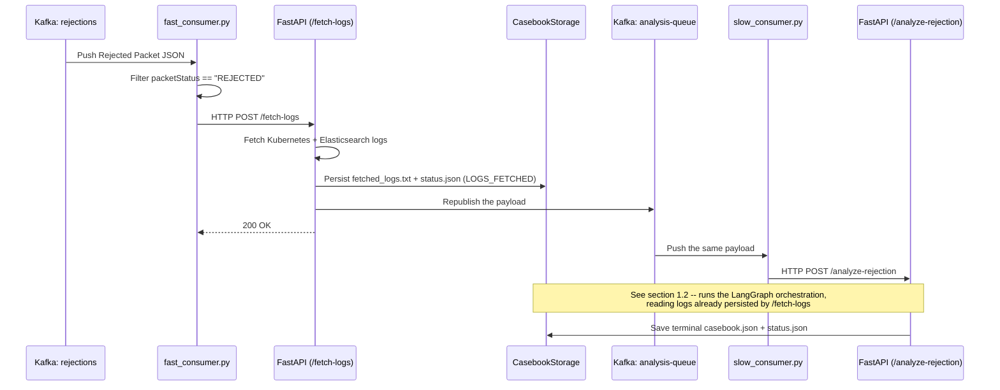
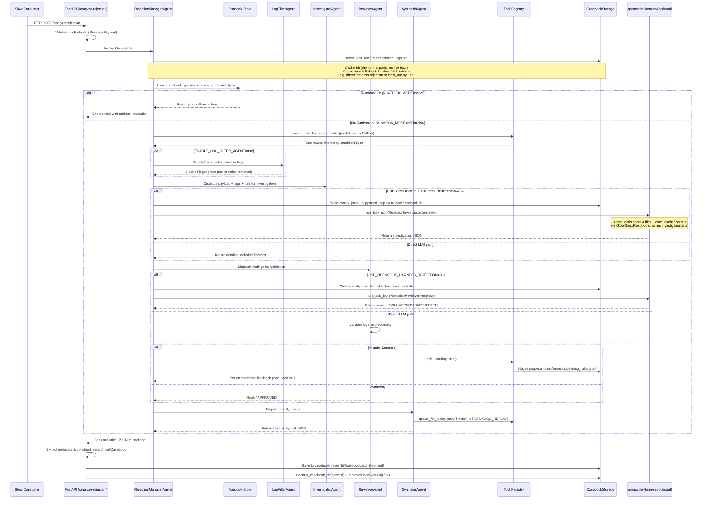
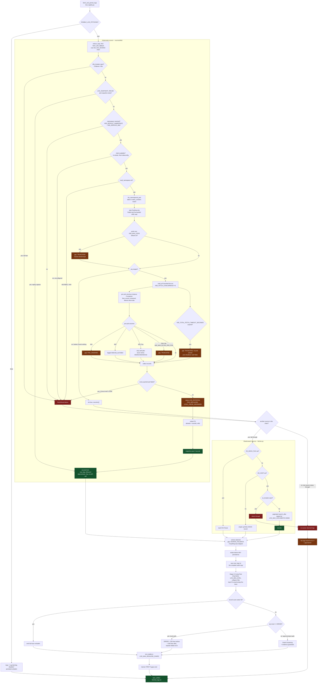
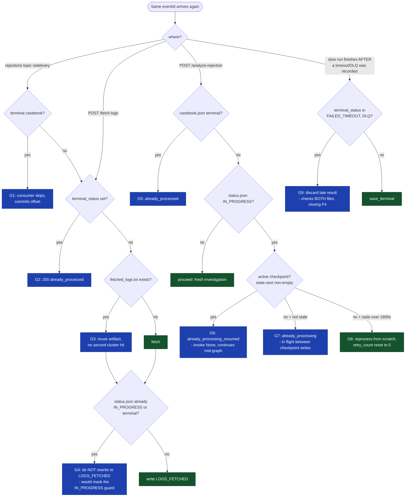
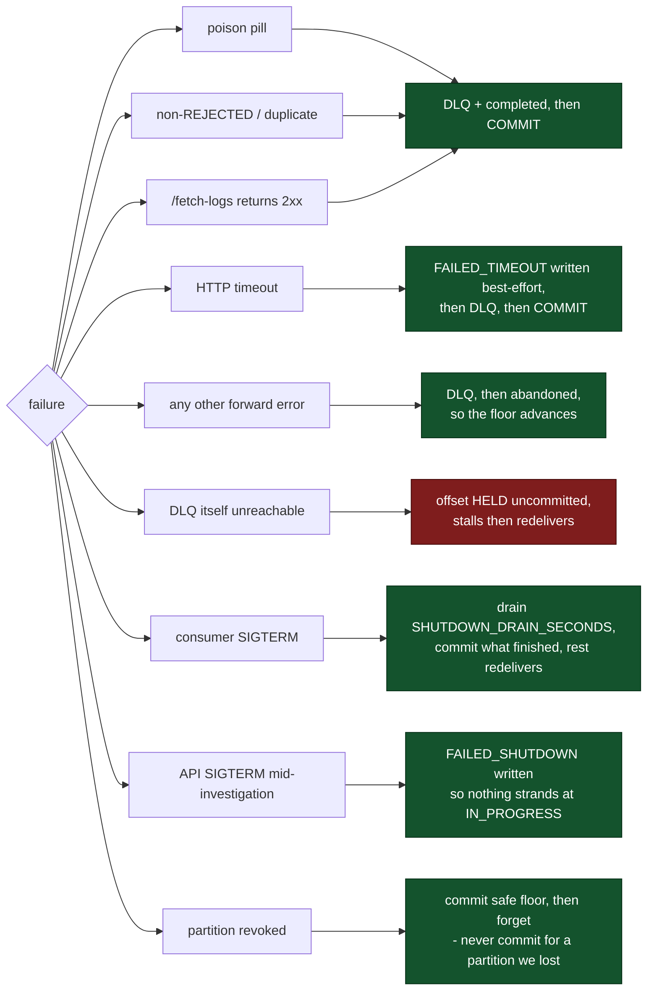

# Agentic Resident CRM: Deep Dive and Architecture

## Overview
**Agentic Resident CRM** is an AI-driven service that investigates two kinds of
packet failure in the UIDAI biometric enrolment/update pipeline and produces a
structured JSON casebook for each, explaining why it failed and what should be
done next.

**Two parallel lanes** share one codebase -- log pipeline, storage abstraction,
consumer scaffolding, and confidence policy -- but solve different problems:

- **Rejection lane** (`/fetch-logs` -> `/analyze-rejection`): a packet was
  *processed* and *rejected* by a business rule (e.g.
  `RESIDENT_MAN_DEDUP_REJECT_TD`). A deterministic LangGraph `StateGraph` runs
  a cache-first log fetch, an optional runbook short-circuit (zero LLM calls
  when a served runbook matches), then an Investigator -> Reviewer ->
  Synthesis agent chain that correlates the reason code with the DB rule and
  the reduced log trace. A reviewer-validated learning loop stages corrections
  to `pending_rules.jsonl` for human promotion -- nothing reaches the
  Investigator's prompt without an operator running `promote_rules.py`.
- **Dead-letter topic (DLT) lane** (`/fetch-dlt-logs` -> `/analyze-dlt`): a
  packet *crashed* -- an unhandled exception, not a business rejection.
  `dlt_consumer.py` consumes the Spring `@RetryableTopic` dead-letter topic,
  fingerprints the failure from its stack trace, corroborates that trace
  against the service's own pod logs (the mis-cast detector), and writes an
  advisory casebook. An opt-in replay precheck joins the stack trace to
  `release` in Bitbucket through the running pod's image version and may
  **park** a replay -- the "ON HOLD" state -- until the fix that would resolve
  it has actually deployed (section 4.4.1). Everything in this lane is off by
  default (`DLT_ENABLED=false`).

Each lane is split into two independently-scalable stages -- bounded
Kubernetes/Elasticsearch log fetch (fast) and unbounded LLM analysis (slow) --
connected by a second Kafka topic, so an LLM backlog can never stall log
collection and let short-retention pod logs rotate away before a packet is
even fetched (section 3.11). Replay actions are human-gated unless
`ENABLE_AUTO_REPLAY=true`. Section 1 has the complete flow with every branch
and duplicate-arrival guard; section 4.4 covers the DLT lane in full.

---

## 1. High-Level Workflow

Ingestion is split into two independently-scalable stages -- fetching
Kubernetes/Elasticsearch logs (bounded, fast I/O) and running the LLM
investigation (unbounded, slow) -- so a backlog in the LLM stage can never
stall log collection and let short-retention Kubernetes logs rotate away
before a packet is even fetched. See section 3.11 for the full design.

### 1.1 Two-Stage Ingestion


```mermaid
sequenceDiagram
    participant K1 as Kafka: rejections
    participant FC as fast_consumer.py
    participant API as FastAPI (/fetch-logs)
    participant FS as CasebookStorage
    participant K2 as Kafka: analysis-queue
    participant SC as slow_consumer.py
    participant API2 as FastAPI (/analyze-rejection)

    K1->>FC: Push Rejected Packet JSON
    FC->>FC: Filter packetStatus == "REJECTED"
    FC->>API: HTTP POST /fetch-logs
    API->>API: Fetch Kubernetes + Elasticsearch logs
    API->>FS: Persist fetched_logs.txt + status.json (LOGS_FETCHED)
    API->>K2: Republish the payload
    API-->>FC: 200 OK

    K2->>SC: Push the same payload
    SC->>API2: HTTP POST /analyze-rejection
    Note over API2,FS: See section 1.2 -- runs the LangGraph orchestration,<br/>reading logs already persisted by /fetch-logs
    API2->>FS: Save terminal casebook.json + status.json
```

### 1.2 Analysis Workflow (inside POST /analyze-rejection)


```mermaid
sequenceDiagram
    participant SC as Slow Consumer
    participant API as FastAPI (/analyze-rejection)
    participant M as RejectionManagerAgent
    participant RB as Runbook Store
    participant LF as LogFilterAgent
    participant I as InvestigatorAgent
    participant R as ReviewerAgent
    participant S as SynthesisAgent
    participant T as Tool Registry
    participant FS as CasebookStorage
    participant OC as opencode Harness (optional)

    SC->>API: HTTP POST /analyze-rejection
    
    API->>API: Validate via Pydantic (MessagePayload)
    API->>M: Invoke Orchestrator

    M->>FS: fetch_logs_node reads fetched_logs.txt
    Note over M,FS: Cache hit (the normal path): no live fetch.<br/>Cache miss falls back to a live fetch inline --<br/>e.g. direct /process-rejection or local_run.py use.
    
    M->>RB: Lookup runbook by (reason_code, enrolment_type)
    alt Runbook Hit (RUNBOOK_MODE=serve)
        RB-->>M: Return pre-built resolution
        M-->>API: Short-circuit with runbook resolution
    else No Runbook or RUNBOOK_MODE=off/shadow
        M->>T: lookup_rule_by_reason_code (pre-fetched in Python)
        T-->>M: Rule row(s), filtered by enrolmentType
        
        opt ENABLE_LOG_FILTER_AGENT=true
            M->>LF: Dispatch raw sliding-window logs
            LF-->>M: Cleaned logs (cross-packet noise removed)
        end
        
        M->>I: Dispatch payload + logs + rule for Investigation
        
        alt USE_OPENCODE_HARNESS_REJECTION=true
            M->>FS: Write context.json + supported_logs.txt to local casebook dir
            M->>OC: run_task_json(RejectionInvestigator template)
            Note over OC: Agent reads context files + docs_cache/ corpus<br/>via Glob/Grep/Read tools, writes investigation.json
            OC-->>M: Return investigation JSON
        else Direct LLM path
            I-->>M: Return detailed technical findings
        end
        
        M->>R: Dispatch findings for Validation
        
        alt USE_OPENCODE_HARNESS_REJECTION=true
            M->>FS: Write investigation_text.txt to local casebook dir
            M->>OC: run_task_json(RejectionReviewer template)
            OC-->>M: Return verdict JSON (APPROVED/REJECTED)
        else Direct LLM path
            R->>R: Validate logic and accuracy
        end
        
        alt Mistake Detected
            R->>T: add_learning_rule()
            T->>FS: Stages proposal to src/prompts/pending_rules.jsonl
            R-->>M: Return corrective feedback (loop back to I)
        else Validated
            R-->>M: Reply "APPROVED"
        end
        
        M->>S: Dispatch for Synthesis
        S->>T: queue_for_replay (only if Action is REPLAY/QC_REPLAY)
        S-->>M: Return strict analytical JSON
    end
    
    M-->>API: Pass analytical JSON to backend
    API->>API: Extract metadata & construct hierarchical Casebook
    API->>FS: Save to casebook_{eventId}/casebook.json (terminal)
    API->>FS: cleanup_casebook_dir(eventId) -- removes local working files
```

### 1.3 Complete Flow -- Every Path

Sections 1.1 and 1.2 show the happy path. This section is the normative
reference: every branch, degradation, and duplicate-arrival case the code
actually implements. Where a diagram and the prose disagree, the code wins --
each node below is annotated with the module that owns it.

Five views, because one diagram covering all of it would be unreadable:

| View | Answers |
| --- | --- |
| 1.3.1 Master flow | What happens to a packet from Kafka to terminal casebook |
| 1.3.2 Log acquisition | Where logs come from, and what happens when they do not arrive |
| 1.3.3 LangGraph state machine | Runbook modes, the retry loop, synthesis repair, abstention |
| 1.3.4 Idempotency | What happens when the same packet arrives twice |
| 1.3.5 Offset and failure matrix | Which failures commit, which redeliver, which stall |

#### 1.3.1 Master flow


```mermaid
flowchart TD
    classDef term fill:#7f1d1d,stroke:#450a0a,color:#ffffff
    classDef skip fill:#1e40af,stroke:#1e3a8a,color:#ffffff
    classDef good fill:#14532d,stroke:#052e16,color:#ffffff
    classDef store fill:#334155,stroke:#0f172a,color:#ffffff
    classDef dlq fill:#78350f,stroke:#451a03,color:#ffffff

    K1(["Kafka: rejections topic"])

    subgraph FAST["fast_consumer.py -- CONSUMER_ROLE=fast, kafkaConsumer.py"]
        K1 --> POLL["poll, enable_auto_commit=false"]
        POLL --> SEM{"worker slot free?<br/>_queue_semaphore"}
        SEM -->|"no: block BEFORE parsing"| POLL
        SEM -->|yes| TRK["OffsetTracker.dispatched tp, offset"]
        TRK --> VAL{"decode utf-8, json.loads,<br/>AUDIT -> packet event,<br/>MessagePayload validate"}
        VAL -->|"invalid: poison pill"| PP["publish_to_dlq raw string"]
        VAL -->|valid| RJ{"packetStatus == REJECTED?"}
        RJ -->|no| SK1["skip: non-rejected packet,<br/>or dead-lettered (ON_HOLD)"]
        RJ -->|yes| D1{"terminal casebook exists?<br/>storage.exists terminal_only"}
        D1 -->|"yes: DUPLICATE"| SK2["skip: already processed"]
        D1 -->|no| SUB["worker pool submit"]
    end

    PP --> RC1["record_completion -- offset commits"]
    SK1 --> RC1
    SK2 --> RC1

    SUB --> POST1["POST /fetch-logs<br/>FAST_CONSUMER_TIMEOUT_SECONDS=90"]

    subgraph FL["POST /fetch-logs -- routes.py, sync, no LLM"]
        POST1 --> AUTH1{"X-API-Key valid?<br/>hmac.compare_digest"}
        AUTH1 -->|no| E403["403"]
        AUTH1 -->|yes| RL1{"rate limit<br/>exempt CIDR or under RATE_LIMIT?"}
        RL1 -->|no| E429["429"]
        RL1 -->|yes| T1{"terminal_status in<br/>TERMINAL_STATUSES?"}
        T1 -->|"yes: DUPLICATE"| AP1["200 already_processed"]
        T1 -->|no| SG1{"service gate, 3.2.3<br/>enforce and service not enabled?"}
        SG1 -->|"yes: write nothing"| SKG1["200 skipped"]
        SG1 -->|"no: store service_resolution.json"| ART{"fetched_logs.txt exists?"}
        ART -->|"yes: reuse artifact"| STAT
        ART -->|no| FETCH["fetch_and_persist_logs<br/>see 1.3.2"]
        FETCH --> FOK{"logs returned?"}
        FOK -->|"yes or 'Log fetching disabled.'"| SAVEA["save_artifact fetched_logs.txt"]
        FOK -->|"None: breaker open or pipeline raised"| NOSAVE["persist nothing<br/>slow side will retry live"]
        SAVEA --> STAT
        NOSAVE --> STAT
        STAT{"status.json is<br/>absent or LOGS_FETCHED?"}
        STAT -->|yes| WSTAT["write status.json = LOGS_FETCHED"]
        STAT -->|"no: IN_PROGRESS or terminal"| KEEP["leave status.json untouched<br/>must not mask the IN_PROGRESS guard"]
        WSTAT --> PUB
        KEEP --> PUB
        PUB{"publish_to_analysis_queue"}
        PUB -->|raises| E500["500 -- offset NOT committed"]
        PUB -->|ok| Q200["200 queued_for_analysis"]
    end

    E403 --> DLQ1
    E429 --> DLQ1
    E500 --> DLQ1["_dlq_and_abandon:<br/>publish DLQ, then release the floor"]
    AP1 --> RC1
    SKG1 --> RC1
    Q200 --> RC1

    Q200 --> K2(["Kafka: packet-analysis-queue"])

    subgraph SLOW["slow_consumer.py -- CONSUMER_ROLE=slow, same module"]
        K2 --> POLL2["identical guards:<br/>poison pill, REJECTED, terminal dedupe"]
        POLL2 --> POST2["POST /analyze-rejection<br/>PACKET_TIMEOUT_SECONDS=300"]
    end

    subgraph AN["POST /analyze-rejection -- _investigate_packet, async"]
        POST2 --> T2{"casebook.json terminal?"}
        T2 -->|"yes: DUPLICATE"| AP2["already_processed"]
        T2 -->|no| SG2{"service gate, 3.2.3<br/>enforce and service not enabled?"}
        SG2 -->|"yes: write nothing"| SKG2["skipped"]
        SG2 -->|no| CKPT["agent.get_state thread_id=eventId<br/>has_active_checkpoint = bool state.next"]
        CKPT --> IP{"status.json == IN_PROGRESS?"}
        IP -->|no| STUB
        IP -->|yes| STALE{"age exceeds MAX_IN_PROGRESS_AGE_SECONDS<br/>default 1800s?"}
        STALE -->|"no + active checkpoint"| RES["already_processing_resumed<br/>invoke None, resumes graph"]
        STALE -->|"no + no checkpoint"| BUSY["already_processing -- skip"]
        STALE -->|"yes + no checkpoint"| STUB["write status.json = IN_PROGRESS"]
        STALE -->|"yes + active checkpoint"| RES
        STUB --> INV["run_in_executor _agent_invoke_executor<br/>asyncio.wait_for AGENT_INVOKE_TIMEOUT_SECONDS"]
        RES --> INV
        INV --> GRAPH["LangGraph -- see 1.3.3"]
        GRAPH --> OUT{"outcome"}
        OUT -->|"asyncio.TimeoutError"| FT["save_terminal FAILED_TIMEOUT"]
        OUT -->|"unhandled exception"| DQ["publish_to_dlq +<br/>save_terminal DLQ"]
        OUT -->|"returned a state"| PARSE{"parse_synthesis<br/>against the contract"}
        PARSE -->|invalid| FSP["FAILED_SYNTHESIS_PARSE<br/>evidence kept, verdict replaced"]
        PARSE -->|valid| LOGSZ{"raw logs present?"}
        LOGSZ -->|"none / 'Log fetching disabled.'"| NOLOG["rejection_logs.path =<br/>'No logs found'"] --> BUILD
        LOGSZ -->|yes| ART2["no write: the text is already stored"]
        ART2 --> BUILD["build casebook<br/>rejection_logs.path = state logs_artifact<br/>fetched_logs.txt, or filtered_logs.txt"]
        FSP --> BUILD
        BUILD --> LATE{"terminal_status in<br/>PROTECTED_TERMINAL_STATUSES<br/>FAILED_TIMEOUT, DLQ?"}
        LATE -->|"yes: another actor won"| DISC["discard late result"]
        LATE -->|no| SAVE["save_terminal<br/>casebook.json + status.json together"]
    end

    AP2 --> RC2["record_completion -- offset commits"]
    SKG2 --> RC2
    FT --> CLEAN["cleanup_casebook_dir<br/>removes local working files"]
    DQ --> CLEAN
    SAVE --> CLEAN
    CLEAN --> RC2
    RES --> RC2
    BUSY --> RC2
    DISC --> RC2

    class PP,DLQ1,DQ,FT dlq
    class SK1,SK2,AP1,AP2,SKG1,SKG2,BUSY,DISC,KEEP,NOSAVE skip
    class SAVE,Q200,RC1,RC2,CLEAN good
    class SAVEA,WSTAT,STUB,ART2 store
    class E403,E429,E500,FSP term
```

#### 1.3.2 Log acquisition -- source chain and every failure mode

`LOG_SOURCE` is an ordered chain, default `kubernetes,elastic`. Fallback fires
when a source fails **or** returns zero records -- both mean "we did not get
logs here". Sources are never merged; one wins per fetch.


```mermaid
flowchart TD
    classDef gap fill:#78350f,stroke:#451a03,color:#ffffff
    classDef bad fill:#7f1d1d,stroke:#450a0a,color:#ffffff
    classDef good fill:#14532d,stroke:#052e16,color:#ffffff

    A["fetch_and_persist_logs<br/>tool_registry.py"] --> EN{"ENABLE_LOG_FETCHING?"}
    EN -->|false| DIS["logs = 'Log fetching disabled.'<br/>persisted verbatim"]
    EN -->|true| CHAIN["reduce_logs, then fetch_with_fallback<br/>over the LOG_SOURCE chain"]

    subgraph K8S["Kubernetes source -- sources/k8s/"]
        CHAIN --> BRK{"k8s_breaker open?<br/>3 failures / 60s"}
        BRK -->|"yes: fail fast"| KFAIL["FetchResult.failure"]
        BRK -->|no| SNAP{"LOG_SNAPSHOT_REUSE<br/>and snapshot exists?"}
        SNAP -->|"yes: replay capture"| KOK["records from raw_logs_k8s.jsonl<br/>deterministic, free, no API call"]
        SNAP -->|no| DISC1{"namespace resolved?<br/>K8S_DEFAULT_NAMESPACE / K8S_SERVICE_MAP"}
        DISC1 -->|no| KFAIL
        DISC1 -->|yes| CLI{"client available?<br/>in-cluster, then kubeconfig"}
        CLI -->|"no: unconfigured"| KFAIL
        CLI -->|yes| NSV{"read_namespace ok?"}
        NSV -->|"403 RBAC / 404"| KFAIL
        NSV -->|yes| LIST["list_namespaced_pod<br/>label or name_contains match"]
        LIST --> PHASE["skip Pending only<br/>Failed and Succeeded ARE read"]
        PHASE --> CAP{"pods over K8S_MAX_PODS<br/>default 20?"}
        CAP -->|yes| GAPT["gap: TRUNCATED<br/>newest-started kept"]
        CAP -->|no| TGT
        GAPT --> TGT{"any targets?"}
        TGT -->|"no: looked, found nothing"| KEMPTY["ok=true, records=[]"]
        TGT -->|yes| READ["read_all: bounded fan-out<br/>K8S_FETCH_CONCURRENCY=5"]
        READ --> PER["per pod: previous instance if restarted,<br/>then current; streamed, filtered client-side"]
        PER --> PERR{"per-pod outcome"}
        PERR -->|404| GV["gap: POD_VANISHED"]
        PERR -->|403| RBAC["logged distinctly, pod failed"]
        PERR -->|"429 / 5xx"| RETRY["retry with jitter<br/>never retries 400/401/403/404/410"]
        PERR -->|"byte cap K8S_MAX_BYTES_PER_POD"| GT2["gap: TRUNCATED"]
        PERR -->|ok| COLLECT
        RETRY --> COLLECT
        GV --> COLLECT
        RBAC --> COLLECT
        GT2 --> COLLECT["collect records"]
        READ --> DEAD{"K8S_TOTAL_FETCH_TIMEOUT_SECONDS<br/>expired?"}
        DEAD -->|yes| GT3["gap: TRUNCATED, N pods unread<br/>pool shutdown wait=false"]
        GT3 --> COLLECT
        COLLECT --> ALLF{"every queried pod failed?"}
        ALLF -->|"yes: COULD NOT LOOK"| KFAIL
        ALLF -->|no| GAPS["detect LOG_ROTATION,<br/>POD_REPLACED, LEVEL_PARSE_DEGRADED"]
        GAPS --> RED["redact PII<br/>allowlist = eventId, refId"]
        RED --> SS["snapshot.save if records"]
        SS --> KOK
    end

    KFAIL --> FB{"another source in the chain?"}
    KEMPTY --> FB
    FB -->|"yes: fall through"| ES
    FB -->|"no: last source raises through"| NONE

    subgraph ELASTIC["Elasticsearch source -- fetcher.py"]
        ES{"ES_MOCK_FILE set?"}
        ES -->|yes| MOCK["read CSV fixture"]
        ES -->|no| HOST{"ES_HOST set?"}
        HOST -->|no| MOCK2["single synthetic MOCK record"]
        HOST -->|yes| EBRK{"es_breaker open?"}
        EBRK -->|yes| EFAIL["raises through"]
        EBRK -->|no| QUERY["paginated search_after<br/>capped at LOG_MAX_DOCUMENTS=50000"]
        QUERY --> EOK["records"]
    end

    MOCK --> WIN
    MOCK2 --> WIN
    EOK --> WIN["winner selected<br/>gap: SOURCE_FALLBACK if anything was skipped"]
    EFAIL --> NONE
    KOK --> WIN

    NONE["no source returned logs"] --> EMPTY["'No logs found for ID: X'<br/>+ gap banner"]

    WIN --> RED2["redact before ANY persistence"]
    RED2 --> RAW["save raw_logs.txt<br/>the complete audit copy"]
    RAW --> NF["Stage 2.5 noise floor<br/>drop below LOG_MIN_LEVEL, collapse SQL<br/>kept if it would empty the trace"]
    NF --> SIZE{"record count under 50?"}
    SIZE -->|yes| DIRECT["emit full trace verbatim"]
    SIZE -->|no| BR{"any level == ERROR?"}
    BR -->|"yes: stuck path"| ERRP["ERROR + 200 lines before<br/>+ 200 lines after,<br/>repeats folded at 3x"]
    BR -->|"no: approve/reject path"| CLU["Drain3 clustering<br/>+ evidence guardrails"]
    DIRECT --> CAPC
    ERRP --> CAPC
    CLU --> CAPC["trim middle to<br/>LOG_MAX_REDUCED_CHARS"]
    CAPC --> RDX["banner FIRST if gaps exist"]
    RDX --> PERSIST["save_artifact fetched_logs.txt"]
    EMPTY --> PERSIST
    DIS --> PERSIST

    class KFAIL,EFAIL,NONE bad
    class GAPT,GV,GT2,GT3,GAPS,EMPTY gap
    class KOK,EOK,PERSIST,SS good
```

> **Why an empty result is not a failure.** `FetchResult.ok` separates
> *could-not-look* from *looked-and-found-nothing*. Collapsing the two would let
> the Investigator conclude "no errors occurred" when the truth is "we could not
> read the logs". Every gap above is rendered into a banner placed **before** the
> trace, and `apply_confidence_policy` caps confidence at
> `SYNTHESIS_GAP_CONFIDENCE_CEILING` (0.6) whenever that banner is present.
>
> The same split bounds a resolution no log line corroborated at all:
> `SYNTHESIS_LOGS_UNAVAILABLE_CEILING` (0.75) when we never looked (fetching
> disabled, or the fetch failed) and `SYNTHESIS_LOGS_SILENT_CEILING` (0.6) when
> the source had nothing for the packet. Only the banner used to be checked, so
> a packet with no logs at all could score higher than one with partial logs.
> The DB rule and the documentation still explain the rejection, so these are
> not the gap ceiling; the defaults match the DLT lane's
> `DLT_LOGS_UNAVAILABLE_CEILING` / `DLT_LOGS_SILENT_CEILING`. Where several
> apply, the lowest binds.

#### 1.3.3 LangGraph state machine

Nodes are compiled once and cached (`get_agent`); the checkpointer is keyed on
`thread_id = eventId`, which is what makes a resume possible.


```mermaid
stateDiagram-v2
    [*] --> fetch_logs

    fetch_logs: fetch_logs_node
    note right of fetch_logs
        Cache-first: fetched_logs.txt from /fetch-logs.
        Artifact PRESENT - whatever its content, including
        the disabled/no-logs sentinels - means a fetch was
        already attempted. Absent falls back to a live
        fetch, which is what keeps /process-rejection and
        local_run.py working unchanged.
    end note

    fetch_logs --> runbook_lookup

    state runbook_lookup {
        [*] --> mode_check
        mode_check: RUNBOOK_MODE?
        mode_check --> agents_off: off (default) - counted as no lookup
        mode_check --> resolve: shadow or serve
        resolve --> miss_norc: no errorReasonCode
        resolve --> miss_none: no runbook file
        resolve --> miss_fp: rule_fingerprint mismatch (DB rule changed)
        resolve --> miss_err: any exception - never propagates
        resolve --> shadow_path: mode=shadow OR code not in RUNBOOK_SERVE_ALLOWLIST
        resolve --> hit: mode=serve AND code allowlisted
    }

    hit --> [*]: SHORT-CIRCUIT - zero LLM calls, synthesis = runbook resolution
    miss_norc --> route
    miss_none --> route
    miss_fp --> route
    miss_err --> route
    agents_off --> route
    shadow_path --> route: runbook answer carried as shadow_runbook_resolution

    route: check_runbook_hit
    route --> filter_logs: ENABLE_LOG_FILTER_AGENT=true
    route --> investigate: otherwise

    filter_logs --> investigate: skipped when logs<br/>empty or disabled

    investigate: investigator_node
    note left of investigate
        First pass sends a PROJECTED payload, the logs, and
        the DB rule. Retry sends prior analysis + reviewer
        feedback + the LOGS AGAIN - the reviewer's most
        common rejection is unsupported citations, so the
        retry must keep the evidence.

        When REJECTION_REASON_CODE_DOCS_ENABLED=true, the node
        first looks up the reason-code documentation for this
        packet (section 3.2.2) and stores it in graph state as
        reason_code_doc, so retries, the Reviewer and Synthesis
        all reuse the SAME document. Both prompts are then built
        by core/rejection_context.py: documentation and rule
        first, logs last, task restated after them, and only the
        logs trimmed if REJECTION_PROMPT_MAX_CHARS binds. With
        the switch off the prompts are byte-for-byte the older
        ones. investigator_path records harness or direct.

        When USE_OPENCODE_HARNESS_REJECTION=true (and not a retry):
        writes context.json + supported_logs.txt to the local
        casebook dir, then calls opencode_runner.run_task_json
        with the RejectionInvestigator harness prompt template.
        The agent reads those files plus the docs_cache/ DROA
        corpus via Glob/Grep/Read, and writes investigation.json.
        Falls back to direct LLM on harness failure. Harness
        prompts live in src/prompts/harness/ as .md templates
        with {{var}} placeholders, loaded by prompt_loader.py.
    end note

    investigate --> review
    review: reviewer_node - retry_count += 1

    state review_decision <<choice>>
    review --> review_decision
    review_decision --> synthesize: verdict starts with APPROVED
    review_decision --> escalate: retry_count reached MAX_INVESTIGATION_RETRIES, default 3
    review_decision --> investigate: rejected - loop back

    note right of review
        A rejection may also call add_learning_rule, which
        is validated (injection markers, identifiers, length)
        and queued to pending_rules.jsonl. Nothing reaches
        the Investigator prompt without a human typing
        "promote".

        REJECTION_REVIEWER_EVIDENCE defaults to TRUE, so the
        direct Reviewer now receives the same evidence the
        Investigator had - rule, enrolment type, payload, logs,
        and the stored document - instead of the investigation
        text alone. It could not otherwise verify the citation
        it most often rejects for. Setting it false restores the
        older prompt exactly. reviewer_path records the path.

        When USE_OPENCODE_HARNESS_DLT / _REJECTION=true: rewrites context.json +
        supported_logs.txt from graph state and writes
        investigation_text.txt to the local casebook dir (so it
        never depends on the Investigator's pass leaving the
        directory behind), then calls
        opencode_runner.run_task_json with the RejectionReviewer
        harness prompt template. The agent cross-references
        claims against those files and the docs_cache/ corpus.
        A rejection may carry a learning_rule in its JSON, which
        goes through the same validated queue as
        add_learning_rule. Falls back to direct LLM on any
        harness failure, including an unwritable case dir.
    end note

    state synthesize {
        [*] --> parse1
        parse1: parse_synthesis
        parse1 --> policy: valid
        parse1 --> repair: invalid - one repair attempt
        repair --> parse2
        parse2 --> policy: valid
        parse2 --> unrepairable: still invalid
        policy: apply_confidence_policy
        policy --> capped: gap banner, no logs, or no lines for the packet - lowest ceiling binds
        policy --> abstain: confidence below SYNTHESIS_CONFIDENCE_THRESHOLD, 0 disables this
        policy --> ok
        capped --> ok
        abstain --> ok: action forced to MANUAL_REVIEW
        unrepairable --> ok: action forced to MANUAL_REVIEW
    }

    escalate: escalate_node - MANUAL_REVIEW plus full transcript
    synthesize --> [*]
    escalate --> [*]

    note left of synthesize
        Shadow comparison runs here: the runbook's action is
        compared against the agents' and RETURNED as
        shadow_comparison, so accuracy_report --shadow can
        answer "would this runbook have been right?" -
        the gate for promoting it to serve.
    end note
```

Every LLM node is wrapped in `@llm_breaker` over `@retry_transient`: three
tenacity attempts on transient provider errors, then the breaker opens after
three consecutive failures and fails fast for 60s.

#### 1.3.4 Idempotency -- the same packet arriving twice

There are **nine** distinct duplicate-arrival guards. They exist at different
layers because a duplicate can enter at any of them.


```mermaid
flowchart TD
    classDef skip fill:#1e40af,stroke:#1e3a8a,color:#ffffff
    classDef work fill:#14532d,stroke:#052e16,color:#ffffff

    DUP(["Same eventId arrives again"]) --> WHERE{"where?"}

    WHERE -->|"rejections topic redelivery"| G1{"terminal casebook?"}
    G1 -->|yes| S1["G1: consumer skips,<br/>commits offset"]
    G1 -->|no| G2

    WHERE -->|"POST /fetch-logs"| G2{"terminal_status set?"}
    G2 -->|yes| S2["G2: 200 already_processed"]
    G2 -->|no| G3{"fetched_logs.txt exists?"}
    G3 -->|yes| S3["G3: reuse artifact,<br/>no second cluster hit"]
    G3 -->|no| W1["fetch"]
    S3 --> G4
    W1 --> G4{"status.json already<br/>IN_PROGRESS or terminal?"}
    G4 -->|yes| S4["G4: do NOT rewrite to LOGS_FETCHED<br/>- would mask the IN_PROGRESS guard"]
    G4 -->|no| W2["write LOGS_FETCHED"]

    WHERE -->|"POST /analyze-rejection"| G5{"casebook.json terminal?"}
    G5 -->|yes| S5["G5: already_processed"]
    G5 -->|no| G6{"status.json IN_PROGRESS?"}
    G6 -->|no| W3["proceed: fresh investigation"]
    G6 -->|yes| G7{"active checkpoint?<br/>state.next non-empty"}
    G7 -->|yes| S6["G6: already_processing_resumed<br/>- invoke None, continues mid-graph"]
    G7 -->|"no + not stale"| S7["G7: already_processing<br/>- in flight between checkpoint writes"]
    G7 -->|"no + stale over 1800s"| W4["G8: reprocess from scratch,<br/>retry_count reset to 0"]

    WHERE -->|"slow run finishes AFTER<br/>a timeout/DLQ was recorded"| G9{"terminal_status in<br/>FAILED_TIMEOUT, DLQ?"}
    G9 -->|yes| S8["G9: discard late result<br/>- checks BOTH files, closing F4"]
    G9 -->|no| W5["save_terminal"]

    class S1,S2,S3,S4,S5,S6,S7,S8 skip
    class W1,W2,W3,W4,W5 work
```

| Guard | Location | Trigger | Result |
| --- | --- | --- | --- |
| G1 | `kafkaConsumer._handle_one_message` | terminal casebook exists | skip, commit offset |
| G2 | `routes.fetch_logs` | `terminal_status` in `TERMINAL_STATUSES` | `already_processed` |
| G3 | `routes.fetch_logs` | `fetched_logs.txt` present | reuse, no refetch |
| G4 | `routes.fetch_logs` | status is `IN_PROGRESS`/terminal | leave status alone |
| G5 | `_investigate_packet` | `casebook.json` terminal | `already_processed` |
| G6 | `_investigate_packet` | `IN_PROGRESS` + active checkpoint | `already_processing_resumed` |
| G7 | `_investigate_packet` | `IN_PROGRESS`, fresh, no checkpoint | `already_processing` |
| G8 | `_investigate_packet` | `IN_PROGRESS` stale, no checkpoint | reprocess, `retry_count=0` |
| G9 | `_investigate_packet` | `PROTECTED_TERMINAL_STATUSES` set | discard late result |

> **`retry_count` is reset explicitly on G8.** `thread_id` is the `eventId`, so a
> redelivered "fresh" invocation can otherwise resume a persisted checkpoint whose
> `retry_count` is already at `MAX_INVESTIGATION_RETRIES` and escalate instantly
> without doing any work.

> **Scope limit.** G3/G4 rely on `filelock` (local backend) or last-writer-wins
> (S3). Neither coordinates across pods, which is why `config_validator` refuses
> to boot with `API_REPLICA_COUNT > 1` unless both `CASEBOOK_STORAGE_BACKEND=s3`
> and `CHECKPOINT_BACKEND=postgres` (or `mysql`) are set.

#### 1.3.5 Offset and failure matrix

Offsets are never committed per message. `OffsetTracker` commits only the
**low-water mark**: the highest offset below which every dispatched message has
completed. Offsets 10, 11, 12 dispatched together with 12 finishing first
commits nothing until 10 and 11 land.


```mermaid
flowchart LR
    classDef good fill:#14532d,stroke:#052e16,color:#ffffff
    classDef warn fill:#78350f,stroke:#451a03,color:#ffffff
    classDef bad fill:#7f1d1d,stroke:#450a0a,color:#ffffff

    F{"failure"} --> A["poison pill"] --> C1["DLQ + completed, then COMMIT"]
    F --> B["non-REJECTED / duplicate"] --> C1
    F --> C["/fetch-logs returns 2xx"] --> C1
    F --> D["HTTP timeout"] --> D1["FAILED_TIMEOUT written best-effort,<br/>then DLQ, then COMMIT"]
    F --> E["any other forward error"] --> E1["DLQ, then abandoned,<br/>so the floor advances"]
    F --> G["DLQ itself unreachable"] --> G1["offset HELD uncommitted,<br/>stalls then redelivers"]
    F --> H["consumer SIGTERM"] --> H1["drain SHUTDOWN_DRAIN_SECONDS,<br/>commit what finished, rest redelivers"]
    F --> I["API SIGTERM mid-investigation"] --> I1["FAILED_SHUTDOWN written<br/>so nothing strands at IN_PROGRESS"]
    F --> J["partition revoked"] --> J1["commit safe floor, then forget<br/>- never commit for a partition we lost"]

    class C1,D1,E1,H1,I1,J1 good
    class G1 bad
```

The one deliberate stall is `G1`. If the DLQ publish fails there is nowhere left
to escalate to, so the offset stays dispatched: commits freeze for that
partition rather than advancing past a message that would then exist nowhere.
It self-heals on redelivery once the broker is reachable.

---

## 2. Directory Structure

The repository follows standard Python backend architecture for modularity and scalability:

```text
agentic-resident-crm/
├── .agents/
│   └── AGENTS.md                   # Agentic configurations and behavioral rules
├── .github/
│   └── workflows/test.yml          # CI: the regression suite on push and pull request
├── AGENTS.md                       # Shared opencode agent instructions, loaded into every
│                                   #   harness session; each flow's own rules live in
│                                   #   src/prompts/harness/rules/
├── README.md                       # Copy of this document for the repo landing page. Regenerate
│                                   #   it from ARCHITECTURE.md; it currently lags by one revision.
├── SYSTEM_OVERVIEW.md              # Narrative overview of the system for a non-engineering reader
├── .env.example                    # Annotated env-var template (the .env itself is gitignored)
├── MULTI_SERVICE_PLAN.md           # One rejection lane for many services: plan (section 3.2.3)
├── DLT_PLAN.md                     # Dead-letter topic (DLT) analysis lane: engineering design
├── KUBERNETES_LOGS_PLAN.md         # Kubernetes log source: engineering design
├── RUNBOOK_PLAN.md                 # Standard runbook implementation plan
├── REMEDIATION_PLAN_2026_08_21.md  # 2026-08-21 codebase audit remediation programme
├── REASON_CODE_DOCS_PLAN.md        # Rejection lane without opencode: reason-code documentation
│                                   #   (proposed; per-lane harness flags, document store, rollout)
├── start.py                        # Process supervisor: spawns main_api.py + fast_consumer.py + slow_consumer.py
├── local_run.py                    # CLI: POST a local packet JSON to the running API
├── rules.csv                       # Rules DB export consumed by check_drift.py (gitignored;
│                                   #   operator-generated, not checked in)
├── reason_codes.csv                # 760 reject codes -> description, category, failure class
│                                   #   (generated from the BusinessReasonCode Java source by
│                                   #    src/tools/parse_reason_codes.py; the .txt source is an
│                                   #    input, not a runtime dependency, and is not kept here)
├── Dockerfile                      # Container image build (Python 3.14 + Node.js for opencode CLI)
├── .dockerignore                   # Excludes .venv, local_casesheets, docs_cache, etc. from image
├── entrypoint.sh                   # Container entrypoint: writes opencode provider config, then start.py
├── pyproject.toml                  # Project metadata, dependencies, ruff/pytest config
├── requirements.txt                # Pinned runtime dependencies
├── version.json                    # Image/service version tag
├── opencode.json                   # opencode CLI config: a $schema pointer only. The provider
│                                   #   block is written at boot by entrypoint.sh
├── tests/
│   ├── conftest.py                 # Test-suite isolation from the developer's .env
│   ├── s3_fakes.py                 # S3 fakes that misbehave the way real S3-compatible stores do
│   ├── manual_payload_demo.py      # Manual demo: parse a real rejection payload, print extracts
│   ├── test_end_to_end.py          # End-to-end contract test (audit G22a, N4)
│   ├── test_fetch_analyze_split.py # Fetch/analyze consumer split (two topics, two consumers)
│   ├── test_api_concurrency.py     # API concurrency (REMEDIATION_PLAN phase 2)
│   ├── test_resilience.py          # Resilience / idempotency / DLQ regression tests
│   ├── test_shutdown_lifecycle.py  # Shutdown and lifecycle (REMEDIATION_PLAN phase 4)
│   ├── test_atomic_replace.py      # Windows-lock regression tests for atomic replace
│   ├── test_multipod_state.py      # Multi-pod correctness (REMEDIATION_PLAN phase 5)
│   ├── test_s3_conditional_write.py # Stores that accept creates but refuse If-Match overwrites
│   ├── test_cleanups.py            # Cleanup correctness and observability (REMEDIATION phase 6)
│   ├── test_evidence_integrity.py  # Evidence integrity (REMEDIATION_PLAN phase 1)
│   ├── test_context_line_attribution.py # Context-line attribution: this packet's lines vs noise
│   ├── test_reducer_noise_floor.py # Stage 2.5 noise floor and the Stage 4 collapse fix
│   ├── test_phase0_fixes.py        # Phase 0 correctness regression tests
│   ├── test_phase1_fixes.py        # Phase 1 reliability regression tests
│   ├── test_phase2_fixes.py        # Phase 2 optimization regression tests
│   ├── test_phase_a_fixes.py       # Phase A regression tests (ENHANCEMENT_PLAN section 5)
│   ├── test_phase_b_fixes.py       # Phase B regression tests (ENHANCEMENT_PLAN section 5)
│   ├── test_phase_c_fixes.py       # Phase C regression tests (ENHANCEMENT_PLAN section 5)
│   ├── test_phase_d_fixes.py       # Phase D regression tests (ENHANCEMENT_PLAN section 5)
│   ├── test_phase_e_fixes.py       # Phase E regression tests (ENHANCEMENT_PLAN section 5)
│   ├── test_phase_f_fixes.py       # Phase F regression tests (ENHANCEMENT_PLAN section 5)
│   ├── test_audit_phase1.py        # Phase 1 regression tests (AUDIT_2026_08.md section 6)
│   ├── test_audit_phase2.py        # Phase 2 regression tests (AUDIT_2026_08.md section 6)
│   ├── test_audit_phase3.py        # Phase 3 regression tests (AUDIT_2026_08.md section 6)
│   ├── test_runbooks.py            # Runbook store, validator, and serving tests
│   ├── test_operator_tools.py      # Operator CLIs must read through CasebookStorage
│   ├── test_log_sources.py         # LogSource Protocol and ElasticLogSource tests
│   ├── test_log_source_chain.py    # Fallback chain (LOG_SOURCE) tests
│   ├── test_log_snapshot.py        # Evidence snapshot persistence and pruning tests
│   ├── test_redaction.py           # PII redaction tests
│   ├── test_prompt_gap_guidance.py # Prompt evidence-gap banner tests
│   ├── test_es_diagnostic.py       # ES diagnostic tool tests
│   ├── test_fetch_pod_logs_cli.py  # fetch_pod_logs CLI tests
│   ├── test_k8s_discovery.py       # Kubernetes pod/namespace discovery tests
│   ├── test_k8s_multi_service.py   # Multi-service fan-out, dedupe, partial failure
│   ├── test_k8s_gaps.py            # Kubernetes evidence gap detection tests
│   ├── test_k8s_parser.py          # Kubernetes log line parser tests
│   ├── test_k8s_retrieval.py       # Kubernetes pod log retrieval tests
│   ├── test_k8s_retry.py           # Kubernetes HTTP retry logic tests
│   ├── test_k8s_mockfile.py        # Offline mock log file for the K8s source
│   ├── test_dlt_stacktrace.py      # DLT lane: headers, `Caused by:` parsing, fingerprint
│   ├── test_dlt_classify.py        # DLT lane: failure taxonomy A/B/C/U
│   ├── test_dlt_reason_codes.py    # DLT lane: reason-code catalog parse, store, use
│   ├── test_dlt_payload.py         # DLT lane: payload identifier extraction, case identity
│   ├── test_dlt_abis_payload.py    # DLT lane: EnrolmentEventResponse schema, refId resolution
│   ├── test_dlt_multi_structure.py # DLT lane: several original topics from one prompt set
│   ├── test_dlt_consumer.py        # DLT lane: message-adapter seam and consumer
│   ├── test_dlt_fetch.py           # DLT lane: /fetch-dlt-logs, log window, evidence
│   ├── test_dlt_corroborate.py     # DLT lane: trace-vs-log verdicts
│   ├── test_dlt_reuse.py           # DLT lane: group records and the reuse policy
│   ├── test_dlt_group_store.py     # DLT lane: the decomposed group store, create-only layout
│   ├── test_dlt_flow_fixes.py      # DLT lane: claims, single-flight, per-code guard, end to end
│   ├── test_dlt_analysis.py        # DLT lane: /analyze-dlt with a mocked LLM
│   ├── test_dlt_analysis_replay.py # DLT lane: auto-replay and precheck, end to end
│   ├── test_dlt_auto_replay.py     # DLT lane: auto-replay confidence gate
│   ├── test_dlt_report.py          # DLT lane: operator CLI and observability wiring
│   ├── test_dlt_sample.py          # DLT lane: corpus capture tooling (Phase 0 gate)
│   ├── test_dlt_lane_parity.py     # DLT lane parity (REMEDIATION_PLAN phase 3)
│   ├── test_code_check_probe.py    # C0: the probe's own decisions about what it reads
│   ├── test_dlt_deployed.py        # C1: running image version, and every way it degrades
│   ├── test_dlt_versions.py        # C3: version parsing and ordering (never lexical)
│   ├── test_dlt_bitbucket.py       # C4: source adapter against recorded responses, no network
│   ├── test_dlt_code_check.py      # C5: the four verdicts and all three asymmetries
│   ├── test_dlt_parked.py          # C7: parking, release, expiry, and the cap
│   ├── test_packet_claims.py       # One investigation per packet under concurrent duplicates
│   ├── test_reason_code_docs.py    # Reason-code store: lookup, rendering, validator, CLI
│   ├── test_service_registry.py    # Service packs: validation, resolution, the gate, the code index
│   ├── test_service_gate.py        # The service gate on the rejection routes and in the graph
│   ├── test_rejection_context.py   # The direct lane's prompt builders and the size limit
│   ├── test_rejection_docs_pipeline.py # The graph with documentation on, and with it off
│   ├── test_agent_factory.py       # Real deep agents on a scripted model: prompt, subagent, limits
│   ├── test_agent_tools_registry.py # Tool registry (server side): discovery, switches, declaration errors
│   ├── test_mcp_client.py          # MCP client over real HTTP: catalog, roles, calls, outages, opencode config
│   ├── test_mcp_server.py          # MCP server: listing, calls, health, the supervised local process
│   ├── test_opencode_mcp.py        # opencode harness: MCP config, role agents, harness tool evidence
│   ├── test_agent_tool_evidence.py # Tool evidence through both lanes, the casebook and the fingerprint
│   ├── test_process_db_tools.py    # The process DB tools against the three tables (SQLite); the database layer
│   ├── test_service_tools.py       # Tools per service: the selection matrix, prefix rule, opencode agents, subagent
│   ├── test_service_prompts.py     # Prompts per pack: content kept, neutrality, snapshots, pool
│   ├── test_service_rules.py       # Rule source per pack: the rules table, the notes, the case files
│   ├── test_service_runbooks.py    # Runbooks and learned rules per service: store, binding, allowlist, scope
│   ├── test_service_logs.py        # Logs per service: routing, catalogs, vocabulary, key redaction, audit
│   ├── test_service_pilot.py       # Pilot mode: the gate, no replay tool, casebook flag, accuracy per service
│   ├── test_service_dlt.py         # DLT per service: contract, identity, resolution, gate, packs, fingerprint
│   ├── fixtures/reason_code_docs/  # A small valid store the pipeline tests look up in
│   ├── fixtures/prompts_before_service_packs/ # The prompts as they were, for content preservation
│   ├── fixtures/composed_prompts/  # Snapshots of the composed prompts, per pack (section 3.2.3)
│   └── fixtures/dlt/                # Recorded DLT corpus fixtures (CSV + JSON)
├── src/
│   ├── main_api.py                 # FastAPI entry point (uvicorn, port 8000)
│   ├── fast_consumer.py            # Fast consumer entry point: rejections topic -> /fetch-logs
│   ├── slow_consumer.py            # Slow consumer entry point: analysis queue -> /analyze-rejection
│   ├── dlt_consumer.py             # DLT consumer entry point: dead-letter topic -> /fetch-dlt-logs
│   ├── dlt_analysis_consumer.py    # DLT analysis entry point: DLT queue -> /analyze-dlt
│   ├── api/
│   │   ├── routes.py               # REST endpoints (/fetch-logs, /analyze-rejection, /process-rejection,
│   │   │                           #   /health, /ready, /metrics, /outcome/{event_id})
│   │   └── dlt_routes.py           # DLT endpoints (/fetch-dlt-logs, /analyze-dlt)
│   ├── core/
│   │   ├── agent_orchestrator.py   # LangGraph StateGraph build + LLM provisioning
│   │   ├── prompt_composer.py      # Generic role prompt + the packet's service pack (section 3.2.3)
│   │   ├── agent_factory.py        # Builds every agent as a deep agent: MCP tools, limits (section 3.5.1)
│   │   ├── rejection_context.py    # The direct lane's three prompts, in a fixed order, under
│   │   │                           #   REJECTION_PROMPT_MAX_CHARS (logs trimmed, nothing else)
│   │   └── checkpointer.py         # Checkpointer backend: sqlite (default), postgres, or mysql
│   ├── dlt/                        # Dead-letter topic analysis (parallel flow; see DLT_PLAN.md)
│   │   ├── headers.py              # Spring DLT header contract, hex epoch decoding
│   │   ├── stacktrace.py           # `Caused by:` chain parsing, frames, fingerprint, FrameLocation
│   │   ├── classify.py             # Failure taxonomy A/B/C/U (pure; takes a catalog hook)
│   │   ├── registry.py             # Reason-code catalog: description, category, failure class
│   │   ├── identity.py             # case_id = dlt-{topic}-{partition}-{offset}[-g{group}]; per-record storage key
│   │   ├── payload.py              # refId: the rejection contract's, else key -> configured -> per-type -> search
│   │   ├── window.py               # Log window anchored on the last attempt
│   │   ├── corroborate.py          # Trace-vs-log check; the mis-cast detector
│   │   ├── groups.py               # Per-fingerprint occurrence records + recommendations
│   │   ├── reuse.py                # Whether a message needs the LLM at all
│   │   ├── canned.py               # Fixed treatments for Class B/C/U (no LLM)
│   │   ├── orchestrator.py         # DLT analysis lane: Investigate -> Review -> Synthesise
│   │   ├── case_storage.py         # DLT case + group storage, separate from casebooks
│   │   ├── auto_replay.py          # Opt-in auto-replay gate on a high-confidence redrive finding
│   │   │                           #   -- Replay precheck (section 4.4.1, DLT_PLAN.md 14) --
│   │   ├── deployed.py             # C1: which image version the pods are actually running
│   │   ├── versions.py             # C3: version parsing and ordering (never lexical)
│   │   ├── bitbucket.py            # C4: read-only source access, Server and Cloud APIs
│   │   ├── code_check.py           # C5: the verdict -- NO_CHANGE/NOT_DEPLOYED/FIX_DEPLOYED/UNKNOWN
│   │   └── parked.py               # C7: packets held until their fix deploys
│   ├── models/
│   │   ├── schemas.py              # Strict Pydantic data validation schemas
│   │   ├── audit_contract.py       # AUDIT envelope -> packet event (MessagePayload), section 3.12
│   │   ├── synthesis.py            # Rejection finding contract + confidence policy
│   │   ├── dlt_schemas.py          # DltMessage: the DLT wire model
│   │   ├── dlt_payload_schemas.py  # EnrolmentEventResponse payload models + refId path registry
│   │   └── dlt_synthesis.py        # DltFinding contract + DLT confidence ceilings
│   ├── prompts/
│   │   ├── LogFilterAgent.md       # Log Filter agent context window sanitization instructions
│   │   ├── InvestigatorAgent.md    # Investigator context and instructions
│   │   ├── ReviewerAgent.md        # Reviewer context and validation logic
│   │   ├── SynthesisAgent.md       # Synthesis output contract (strict JSON keys)
│   │   ├── RunbookGenerator.md     # LLM prompt for generic runbook template generation
│   │   ├── DltInvestigatorAgent.md # DLT investigator: trace vs logs, and what it may not invent
│   │   ├── DltReviewerAgent.md     # DLT reviewer: approval rule
│   │   ├── DltSynthesisAgent.md    # DLT finding output contract
│   │   ├── pending_rules.jsonl     # Reviewer-proposed rules awaiting promote_rules.py
│   │   └── harness/                # opencode harness task instruction templates ({{var}} placeholders)
│   │       ├── RejectionInvestigator.md  # rejection investigator harness prompt
│   │       ├── RejectionReviewer.md      # rejection reviewer harness prompt
│   │       ├── DltInvestigator.md        # DLT investigator harness prompt
│   │       ├── DltReviewer.md            # DLT reviewer harness prompt
│   │       └── rules/                    # Per-flow rules, inlined by `{{> rules/<flow>}}`. They
│   │                                     #   cannot live in AGENTS.md, which every flow loads
│   │           ├── rejection.md          # Rejection flow: evidence, enrolment types, glossary
│   │           └── dlt.md                # DLT flow: stack trace first, per-code findings
│   ├── reason_code_docs/           # What the direct Investigator reasons from (section 3.2.2)
│   │   ├── README.md               # The file format, the lookup, and the validator's rules
│   │   └── services/               # One JSON file per service, keyed by reason code
│   │       └── enu-biometric.json  #   ENU biometric stage: 98 codes + 58 CRE policy rules
│   ├── service_packs/              # One directory per service: how its packets are placed (3.2.3)
│   │   ├── README.md               # The service.json contract and the resolution order
│   │   ├── _default/               # Matches nothing; for unresolved packets under default_pack
│   │   └── enu-biometric/          # service.json (stage Biometric, rules_db), policy.md (the
│   │                               #   business policy and glossary), investigator.md, reviewer.md,
│   │                               #   synthesis.md -- the biometric text the role prompts used to carry
│   ├── runbooks/                   # One directory per service below each of these
│   │   ├── draft/                  # LLM-generated runbook drafts (pending human review);
│   │   │   └── enu-biometric/      #   the 39 shipped drafts
│   │   └── final/                  # Human-approved runbook templates (served online)
│   ├── storage/
│   │   ├── base.py                 # CasebookStorage Protocol
│   │   ├── local.py                # Atomic .tmp + filelock local filesystem backend
│   │   ├── s3.py                   # S3 backend (MinIO-compatible, path-style, conditional writes)
│   │   └── factory.py              # Backend selection via CASEBOOK_STORAGE_BACKEND
│   ├── tools/
│   │   ├── tool_registry.py        # Explicitly wired tools (rule lookup, logs, replay queue)
│   │   ├── mcp_config.py           # Which MCP tool servers exist: one config for every consumer (section 3.5.1)
│   │   ├── mcp_server.py           # The bundled MCP tool server (streamable HTTP) + the API's supervised child
│   │   ├── mcp_client.py           # MCP client: catalog, per-role tools for deep agents, opencode config, evidence
│   │   ├── agent_tools/            # The tools the bundled server serves, discovered (section 3.5.1)
│   │   │   ├── __init__.py         #   Registry: Toolset (roles, services), @agent_tool, discovery, scope checks
│   │   │   ├── __main__.py         #   CLI: registered tools; call one in-process, without a server
│   │   │   ├── _database.py        #   Read-only database layer: one engine and breaker per database key
│   │   │   ├── common/             #   Tools for every service (services=("*",)); none yet
│   │   │   └── enu_biometric/      #   enu-biometric's tools, all named bio_* (section 3.2.3)
│   │   │       ├── _process_db.py  #     The process_db toolset and the `process` database it reads
│   │   │       ├── stage_tracker.py #    bio_stage_tracker: stage summary, timeline
│   │   │       ├── parking_queue.py #    bio_parking_queue_store: parking status
│   │   │       └── helper_cache.py #     bio_helper_cache_store: ABIS candidates, candidate facts,
│   │   │                           #       parking verdicts, update checker, JSON_EXTRACT fields
│   │   ├── approve_replays.py      # CLI: approve queued packet replays
│   │   ├── promote_rules.py        # CLI: promote + git-commit learned rules
│   │   ├── record_outcome.py       # CLI: attach a ground-truth verdict to a completed investigation
│   │   ├── check_reason_code_docs.py # CLI: validate the reason-code document store (CI gate)
│   │   ├── check_drift.py          # CLI: rules.csv schema drift detector
│   │   ├── build_catalog.py        # CLI: Stage 0 offline template catalog builder (--service: one service's)
│   │   ├── redaction_audit.py      # CLI: personal data left in a service's sample logs after redaction
│   │   ├── eval_harness.py         # CLI: Stage 6 evaluation harness for pipeline accuracy
│   │   ├── accuracy_report.py      # CLI: resolution accuracy by service and reason code (runbook and pilot gate)
│   │   ├── prune_checkpoints.py    # CLI: SQLite checkpoint pruning utility
│   │   ├── prune_casesheets.py     # CLI: Old/orphaned casesheet cleanup
│   │   ├── probe_s3_cas.py         # CLI: does this S3 endpoint honour conditional writes?
│   │   ├── es_diagnostic.py        # CLI: Elasticsearch connectivity and query diagnostics
│   │   ├── fetch_pod_logs.py       # CLI: Direct Kubernetes pod log retrieval
│   │   ├── build_log_fixture.py    # CLI: turn a prod log dump into a Kubernetes fixture tree
│   │   ├── build_runbooks.py       # CLI: Mine casebooks to draft generic runbook templates
│   │   ├── promote_runbooks.py     # CLI: Human-gate review and promotion of runbook drafts
│   │   ├── dlt_report.py           # CLI: read DLT output (--top, --group, --case, --unreviewed,
│   │   │                           #      --parked, --code-check, --code-check-accuracy)
│   │   ├── dlt_sample.py           # CLI: capture/analyse a real DLT corpus (Phase 0 gate)
│   │   ├── code_check_probe.py     # CLI: replay-precheck feasibility gate (C0; throwaway)
│   │   ├── release_parked_replays.py # CLI: release packets whose fix has now deployed (C7)
│   │   └── parse_reason_codes.py   # CLI: BusinessReasonCode Java source -> reason_codes.csv
│   ├── log_pipeline/
│   │   ├── config.py               # Pipeline constants and tunables
│   │   ├── types.py                # Canonical LogRecord TypedDict and shared types
│   │   ├── catalog.py              # Stage 0: Template classification catalog
│   │   ├── fetcher.py              # Stage 1: Source-filtered ES fetch + search_after
│   │   ├── reducer.py              # Stages 2-4: ERROR branch, Drain3 clustering, guardrails
│   │   ├── pipeline.py             # Top-level orchestrator wiring Stages 1-4
│   │   ├── scope.py                # Whose logs a packet reads: apps, catalog, vocabulary per service
│   │   ├── redaction.py            # PII redaction for log records, by pattern and by JSON key
│   │   ├── snapshot.py             # Evidence snapshot persistence (raw_logs_k8s.jsonl)
│   │   └── sources/
│   │       ├── base.py             # LogSource Protocol definition
│   │       ├── elastic.py          # ElasticLogSource: wraps fetcher.py
│   │       ├── chain.py            # FallbackChain: ordered LOG_SOURCE cascade
│   │       └── k8s/                # Kubernetes pod log source
│   │               ├── source.py       # KubernetesLogSource entry point
│   │               ├── mockfile.py     # Offline mock log file source (K8S_MOCK_LOG_FILE)
│   │               ├── client.py       # HTTP client for Kubernetes API
│   │           ├── discovery.py    # Pod/namespace discovery, multi-service fan-out
│   │           ├── retrieval.py    # Pod log fan-out and retrieval
│   │           ├── parser.py       # Raw log line parser
│   │           ├── gaps.py         # Evidence gap detection
│   │           ├── retry.py        # HTTP retry with status-aware backoff
│   │           ├── filtering.py    # Log filtering and deduplication
│   │           └── fixtures.py     # Shared test fixtures for k8s tests
│   └── utils/
│       ├── env.py                  # Environment variable configuration
│       ├── paths.py                # Centralized path constants (CHECKPOINT_DB_PATH, etc.)
│       ├── reason_code_docs.py     # The reason-code store: lookup (never raises), rendering,
│       │                           #   provenance, and the validator (section 3.2.2)
│       ├── packet_claims.py       # One investigation per packet: a create-only claim, so
│       │                           #   concurrent duplicates cannot both invoke the graph
│       ├── service_registry.py     # Service packs, which service a packet belongs to, and
│       │                           #   the intake gate (section 3.2.3)
│       ├── config_validator.py     # Fail-fast boot-time configuration validation
│       ├── logging_config.py       # structlog JSON logging setup
│       ├── kafkaConsumer.py        # Background topic polling + bounded worker pool (CONSUMER_ROLE=fast|slow|dlt|dlt_analysis)
│       ├── message_adapters.py     # Per-role record handling: rejection payload vs DLT case
│       ├── atomic.py               # Atomic file replace with retry (Windows os.replace)
│       ├── metrics.py              # Counters for the DLT lane and LLM usage
│       ├── llm_utils.py            # LLM factory (local OpenAI-compatible / Mistral / HF)
│       ├── resilience.py           # tenacity retries + pybreaker circuit breakers
│       ├── dlq_publisher.py        # Dead Letter Queue producer
│       ├── analysis_queue_publisher.py # Publishes fetched payloads onto the analysis queue
│       ├── s3_uploader.py          # Standalone S3 log upload. NOT on the request path any more --
│       │                           #   logs go through CasebookStorage.save_artifact (section 3.3)
│       ├── runbook_store.py        # Runbook load/save, TTL cache, fingerprinting, path guard
│       ├── runbook_validator.py    # Generic-text regex validator (no UUIDs/dates/SRNs)
│       ├── docs_loader.py          # S3 corpus downloader for the opencode harness (docs_cache/)
│       ├── kafka_producer.py       # Single shared KafkaProducer for DLQ + analysis + DLT queues
│       ├── opencode_runner.py      # opencode subprocess harness: shared serve, per-task run
│       ├── prompt_loader.py        # Harness prompt template loader ({{var}} substitution, pluggable backend)
│       ├── case_cleanup.py         # Local casebook dir cleanup: immediate on terminal + background reaper
│       └── outcomes.py             # Resolution outcome recording (ground-truth verdict storage)
├── docs_cache/                     # Generated: DROA documentation corpus pulled from S3 for the
│                                   #   opencode harness (DOCS_CACHE_DIR; gitignored, dockerignored)
├── local_casesheets/               # Generated (LOCAL_CASESHEETS_DIR). Five roots under one backend:
│                                   #   casebook_<eventId>/  rejection casebooks + logs
│                                   #   dlt_cases/           DLT casebooks + trace/header artifacts
│                                   #   dlt_groups/          per-fingerprint records
│                                   #   dlt_parked_replays/  packets waiting for a deploy (C7)
│                                   #   pending_replays/     replays awaiting human approval
└── local_checkpoints/              # Generated (LOCAL_CHECKPOINTS_DIR): checkpoints.db, drain3_state/,
                                    #   template_catalog.json, one heartbeat file per consumer role
```

---

## 3. Core Components Deep Dive

### 3.1 Environment Configuration (`.env`)
The system manages all operational feature flags, LLM credentials, MySQL database connections, and Kafka connectivity settings via a strictly typed `.env` file (loaded via `python-dotenv` in `src/utils/env.py`).
- **Template:** `.env.example` is the annotated reference: it carries every setting an operator is expected to tune, with the reasoning behind each default. It is a starting point, not an exhaustive dump of every variable the code reads -- a handful of internal tunables (retry budgets, renderer selection, pipeline line bounds) exist only in code with working defaults.
- **Database Modes:** Set `USE_MOCK_DB=true` to parse rules locally from a CSV, or `USE_MOCK_DB=false` to dynamically query the live MySQL `rules` table via SQLAlchemy/PyMySQL.
- **Agent tools and the process database:** Every agent is a deep agent, and every agent -- deep agents and the opencode harness alike -- reaches its tools only through MCP servers (section 3.5.1). `AGENT_MCP_SERVERS` lists them; unset, it is the bundled server, which the API runs as a supervised child whenever `AGENT_MCP_SERVE` (default `auto`: when some bundled toolset is on) says so, on `AGENT_MCP_HOST`/`AGENT_MCP_PORT` (127.0.0.1:8765). Moving to an organisation-hosted server is a change to `AGENT_MCP_SERVERS` (with `${NAME}` references for tokens) and `AGENT_MCP_SERVE=false`, not to any agent. The rejection lane's tools are scoped by the packet's service as well as by role (section 3.2.3, "Tools per service"); `AGENT_TOOLS_COMMON` names undeclared tools from other servers to treat as tools for every service. The process DB toolset reads enu-biometric's own `uidprocessv2_2` -- a second MySQL datasource with its own engine and its own `process_db_breaker`, used by the tool server process -- and is off unless `PROCESS_DB_ENABLED=true`. It is the `process` key of the tools' shared read-only database layer (`agent_tools/_database.py`); any other database a toolset reads is its own key, with `AGENT_DB_<KEY>_*` settings, pool and breaker. `validate_config()` fails the boot if a database is on without its `..._HOST`/`USERNAME`/`PASSWORD`, if a tool module fails to import, if an `AGENT_MCP_*` setting is malformed, or if an `AGENT_TOOLS_<ROLE>` variable names an unknown role; the tool names a selection lists are checked against the servers' listings when the first agent is built, and the tools' service scopes against the registry by `main_api.validate_service_registry()`. Per-run limits are `AGENT_MAX_TOOL_CALLS` and `AGENT_MAX_MODEL_CALLS`.
- **Security:** The actual `.env` file is excluded via `.gitignore` to prevent secret leakage.
- **Credentials the process holds:** the LLM provider key, MySQL, Elasticsearch, a Kubernetes kubeconfig (or an in-cluster ServiceAccount), `OIS_API_KEY` for the replay endpoint, and -- when the replay precheck is configured -- `BITBUCKET_TOKEN`. The last is **read-only and scoped to the repositories named in `DLT_REPO_MAP`**: `src/dlt/bitbucket.py` has no code path that writes, and leaving `BITBUCKET_BASE_URL` empty disables every source lookup outright.
- **Feature flags are layered, not global.** Several capabilities are gated by two or three independent switches rather than one, so "let the system nominate an action" and "let the action actually happen" are always separate decisions -- `DLT_AUTO_REPLAY_ENABLED` vs `ENABLE_AUTO_REPLAY`, and `DLT_CODE_CHECK_ENABLED` vs `DLT_CODE_CHECK_GATES_REPLAY` vs `DLT_CODE_CHECK_PARK_ENABLED` (section 4.4.1).
- **Derived defaults are load-bearing -- setting them explicitly breaks a relationship.** A number of settings default to a *function of another setting* rather than to a constant, and the derivation is the safety property. Leave them unset unless you intend to override the relationship:

  | Variable | Derived default | Why the relationship matters |
  | --- | --- | --- |
  | `AGENT_INVOKE_TIMEOUT_SECONDS` | `max(PACKET_TIMEOUT_SECONDS - 30, 30)` | The server-side budget must expire *before* the consumer's. Set equal (or higher) and both sides time out together: the consumer writes `FAILED_TIMEOUT` and DLQs the message while the API keeps running and later overwrites that verdict with a "successful" casebook. |
  | `DLT_ANALYZE_TIMEOUT_SECONDS` | `DLT_ANALYSIS_TIMEOUT_SECONDS - 30` | Same invariant for the DLT lane, which inherited the bug the rejection lane had already fixed. |
  | `MAX_CONCURRENT_DLT_ANALYSES` | `MAX_CONCURRENT_INVESTIGATIONS` | The DLT executor is a *sibling* of the rejection lane's, not a share of it, so a DLT backlog cannot starve rejections. |
  | `RATE_LIMIT_PER_MINUTE` | `max(60, MAX_CONCURRENT_INVESTIGATIONS x 20)` | The ceiling tracks the concurrency the API is actually built to serve; a fixed limit throttled this system's own consumer, which forwards every packet from a single IP. |
  | `HEARTBEAT_STALE_SECONDS` | `HEARTBEAT_INTERVAL_SECONDS x 6` | Staleness is defined in beats, not seconds, so retuning the cadence retunes the health check with it. |
  | `K8S_APP_NAMES` | `ES_APP_NAMES` | One application list drives both log sources. |
  | `CASEBOOK_S3_BUCKET` | `S3_LOGS_BUCKET` | One bucket serves casebooks and log artifacts unless they are deliberately split. |
  | `DLT_CODE_CHECK_NEGATIVE_TTL_SECONDS` | 900 (vs `DLT_CODE_CHECK_TTL_SECONDS` 3600) | An *empty* commit list is the answer that becomes `NO_CHANGE` and withholds a replay, so a stale one is the expensive kind of wrong. Negative results expire sooner than positive ones by design. |

- **Windows paths must not be double-quoted.** `python-dotenv` processes backslash escapes inside double-quoted values but leaves unquoted values verbatim, so `KUBECONFIG_PATH="C:\temp\kube\config"` silently parses as `C:<TAB>emp\kube\config` while the unquoted form is correct. Operators run this on Windows desktops (`MOCK_DB_PATH`, `ES_MOCK_FILE`, `KUBECONFIG_PATH`), and the failure is invisible -- a wrong path, not a parse error -- so every path in `.env` is left unquoted. Forward slashes are the other safe option.
- **`BITBUCKET_API_FLAVOUR` and `BITBUCKET_FLAVOUR` are two names for one setting.** The runtime adapter (`src/dlt/bitbucket.py`) reads `BITBUCKET_API_FLAVOUR`; the standalone probe CLI (`python -m src.tools.code_check_probe`, section 4.4.1) reads `BITBUCKET_FLAVOUR`. Set both to the same value, or the probe will auto-detect a flavour the runtime never uses and report a verdict the pipeline would not reproduce.

### 3.2 Environment & Local LLM Integration (`llm_utils.py`)
Unlike generic AI projects bound to OpenAI, `agentic-resident-crm` is designed for on-premise, secure environments.
`get_llm(tier)` is a three-way factory selected by environment flags, in priority order:
1. `USE_HF=true` -> `ChatHuggingFace` over `HuggingFaceEndpoint` (requires `HF_TOKEN`).
2. `MOCK_LLM_WITH_MISTRAL=true` -> `ChatMistralAI` (development/demo path, requires `langchain-mistralai`).
3. Default -> `ChatOpenAI` pointed at an OpenAI-compatible local endpoint via `LLM_BASE_URL_COMPLEX` (e.g. `http://localhost:8000/v1`).

The factory accepts `tier="complex"` and `tier="simple"` and raises `ValueError`
on any other tier. The Investigator and Synthesis agents use `complex`; the
Reviewer -- a bounded verdict task -- uses the cheaper `simple` tier, so both
tiers are now load-bearing rather than one being constructed and discarded.
`.env`, `.env.example`, and `llm_utils.py` all use this same
`_COMPLEX`/`_SIMPLE` env var suffix vocabulary; `config_validator.py` checks
whichever key the *selected* provider (`USE_HF` / `MOCK_LLM_WITH_MISTRAL` /
default OpenAI-compatible) actually reads, not a hardcoded `OPENAI_API_KEY`.

### 3.2.1 opencode Harness (`USE_OPENCODE_HARNESS_REJECTION`, `USE_OPENCODE_HARNESS_DLT`)

When a lane's harness switch is true, that lane's Investigator and Reviewer
nodes bypass the direct `ChatOpenAI` path and instead run through the
**opencode harness** (`src/utils/opencode_runner.py`). This gives the agent a
full tool environment -- `Glob`, `Grep`, `Read`, `Write` -- so it can
independently explore the DROA-generated service documentation corpus
(`docs_cache/`) and cross-reference log evidence against the actual service
architecture.

**The switch is per lane.** `USE_OPENCODE_HARNESS_REJECTION` and
`USE_OPENCODE_HARNESS_DLT` are read through
`opencode_runner.lane_enabled(<lane>)`, which each lane's orchestrator calls
about its own lane and nothing else. A lane whose own switch holds a non-empty
value uses it; otherwise the lane inherits the older single switch
`USE_OPENCODE_HARNESS`, so a deployment that only ever set that variable
behaves exactly as it did before. A value counts as on when, stripped of
surrounding whitespace and lowercased, it is `true`.

The split exists because the two lanes are moving apart: the rejection lane
runs on the direct path with curated reason-code documentation (section 3.2.2)
while the DLT lane keeps the harness. The target production shape is therefore
`USE_OPENCODE_HARNESS_REJECTION=false` with `USE_OPENCODE_HARNESS_DLT=true`.

`opencode_runner.is_enabled()` is now the **any-lane** question -- "is a server
needed at all?" -- and it is what gates the process-wide machinery: the corpus
download and `opencode serve` start-up in `main_api.py` lifespan, the `/ready`
503s in `routes.py`, `start.py`'s wait on `/ready`, and the provider config
`entrypoint.sh` writes. So with the DLT lane alone on opencode the server still
starts, the corpus still downloads, and `/ready` still waits for both; that is
expected, not a leftover.

`entrypoint.sh` resolves the same three variables in its `harness-lanes`
block, and `tests/test_opencode_harness.py` executes that block and compares
its answer with `lane_enabled()` for every switch combination -- the two sides
of that language boundary had already drifted once, and a disagreement is
invisible at run time because every harness failure falls back to the direct
LLM.

**Architecture:**
- A single `opencode serve` process runs for the API's lifetime, started in
  `main_api.py` lifespan on a daemon thread so the API binds its port
  immediately rather than waiting out a 15-30s boot behind a socket that is
  not yet accepting connections. It listens on `127.0.0.1:4096` and is
  guarded by a per-process `secrets.token_urlsafe(24)` password passed as
  `OPENCODE_SERVER_PASSWORD`. Cold boot is ~15s; attached calls take ~3s.
  `NO_PROXY` is force-extended with `127.0.0.1,localhost` on both the server
  and every task, because a corporate proxy that intercepts loopback returns
  an HTML error page that surfaces as "Request is not supported by this
  version of OpenCode Server".
- Each investigation/review call runs
  `opencode run --attach <url> --auto --format json --model <OPENCODE_MODEL> --dir <repo_root> <prompt>`
  as a fresh subprocess -- a fresh conversation, so no context bleeds between
  cases even though the server is shared. The prompt is loaded from a template
  file in `src/prompts/harness/` via `prompt_loader.render()`, which
  substitutes `{{variable}}` placeholders (`event_id`/`ref_id`, `output_path`,
  `etype_display`) and raises `KeyError` on any placeholder left unfilled.
  `etype_display` comes from `agent_orchestrator.ENROLMENT_TYPE_DISPLAY`, the
  one map both Investigator paths use; each used to carry its own, and they
  disagreed on `E`, `Z` and the description of `U`.
- **The agent is sandboxed by capability, not by trust.** `OPENCODE_PERMISSION`
  denies `bash` and `webfetch` outright, so the agent's whole world is the
  filesystem it can `Glob`/`Grep`/`Read` and the one file it is told to
  `Write`. It cannot shell out and it cannot reach the network.
- The agent reads context files (`context.json`, `supported_logs.txt`,
  `investigation_text.txt`) written to the local `casebook_{event_id}/`
  directory by the orchestrator, plus the documentation corpus in
  `docs_cache/`, and writes its JSON output to a specified file path. The
  prompt itself is always written to `<output>.prompt.txt` beside the output
  file and the command line carries only an instruction to read it (Fortify
  command-injection sink, and the Windows command-line limit). Beside the
  output means it is exactly as unique as the output path and is removed
  with the case directory; it used to go to a shared `_prompts/` directory
  named after the output's basename alone, which is identical for every case
  (`investigation.json`), so concurrent tasks could read each other's
  instructions. If the expected output file is absent the runner accepts any
  other `.json` in the same directory whose mtime is newer than the task's
  start, since the model does not always follow instructions.
- **One task timeout, one reader.** `OPENCODE_TASK_TIMEOUT_SECONDS` is read
  only by `opencode_runner._task_timeout()` (default
  `DEFAULT_TIMEOUT_SECONDS`, 300s); none of the four harness call sites passes
  a `timeout=` of its own, so all four agree by construction. They did not
  always: the rejection Investigator carried a 120s fallback while the other
  three carried 300s, putting the shortest budget on the heaviest task -- the
  one that reads the corpus from cold -- so it timed out first and degraded to
  the direct LLM. `tests/test_opencode_harness.py` parses both orchestrators
  and fails if any call site reintroduces its own timeout.
- On any harness failure (timeout, subprocess error, server not ready, output
  that is not JSON), the node logs a warning and falls through to the direct
  `ChatOpenAI` path -- so a harness outage degrades rather than breaks the
  pipeline. The harness is skipped outright on an Investigator **retry** in
  both lanes: a retry's whole purpose is to carry the Reviewer's feedback
  back in, which the file-based contract has no slot for. Reviewers use the
  harness on every pass.

**Task trace (`--format json`).**
One harness task is an agentic loop, not one LLM call: the agent reads the
corpus, greps it, reads more, and answers, and each of those turns is its own
round-trip. None of that used to be visible. `opencode run` piped to a
subprocess with no TTY prints the final assistant text and nothing else, so a
task that burned twenty calls and a task that burned two produced the same
single log line, and the harness path recorded no metrics at all --
`metrics.record_llm_usage()` reads `usage_metadata` off a LangChain response,
and a harness task has no response object, it returns a file on disk. With
a lane is on the harness its Investigator and Reviewer nodes therefore
reported zero calls and zero tokens while doing all of the work.

`--format json` turns stdout into one JSON object per line. `_Trace` in
`opencode_runner` folds that stream into a per-task tally -- `llm_calls`
(one per `step_start`), `tools` (a count by tool name), `tokens`
(input/output/reasoning/cache), `cost`, and the opencode `session_id` -- which
is returned on the result as `trace`, logged on the completion line, and
metered by `metrics.record_harness_usage()` under the calling node's label.
The four call sites pass that label as `node=`; a test fails the build if any
of them stops. Only input and output reach Prometheus, the same two directions
the direct path records, so one dashboard compares the two paths without
knowing which served a packet. Metering also happens on the timeout path: a
task killed at the deadline still spent every token it had already spent, and
those runs are the expensive ones. Tool calls log at INFO with the argument
that drove them (`tool grep pattern=...`); steps and text log at DEBUG. Lines
that are not events -- a provider error, a stack trace -- are still logged
verbatim, because they are the only channel a failure the event stream never
reaches arrives on.

The runner never parsed stdout for results (it reads the output file off
disk), so the format was free to change; only the log lines and the trace
depend on it. Two deliberate omissions:

- **`--title` is not passed.** It looks like the obvious way to stamp the
  event id on the session and to skip the extra title-generation LLM call
  opencode makes once per task, but on opencode 1.18.20 passing it hangs
  `run` at startup before it reaches the model -- reproducibly, with the same
  invocation succeeding the moment the flag is removed. The trace's
  `session_id` is the correlation handle instead: it joins a log line to the
  row in opencode's own sqlite store.
- **The title-generation call is still paid.** It is a second LLM call per
  task, with no tools and a ~2KB prompt, purely to name the session. Until
  `--title` is safe, or opencode grows a config switch for it, it stands.

**Corpus download (`src/utils/docs_loader.py`):**
The DROA documentation corpus is downloaded from S3 (`DOCS_S3_PREFIX`,
default `nalanda/corpus`, on `CASEBOOK_S3_BUCKET` falling back to
`S3_LOGS_BUCKET`) into `DOCS_CACHE_DIR` (default `docs_cache/`). It downloads
into `docs_cache.tmp/` and renames on success, so a failed or partial
download never leaves the agent reading half a corpus. The two startup steps
are **sequential, not concurrent**: the background thread downloads the corpus
and only then starts `opencode serve`, which is why `/ready` reports them as
two distinct 503 reasons ("Downloading documentation corpus", then "Starting
opencode server") and why `start.py` waits on both before launching consumers.
If S3 is unconfigured or unreachable the download is skipped or abandoned and
whatever is already on disk is used -- the corpus changes on deploy, not per
message, so a stale copy beats no copy. Each harness node additionally polls
`corpus_available()` for up to 60s before giving up and proceeding without
docs, which covers a packet that arrives while a download is still running.

**Prompt templates (`src/utils/prompt_loader.py`):**
Harness instruction prompts live as `.md` files in `src/prompts/harness/`
with `{{variable}}` placeholders. The `render(name, **vars)` function reads
from disk on every call (edits take effect without a restart) and substitutes
placeholders via regex. The backend (`_load_text`) is pluggable for future
Langfuse integration without caller changes. Templates are included in
`compute_prompt_fingerprint()` -- together with the `rules/*.md` files they
inline and the root `AGENTS.md` opencode loads into every session -- so
prompt changes are tracked in every
casebook's provenance block.

**Provider configuration lives outside the process.** A `provider` block
sent through `OPENCODE_CONFIG_CONTENT` once *replaced* the operator's rather
than merging into it, losing the `baseURL` and producing the same "Request is
not supported by this version of OpenCode Server" error a proxied loopback
does. So `opencode_runner._harness_config()` never sends one, and the provider
block (npm package, `baseURL`, API key, model names) must be in
`~/.config/opencode/config.json`. What it does send -- when agent tool
servers are configured -- is an `mcp` block (the servers) and an `agent`
block (one agent per harness role and service pack -- `crm_<role>__<service>`
and `crm_<role>__default` for the rejection roles, `crm_<role>` for the DLT
roles -- each allowed exactly the MCP tools that role gets for that pack;
sections 3.2.3 and 3.5.1). Blocks without a `provider` are deep-merged:
verified on opencode 1.18.20 with `opencode debug config`, the provider
surviving from both the global and the project file.
In a container `entrypoint.sh` writes that file from the runtime environment
-- reading `LLM_BASE_URL_COMPLEX` and `LLM_API_KEY_COMPLEX`, the same
variables `llm_utils.py` reads -- before exec'ing `start.py`, because the LLM
endpoint comes from a ConfigMap at run time and cannot be baked into the
image. It writes nothing at all unless some lane uses the harness.

> **`OPENCODE_MODEL`'s default is shared across the language boundary.**
> The first path segment is the *provider name*: `entrypoint.sh` uses it as
> the key of the provider block it writes, and `opencode_runner` asks for a
> model under that same key. The two defaults are therefore pinned equal at
> `uidai/glm-5.2-fp8` -- they were not, and the container's default declared a
> provider called `opencode` while every task asked for one called `uidai`,
> which no config defined. Every task failed and every node fell back to the
> direct LLM, which reads as the harness doing nothing rather than as a broken
> configuration. `tests/test_opencode_harness.py` now asserts the two stay
> equal, and `entrypoint.sh` refuses to boot on an `OPENCODE_MODEL` with no
> `provider/` segment rather than writing a config that cannot work.

**Not on the harness path:** The Log Filter node (mechanical text operation),
the Synthesis node (future work), and the DLT Synthesis node (future work)
continue to use the direct LLM path regardless of the harness toggle.

### 3.2.2 Reason-code documentation (`REJECTION_REASON_CODE_DOCS_ENABLED`)

With `USE_OPENCODE_HARNESS_REJECTION=false` the rejection Investigator can no
longer explore the DROA corpus for itself: the direct path has no tools. It is
handed curated documentation for the packet's own reason code instead, chosen
by a **lookup in Python rather than by an agent** -- one LLM call, a bounded
prompt, and a recorded hash of exactly what the model was shown.

**The store** (`src/reason_code_docs/`, overridable with
`REASON_CODE_DOCS_DIR`) is one JSON file per service under `services/`, in the
shape the service teams generate from their own source. `enu-biometric.json`
is the first. Each file carries two kinds of entry, keyed by reason code:

- `codes[]` -- what a code *means*: numeric code, category, whether the
  failure is retryable, and prose traced through the service source.
- `rules.rules[]` -- what *fires* a code: the CRE rule engine condition, and
  what happens to the applicant and the candidates as a result.

Because both are keyed by reason code, the mapping is intrinsic and there is
no index file to keep in step with the documents. Enrolment type is intrinsic
too: a rule whose `condition_description` names `'ENROLMENT'` documents the E
family, one naming `'UPDATE'` documents U, and one naming neither fires for
every type and is always included.

**The lookup** (`src/utils/reason_code_docs.py::lookup`) takes the packet's
first non-empty `errorReasonCode` and its raw `packetMetaData.enrolmentType`,
normalises the type to a family (the packet's service pack's own map first;
failing that `N`/`E`/`ENROLMENT`/`ENROLLMENT` to `E`, `U`/`UPDATE` to `U`,
another type code as-is, anything else to nothing), collects the entries that
apply and renders them. It returns one of five outcomes -- `hit`, `miss`,
`error`, `no_reason_code`, `disabled` -- and **never raises**: a documentation
problem costs one packet its document, never the packet. Every block in the
rendered text is headed `[Source: services/<file>.json, <kind> <ref>]`, so a
claim in an investigation is traceable to the entry it came from, and the text
is hashed into the casebook while the text itself never is.

**Whose file answers** is decided first, and recorded as `scope` on the state
and as a label on `reason_code_doc_lookups_total`:

- `own` -- the packet's own service's file, named by its pack's
  `reason_code_docs_file`. A file must be named after the service it documents,
  and the validator enforces that, because the name is how the packet's file is
  found.
- `other_service` -- its own file publishes nothing for that code, so the other
  files answer, under a note naming the service that does not document it: the
  code may be raised from a shared library, or the packet may have been placed
  in the wrong service.
- `all` -- no service was known, so every file answers together, as before
  services existed.

A code its own file documents only for another enrolment type stays a miss: the
other services' files are not consulted, because "documented, but not for this
packet's type" is the store's answer and another service's rule would not
change it. The enrolment-type words in the rendered text are the pack's own, so
one service's "Biometric Update (U)" is never printed in another's.

A code documented only for `U` is deliberately a miss for an enrolment packet,
rather than being answered with rules that cannot have fired.

**Validation** (`src/tools/check_reason_code_docs.py`, and
`main_api.validate_reason_code_docs()` at boot when the switch is on) checks
the file shape, that a rule's `description` contains its
`condition_description` verbatim (the renderer splits the outcome off there),
the 16000-character cap per rendered document, and the content rules -- no
UUIDs, dates or long digit runs, and none of `runbook_validator`'s injection
markers, since this text goes into a prompt. Errors exit the process at boot,
following `validate_config`'s convention; warnings are logged. A reason code
that cannot match a payload value, such as the generated
`(CRE_REJECT_APPLICANT)`, is a warning and is skipped: it is real data, not a
typo, and failing a deploy over it would mean the file could never ship.

**Where the files come from.** They ship inside the image, and
`REASON_CODE_DOCS_DIR` points the store at a mounted volume instead. With
`REASON_CODE_DOCS_S3_DOWNLOAD=true` the API instead fetches every service file
under `REASON_CODE_DOCS_S3_PREFIX` (bucket: `CASEBOOK_S3_BUCKET`, else
`S3_LOGS_BUCKET`) in a background thread at start-up, and again every
`REASON_CODE_DOCS_REFRESH_SECONDS` -- which is how an estate of services keeps
one store current without a deploy per document. The download is staged in a
sibling directory, **validated with the same validator**, and only then swapped
in with two renames, so a broken, empty or unreachable upload leaves the copy
that was serving in place. `/ready` returns 503 until the first copy is on disk
and a refresh never unreadies a pod that was ready; boot validation then checks
that the fetch can work at all rather than reading the disk, and refuses to
start when `REASON_CODE_DOCS_DIR` is left at the default -- the swap would
replace the files shipped in `src/` -- or when no bucket is configured.

### 3.2.3 Services: registry, resolution, the intake gate and prompts per pack (`REJECTION_SERVICE_GATE`)

Every service publishes its rejections to the one topic the fast consumer
reads, in one structure. `MULTI_SERVICE_PLAN.md` moves the lane from "every
packet is enu-biometric" to "every packet is analysed with its own service's
knowledge". Phases 1 to 8 are built:

- **Phase 1** places each packet in a service and can turn away the services
  that are not switched on yet.
- **Phase 2** builds each packet's agents from its own service pack. The role
  prompts now hold only what every service shares; the enu-biometric text they
  used to carry lives in the enu-biometric pack.
- **Phase 3** gives each pack its own rule source and its own reason-code
  documentation first.
- **Phase 4** scopes the agents' tools by service as well as by role.
- **Phase 5** keeps runbooks per service, binds a runbook of a service with
  no rules table to its documentation, and gives learned rules a scope.
- **Phase 6** searches each packet's own service's logs, reduces them with
  that service's catalog and vocabulary, and redacts personal data by JSON
  key as well as by pattern, for every packet.
- **Phase 7** adds pilot mode, in which a service is analysed without being
  able to trigger a replay, and measures accuracy per service. No second
  service is onboarded yet: that needs Phase 0's values and a pack written by
  the service's experts.
- **Phase 8** takes the DLT lane multi-service. Every service dead-letters its
  records with the rejection lane's payload and key, so a record is placed in
  a service the same way, plus three DLT signals. It is gated, stored,
  fingerprinted, logged and analysed as that service's.

**The registry** (`src/utils/service_registry.py`) is one directory per service
under `SERVICE_PACKS_DIR` (default `src/service_packs/`), each with a
`service.json` and a `policy.md`; `src/service_packs/README.md` is the
contract. Two packs ship: `enu-biometric`, matched by `flowMetaData.stage`
`Biometric`, and `_default`, which matches nothing and is reserved for
unresolved packets. The registry is
loaded once per process and kept -- a pack changes with a deploy, not while
packets are in flight -- and a pack with any error is left out entirely rather
than half-used. `main_api.validate_service_registry()` refuses to boot on an
error, API-only for the same reason as the documentation check: the consumers
never read a pack.

**Resolution** (`service_registry.resolve`) is deterministic, never a model's
call. In order, the first step that names exactly one service decides:

1. `flowMetaData.stage` (and `subStage`, for a service that lists sub-stages),
   case-insensitively;
2. `sourceTopic`, against each pack's `match.source_topics` (whole-string
   regular expressions);
3. the packet's first `errorReasonCode`, when exactly one reason-code
   documentation file documents it (`reason_code_docs.services_for_code`; the
   file's stem is the service);
4. otherwise `_unresolved`.

The stage comes first because it is the producer's own statement of where the
packet failed; a reason code can be raised from a shared library. When the
documentation names a different service than the stage or topic did, the
stage or topic still wins and the resolution records
`conflict: {"reason_code_docs": <service>}`. `reason_codes.csv` is not used: its
`stage` column is empty for most enu-biometric codes.

**The gate.** `REJECTION_SERVICE_GATE=record` (the default) resolves and
records only; nothing is skipped, and what `enforce` would do is logged ("The
service gate would skip this packet"). With `enforce`, a packet whose service
is unresolved (`service_unresolved`), has no pack (`service_not_registered`)
or is in neither `REJECTION_SERVICES_ENABLED` (default `enu-biometric`) nor
`REJECTION_SERVICES_PILOT` (`service_not_enabled`) gets `200 {"status": "skipped", "reason": ..., "service": ...}`,
and the consumer commits it like any other 2xx. `REJECTION_UNRESOLVED_SERVICE`
is `skip` or `default_pack`; the latter lets unresolved packets through.

The gate runs twice, at the same point of each stage's own logic:

- `POST /fetch-logs`: after the terminal-status check and **before** anything
  is fetched or written. A skipped packet leaves nothing behind -- no logs, no
  artifact, no `status.json`, no casebook -- so if it is replayed after its
  service is enabled, it is analysed in full.
- `_investigate_packet` (`/analyze-rejection`, `/process-rejection`): after the
  terminal-casebook check and before the graph is built, the claim is taken or
  the `IN_PROGRESS` stub is written. It catches a service switched off while
  its packets waited on the analysis queue, and it is the only gate on the
  `/process-rejection` path, which has no fetch stage.

**The stored resolution.** The fetch stage stores its answer as the artifact
`service_resolution.json`; the analysis stage reads it back
(`service_registry.load_or_resolve`) rather than resolving again, so both
stages act on one answer even across a redeploy of the registry, and resolves
afresh only when there is none. The resolution travels into the graph with the
payload (`GraphState.service`, `GraphState.service_resolution`);
`fetch_logs_node` fills them for an invocation that did not pass them. The
casebook records `packet_metadata.service` and
`packet_metadata.service_resolution` (the service, how it was resolved, the
matched value, any conflict, the evidence looked at, and the registry's
`sha256`). `packet_status.service` still holds `flowMetaData.stage`, for its
existing readers -- a misleading name that is kept deliberately.

**Metrics.** `agentic_resident_crm_service_resolutions_total{service, source,
conflict}` counts each freshly computed resolution (a stored one read back is
not counted again). `agentic_resident_crm_rejections_skipped_total{service,
reason}` counts skips under `enforce`. `agentic_resident_crm_packets_total`
and `agentic_resident_crm_packet_duration_seconds` gained a `service` label
(`unknown` for a packet that exited before it was resolved), and so did
`agentic_resident_crm_llm_calls_total` (`unknown` for the DLT lane).

#### Prompts per service pack (Phase 2)

Services' vocabularies contradict each other -- enu-biometric's "demo" is the
face modality and must not be read as demographic -- so no prompt ever carries
two services' policies. `core/prompt_composer.py` builds each system prompt from
the generic role prompt and **one** pack, in a fixed order:

```
<src/prompts/<Role>Agent.md>                       -- generic, service-neutral
### SERVICE CONTEXT -- <display name> [<pack>]
<the pack's investigator.md / reviewer.md / synthesis.md>
### SERVICE POLICY -- <display name> [<pack>]
<the pack's policy.md>
### LEARNED RULES                                  -- the Investigator only, when any exist
<src/prompts/learned_rules.md, then the pack's learned_rules.md>
```

`build_agent` then adds the AVAILABLE TOOLS section and the operating note, as
before. The LogFilter has no pack. `python3 -m src.core.prompt_composer
<role> --pack <pack>` prints a composed prompt.

**The pool.** An agent's system prompt is fixed when it is built, so the
Investigator, the Reviewer and Synthesis have one agent per pack, held in a
pool inside the one compiled graph. The graph, its nodes, edges and
checkpointer are unchanged. The pool is rebuilt with the graph when the tool
catalog goes stale.
- The prebuilt packs (`service_registry.packs_to_prebuild()`) are built with
  the graph, in the order the agents always were. They are every enabled
  service's pack, and the pre-registry pack in `record` mode.
- Any other pack is built the first time a packet needs it.

**Which pack a packet uses** (`service_registry.pack_for`) is decided the way
the gate decides, once per packet, and carried in `GraphState.service_pack`:
- A packet the gate lets through uses its own service's pack.
- An unresolved packet admitted by `REJECTION_UNRESOLVED_SERVICE=default_pack`
  uses `_default`. Its confidence is capped at 0.6
  (`SYNTHESIS_UNRESOLVED_SERVICE_CONFIDENCE_CEILING`), because no service
  policy was applied.
- A packet the gate would skip is analysed at all only in `record` mode, and
  then with the pre-registry pack (`enu-biometric`) -- exactly as before packs
  existed. So `record` changes what is recorded, never how anything is
  analysed.

**What the agents are told about the service:**
- The direct lane's `rejection_context` builders put a `### Service` section
  first ("This packet belongs to enu-biometric (...), placed there by its
  flowMetaData.stage 'Biometric'"), including any documentation conflict.
- The harness appends a SERVICE CONTEXT block after the rendered template,
  the way it appends the tools section. It opens with the same statement and
  where the service's `docs_cache/` directory is; the templates point at
  "the SERVICE CONTEXT at the end of this task".
- Neither is said for a packet analysed with the pre-registry pack in
  `record` mode, which does not belong there. The docs-off direct Investigator
  prompt is byte-for-byte what it was.

The enrolment-type labels come from the pack's `enrolment_types.payload`
(`enrolment_type_display(payload, pack)`), replacing `ENROLMENT_TYPE_DISPLAY`.
The enu-biometric labels are unchanged.

**Fingerprints and provenance.** `prompt_fingerprint(pack)` is per pack. The
casebook records it, and `resolution.provenance.service_pack` (the pack and
its digest), for the pack the graph actually used.

**Learned rules.** A proposed rule records the packet's service and pack
(`pending_rules.jsonl` gains `service`, `service_pack`). `promote_rules.py`
appends an approved rule to that pack's `learned_rules.md`, never to
`InvestigatorAgent.md`, which every service reads. An entry recorded before
packs existed goes to the pre-registry pack. A rule can instead be `generic`
(Phase 5, below).

**Validation.** A pack is valid only if its text also is:
- `policy.md` is present and not empty;
- every text file passes the reason-code documentation's content checks (no
  UUID, date or long digit run, no instruction-shaped text);
- the text composed for any role fits `SERVICE_PACK_MAX_CHARS` (default
  20000).

The API refuses to boot otherwise. Once the documentation corpus has
downloaded, an enabled service with no `docs_cache/` directory is logged as a
warning.

**What guards it.** `tests/test_service_prompts.py`:
- **Content preservation.** Every line the role prompts and the policy
  carried before Phase 2 -- kept verbatim in
  `tests/fixtures/prompts_before_service_packs/` -- is still in the composed
  enu-biometric prompts, or a listed replacement is. This covers both the
  direct and the harness paths.
- **Neutrality.** The generic prompts and `AGENTS.md` name no service concept.
- **Snapshots.** The composed prompts are snapshotted in
  `tests/fixtures/composed_prompts/`.

#### Where each service's rules come from (Phase 3)

The rules table the pipeline queries holds enu-biometric's rules and nothing
else, so a pack declares its rule source and only `rules_db` packs are looked
up in it (`service_registry.rule_source_of`):

| `rule_source.type` | The rule | What the prompt carries |
| --- | --- | --- |
| `rules_db` | rows in the rules table, looked up by reason code and filtered by the pack's own `enrolment_type_filter` | `### Database Rule Configuration`, as before |
| `none` | the service's reason-code documentation | `### Rule source` -- the provenance note alone |

For a `none` pack nothing queries the rules table -- not
`investigator_node`, not `get_error_description`, and not
`runbook_lookup_node`, which checks such a service's runbooks against its
documentation instead (Phase 5, below). `db_rule` stays empty, and the `### Rule source` section holds the note for
the case the packet is actually in: the documentation is the only account of the
rule; or no documentation describes this code, so say so and invent nothing; or
the documents are switched off as well, which boot validation refuses for an
enabled service. A `### Database Rule Configuration` section with nothing in it
would read as a lookup that failed, which is why the section is replaced rather
than emptied. The investigation task then names "the Reason Code Documentation"
alone as what to apply.

The harness is given the documents for such a service, deliberately departing
from `REASON_CODE_DOCS_PLAN.md` D13: without the rules table it would otherwise
have no rule at all. `_write_harness_case_files` leaves `db_rule` out of
`context.json`, writes the text (or the note) to `reason_code_doc.md`, and the
appended `### RULE SOURCE` section tells the agent to read it wherever the task
says "DB rule". A `rules_db` pack's case files and prompts are exactly what they
were.

Counted on `reason_code_doc_lookups_total{outcome, match, service, scope}`.
`tests/test_service_rules.py` guards it: the rules table is wired to fail the
test if a `none` service reaches it at all.

#### Tools per service (Phase 4)

A tool is meaningful for some services' packets and not others': the process
DB tools read enu-biometric's own tables, and on another service's packet a
"no row" from them would read like a finding. So the scope is enforced when an
agent is built, never left to a tool's description (`MULTI_SERVICE_PLAN.md`
D7):

- **A toolset declares its services.** `Toolset(..., services=(...))` names
  the services whose packets its tools are for, or `("*",)` for every service.
  The server publishes it in each tool's `_meta` as `uidai.crm/services`, next
  to `uidai.crm/agents`; the client reads it into `RemoteTool.services`.
- **The selection** (`mcp_client.selection(role, service)`) for a rejection
  role and a pack keeps a tool the role gets (by its listing, or by
  `AGENT_TOOLS_<ROLE>`) only when it is in the pack's scope:

  | The tool | In scope for pack S when |
  | --- | --- |
  | names `"*"` | always |
  | names S | S is a service (never for `_default`) |
  | names no services (another team's server) | `AGENT_TOOLS_COMMON` lists it |
  | any | S's `tools.include` lists it -- unless its `tools.exclude` does |

  `AGENT_TOOLS_<ROLE>` is applied first, so it can narrow or replace a role's
  list but never add a tool outside the scope, and `tools.include` never
  widens the roles a tool is for. An unresolved packet's `_default` pack gets
  the `"*"` tools alone (it may not include any). The DLT roles are not scoped
  by service yet: they take no service and keep the role-only selection.
- **Every agent is built for a pack.** `build_agent(role, model, prompt,
  tools, pack=...)` takes its MCP tools and its AVAILABLE TOOLS section for
  that pack; a rejection role without one is refused. The pool already builds
  one agent per (role, pack), so each pack's agents are offered exactly its
  tools, and the `task` subagent is given the parent's scoped list, never the
  role's full one. The one LogFilter serves every service, so it is built with
  the `_default` scope.
- **The harness** gets one opencode agent per harness rejection role and
  registered service, `crm_<role>__<service_slug>` (the name with every
  character outside `[a-z0-9]` turned into `_`: `crm_investigator__enu_biometric`),
  plus `crm_<role>__default` with the `"*"` tools; the DLT roles keep
  `crm_dlt_investigator` and `crm_dlt_reviewer`. A task runs as its pack's
  agent (`run_task(..., service=pack)`); a pack the server was started without
  falls back to `__default`, never to a wider set, and with tool servers
  configured a task that finds no agent of its own is refused -- opencode's
  default agent would have every tool -- so the node falls back to its direct
  path. The prompt's appended tools section is the same pack's
  (`_with_tools_section(prompt, role, pack)`). The config is built when
  `opencode serve` starts, so a new pack needs a restart; it ships with a
  deploy anyway.
- **Names carry the service's prefix** (D8). Tool names are global across
  servers, so a tool scoped to exactly one service is named with that
  service's `tool_prefix` and an underscore, and any other declared tool
  carries no registered service's prefix. The process DB tools became
  `bio_get_packet_stage_summary`, `bio_get_parking_status` and so on.
  `main_api.validate_service_registry()` refuses to boot on a local toolset
  naming an unregistered service or a local tool breaking the prefix rule
  (`agent_tools.scope_problems`), and two modules registering one name fail
  discovery; a toolset for a rejection role that declares no services is a
  warning. A served tool that breaks the rule -- another team's server,
  checkable only once it lists -- is left out of the catalog with an error
  log, as a reserved name is. A service named `default` is refused: its
  agents would be the unresolved packets'.
- **The package layout** follows the scope: `agent_tools/common/` for the
  `"*"` tools and `agent_tools/<service_slug>/` for one service's
  (`agent_tools/enu_biometric/`). `discover()` walks subpackages; a module or
  subpackage whose name starts with `_` is still a helper.
- **Databases are shared per database** (D9). `agent_tools/_database.py` is
  the read-only layer every database-backed toolset shares: `declare(key)`
  returns one `Database` per key -- one engine, one circuit breaker, one
  switch and one set of settings -- so two toolsets reading one database share
  its pool, and one database's outage opens only its own breaker. The
  `process` key keeps its `PROCESS_DB_*` settings and `process_db_breaker`;
  any other key's are `AGENT_DB_<KEY>_*` and `agent_db_<key>_breaker`. A
  toolset is served only while its database is on, and `validate_config()`
  requires the connection settings of every database that is on. A common
  database does not make a common tool: a toolset for one service may read a
  shared database. `agentic_resident_crm_breaker_state` samples every
  declared database's breaker as well; the tools run in the tool server, so
  in the API process these show that process's own calls (the in-process CLI),
  not the tool server's.
- **The fingerprint is per pack** (D13): `mcp_client.fingerprint_material(pack)`
  hashes each role's tools and section for that pack (the LogFilter's with the
  `_default` scope, the DLT roles' unscoped), so a tool added for one service
  moves only the fingerprints of the packs whose scope includes it.

`python3 -m src.tools.mcp_client list` shows the selection per pack and role,
and `prompt <role> --service <pack>` one AVAILABLE TOOLS section.
`tests/test_service_tools.py` holds the selection matrix, the prefix and
scope checks, the per-service opencode agents, and a fixture service's
Investigator and its `task` subagent over the real tool server, offered no
`bio_` tool.

#### Runbooks and learned rules per service (Phase 5)

A runbook is one service's stored answer for one of its reason codes, and a
learned rule is a lesson learned under one service's policy. Both are now kept
by service (`MULTI_SERVICE_PLAN.md` D11).

**Where runbooks live.** `src/runbooks/{draft,final}/<service>/<CODE>__<TYPE>.json`
(`utils/runbook_store.py`). `get_runbook(service, code, type)` reads only that
service's directory, falling back to its `ANY` runbook and never to another
service's. The cache key carries the service. The 39 shipped drafts moved to
`draft/enu-biometric/` and record `"service": "enu-biometric"`. A runbook left
at the top level is ignored with a warning, and `_default` has no directory:
an unresolved packet has no service whose answers apply.

**Schema 1.2 and the binding.** A 1.2 runbook records `service`, which must
equal its directory, and `binding`, which says what it was derived from and is
checked against before it is served:

| Service's rule source | `binding.type` | `binding.fingerprint` |
| --- | --- | --- |
| `rules_db` | `db_rule` | `generate_rule_fingerprint` of the parsed rule rows, as before |
| `none` | `reason_code_doc` | `entries_sha256` of the service's own documentation entries for the code |

The documentation binding hashes the selected entries (their source, kind,
ref, enrolment type and body), not the rendered text. The title line carries
the pack's enrolment-type label, so editing a label leaves every runbook
valid; editing an entry makes the runbooks bound to it stale.
`reason_code_docs.lookup` returns `entries_sha256` on every hit. A 1.0 or 1.1
runbook still loads, but only from `enu-biometric/`, the one service runbooks
were written for before 1.2; its `rule_fingerprint` is read as a `db_rule`
binding (`runbook_store.binding_of`).

**The lookup node** (`runbook_lookup_node`):
1. Resolves the packet's documentation first, whatever `RUNBOOK_MODE` is, and
   returns it from every branch. There is one documentation lookup per packet:
   the Investigator reuses it, and a packet a runbook answered records it in
   `resolution.provenance.reason_code_doc`, which used to be `null` for one.
2. Looks up the runbook under the packet's pack -- the knowledge the packet is
   analysed with. In `record` mode that is the pre-registry pack for a packet
   the gate would skip, as before.
3. Checks the binding against the pack's rule source. A binding of the other
   type is stale (`fingerprint_mismatch`). A `db_rule` binding is compared
   only when the table returns a rule, as it always was. A `reason_code_doc`
   binding with no documentation hit to compare against is not served
   (`binding_unavailable`), because for such a service nothing else can
   vouch for it.
4. Serves or shadows it. `RUNBOOK_SERVE_ALLOWLIST` entries are `service:CODE`,
   so a code cleared for one service is not cleared for another. A bare `CODE`
   still means enu-biometric, with a deprecation warning logged once per
   entry.

`runbook_lookups_total{outcome, service}` counts `hit`, `shadow`, `miss`,
`no_reason_code`, `no_service`, `fingerprint_mismatch`, `binding_unavailable`
and `error`. `rule_source_none` is gone: a service without a rules table now
has runbooks of its own.

**Drafting and promotion.** `build_runbooks.py` groups casebooks by
(service, code, type) and writes schema 1.2 drafts with the binding for the
service's rule source. Only the service's own documentation can bind a draft;
a code only another service documents gives nothing to bind to, so no draft.
A casebook is used only for a registered service (`casebook_service`):
- its `packet_metadata.service`, unless its `provenance.service_pack` names
  another pack -- a packet the gate only recorded, reasoned from another
  service's knowledge;
- for a casebook from before Phase 1, enu-biometric when its
  `packet_status.service` (the stage) matches enu-biometric's `match` rules;
- otherwise it is left out.

`promote_runbooks.py` walks the service directories, promotes a draft within
its own service, and `--list` checks each final runbook's binding the way it
was made. `check_reason_code_docs --coverage` checks each runbook against its
own service's documentation file.

**Learned rules carry a scope.** A proposal in `pending_rules.jsonl` records
`scope`:
- `service`, the default, which goes to the pack's `learned_rules.md`;
- `generic`, which goes to `src/prompts/learned_rules.md`, composed into every
  service's Investigator prompt and hashed into every fingerprint.

Both Reviewer prompts say a rule is generic only when it concerns evidence
handling, citations or output format and names nothing of any one service.
The direct Reviewer passes it as `add_learning_rule(scope=...)`, the harness
Reviewer as `learning_rule.scope` in its JSON. Anything else is queued as
`service`, because the costs are lopsided: a rule wrongly marked generic
reaches every service, and one wrongly kept to its service merely fails to
spread. `promote_rules.py` shows the proposed scope and the exact diff for it;
typing the other scope's name switches it and shows the diff again. The three
entries queued before scopes existed have neither a scope nor a pack, and are
promoted into enu-biometric's pack, where they were learned.

`tests/test_service_runbooks.py` guards all of this, with the harness scope in
`test_opencode_harness.py`.

#### Logs and privacy per service (Phase 6)

**Whose logs a packet reads.** `src/log_pipeline/scope.py` turns the service
a packet is fetched for into a `LogScope`: the apps to search, their pod
matches, the template catalog and Drain3 parse tree, and the decision
vocabulary. Which service that is comes from `scope.service_to_search`, called
with the packet's resolution and pack by `/fetch-logs` and, for a live fetch,
by `fetch_logs_node`:

| The packet | Searches | Catalog and parse tree |
| --- | --- | --- |
| Analysed with its own service's pack | the pack's `logs.app_names`, then those of each `logs.also_search` service, and nothing else | the service's own, when built; otherwise none |
| Analysed with `_default` (unresolved, admitted by `REJECTION_UNRESOLVED_SERVICE=default_pack`) | nothing; the model is told why | -- |
| Analysed with the pre-registry pack because `record` mode would have skipped it, and every caller with no service (the DLT lane, the CLIs) | `ES_APP_NAMES` / `K8S_APP_NAMES`, as before | `CATALOG_PATH` and `drain3_state.bin`, as before |

A packet no service could be placed in searches nothing because searching
every service would hand the model other services' evidence as if it were
this packet's. `record` mode keeps changing nothing about analysis (D5): a
packet it analyses with another service's pack is fetched as every packet was
before. `ES_APP_NAMES` and `K8S_APP_NAMES` are therefore only a fallback now.

- **Elasticsearch** filters `application_name.keyword` on the scope's apps
  (`FetchContext.apps`, `fetcher.fetch_logs(apps=...)`).
- **Kubernetes** discovers exactly those apps
  (`discovery.discover_targets(apps=, pod_matches=)`). Each app's pod match
  is its pack's `logs.k8s_match`, unless `K8S_SERVICE_MAP` has an entry for
  the app, which still wins; the app name is used when neither says anything.
  The namespace comes only from the environment (`K8S_SERVICE_MAP`,
  `K8S_DEFAULT_NAMESPACE`), because it differs between environments and a
  pack does not.
- A service that declares no `app_names` searches the application named
  after it, as its documentation file and corpus directory default to its
  name (`service_registry.log_options`).

**A catalog per service.** A catalog's template ids mean something only
against the parse tree that produced them, so a service's catalog and tree go
together: `template_catalog.<service>.json` and
`drain3_state/drain3_state.<service>.bin`, under `LOCAL_CHECKPOINTS_DIR`.
`build_catalog.py --service <name>` builds them from that service's packets,
searching its apps and classifying with its vocabulary. A service without a
catalog of its own gets an empty one, so no `must_not` clause is sent for its
fetch: losing an evidence line costs more than a longer trace, and the
unscoped catalog was built from another service's logs. The one exception is
the pre-registry pack, enu-biometric: until it has a catalog of its own, it
keeps the unscoped catalog and tree, which were built from its packets, so its
reduction is unchanged. Catalogs are read once per process, so a new one is
picked up on restart.

**Decision vocabulary** is the generic regex (`LOG_DECISION_VOCAB_REGEX`,
now only the words every service's decisions share) OR the pack's
`logs.decision_vocabulary`, matched case-insensitively
(`scope.DecisionVocabulary`). The biometric words the generic regex used to
carry are enu-biometric's pack vocabulary, and a caller with no service still
matches them, so the unscoped vocabulary is exactly the old one.

**Redaction by JSON key.** Names, dates of birth, genders and addresses have
no shape a pattern can recognise, so `redaction.redact_text` also replaces
the value of every `REDACT_JSON_KEYS` key (default
`redaction.DEFAULT_JSON_KEYS`: name fields, relatives' names, `dob` /
`dateOfBirth`, `gender`, address fields and `pincode`), matched
case-insensitively, before the patterns run:
- at any depth, and whatever the value is: a string, a number, or a whole
  object or array;
- in plain JSON and in JSON logged inside a string (`\"name\":\"...\"`),
  honouring escaped quotes, and brackets inside strings;
- a value cut off by the end of the line is redacted to the end;
- `null`, booleans, empty strings and values already redacted are left
  alone, so a second pass counts nothing.

The placeholder is `"[REDACTED:JSON_FIELD]"`, quoted as the key is, and the
count lands in `redactions_total{pattern="JSON_FIELD"}`. Redaction is global
(D12): the list is every service's sensitive keys, applied to every packet
whatever its service, because it must not depend on the service having been
resolved correctly. It covers every caller of `redact_text`: the log
pipeline, the Kubernetes snapshot, the DLT lane's stack traces and payload
fields, and the agent tools' database values.

**The redaction audit.** `python -m src.tools.redaction_audit --service <name>
<files or directories>` runs a service's sample logs through the same
redaction and counts what is left of the known keys -- in any spelling it can
recognise: `"key": `, `'key': `, `key=`, `key: ` -- and patterns. The count
must be zero before a service is enabled or piloted; findings name the file
and line, never the value, and the exit status is 1 while anything is left. A
count on a non-JSON spelling means the service logs a form key redaction does
not cover, and `K8S_REDACT_EXTRA_PATTERNS` or `REDACT_JSON_KEYS` must cover it
first.

**Not done: the payload projection.** The plan narrows `_project_payload` to
named `packetMetaData` fields only if Phase 0 finds demographic fields in a
service's payload. Phase 0 has not been run, so the projection is unchanged.

`tests/test_service_logs.py` guards all of this.

#### Pilot mode and accuracy per service (Phase 7)

A service is switched on in two steps. First it is piloted: listed in
`REJECTION_SERVICES_PILOT` (blank means none). Then, once its experts' verdicts
meet the agreed bar, it moves to `REJECTION_SERVICES_ENABLED`.

A pilot service is analysed exactly like an enabled one, with two differences:

- **Its casebooks carry `"pilot": true`** at the top level. Every other
  casebook has no `pilot` key, as before.
- **Its Synthesis agent is built without `queue_for_replay`**, so nothing a
  pilot concludes is replayed. The generic Synthesis prompt tells the agent to
  call that tool before answering REPLAY, so a pilot's prompt ends with a
  `### PILOT MODE` section (`prompt_composer.PILOT_SYNTHESIS_SECTION`). The
  section tells it the tool is absent, and to choose the action the evidence
  supports anyway, because that choice is what the experts judge. The
  Investigator and the Reviewer are the same as an enabled service's.

The pilot decision is made once per packet, alongside the pack
(`service_registry.is_pilot(pack)`), and travels in `GraphState.pilot`:

- the route passes it in;
- `fetch_logs_node` fills it for an invocation that did not;
- a checkpoint written before the key existed reads it from its pack.

The pool keys the Synthesis agent on (role, pack, pilot). The prompt
fingerprint hashes the PILOT MODE section for a pilot pack, so a pilot's
casebooks are never attributed to the same prompts as the enabled service's
(`prompt_fingerprint(pack, pilot=)`, cached under `<pack>+pilot`).

The gate treats a pilot service as enabled. Its agents are prebuilt with the
graph, its `docs_cache/` directory is checked, and the Phase 3 rule-source
checks apply to it. Boot validation refuses a pilot name with no pack,
`_default`, `_unresolved`, or a service named in both lists: a move from pilot
to enabled done halfway would leave replays depending on which list was read.
Where validation has not run, a service in both lists is treated as a pilot.

**Accuracy per service.** `outcomes.record_outcome` copies
`packet_metadata.service` and the `pilot` flag into each outcome record.
`outcomes.outcome_service` reads a record with no service, written before this
existed, as enu-biometric's, the only service analysed until then.
`accuracy_report` groups its rows by service as well as by reason code, type
and source. `--service <name>` restricts it to one service; that figure is the
one the owner reads to move a pilot to enabled. The `--shadow` report names
each runbook's service and gives the full `<service>:<CODE>` allowlist entry.

`tests/test_service_pilot.py` guards all of this.

#### The DLT lane per service (Phase 8)

**The contract.** Every service dead-letters its records with the rejection
lane's Kafka payload (`MessagePayload`) and key. Only the headers differ: they
carry the exception and the stack trace. From 2026-09-29 that payload is the
AUDIT envelope, with `executionStatus` ON_HOLD; `DltAdapter.parse`
translates it into the packet event before anything reads it (section 3.12).

- `dlt/payload.rejection_contract` recognises such a payload. The refId comes
  from `packetMetaData.refId` (`ref_id_source: contract`).
- The key follows the rejection lane's key contract, which names no field, so
  it is only checked. It is a mismatch, and a `REFID_KEY_PAYLOAD_MISMATCH`
  gap, when it equals none of the payload's eventId, refId, srn or sid.
- `DltMessage.event_id` carries the payload's eventId. The payload summary
  for the contract lists the stage, source topic, enrolment type, status and
  reason codes, and labels the refId as the correlation id. It leaves out
  every other `packetMetaData` field.
- Payloads outside the contract keep the four older layers.

**Identity.**

- `case_id` gains the consumer group that gave up on the record, as a digest
  (`dlt-{topic}-{partition}-{offset}-g{digest}`). Two services consuming one
  topic can each dead-letter one original record.
- Cases are stored per record, under `identity.storage_key`:
  `<refId>__<digest of case_id>`, or the case id when there is no usable
  refId. Keyed on the refId alone, a second record of the same packet (from
  another service, or another stage) found the first one's terminal casebook
  and was acknowledged without analysis.
- The claim's "holder finished" check reads the holder's own record's key.
- `case_storage.keys_for_ref_id` finds every case of a refId, including one
  stored under the bare refId before Phase 8. `dlt_report --case` takes a
  storage key, a refId or a case id.

**Resolution** (`service_registry.resolve_dlt`). The first step that names
exactly one service decides:

1. the consumer group, against the pack's `dlt.consumer_groups`;
2. `flowMetaData.stage` and `subStage`, as for a rejection;
3. the original topic, against `dlt.original_topics` (whole-string regular
   expressions);
4. the failure site's first application frame that any pack's
   `dlt.java_packages` claims, longest prefix first;
5. `sourceTopic`;
6. the reason code -- the payload's, else the trace's business code -- when
   exactly one documentation file documents it.

Every later step that names exactly one other service is recorded in
`conflict`, keyed by its source. The consumer group comes first because it is
the failing consumer's own identity, as the stage is the rejecting
producer's. Boot validation refuses:

- a consumer group, or a Java package, named by two services;
- a malformed pattern or package;
- any `dlt` signal on `_default`.

The shipped enu-biometric pack names `com.uidai.enu.biometric`, which places
the reference record.

**The gate** has its own settings, because a service's crashes are onboarded
apart from its rejections:

- `DLT_SERVICE_GATE` is `record` (default) or `enforce`.
- `DLT_SERVICES_ENABLED` defaults to `enu-biometric`; blank means the default.
- Under `enforce`, `/fetch-dlt-logs` acknowledges a record whose service is
  unresolved, unregistered or not enabled with
  `{"status": "skipped", ...}`. This happens before the claim and before any
  evidence is written, so the record leaves nothing behind.
- `/analyze-dlt` checks again, for a service switched off while its records
  waited.
- There is no `_default` pack in this lane: an unresolved record is a skip
  reason.
- The resolution is stored as `service_resolution.json` beside the case, and
  the analysis stage acts on it.

**The pack** (`dlt_pack_for`) is the record's own service when the gate lets
it through, and none otherwise. A record with no pack is analysed exactly as
before: `record` mode changes nothing about analysis here either. With a pack:

- **Agents.** One per (role, pack), built on first use; the no-pack agents
  are built with the graph. The pack's optional `dlt.md` is appended as a
  `### SERVICE CONTEXT`. A pack without one leaves the system prompts as they
  were. `policy.md` is not given to the DLT agents: it is written for
  business-rule rejections.
- **User message.** It opens with a `### Service` section naming the service,
  how the record was placed there, and any conflicting evidence.
- **Harness.** The task ends with the service context, pointing the agent at
  `docs_cache/<droa_corpus_dir>/`, and runs as `crm_dlt_<role>__<slug>`. The
  two DLT templates tell the agent to use it.
- **Tools.** Scoped by the service, as for a rejection. `selection(dlt_role,
  None)` keeps the role-only selection, and `_default` is refused.
- **Logs.** The record's own service's apps are searched, following Phase 6's
  rule.
- **Running version.** It is read from the service's first app, with its pod
  match (`deployed.for_service`). enu-biometric keeps the environment's
  default read, which `K8S_DEFAULT_APP` has always named.
- **Metrics.** `LLM_CALLS` for the DLT nodes carries the resolved service.

**The fingerprint** gains the service (`compute_fingerprint(service=)`,
appended last). This happens only for a registered service other than
enu-biometric (`fingerprint_service`), and whatever the gate decides: two
services sharing a failure mode through a common library never share a group.
Every enu-biometric and unresolved fingerprint, and the groups and
recommendations under them, is unchanged.

**The casebook** is schema 1.3. It adds:

- `packet.event_id`, `packet.service` and `packet.service_resolution`;
- `failure.fingerprint_service`;
- `provenance.service_pack` (`{"service", "sha256"}`, or nulls).

**Metrics:** `agentic_resident_crm_dlt_service_resolutions_total{service,
source, conflict}` and `agentic_resident_crm_dlt_skipped_total{service,
reason}`.

`tests/test_service_dlt.py` guards all of this.

### 3.3 Core Pipeline (Deterministic StateGraph)
Instead of relying on an unpredictable LLM to orchestrate the subagents, the system uses a highly robust, strictly deterministic Python `StateGraph` (via `langgraph`) in `src/core/agent_orchestrator.py`. This ensures the exact sequential execution of every step.

1. **Log Fetcher Node**: Cache-first (section 3.11). Reads `fetched_logs.txt` from `CasebookStorage` -- persisted by `POST /fetch-logs` before `/analyze-rejection` ever invokes the graph -- and uses it directly if present, with no live fetch. Only when that artifact is absent (a direct `/process-rejection` call, `local_run.py`, or any caller that invokes the graph without going through `/fetch-logs` first) does it fall back to fetching live: if `ENABLE_LOG_FETCHING=true`, `fetch_and_persist_logs` triggers the same log-reduction pipeline (`fetch_logs_for`) to pull relevant Kibana/Kubernetes traces using the `eventId` and persists the result for next time.
2. **Runbook Lookup Node**: First resolves the packet's reason-code documentation, whatever the mode, and returns it for the Investigator to reuse. Then checks `RUNBOOK_MODE` (off/serve/shadow). If `serve`, it looks up a final runbook by `(reason_code, enrolment_type)` in `src/runbooks/final/<pack>/`, verifies its binding -- the DB rule fingerprint for a service with a rules table, the documentation entries' hash for one without (section 3.2.3, Phase 5) -- hasn't changed, and short-circuits the graph directly to `END` with the pre-built resolution (no LLM calls). In `shadow` mode, it records the runbook match but lets the agents run normally; `synthesis_node` later compares the two results and logs any divergence. If `off` (the default) or no runbook matches, it falls through to the Investigator.
3. **Investigator Node**: A deep agent (section 3.5.1). For a service whose pack names the rules table as its rule source, the rule is still fetched deterministically in Python before the call: `lookup_rule_by_reason_code` is invoked by the node itself, the result is filtered by `enrolmentType` using the pack's own filter, and the rule text is injected into the prompt. If the rule lookup fails or returns nothing, it falls back to `get_error_description` (from `tool_registry.py`) to inject hardcoded error definitions (e.g., for `RESIDENT_BIOMETRIC_UPDATE_IDENTIFY_FAILURE`). For a service with no rules table nothing here queries one, and the prompt carries a `Rule source` note instead (section 3.2.3). On top of that the agent gets the MCP tools the `investigator` role is given (section 3.5.1) -- the process DB tools when `PROCESS_DB_ENABLED=true`, otherwise none -- and every call it makes, including one inside a `task` subagent, is recorded into the `tool_evidence` state field (merged across retries), saved as the `tool_evidence.json` artifact, and listed in the casebook's `resolution.provenance.tool_calls`. The harness path appends the same AVAILABLE TOOLS section to its prompt, runs as the `crm_investigator` opencode agent, and keeps the MCP calls it made -- read off the task's event stream -- as evidence the same way. A retry is shown the earlier attempts' tool results under `Evidence retrieved with tools`. The prompt is projected down to only the fields the Investigator needs (`eventId`, `packetMetaData`, `packetExecutionSummary`, `flowMetaData.stage`) rather than the full raw Kafka message, and on a retry it sends only the delta -- the prior investigation plus the Reviewer's feedback -- instead of resending the full payload/logs/rule context again. When `REJECTION_REASON_CODE_DOCS_ENABLED=true` the node additionally resolves the reason-code documentation for this packet (section 3.2.2) before anything else, stores it in graph state as `reason_code_doc` so every later node reuses the same version, counts the outcome on `reason_code_doc_lookups_total`, and builds both its prompts through `core/rejection_context.py` -- documentation and rule first, logs last, task restated after them, and only the logs trimmed when `REJECTION_PROMPT_MAX_CHARS` binds. With that switch off the prompts are byte-for-byte the ones described above. Either way it returns `investigator_path` (`harness` or `direct`), because a harness task that fails falls back silently and a comparison of the two paths would otherwise score the wrong one. When `USE_OPENCODE_HARNESS_REJECTION=true`, the node writes `context.json` and `supported_logs.txt` to the local casebook directory, renders the `RejectionInvestigator` harness prompt template, and calls `opencode_runner.run_task_json()` -- giving the agent Glob/Grep/Read access to the `docs_cache/` DROA corpus. It falls back to the direct LLM path on harness failure (section 3.2.1).
4. **Reviewer Node**: A distinct deep agent, built once at graph-construction time (not per review) and bound to the `simple` LLM tier, that acts as a strict QC validator holding one tool (`add_learning_rule`). The tool no longer closes over the current `event_id`/investigation text per call -- it reads them from a pair of `contextvars.ContextVar`s that `reviewer_node` sets before each invocation, since each packet already runs on its own dedicated thread. `REJECTION_REVIEWER_EVIDENCE` defaults to **true**, so on the direct path it is now given the same evidence the Investigator had -- including what the Investigator's tools returned, as an `Evidence retrieved with tools` section (and, for a harness Reviewer, as `tool_evidence.txt`), without which every finding resting on a tool result could only be rejected -- the rule, the enrolment type, the projected payload, the logs, and the stored document -- through `build_review_prompt`, rather than the investigation text alone. It could not otherwise check the citation it most often rejects for, while `ReviewerAgent.md` asked it to do exactly that; setting the variable to false restores the older prompt character for character. It returns `reviewer_path` alongside its verdict. When `USE_OPENCODE_HARNESS_REJECTION=true`, the node rewrites `context.json`/`supported_logs.txt` from graph state (the same `_write_harness_case_files` the Investigator uses), writes `investigation_text.txt`, and renders the `RejectionReviewer` harness prompt template, giving the reviewer agent the same corpus access to verify the investigator's claims against service documentation. The harness reviewer has no tools, so a rejection returns its proposed rule as an optional `learning_rule` object in its JSON, which is passed to the same `queue_learning_rule` function behind `add_learning_rule` -- one validated path to `pending_rules.jsonl` either way. All file writes sit inside the harness `try`, so a missing or unwritable case directory falls back to the direct LLM like any other harness failure.
5. **Conditional Router & Loop Guard**: A pure Python control edge that checks the Reviewer's output via `is_reviewer_approved()`: the (markdown/whitespace-stripped) feedback must *start with* the literal token `APPROVED`, not merely contain it -- this closes the "NOT APPROVED"/"DISAPPROVED" false-positive that a substring match would produce. Otherwise it increments `retry_count`; once `retry_count >= MAX_INVESTIGATION_RETRIES` it routes to the `escalate` node (preventing infinite LLM loops), else it loops back to the Investigator Node. A fresh (non-resumed) invocation always starts `retry_count` at 0, so a redelivered packet can never resume a stale checkpoint with the retry budget already exhausted.
6. **Synthesis Node**: The final agent that takes the approved, heavily vetted technical diagnosis and translates it into a human-readable JSON `Casebook`. It holds the `queue_for_replay` tool, except for a pilot service's packet, whose Synthesis is built without it (section 3.2.3, Phase 7). In shadow mode, it also compares its output to the runbook's pre-built resolution and logs a warning on any `action` divergence. When `REJECTION_SYNTHESIS_DOC_GUIDANCE=true` **and** the stored document both hit and carries `resolution_guidance`, the prompt gains a `### Resolution guidance from the reason code documentation` section holding those `- action: X | resident_action: Y | when: Z` lines; the validator has already checked the values against `ACTIONS` and `RESIDENT_ACTIONS`, so the model is never offered an action the contract would then reject. It has its own switch, **off by default**, so its effect on the chosen action can be measured apart from everything else the documentation changes. The repair prompt is untouched.
7. **Log Processor**: After the graph completes, `routes.py` structures the final casebook's `packet_status.rejection_data.rejection_logs` field into an object containing `path` and `gaps`. `path` records the **relative** name of the artifact that already holds the trace, so the evidence travels with the casebook and resolves identically on local disk and on S3. That name comes from the graph's `logs_artifact` state field: `fetch_logs_node` sets it to `"fetched_logs.txt"` and `filter_logs_node` overwrites it with `"filtered_logs.txt"` once that artifact is successfully written (on a failed write the pointer stays on `fetched_logs.txt`, which exists and holds a superset, rather than naming a key nothing wrote). A checkpoint resumed from state serialised before the field existed falls back to `"fetched_logs.txt"`. There is no size threshold and no truncation: whatever was fetched is persisted whole. When no logs were obtained (or `ENABLE_LOG_FETCHING=false`), `path` is the literal string `"No logs found"` and `gaps` is `null`.

   > **Nothing is written here.** This step used to `save_artifact(event_id, "supported_logs.txt", ...)` from the final graph state. That state is only ever the content of `fetched_logs.txt`, or of `filtered_logs.txt` when the LogFilter replaced it, so the write produced a byte-for-byte duplicate of an object already in the store -- and nothing ever read the duplicate back. `reduce_logs` had the same shape: it wrote `reduced_logs.txt` and then returned the identical string, which both production callers persist themselves as `fetched_logs.txt` (`fetch_and_persist_logs` in the rejection lane, `dlt_routes` in the DLT lane). Both writes are gone. A rejected packet's S3 prefix therefore holds `fetched_logs.txt` as the single canonical reduced trace, `raw_logs.txt` as the pre-noise-floor audit copy, and `filtered_logs.txt` only when `ENABLE_LOG_FILTER_AGENT=true` -- five log objects down to three. `reduced_logs.txt` is deliberately still listed in `prune_casesheets.LOG_ARTEFACTS` so cases written before this change are still cleaned up. The field was always a locator rather than the text, so no reader changes. The `gaps` field carries the evidence-gap banner lifted out of the raw trace (matched on `BANNER_HEADER`/`BANNER_FOOTER` from `k8s/gaps.py`) so operators retain the incompleteness warning without inline clutter.

   > **`upload_logs_to_s3()` is no longer on this path.** `src/utils/s3_uploader.py` still exists and still works, but nothing in `src/` calls it -- only its own tests do. Routing the trace through the storage abstraction instead means a deployment on `CASEBOOK_STORAGE_BACKEND=s3` already lands the logs in S3, beside the casebook that cites them, under one set of credentials and one retention policy. `S3_LOGS_BUCKET` survives only as a fallback name for `CASEBOOK_S3_BUCKET` (in `config_validator` and `docs_loader`).

### 3.4 Resilience & Hardening (Phase 1 & 2)
The architecture incorporates several resilience mechanisms to prevent runaway costs, silent failures, file corruption, and pipeline deadlocks:
- **Idempotency & Staleness Guards**: The API intercepts requests and validates against the `CasebookStorage` interface. `IN_PROGRESS` stubs are written immediately to a separate `status.json` file to prevent duplicate runs without polluting the final `casebook.json`. Upon successful completion, `status.json` is overwritten with the terminal status. If an `IN_PROGRESS` stub goes stale (exceeding `MAX_IN_PROGRESS_AGE_SECONDS`), the pipeline safely resumes from a LangGraph checkpoint or fresh start. `TERMINAL_STATUSES` (`src/storage/base.py`, the single definition the routes, the consumer and the storage backends all import) is `COMPLETED`, `REJECTED`, `NEEDS_MANUAL_REVIEW`, `FAILED_PERMANENT`, `DLQ`, `FAILED_TIMEOUT`, `FAILED_SYNTHESIS_PARSE` (the agents breached the Synthesis contract even after the repair attempt -- named distinctly so it is never confused with a packet they genuinely could not classify) and `FAILED_SHUTDOWN` (the API stopped mid-investigation; terminal so the packet is not stranded at `IN_PROGRESS`, and redelivered anyway because its offset never committed). `PROTECTED_TERMINAL_STATUSES` -- the subset a late-finishing run may never overwrite -- is `FAILED_TIMEOUT` and `DLQ`. `POST /fetch-logs` writes a non-terminal `LOGS_FETCHED` status ahead of `IN_PROGRESS` (section 3.11); it only ever advances `status.json` from absent/`LOGS_FETCHED`, never overwriting an `IN_PROGRESS` or terminal status a concurrent `/analyze-rejection` call may already have written, so a redelivered fetch can't hide the marker that `_investigate_packet`'s own dedupe guard depends on.
- **Log Reduction Pipeline (`src/log_pipeline/`, section 3.6)**: Fetched logs are no longer dumped raw into the LLM context. Instead, they pass through a production-grade pipeline: Stage 1 (source-filtered fetch with `search_after` and an `_id` tiebreaker for broad ES version compatibility, a hard `LOG_MAX_DOCUMENTS` cap, TLS verification on by default (`ES_VERIFY_CERTS`), and local Kibana CSV mock support via `ES_MOCK_FILE` for offline testing), Stage 2 (branch on ERROR -- stuck packets skip clustering, with both a leading *and* trailing context window so a cascading failure can't pull in the entire trace), Stage 2.5 (a severity floor and SQL-column collapse applied only to the model's copy, after `raw_logs.txt` is written), Stage 3 (Drain3 clustering with file-persisted state for stable template IDs, held as a process-wide `TemplateMiner` singleton so the state file is only read/deserialized once per process rather than per packet, serialized by a thread lock + cross-process `FileLock` so concurrent packets can't corrupt the shared parse tree, and scoped to emit only the clusters this call's own logs actually matched -- never another packet's templates), and Stage 4 (evidence assembly guardrails enforcing decision-vocabulary regex matches, rare-template retention, and flow-boundary context, each bounded so an exemption cannot make the output larger than its input). An offline Stage 0 catalog (`build_catalog.py`) classifies templates as boilerplate/informative/decision-marker and flags an implausibly high boilerplate share, and a Stage 6 eval harness (`eval_harness.py`) validates pipeline accuracy before production use.
- **Pluggable Log Sources (`src/log_pipeline/sources/`)**: Stage 1 sits behind a `LogSource` Protocol (mirroring `CasebookStorage`), so Stages 2-4 are source-agnostic -- any source emitting the canonical `LogRecord` (`timestamp`/`level`/`message`/`app_name`, defined in `src/log_pipeline/types.py`) works with Drain3 clustering, the guardrails, the S3 offload, and the casebook wiring unchanged. `ElasticLogSource` wraps the existing fetcher without modifying it, so the `ES_MOCK_FILE` CSV workflow is unchanged. See section 3.10 for the Kubernetes log source and the fallback chain architecture.
- **Decoupled Fetch/Analyze Consumers, Bounded Concurrency, & At-Least-Once Delivery**: `fast_consumer.py` and `slow_consumer.py` (both thin entry points over `src/utils/kafkaConsumer.py`, selected by `CONSUMER_ROLE`; section 3.11) each isolate their own Kafka polling loop and submit tasks to a `ThreadPoolExecutor` bounded by a `Semaphore` (`MAX_CONCURRENT_INVESTIGATIONS`, sized independently per process). To guarantee At-Least-Once delivery and prevent consumer rebalances during slow AI processing, each consumer is configured with `KAFKA_MAX_POLL_RECORDS` and a high `KAFKA_MAX_POLL_INTERVAL_MS`. Offsets are never committed immediately upon dispatch; instead, an `OffsetTracker` records completions and each poll cycle commits only the safe low-water mark -- the highest offset below which every dispatched message on that partition has completed -- so a batch that finishes out of order can never commit past one still in flight. If a crash or 429 error occurs, the offset is not marked complete, and Kafka safely redelivers the packet.
- **DLQ, Poison-pill, & Checkpointing**: LangGraph checkpoints through `src/core/checkpointer.py`, selected by `CHECKPOINT_BACKEND`: `SqliteSaver` (WAL mode enabled) by default, or a shared `PostgresSaver`/`PyMySQLSaver` when running more than one replica -- `mysql` exists for organisations without Postgres support. Structurally invalid Kafka messages (poison-pills) and unrecoverable pipeline crashes are immediately published to a Dead Letter Queue (`rejected-packets-dlq`) via `dlq_publisher.py`.
- **Pipeline Timeouts**: `PACKET_TIMEOUT_SECONDS` bounds the **slow consumer's HTTP client** waiting on `/analyze-rejection` -- the LLM investigation budget, same variable and meaning this had before the fetch/analyze split. The fast consumer gets its own, much shorter `FAST_CONSUMER_TIMEOUT_SECONDS` for the bounded `/fetch-logs` call. The API side is independently bounded too: `routes.py` runs `agent.invoke()` (from `/analyze-rejection` or `/process-rejection`) on a dedicated executor thread with its own budget (`AGENT_INVOKE_TIMEOUT_SECONDS`, defaulting to `PACKET_TIMEOUT_SECONDS - 30s`) so the server is authoritative about its own failure and returns `FAILED_TIMEOUT` before the consumer's deadline fires. `/fetch-logs` has no equivalent dedicated executor -- it's bounded I/O (`K8S_TOTAL_FETCH_TIMEOUT_SECONDS`, `ES_REQUEST_TIMEOUT_SECONDS`), not a multi-minute LLM call, so it runs on Starlette's own sync-dispatch threadpool like `/health`/`/ready`. Both the LLM clients (`LLM_TIMEOUT_SECONDS`, `max_retries=0`) and `agent.invoke` are bounded. If a terminal `FAILED_TIMEOUT`/`DLQ` status is already recorded by the time a slow invocation finally returns, that late result is discarded rather than overwriting it.
- **Human-in-the-Loop Replays**: Agents cannot fire destructive API requests directly. Unless `ENABLE_AUTO_REPLAY=true`, replay actions invoked by the LLM are queued for an operator to approve via `approve_replays.py`. The queue is **one document per packet id** under the `pending_replays` storage root (`get_scoped_storage`), not the `src/db/pending_replays.jsonl` file it used to be: that file lived on whichever pod happened to write it, so under `CASEBOOK_STORAGE_BACKEND=s3` with more than one replica an operator saw only their own pod's entries and the rest were invisible indefinitely. `approve_replays.py` still drains any leftover local jsonl for backwards compatibility. Both the auto-replay call and `approve_replays.py` send the replay payload as an authenticated (`OIS_API_KEY`) JSON body rather than query params, so PII like `notificationEmail`/`notificationMobile` doesn't land in server access logs. The packet id is pattern-guarded (`EVENT_ID_PATTERN`) before it is interpolated into a storage path.
- **Safe Self-Learning & Drift Checks**: The Reviewer's `add_learning_rule` tool stages suggestions to `src/prompts/pending_rules.jsonl` using `filelock`. A human runs `src/tools/promote_rules.py` (which includes top-level locking and git-status safety checks) to approve and Git-commit the rules; only promoted entries are removed from the pending file, so skipped/errored/concurrently-appended entries survive. Additionally, `src/tools/check_drift.py` detects database schema/policy drift, and distinguishes a genuinely changed schema from a malformed single-column CSV export.
- **External Call Resilience**: `tenacity` handles exponential backoff retries, and `pybreaker` provides circuit breakers for database, Elasticsearch, LLM, Kubernetes, and Bitbucket calls (`db_breaker`, `es_breaker`, `llm_breaker`, `k8s_breaker`, `bitbucket_breaker` -- all `fail_max=3`, `reset_timeout=60`). Every one is sampled onto the `breaker_state` gauge at scrape time rather than on transition, so a breaker that reset on a timeout doesn't leave a stale "open" reading behind. The two newest are read-only paths whose failure must only ever *degrade* a result: a tripped `k8s_breaker` makes the running image version unknown, and a tripped `bitbucket_breaker` makes a replay-precheck verdict `UNKNOWN` -- neither raises into the analysis lane.
- **Storage Abstraction & Schema Versioning**: The `CasebookStorage` interface implements retried atomic `.tmp` writes (to safely handle concurrent readers/AV scanners holding the file on Windows) and enforces a `"schema_version"` field on every saved casebook for backwards compatibility.
- **Structured Logging & Health Checks**: `agent_orchestrator.py`, `tool_registry.py`, `kafkaConsumer.py`, `dlq_publisher.py`, `analysis_queue_publisher.py`, `s3_uploader.py` and the entire `log_pipeline/` package log through the same `structlog` logger as `routes.py` (bound to `event_id` where available) rather than bare `print()`. Verbosity is set by `LOG_LEVEL`. The operator CLIs still print to stdout deliberately -- they are interactive tools, not services. The FastAPI server provides `/health` and `/ready`. `/health` reports this process's own `status`/`draining`/`in_flight`/`capacity`, plus a heartbeat block for each of the four consumer roles (`fast_consumer`, `slow_consumer`, `dlt_consumer`, `dlt_analysis_consumer`) and a top-level `last_heartbeat`/`consumer_alive` alias for the fast consumer that predates the split. A heartbeat file that is absent reads as `null`, not `false` -- "unknown", not "dead" -- because a split-pod deployment has no local heartbeat file for any consumer, and the DLT roles are off by default; each consumer answers its own liveness on `CONSUMER_HEALTH_PORT` / `SLOW_CONSUMER_HEALTH_PORT` / `DLT_HEALTH_PORT` / `DLT_ANALYSIS_HEALTH_PORT` instead. `/ready` verifies checkpoint store connectivity and Kafka producer reachability (cached for `PRODUCER_HEALTH_TTL_SECONDS`, default 30s). When any lane uses the harness, `/ready` additionally waits for the DROA corpus download (`docs_loader.corpus_available()`) and the opencode server (`opencode_runner.server_ready()`), returning 503 with "Downloading documentation corpus" or "Starting opencode server" respectively until both are ready; when the API runs its own agent tool server, `/ready` also returns 503 "Starting agent tool server" until that answers its health check -- so consumers do not forward packets before the harness can serve them. `validate_config()` provides fail-fast configuration validation at boot.
- **Agent Caching**: The Investigator, LogFilter, Synthesis and Reviewer deep agents (and the DLT lane's three) are all created once at graph construction time and reused across invocations, avoiding per-packet (and, for the Reviewer, per-retry) LLM handshake overhead.
- **Local Casebook Cleanup**: Every `save_terminal()` call site -- success, timeout, DLQ, shutdown straggler, consumer-side timeout, and both DLT lanes -- is followed by `cleanup_casebook_dir()`, which removes the local `casebook_{id}/` working directory. Under `CASEBOOK_STORAGE_BACKEND=s3` this is safe: the terminal casebook is already in S3, and the dedupe check (`storage.exists(..., terminal_only=True)`) reads it from there, not from local disk. **Under the default `local` backend it is not safe, and this is an open defect.** `LocalFilesystemCasebookStorage` writes `casebook.json` and `status.json` into `LOCAL_CASESHEETS_DIR/casebook_{id}/` -- the same directory the cleanup deletes -- so a completed casebook is removed as soon as it is written, and the dedupe check that reads it back finds nothing. Anything that reads casebooks afterwards (`accuracy_report`, `dlt_report`, the outcome CLIs) sees an empty store on a local deployment. A background reaper daemon (started in `main_api.py` lifespan) scans `LOCAL_CASESHEETS_DIR` every `CASEBOOK_REAPER_INTERVAL_SECONDS` (default 300s) and removes directories whose mtime is older than `CASEBOOK_LOCAL_TTL_SECONDS` (default 3600s), catching those left by crashes, OOM kills, or any path where the immediate cleanup did not run. It matches **only entries named `casebook_*`**, which is load-bearing rather than incidental: `dlt_cases/`, `dlt_groups/`, `dlt_parked_replays/` and `pending_replays/` sit in the same directory under a local storage backend and are durable state -- a parked replay legitimately waits weeks for a deploy (section 4.4.1), and an unscoped TTL sweep would delete it. Neither layer ever raises: a cleanup failure must not turn a successful case into a failed one. `src/utils/case_cleanup.py`.
- **Non-Blocking Request Handling**: `/process-rejection` and `/analyze-rejection` are both `async def`; `agent.invoke()` runs on a dedicated `ThreadPoolExecutor` sized to `MAX_CONCURRENT_INVESTIGATIONS`, separate from Starlette's own sync-dispatch threadpool. A multi-minute investigation therefore can't starve `/health`, `/ready`, `/fetch-logs`, or the sync auth/rate-limit dependencies of a worker slot. `/fetch-logs` is deliberately plain `def`, not `async def` -- its bounded I/O runs on Starlette's own threadpool, the same one `/health`/`/ready` use, since it never needs the dedicated executor a multi-minute LLM call does.
- **Indexed Mock Rule Lookups**: `lookup_rule_by_reason_code` builds a `reason_code -> row positions` index over the mock rules table once (cached for the process lifetime) instead of rescanning and re-casting every row on every lookup; a missing/unreadable mock DB file is also cached so the filesystem isn't re-probed on every call.
- **Rate Limiter Eviction**: The in-memory IP rate limiter evicts stale entries when it exceeds 1000 tracked IPs to prevent unbounded memory growth.

### 3.5 The Agent Ecosystem
The intelligence of the system relies on a multi-agent hierarchy. The Investigator, the Reviewer and Synthesis are each built with the business policy of the packet's service -- the `policy.md` of its service pack, composed into their system prompts under `### SERVICE POLICY` (section 3.2.3) -- and are strictly instructed to reference it to understand success criteria and parse deviations correctly. For enu-biometric that policy is the one formerly kept at the repository root as `agent_policy_context.md`, unchanged.
- **Dynamic Context Injection**: The Python orchestrator dynamically intercepts and filters database rules (e.g., checking the `enrolmentType` from the payload) before injecting the exact correct rule into the agent's prompt to avoid LLM hallucinations.
- **RejectionManager (not an LLM)**: The conductor is the compiled `StateGraph` itself, not an agent. Routing is plain Python, so the sequence of steps cannot be altered by a model.
- **LogFilterAgent**: (Optional). Because logs are fetched from Kubernetes using a sliding window (e.g., 5 lines before, 20 lines after a match), the resulting block often contains log lines and errors from highly concurrent, unrelated packets. If `ENABLE_LOG_FILTER_AGENT=true`, this agent reads the block and cleanly deletes any errors belonging to other `eventId`s or `refId`s before the investigation begins, writing its output to a `filtered_logs.txt` artifact for local debugging before uploading to S3.
- **InvestigatorAgent**: The detective. It correlates error codes (`reasonCode`) with the internal business rule (`ruleId`) that the orchestrator pre-fetched for it, cross-references the reduced Elasticsearch trace, and determines the technical failure. It holds only the MCP tools its role is given (section 3.5.1). It is explicitly hardened against "Context Confusion," meaning it is strictly instructed to verify the `eventId` of any ERROR log before trusting it, preventing cross-packet hallucinations when the LogFilterAgent is disabled. When the rejection lane is on the harness (`USE_OPENCODE_HARNESS_REJECTION=true`), this agent instead runs as an opencode task with full Glob/Grep/Read/Write access to the DROA service documentation corpus in `docs_cache/`, enabling it to cross-reference log evidence against the actual microservice architecture, module-level docs, and Kafka dataflow chains (section 3.2.1).
- **ReviewerAgent**: The auditor. It checks the Investigator's homework to eliminate hallucinations. When the opencode harness is enabled, it independently verifies the Investigator's claims against the same documentation corpus and the case evidence files (`supported_logs.txt`, `context.json`), rather than relying solely on the text passed to it in the prompt.
- **SynthesisAgent**: The resolution writer. Once the investigation is validated, this agent synthesizes the findings into plain English, categorizes the remediation steps into strict enums (e.g., `NEW_PACKET`, `REPLAY`), and generates the analytical JSON block.

### 3.5.1 Deep agents and agent tools over MCP

**Every agent is a deep agent.** `core/agent_factory.py::build_agent(role, model, system_prompt, tools=(), pack=None)` builds all seven -- the rejection lane's `investigator`, `reviewer`, `synthesis` and `log_filter`, and the DLT lane's `dlt_investigator`, `dlt_reviewer` and `dlt_synthesis` -- with `deepagents.create_deep_agent`. Each gets:

- its explicit tools (`queue_for_replay` for Synthesis, `add_learning_rule` for the Reviewer) and the MCP tools its role is given -- for a rejection role, only those in scope for the service pack it is built for (section 3.2.3, "Tools per service");
- the deep-agent built-ins: `write_todos`, a scratch filesystem held in the run's own state (nothing touches disk), and `task` subagents;
- a system prompt fixed at build time: the role's prompt file, then an `### AVAILABLE TOOLS` section when the role has MCP tools, then an `### OPERATING MODE` note (unattended; only the final message is read; never ask a question), then deepagents' own base prompt. Nodes therefore invoke an agent with the user message alone;
- per-run limits the deepagents default (a recursion limit of 9,999) does not provide: past `AGENT_MAX_TOOL_CALLS` (20) further tool calls are refused and the model is told to answer; past `AGENT_MAX_MODEL_CALLS` (25) the run raises `ModelCallLimitExceededError` and the node fails like any agent failure.

The general-purpose subagent behind `task` is configured by the factory: it gets the parent's MCP tools -- the same service-scoped list, so it is no way around the scope -- and limits of its own, and never the explicit tools, since the deepagents default would hand it `queue_for_replay` and `add_learning_rule` and none of the limits. `queue_for_replay` and `add_learning_rule` stay in-process on purpose: both act on this packet's pipeline state (the replay queue, the pending-rules file with the event id the Reviewer node sets), which a tool server has no way to see and an opencode task must not reach.

**Every tool is reached over MCP.** The tools in `src/tools/agent_tools` are served by the bundled server, `src/tools/mcp_server.py`: an `MCPServer` (the `mcp` 2.x SDK) over streamable HTTP at `/mcp`, stateless with JSON responses so every request stands alone -- a restarted server is invisible to its clients, and replicas can sit behind one URL, which is how a hosted server would run. Its tools run on worker threads; bound to loopback it accepts only loopback Host and Origin headers (DNS-rebinding protection). Each tool's listing carries, besides its description and argument schema, the MCP read-only hint and, under `_meta`, `uidai.crm/toolset`, `uidai.crm/agents` (the roles it is meant for), `uidai.crm/services` (the services whose packets it is for, or `"*"`) and `uidai.crm/guidance` -- so a client needs none of this repository's code to use it. `src/tools/mcp_config.py` is the one place the consumers learn which servers exist (`AGENT_MCP_SERVERS`, or the bundled server when `AGENT_MCP_SERVE` runs it). The API starts the bundled server as a child process (`LocalToolServer`), restarts it with backoff if it dies, gates `/ready` on its health, starts it before `opencode serve`, and stops it after the drain.

**The client (`src/tools/mcp_client.py`).** One catalog -- the listing of every configured server -- is shared by every agent built from it. A server that cannot be listed is left out and the catalog marked incomplete; an incomplete catalog is fetched again after `AGENT_MCP_RETRY_SECONDS`, and `get_agent()`/`get_dlt_agent()` rebuild their graphs from it (`is_stale`), so a tool server that is down when the first packet arrives costs the packets that met the outage their tools, not every packet until a restart. A role gets the tools whose listing names it; a tool whose listing names no roles -- any tool from a server that does not know this repository -- goes to no role until `AGENT_TOOLS_<ROLE>` lists it, and `AGENT_TOOLS_<ROLE>` replaces a role's selection outright (a list, or `none`). For a rejection role that list is then narrowed to the pack's scope (section 3.2.3): `selection(role, service)`, `tools_for`, `prompt_section` and `fingerprint_material` all take the pack. Each tool becomes a LangChain tool whose sync and async implementations open their own MCP session (a couple of requests), use the listing's JSON schema as it is (the server validates, and its refusal comes back as a readable result), time out after `AGENT_MCP_TIMEOUT_SECONDS`, never send loopback traffic through a proxy, and turn any failure -- server down, timeout, a tool error -- into a result saying nothing was read, because an exception would end the agent run. Tool names that are reserved, already served by an earlier server, or breaking the service prefix rule are ignored with an error log.

**opencode gets the same servers and the same selection.** `opencode_runner._harness_config()` returns `mcp_client.opencode_config()`: an `mcp` block naming the servers, and one agent per harness role and scope -- `crm_investigator__<service>` and `crm_reviewer__<service>` for every registered service, `crm_investigator__default` and `crm_reviewer__default`, and `crm_dlt_investigator` and `crm_dlt_reviewer` -- whose `tools` deny `<server>_*` and allow exactly the tools that role gets for that scope. Each harness task runs as its role's agent for the packet's pack (`--agent`, `opencode_runner._task_agent(node, service, config)`); an attached task takes its server's own config, so it can never name an agent the server was not started with. The orchestrators append the role's AVAILABLE TOOLS section for the same pack to the harness prompt, naming tools as opencode does (`agent_tools_bio_get_parking_status`). Verified end to end on opencode 1.18.20 against a scripted model: the investigator agent was offered all nine MCP tools and its call ran over MCP against the server, while the DLT investigator agent was offered none of them -- opencode removes denied tools from the model's list, it does not merely refuse them.

**Adding a tool.** A tool is a plain function decorated with `@agent_tool(TOOLSET)` in any module of `src/tools/agent_tools` -- in its service's subpackage (`enu_biometric/`), or `common/` for a tool for every service -- whose name does not start with `_`. The next time the server starts it serves the tool, and every role in the toolset's `agents` gets it for the packets of the services in its `services` -- deep agents and harness alike, with no other file changed. A tool scoped to one service is named with that service's `tool_prefix`. A `Toolset` also carries `guidance` (added to the AVAILABLE TOOLS section of every agent that gets one of its tools), `enabled` (checked at server start; a disabled toolset is not served) and `read_only` (published as the MCP hint; defaults to false). The decorator turns the docstring and signature into the description and schema, and an exception inside the tool into a result saying it failed and read nothing. `validate_config()` imports every tool module at boot. `python3 -m src.tools.agent_tools list|call` inspects and runs the registered tools in-process; `python3 -m src.tools.mcp_client list|prompt <role> [--opencode]|call` shows and calls what the agents actually get through MCP; `python3 -m src.tools.mcp_server` runs a server by itself.

**Tool evidence.** Recording uses a `ContextVar` holding the node's list, and the MCP client's tool wrapper appends to it; LangGraph and the tool node copy the context into the threads they run tools on, so a call -- including one inside a `task` subagent -- lands in the list of the node that started the run. A harness task's MCP calls are read off its `--format json` event stream instead (`tool_use` parts: `callID`, `state.input`, `state.output`, `status`) and mapped back to the tools' own names by `mcp_client.evidence_from_harness`. The Investigator nodes of both lanes merge their calls into `tool_evidence` ({tool, args, result}, one record per tool and arguments, at most 30), and `mcp_client.render_evidence` bounds what a prompt carries to `AGENT_TOOL_EVIDENCE_MAX_CHARS` (40000), keeping the most recent. The rejection Reviewer gets it through `rejection_context.build_review_prompt`, a retry through `build_retry_prompt`, and a harness Reviewer as `tool_evidence.txt`; the DLT lane appends it to `_evidence_block`, which its Reviewer, its retries and its harness files already read. With no tool calls every prompt is byte-for-byte what it was without tools. The prompt fingerprint covers `mcp_client.fingerprint_material(pack)` -- each role's tool names, descriptions, schemas and prompt section for the pack -- and the operating note, so a change to what is served moves it like a prompt edit, for the packs whose scope includes it.

**Process DB toolset (`process_db`, `agent_tools/enu_biometric/`).** Served when `PROCESS_DB_ENABLED=true`, for the `investigator` role of enu-biometric packets only (`services=("enu-biometric",)`). The Reviewer gets its results as evidence instead of querying again, and the DLT roles get none: the DLT narrative is stored per error code and re-served to every record with the same failure signature (section 4.4), so one packet's rows must not reach it. Nine tools, all keyed by `refid`:

| Question | Tool | Table |
|---|---|---|
| Where is the packet, is a substage stuck, how long did a step take, was it retried | `bio_get_packet_stage_summary`, `bio_get_packet_stage_timeline` | `bio_stage_tracker` |
| Is the applicant parked, what is it waiting on, who waits on a candidate | `bio_get_parking_status` | `bio_parking_queue_store` (+ the tracker's parking rows) |
| Which candidates ABIS returned, with what scores | `bio_get_abis_candidates` | `bio_helper_cache_store` (`AbisMwCandidateRecord`) |
| What the service knew about each candidate at the PB1 decision | `bio_get_candidate_facts` | `ApplicantCandidateHelperRecord` |
| Cross-match verdicts of a parked update packet | `bio_get_parking_match_verdicts` | `ParkingHelperRecord` |
| What the Update Checker returned | `bio_get_update_checker_result` | `UpdateCheckerHelperRecord` |
| Which helper records exist | `bio_list_helper_records` | `bio_helper_cache_store` |
| Any other field of a record | `bio_get_helper_record_fields` (MySQL `JSON_EXTRACT`) | `bio_helper_cache_store` |

The stage summary applies the table's rules rather than returning rows: per writer (`created_by`, so canary rows stay apart), substage and attempt (`stage_resubmission_count`) it reports IN PROGRESS/COMPLETED times and the duration between them; a latest attempt that is IN PROGRESS with no COMPLETED row is listed in `open_substages`, an earlier one is `superseded_by_replay`, and `<NAME>_RESUBMISSION` request copies -- IN PROGRESS by design -- are listed apart and never counted as open. `bio_get_parking_status` derives `parked_now` by the service's rule (the APPLICANT map still has InProcess entries and the tracker has no `BIO_CANDIDATE_DEPARTING` COMPLETED row), matching `record_category` case-insensitively. The helper-record tools return the documented fields rather than the blob, tolerate the wrapper and key-casing variations the documentation leaves open, and report a record of unexpected shape as such instead of as empty. Guarantees, all in the shared database layer (`agent_tools/_database.py`, the `process` key): every connection runs `SET SESSION TRANSACTION READ ONLY` (and is refused if that fails -- the service's configured account can write) and `max_execution_time` (`PROCESS_DB_QUERY_TIMEOUT_MS`); every statement is fixed SQL filtered on the indexed `refid`, with JSON paths checked against a strict grammar before they reach the server; rows are capped at `PROCESS_DB_MAX_ROWS` and output at `PROCESS_DB_MAX_OUTPUT_CHARS` by dropping whole list entries so the JSON stays valid; values from the JSON blobs pass through the log pipeline's PII redaction with refIds (UUIDs) shielded and `uid` masked outright; and a disabled, refused or failed lookup returns a message saying nothing was read, never something that reads like an empty table -- which for the `*_DATA_NOT_FOUND` codes would itself be evidence.

### 3.6 Log Reduction Pipeline
Fetched logs are heavily compressed to prevent LLM context window exhaustion and save tokens, using a map-reduce and clustering architecture (`src/log_pipeline/`). The stages are numbered as the design named them, which is why there is a 2.5: it was inserted between two existing stages and the numbers of the others are load-bearing in the code and the tests. `pipeline.reduce_logs` runs them in this order:
- **Scope**: Each packet is fetched for one service -- its apps, its catalog, its vocabulary -- or, for a packet of the `_default` pack, not at all; a caller with no service keeps the environment's lists (section 3.2.3, "Logs and privacy per service").
- **Stage 0 (Offline Catalog)**: `build_catalog.py` samples historical logs to identify structural templates, classifying them as `boilerplate`, `informative`, or `decision-marker` based on cross-flow frequency. `--service` builds one service's own catalog and parse tree.
- **Stage 1 (Fetch)**: Source-filters Elastic logs to minimal fields, uses `search_after` with `_seq_no` for stable pagination, and uses catalog-driven `must_not` filters to drop pure boilerplate.
- **Redaction**: PII is scrubbed at this one seam -- after the fetch, before *any* persistence -- so Elasticsearch is covered as well as Kubernetes (section 3.10), by pattern and by JSON key.
- **Stage 2.5 (Noise Floor)**: Applied **after** `raw_logs.txt` is written, never before, so the audit copy stays the complete record and only the model's copy is thinned. Two filters: a severity floor (`LOG_MIN_LEVEL`, default `INFO`) drops framework `DEBUG` chatter -- shard hints, JPA transaction bookkeeping, SQL echo, roughly half the lines and two-thirds of the bytes in a real trace -- and `LOG_COLLAPSE_SQL` (default on) reduces an echoed `SELECT`'s column list to a count, since the diagnostic content of `select a,b,...,z from t where x=?` is entirely in the table and the predicate. `WARN` and `ERROR` sit above the default floor and can never be dropped by it, the count of what was removed is announced in the banner rather than dropped silently, and if the floor would empty the trace the original is kept -- handing the agent nothing reads as "no logs existed", the one conclusion this pipeline must never invite.
- **Small-trace bypass**: Under 50 records the trace is emitted verbatim; there is nothing to reduce.
- **Stage 2 (ERROR Branching)**: Detects `level=ERROR` logs. If found, it trims the trace to the errors plus `LOG_ERROR_CONTEXT_LINES` (default 200) *preceding* and `LOG_ERROR_TRAILING_LINES` (default 200) *trailing* lines, bypassing clustering entirely to preserve raw crash forensics. Without the trailing cap a cascading failure keeps everything from the first error to the end of the trace, which is the whole log. Within that window a template repeating `LOG_ERROR_REPEAT_THRESHOLD` times (default 3) is folded to its first occurrence plus a count -- a lower bar than the clustered path uses, because the window is a few hundred lines rather than a whole flow; `WARN` and `ERROR` lines are never folded.
- **Stage 3 (Drain3 Clustering)**: For non-crashing (logic/rule rejection) flows, it uses Drain3 to strip dynamic noise (UUIDs, IPs) and cluster identical logs into structural templates. Clustering state is file-persisted to keep template IDs stable, one parse tree per service catalog.
- **Stage 4 (Evidence Guardrails)**: Regardless of clustering, it forces full-text retention for matches against a decision vocabulary (the generic `LOG_DECISION_VOCAB_REGEX`, e.g. `Validation Failed`, OR the packet's pack's `logs.decision_vocabulary`), rare templates (`LOG_RARE_TEMPLATE_THRESHOLD`, count < 5), and flow boundaries. Two bounds keep those exemptions from inverting the pipeline: a template repeating `LOG_BOILERPLATE_COUNT` times (default 5) collapses to count-only **even with no catalog** -- frequency within the flow is evidence of boilerplate on its own, and without this a deployment that never ran `build_catalog` collapsed nothing at all and emitted "reduced" output ~1.8x larger than its input -- and decision-vocabulary matches are capped at `LOG_MAX_DECISION_LINES` (default 300), keeping the first and last half rather than the first N, since a decision sequence carries information at both ends and repeats in the middle.
- **Final ceiling**: `LOG_MAX_REDUCED_CHARS` (default 120,000) bounds the whole formatted string, trimming the middle and saying so. The per-section bounds cap the parts; this caps the total, and exists chiefly for the ERROR branch, which is bounded in *lines* and not in characters -- a stack-trace-heavy trace can exhaust a context window in a few hundred of them. The gap/noise banner is prepended **after** this trim, so a size ceiling can never be what removes the warning that the evidence is incomplete.
- **Stage 5 & 6 (LLM & Eval)**: The compressed, structured output is injected into the LLM context (and simultaneously persisted to `reduced_logs.txt` for human audits). `eval_harness.py` provides an offline safety check to measure evidence-citation accuracy against ground truth before trusting the pipeline in production.

### 3.7 The Self-Learning Loop (human-gated)
If the `ReviewerAgent` spots a mistake (e.g., the Investigator recommended a solution that contradicts the business rule), the Reviewer invokes the `add_learning_rule` tool, defined inline in `agent_orchestrator.reviewer_node`.

The tool does **not** mutate any prompt directly. It appends a JSON proposal
(`eventId`, timestamp, proposed rule, reviewer reasoning, original investigator output,
the packet's `service` and `service_pack`, and the proposed `scope`)
to `src/prompts/pending_rules.jsonl` under a `filelock`. A human then runs
`src/tools/promote_rules.py`, which refuses to run if `src/prompts/` or
`src/service_packs/` has uncommitted changes, prompts per rule (showing the
scope, which the operator may change), and appends approved ones as
`- CRITICAL RULE:` lines: a `service` rule to its pack's `learned_rules.md`, a
`generic` one to `src/prompts/learned_rules.md` (section 3.2.3). Committing is
opt-in (`--commit`). This keeps the learning
loop auditable and prevents an LLM from silently rewriting its own instructions.

### 3.8 Storage & Casesheets
Outputs are stored in `local_casesheets/casebook_<event_id>/`. This directory contains:
- `casebook.json`: The final structured JSON block (terminal state only).
- `status.json`: The in-flight lifecycle marker (`LOGS_FETCHED`, `IN_PROGRESS`, then the terminal status).
- `raw_logs.txt`: The complete uncompressed log trace, before the Stage 2.5 noise floor -- the audit copy.
- `fetched_logs.txt`: The reduced trace that was injected into the LLM, persisted by `POST /fetch-logs`. Its *presence* is the cache key `fetch_logs_node` checks (section 3.11), so the "disabled"/"no logs found" sentinels are cached too. This is also what the terminal casebook cites in `rejection_data.rejection_logs.path`.
- `filtered_logs.txt`: Only when `ENABLE_LOG_FILTER_AGENT=true`. The LogFilter's output replaces `logs` in graph state, so the casebook cites this one instead.
- `raw_logs_k8s.jsonl` / `log_snapshot_meta.json`: The Kubernetes evidence snapshot (section 3.10).
- `outcome.json`: The operator's ground-truth verdict, written long after the packet is terminal (section 4.1). Exempt from pruning (`prune_casesheets.PRESERVED_ON_PRUNE`).

> **Three log objects, not five.** `reduced_logs.txt` and `supported_logs.txt` are no longer written. Each was a byte-for-byte duplicate of `fetched_logs.txt` that nothing read back: `reduce_logs` saved the reduced text and then *returned* the same string, which its callers persist as `fetched_logs.txt`, and the terminal casebook step saved the final graph state, which is that same text (or `filtered_logs.txt`'s, when the LogFilter replaced it). `rejection_logs.path` was always a locator rather than the text, so it now simply names the artifact that already exists -- see section 3.7 step 7. `reduced_logs.txt` remains in `prune_casesheets.LOG_ARTEFACTS` so cases written before the change are still cleaned up.
- Harness working files when a lane is on the harness: `context.json`, `investigation.json`, `investigation_text.txt`, `review.json` in the rejection lane; `dlt_evidence.txt`, `dlt_failure.json`, `dlt_investigation.json`, `dlt_investigation_text.txt`, `dlt_review.json` in the DLT lane.
- `*.lock` / `*.tmp`: `filelock` and atomic-write scratch files.

> **The harness writes to local disk directly, not through `CasebookStorage`.**
> This is the one deliberate bypass of the storage abstraction in the system,
> and it is forced: the opencode agent reads files with `Read`/`Glob`/`Grep`,
> which see a filesystem and not an S3 bucket, so under
> `CASEBOOK_STORAGE_BACKEND=s3` a context file written through the storage
> layer would be somewhere the agent cannot reach. The DLT lane writes its
> harness files to `casebook_<refId>/` for the same reason, even though its
> durable artifacts live under `dlt_cases/`. Everything that must *survive*
> still goes through `CasebookStorage`; these files are scratch, which is why
> the cleanup below can delete them unconditionally.

**Local working directories are ephemeral.** Once a case reaches a terminal
status and `save_terminal()` persists the casebook to the storage backend, the
entire local `casebook_{id}/` directory is removed by `cleanup_casebook_dir()`
(`src/utils/case_cleanup.py`). This includes harness working files
(`context.json`, `supported_logs.txt`, `investigation.json`, `review.json`,
DLT equivalents) and, under a local storage backend, the casebook and status
files themselves. On S3 the dedupe check reads from the bucket, not from the
per-case working directory, so deleting local working files does not break
idempotency. On the local backend the two are the same directory, so the
cleanup deletes the terminal casebook it just wrote -- see the open defect
noted in section 3.4. A background reaper catches anything the immediate
cleanup misses (section 3.4).

**Five roots share one backend.** `storage.factory.get_scoped_storage(root)`
returns the same `CasebookStorage` implementation -- same locking, same atomic
`.tmp` writes, same terminal-status handling -- scoped to a subdirectory
(local) or key prefix (S3). This is configuration, not a second storage
implementation:

| Root | Written by | Holds |
|---|---|---|
| `casebook_<eventId>/` | the rejection lane | casebooks, status, raw/reduced logs |
| `dlt_cases/` | `/fetch-dlt-logs`, `/analyze-dlt` | DLT casebooks, `headers.json`, `trace.txt`, `parsed_trace.json`, `payload_summary.txt`, `fetched_logs.txt`, `deployed.json` |
| `dlt_groups/` | `dlt/groups.py` | one record per fingerprint: counts, members, recommendation, latest code-check verdict |
| `dlt_parked_replays/` | `dlt/parked.py` | packets waiting for their fix to deploy (section 4.4.1) |
| `pending_replays/` | `queue_for_replay` | replays awaiting human approval |

The opencode harness writes its working files -- including each task's
prompt, as `<output>.prompt.txt` -- inside the case's `casebook_<id>/`
directory, so they share that directory's cleanup. There is no longer a
separate `_prompts/` directory: the reaper only matches `casebook_*`
(below), and it must, because the four storage roots in the table above are
durable state that a TTL sweep would destroy.

Keeping DLT cases out of `casebook_<eventId>/` matters: `accuracy_report`,
`prune_casesheets` and everything else that walks `list_events()` expects
rejection casebooks, and a DLT case has a different schema, lifecycle and
audience.

Group and parked records are mutated through `CasebookStorage.update_json`,
never load-then-save. Both are read-modify-write on a counter, and the DLT
analysis role is meant to scale out -- a `filelock` under
`LOCAL_CHECKPOINTS_DIR` coordinates processes on a shared filesystem and does
nothing at all for two pods on different nodes, which is precisely the
deployment it was written for. `update_json` puts the atomicity in the backend
that can actually provide it: a held lock locally, a conditional write on S3.

`eventId` is constrained by a Pydantic pattern (`^[A-Za-z0-9_.:-]{1,128}$`) before
it is ever interpolated into a path, and `LocalFilesystemCasebookStorage`
independently refuses to resolve a directory outside its storage root as
defense in depth. The DLT `case_id` and a parked entry's key carry the same
guard. Only `save()` creates a casebook directory as a side
effect -- `load()`/`exists()` are read-only and never create one, so probing
for an event that doesn't exist (or was skipped) doesn't leave an empty
directory behind.

To ensure zero hallucinations, `routes.py` deterministically extracts static metadata directly from the Kafka payload. All keys are `snake_case`. The output is a hierarchical JSON block formatted for downstream systems:

- **casebook_metadata** (`created_at`, `last_updated` -- UTC, written on every save)
- **packet_metadata** (`srn`, `sid`, `ref_id`, `source`, `packet_type`, `is_mbu`, `update_type`, `is_child`, `created_at`, `uploaded_at`)
- **packet_status** (`status`, `service`, `sub_service`, `last_updated`, `is_in_process`, `rejection_data`)
- **resolution** (`source`, `synthesis`, `action`, `resident_action`, `confidence`, `abstained` -- `source` is `"agent"` for LLM-generated or `"runbook:<id>@v<version>"` for runbook-served results)
  - `resolution.provenance.prompt_fingerprint`: the SHA256 over every agent system prompt, **every harness template in `src/prompts/harness/` and the `rules/` files they inline**, the generic `learned_rules.md`, the root `AGENTS.md`, **the service pack the agents were built from** (its `service.json` and every text file, by digest), and the tool configuration (`compute_prompt_fingerprint`). It is per pack, so an edit to one service's pack moves only that service's fingerprint. This is what lets an accuracy movement be attributed to a prompt change rather than merely correlated with one.
  - `resolution.provenance.service_pack`: `{"service", "sha256"}` -- the pack the agents were built from, and its digest. Usually the packet's own service; see section 3.2.3 for when it is not.
  - `resolution.provenance.reason_code_doc`: which documentation this packet was reasoned from -- the outcome, the requested and matched enrolment types, the source refs, and the SHA256 of the exact rendered text the model was shown. The text itself is **never** written to a casebook or a log line: it is large, identical for every packet with this reason code, and the digest already identifies the version. It is recorded per packet rather than folded into `prompt_fingerprint` so that a document edit and a prompt edit stay distinguishable. For a packet a runbook answered it is the documentation the runbook was checked against, resolved before the runbook decision (section 3.2.3, Phase 5); it was `null` for such a packet before then.
  - `resolution.provenance.investigator_path` / `reviewer_path`: `harness`, `direct`, or `null`. A harness task that fails falls back to the direct LLM silently, so without these a comparison of the two paths would be scoring runs that were not on the path they claim.
  - `outcome.json` denormalises `reason_code_doc_outcome`, `reason_code_doc_sha256` and `investigator_path` beside `prompt_fingerprint`, for the same reason the other fields are denormalised there: accuracy has to be groupable without re-reading every casebook.
  - `resolution.shadow`: present only in `RUNBOOK_MODE=shadow`, carrying what the runbook would have decided.
  - On a contract breach the status is `FAILED_SYNTHESIS_PARSE` and `resolution` additionally carries `parse_error` and a 2000-char `raw_output`, with `action` set explicitly to `MANUAL_REVIEW` rather than left null.
- **resolution_outcome** (optional; written by `POST /outcome/{event_id}`, not by the pipeline) -- the operator's ground-truth verdict (`CORRECT`/`INCORRECT`/`PARTIAL`), which is what `accuracy_report` scores against.
- **schema_version** (injected by the storage layer, currently `"1.2"`; `CASEBOOK_SCHEMA_VERSION` in `src/storage/base.py`). `1.1` -> `1.2` added the optional `resolution_outcome` block and is purely additive: a 1.1 casebook is a valid 1.2 casebook with no outcome recorded yet. The DLT casebook versions independently, at `"1.1"` (section 4.4 point 9).

`packet_metadata.is_mbu` and `is_child` are emitted as `null` because the
mapping is not derivable from the payload alone. `update_type` carries the raw
`enrolmentType` (`N`/`U`/`E`), not the B/D update classification the field name
suggests. `sid` replaced the earlier `eid` key: the event id is already the
directory name and the `status.json` stub's `packet_metadata.eid`, while `sid`
is the payload identifier downstream systems actually join on.

### 3.9 Runbook Pipeline
For repeated rejections, the system implements a Runbook pattern to short-circuit the multi-minute LLM loop.
- **Drafting (Offline)**: `build_runbooks.py` mines `local_casesheets/` for completed resolutions sharing the same service, `errorReasonCode` and `enrolmentType` (section 3.2.3, Phase 5). It uses a strictly prompted LLM (the `simple` tier) to synthesize a generic resolution template that contains zero packet-specific values (enforced by a regex validator checking for UUIDs, dates, SRNs, etc.). The result is saved to `src/runbooks/draft/<service>/`, as schema 1.2 with the service and its binding.
- **Promotion (Offline)**: `promote_runbooks.py` acts as a human review gate. Operators inspect the generic template and approve it. The tool checks for binding staleness, bumps the version, and git-commits the final template to `src/runbooks/final/<service>/`.
- **Serving (Online)**: A `runbook_lookup` node runs immediately after `fetch_logs`. If `RUNBOOK_MODE=serve` and a final runbook of the packet's service matches its reason code (with its binding matching the live DB rule, or for a service without a rules table the live documentation entries), the graph short-circuits the agents and directly emits the runbook's generic resolution. To preserve auditability, `resolution.source` in the casebook is marked with `runbook:<id>@v<version>`. If `RUNBOOK_MODE=shadow`, the agents still run and any divergence is logged. `RUNBOOK_SERVE_ALLOWLIST` narrows `serve` to specific `service:CODE` pairs: a code not on the list keeps running the agents and is shadow-compared, which is how it earns its place. (Until 2026-08-15 the fingerprint check raised `TypeError` and DLQ'd every runbook-matching packet.)

### 3.10 Kubernetes Log Source (`src/log_pipeline/sources/k8s/`)
Elasticsearch is the primary log source and system of record, but it can drop lines under heavy load or indexing delays. The Kubernetes log source reads pod logs directly from the kubelet API to cover those gaps. **It is supplementary, not a replacement.** The full design is documented in `KUBERNETES_LOGS_PLAN.md`.

#### Fallback Chain (`LOG_SOURCE`)
The `LOG_SOURCE` environment variable is an ordered, comma-separated chain that controls which sources are tried:
- `kubernetes,elastic` (default) -- try pods first, fall back to Elasticsearch. With no cluster configured (`KUBECONFIG_PATH`/`K8S_DEFAULT_NAMESPACE` unset), the Kubernetes leg fails fast and every fetch falls straight through to Elasticsearch.
- `elastic,kubernetes` -- the reverse.
- `elastic` -- Elasticsearch only (behaviour prior to the Kubernetes source).
- `kubernetes` -- Kubernetes only, no fallback.

Fallback triggers when a source fails OR returns no records. Sources are never merged -- one wins per fetch. A `SOURCE_FALLBACK` evidence gap records what was tried. The chain is implemented in `src/log_pipeline/sources/chain.py`.

#### Architecture
The `KubernetesLogSource` (`sources/k8s/source.py`) ties together five internal modules:

1. **Discovery** (`discovery.py`): Verifies the namespace with a targeted `read_namespace` pre-flight (the ServiceAccount cannot list namespaces or pods cluster-wide), then lists pods within it -- by default a client-side name-substring match (`PodMatchSpec`, `K8S_SERVICE_MAP`), or a server-side label selector where an app opts in -- filters out sidecars (`istio-proxy`, `linkerd-proxy`, `vault-agent`), skips `Pending` pods, and caps the target list at `K8S_MAX_PODS` (default 20). Reports `TRUNCATED_PODS` evidence gaps when the cap is reached.

   **Multi-service (2026-08-21).** A refId passes through several services, so `K8S_APP_NAMES` -- falling back to `ES_APP_NAMES`, so one list drives both sources -- names every service to search. Each resolves its own namespace and match spec, and the results are merged. Since Phase 6 of `MULTI_SERVICE_PLAN.md` these lists are only the fallback for a caller with no service: a packet searches its own service's apps, with its pack's pod match (section 3.2.3). Three properties make the merge safe: pods are **deduped** on (namespace, pod, container), because `name_contains` is a substring test and `enu-biometric` therefore also matches `enu-biometric-abis-mw-consumer`'s pods -- reading such a pod once per matching service would duplicate every line it contributed; a service that cannot be searched **degrades rather than fails**, yielding a `SERVICE_UNAVAILABLE` gap while the others still return logs, so an unreachable hop is announced instead of being mistaken for a silent one; and `K8S_MAX_PODS` applies **per service** with merging done round-robin, so adding a service never shrinks another's representation and the optional `K8S_MAX_TOTAL_PODS` ceiling trims every service evenly rather than dropping whichever was configured last.
2. **Retrieval** (`retrieval.py`): Reads logs for each discovered `(pod, container)` pair using a concurrent `ThreadPoolExecutor` fan-out. Streams logs line-by-line (`_preload_content=False`) to avoid buffering hundreds of megabytes. Requests kubelet timestamps (`timestamps=True`) for reliable cross-pod ordering. Also reads `previous=True` logs for restarted containers so pre-crash evidence is not lost. The entire fan-out is bounded by a wall-clock deadline (`K8S_TOTAL_FETCH_TIMEOUT_SECONDS`), enforced with `as_completed(timeout=...)` plus an explicit `shutdown(wait=False, cancel_futures=True)` -- a `with ThreadPoolExecutor(...)` block would call `shutdown(wait=True)` on exit and wait for every slow pod regardless of the deadline.
3. **Parser** (`parser.py`): Splits each line into a kubelet RFC3339Nano timestamp and a body, then extracts a structured `LogRecord` with `level`, `message`, and `app_name`. Tracks parse statistics (`ParseStats`) so degradation can be detected.
4. **Filtering** (`filtering.py`): Applies client-side identifier matching (the kubelet API has no server-side grep). Matches by `eventId`, `refId`, and any extra identifiers. Uses a `KeepAllSelector` fallback when no identifier is available.
5. **Gap Detection** (`gaps.py`): The mechanism that makes the source trustworthy. Detects four types of evidence gaps:
   - **Log Rotation**: Oldest observed line is newer than the requested window start, meaning earlier logs were rotated off the node.
   - **Pod Replacement**: A pod's `startTime` is after the requested window start, meaning the previous instance's logs are gone.
   - **Parse Degradation**: More than 10% of lines failed level extraction, suggesting an unexpected log format.
   - **Truncation**: The pod list exceeded `K8S_MAX_PODS`.

   Gaps are rendered as a banner (`--- EVIDENCE GAPS (the trace below is INCOMPLETE) ---`) prepended to the text handed to the LLM, so the Investigator and Reviewer know to qualify their findings.

#### PII Redaction (`src/log_pipeline/redaction.py`)
Log lines may carry Aadhaar numbers, VIDs, mobile numbers, or email addresses. Redaction runs in `pipeline.reduce_logs` -- the one seam **every** source passes through, so Elasticsearch is covered too -- after identifier filtering and before any persistence. The Kubernetes source additionally redacts before writing its own snapshot, which is a separate, earlier persistence point; redaction is idempotent, so the second pass is a no-op:

```
fetch -> filter by identifier -> extract context -> REDACT -> persist
```

Patterns matched (longest-first to prevent partial matches): 16-digit VIDs, 12-digit Aadhaar numbers, spaced Aadhaar (`NNNN NNNN NNNN`), 10-digit mobile numbers, email addresses. Before them, the value of every personal-data JSON key (`REDACT_JSON_KEYS`: names, date of birth, gender, address) is replaced, in plain or escaped JSON (section 3.2.3, "Logs and privacy per service"). Operational identifiers (`eventId`, `refId`) are allowlisted so they remain matchable. Placeholders are retained rather than deleted, so the LLM can see that a value existed. `redaction_audit.py` counts what a service's sample logs still hold after redaction.

#### Evidence Snapshot (`src/log_pipeline/snapshot.py`)
Kubelet retention is short (roughly 10MB x 5 files per container), but investigations routinely happen much later -- consumer lag, DLQ replays, checkpoint resumes, and the Investigator retry loop all re-enter the fetch path. The first successful Kubernetes fetch is persisted as structured JSONL (`raw_logs_k8s.jsonl`) alongside a metadata file (`log_snapshot_meta.json`). Every later fetch reuses the snapshot. This makes retries deterministic and free, and preserves evidence that the kubelet has since discarded.

#### HTTP Client & Retries
- `client.py`: Thin wrapper over `urllib3` / `kubernetes.client` for the Kubernetes API.
- `retry.py`: Status-aware backoff: retries on 429/5xx with full jitter, never retries a 403 (RBAC misconfiguration should fail fast, not loop). Wrapped around all three Kubernetes API calls (`read_namespace`, `list_namespaced_pod`, `read_namespaced_pod_log`); `k8s_breaker` guards `KubernetesLogSource.fetch` so a cluster that is down entirely fails fast rather than costing every packet a full fan-out timeout.

### 3.11 Fetch/Analyze Consumer Split

Log fetching (bounded Kubernetes/Elasticsearch I/O) and LLM analysis
(unbounded, minutes-long) used to run back-to-back inside one
`agent.invoke()` call reached via one Kafka consumer. That coupled their
scaling: the consumer's effective throughput was capped by LLM latency, and
under any backlog a packet's Kubernetes pod logs -- short retention, roughly
10MB x 5 files per container -- could rotate away before the packet was even
fetched. The two stages are now fully decoupled, each independently
scalable, connected by a second Kafka topic.

**Topics, consumers, routes:**

| | Topic (default) | Consumer | Route |
|---|---|---|---|
| Fetch | `rejections` (`KAFKA_CONSUMER_TOPIC_NAME`) | `src/fast_consumer.py` | `POST /fetch-logs` |
| Analyze | `packet-analysis-queue` (`PACKET_ANALYSIS_TOPIC_NAME` / `SLOW_CONSUMER_TOPIC_NAME`) | `src/slow_consumer.py` | `POST /analyze-rejection` |

Both consumers are thin entry points over the same, otherwise-unmodified
`src/utils/kafkaConsumer.py` engine -- the offset tracker, rebalance
listener, heartbeat, health server, bounded worker pool, DLQ routing, and
graceful shutdown drain are all identical code, reused rather than
duplicated. Each entry point sets `CONSUMER_ROLE` (`fast`/`slow`) before
importing the module, which is what selects that process's topic, group id,
internal endpoint, per-message timeout, heartbeat file, and health port --
see the `CONSUMER_ROLE` block at the top of `kafkaConsumer.py`. No
role-specific branching exists anywhere else in that file: the analysis
queue carries the exact same payload the original topic did (still
`packetStatus == "REJECTED"`, still validated by the same `MessagePayload`
schema; an AUDIT message is translated into it by the fast consumer, section
3.12), so the existing poison-pill check and terminal-casebook dedupe are
exactly the right guards for both roles, unchanged.

**`POST /fetch-logs`** (fast consumer's target): fetches Kubernetes and
Elasticsearch logs for the payload (`fetch_and_persist_logs` in
`tool_registry.py` -- the same `ENABLE_LOG_FETCHING` check and
`fetch_logs_for` call `fetch_logs_node` used to run itself), persists the
result to `CasebookStorage` as `fetched_logs.txt`, writes a non-terminal
`LOGS_FETCHED` status, and republishes the payload onto the analysis queue.
It touches neither the LangGraph agent nor its checkpointer. It is
idempotent on redelivery: an already-terminal event is skipped entirely, an
already-fetched event reuses the persisted artifact instead of re-fetching,
and it never overwrites a `status.json` that has already advanced to
`IN_PROGRESS` or a terminal status (see 3.4's Idempotency bullet) -- so a
duplicate delivery on the *original* topic can't reopen a dedupe race on the
*analysis* side. Runs as a plain `def` route (Starlette's own sync
threadpool), not `async def`, since the work is bounded I/O, not a
multi-minute LLM call.

**`POST /analyze-rejection`** (slow consumer's target): byte-for-byte the
same body as `/process-rejection` -- both call the same `_investigate_packet`
under the same metrics/in-flight-tracking wrappers, because that function has
no idea, and no need to know, where `state["logs"]` came from. The only
thing that differs in practice is *how* `fetch_logs_node` gets its logs.

**Checkpoint and state safety.** The graph itself (node set, edges,
`thread_id = event_id` checkpointer keying in `agent_orchestrator.py`) is
completely unchanged by this split. `fetch_logs_node` is cache-first: it
checks `CasebookStorage.load_artifact(event_id, "fetched_logs.txt")` first
and returns that if present (the normal path once `/fetch-logs` has run);
only when it's absent does it fall back to a live fetch, via the same
`fetch_and_persist_logs` function `/fetch-logs` uses (which persists the
artifact so a later retry doesn't re-fetch). That fallback is what keeps
`/process-rejection`, `local_run.py`, and every pre-split test working
unmodified -- none of them ever populate `fetched_logs.txt`, so they always
take the live-fetch path, exactly as before the split -- and it's also what
lets `/analyze-rejection` degrade gracefully if it's ever reached before
`/fetch-logs` (a manual publish to the analysis queue, or a race). Because
the artifact's presence (not its content) is what fetch_logs_node checks,
even the "disabled"/"no logs found" sentinel strings are cached and treated
as a completed fetch, never re-attempted.

**Local development:** `start.py` spawns all three processes (API,
`fast_consumer.py`, `slow_consumer.py`); no special per-child environment is
needed since each consumer sets its own `CONSUMER_ROLE`. When
any lane uses the harness, `start.py` waits for the `/ready` endpoint to
return 200 (or a non-corpus/non-opencode 503) before starting consumers, so
the corpus download and opencode server boot complete first. See section 4.

**The DLT lane repeats this split, not the code.** `dlt_consumer.py` and
`dlt_analysis_consumer.py` are two more entry points over the same
`kafkaConsumer.py` engine (`CONSUMER_ROLE=dlt` / `dlt_analysis`), feeding
`POST /fetch-dlt-logs` and `POST /analyze-dlt`. The same reasoning applies for
the same reason -- bounded I/O must not queue behind a multi-minute LLM call --
and the DLT analysis route gets its own bounded executor
(`MAX_CONCURRENT_DLT_ANALYSES`), a *sibling* of the rejection lane's rather
than the same pool, so a DLT backlog cannot starve the rejection lane or vice
versa. Section 4.4 covers what actually runs in each.

### 3.12 The Kafka payload contract (AUDIT envelope)

From 2026-09-29 the producers publish an AUDIT event instead of the packet
event this system was built on. The rejections topic carries it, and so does
the payload of every dead-lettered record. The DLT record's headers and key
are unchanged, so the stack trace, the original coordinates and the
timestamps still come from the headers.

The packet's facts live under `edata`. Everything downstream -- the routes,
the graph, the service registry, the log pipeline, the DLT lane -- reads the
packet event (`MessagePayload`), so `src/models/audit_contract.py`
translates the envelope once, where a record enters:

- `RejectionAdapter.parse` translates before it validates, so the body
  posted to `/fetch-logs` and republished to the analysis queue is the packet
  event.
- `DltAdapter.parse` translates the payload before it builds the
  `DltMessage`, so the stored payload is the packet event and
  `rejection_contract`, `resolve_dlt` and the payload summary read it as
  before.
- `MessagePayload` translates in a `before` validator, so an AUDIT message
  posted straight to a route is accepted too.

Any other payload -- the packet event itself, a DLT payload of another type,
a value that is not a dict -- is returned unchanged.

| Packet event | From the envelope |
|---|---|
| `eventId`, `packetMetaData.refId` | `edata.refId`. The envelope has no eventId and `mid` is one per message; the packet event's eventId equalled its refId |
| `packetExecutionSummary.packetStatus` | `ON_HOLD` when `executionStatus` is ON_HOLD; else `REJECTED` when `validationStatus` is "false"; else `executionStatus` |
| `packetExecutionSummary.errorData` | `edata.errorData`, as is |
| `hasExecutionErrors` / `isExecutionSuccess` | `executionStatus` is ON_HOLD / is COMPLETED |
| `hasValidationErrors` / `isValidationSuccess` | `validationStatus` is "false" / is "true" |
| `flowMetaData.stage`, `subStage` | `edata.stage`, `edata.subStage` |
| `sourceTopic` | `edata.publishedTopic` |
| `sid` | `edata.sid` |
| `sidDate` | The sid's last 14 digits, `yyyyMMddHHmmss`; None when they are not a date |
| `eventTimestamp` | `ets` (epoch milliseconds) in ISO-8601 UTC. The packet event's was local time with no offset |
| `category`, `eventType`, `version` | `messageType`, `edata.stageOutcome`, `ver` |
| `packetMetaData.enrolmentType`, `pktSource`, `isMBU`, `isNRI`, `isForeignResident` | The `edata` fields of the same name. `isMBU` fills the casebook's `packet_metadata.is_mbu` |
| `resubmissionSummary` | `edata.resubmissionCount`, `edata.resubmissionReason` |

Nothing else in the envelope is carried: not the station, operator or
payment fields, and not `context.pdata`, which names the producing pod.

**What the rejection lane does with it.** A dead-lettered record's AUDIT
event (`executionStatus` ON_HOLD) is skipped as `dead-lettered packet
(ON_HOLD)`: the DLT lane analyses it from the dead-letter record, whose
headers carry the stack trace. A stage that passed (`validationStatus`
"true") is skipped as `non-rejected packet`, as before. An envelope with no
`edata.refId` fails validation and is a poison pill.

The producer's `executionStatus` ON_HOLD is not the DLT lane's own "ON HOLD"
state, a replay parked until its fix deploys (section 4.4.1).

**Stage values.** Service packs match `flowMetaData.stage`, which is now
`edata.stage` (`REJECTINTERCEPTOR` and `QC` in the samples). A pack whose
`match.stages` still lists a packet-event value matches nothing until it
lists the AUDIT one.

`tests/test_kafka_audit_contract.py` guards the translation against the two
captured samples in `tests/fixtures/audit/`.

---

## 4. How to Run Locally

1. **Install Dependencies:**
   **Mac/Linux:**
   ```bash
   python3 -m venv .venv
   source .venv/bin/activate
   pip install -r requirements.txt
   ```

   **Windows (Command Prompt):**
   ```cmd
   python -m venv .venv
   .venv\Scripts\activate.bat
   pip install -r requirements.txt
   ```

   **Windows (PowerShell):**
   ```powershell
   python -m venv .venv
   .venv\Scripts\Activate.ps1
   pip install -r requirements.txt
   ```

2. **Configuration:**
   Copy `.env.example` to `.env` and set at minimum `USE_MOCK_DB`, `MOCK_DB_PATH`,
   `LLM_BASE_URL_COMPLEX` / `LLM_MODEL_COMPLEX`, and `AGENTIC_RESIDENT_CRM_API_KEY`.
   For fully offline runs, set `ES_MOCK_FILE` to a Kibana CSV export.
   On Windows, leave every path value **unquoted** (`MOCK_DB_PATH=C:\Users\you\rules.csv`) --
   see section 3.1 for why double quotes corrupt backslash paths.

3. **Start all services:**
   ```bash
   python3 start.py
   ```
   *This supervisor spawns `src/main_api.py` (FastAPI on port 8000),
   `src/fast_consumer.py` (rejections -> `/fetch-logs`), and
   `src/slow_consumer.py` (analysis queue -> `/analyze-rejection`) as three
   separate processes. Setting `DLT_ENABLED=true` additionally spawns
   `src/dlt_consumer.py` (dead-letter topic -> `/fetch-dlt-logs`) and
   `src/dlt_analysis_consumer.py` (DLT queue -> `/analyze-dlt`). See section
   3.11 for the fetch/analyze split and section 4.4 for the DLT lane.*

   *When the API runs its own agent tool server, it starts it first, as a
   supervised child process, and `/ready` returns 503 "Starting agent tool
   server" until it answers its health check. When any lane uses the harness,
   the startup sequence is: API binds -> background thread downloads the DROA
   corpus from S3 to `docs_cache/`, waits (up to 120s) for the tool server --
   opencode connects to its MCP servers only as it starts -- and starts
   `opencode serve` -> `/ready` returns 503 with "Downloading documentation
   corpus" then "Starting opencode server" -> once all are ready, `/ready`
   returns 200 (or a Kafka/checkpoint 503) -> `start.py` starts the
   consumers. `start.py` waits for `/ready` whenever the tool server or the
   harness is coming up. In a container, `entrypoint.sh` writes the opencode
   provider config from runtime env vars before calling `start.py`.*

   To run them individually:
   ```bash
   python3 src/main_api.py        # API only
   python3 src/fast_consumer.py   # Fast consumer only
   python3 src/slow_consumer.py   # Slow consumer only
   ```

### 4.2 HTTP Surface

Every route is served by one FastAPI app on port 8000 (`main_api.py` mounts
`api/routes.py` and `api/dlt_routes.py` as two routers). Both consumers and
both DLT consumers reach the API over HTTP rather than in-process, which is
what lets each scale independently.

| Route | Auth | Caller | Does |
|---|---|---|---|
| `POST /fetch-logs` | API key + rate limit | fast consumer | Resolve the packet's service, then fetch and persist logs and publish to the analysis queue -- or, under `REJECTION_SERVICE_GATE=enforce`, return `skipped` for a service that is not enabled, writing nothing (section 3.2.3). Sync (`def`) -- bounded I/O, no LLM (section 3.11). |
| `POST /analyze-rejection` | API key + rate limit | slow consumer | Run the LangGraph investigation and write the terminal casebook, after the same service gate (section 3.2.3). `async`. |
| `POST /process-rejection` | API key + rate limit | `local_run.py`, tests | The pre-split single-call path: byte-for-byte the same `_investigate_packet`, with `fetch_logs_node` taking its live-fetch fallback because nothing cached the logs first. |
| `POST /fetch-dlt-logs` | API key + rate limit | DLT consumer | DLT lane's fetch half (section 4.4). |
| `POST /analyze-dlt` | API key + rate limit | DLT analysis consumer | DLT lane's analysis half. Own bounded executor (`MAX_CONCURRENT_DLT_ANALYSES`). |
| `POST /outcome/{event_id}` | API key + rate limit | operator | Attach a ground-truth verdict (`CORRECT`/`INCORRECT`/`PARTIAL`, `verified_by`, optional `notes`/`corrected_action`) to a completed casebook, as `resolution_outcome`. 404 on an unknown event, 422 on a bad verdict or an `event_id` failing `EVENT_ID_PATTERN`. This is the only source of truth `accuracy_report` has, and therefore the gate on promoting any runbook to `serve`. `src/tools/record_outcome.py` is the CLI equivalent. |
| `GET /health` | none | liveness probe | This process's `status`/`draining`/`in_flight`/`capacity` plus a heartbeat block per consumer role (section 3.4). Always 200; a draining pod reports `status: draining` here and fails `/ready`. |
| `GET /ready` | none | readiness probe | 503 while draining, while the checkpoint store or Kafka producer is unreachable, or -- with the harness on -- while the corpus is downloading or opencode is booting. |
| `GET /metrics` | **none, deliberately** | Prometheus | Exposition of counters, latencies and breaker gauges. Unauthenticated because a scrape target that needs a secret is one operators route around; it exposes no packet content or resident data. Returns 501 if `prometheus_client` is not installed. Breaker state is sampled at scrape time rather than on transition, so a breaker that reset on its own timeout leaves no stale "open" reading. |

Authentication is a constant-time `hmac.compare_digest` against
`AGENTIC_RESIDENT_CRM_API_KEY` in the `X-API-Key` header; the in-memory rate
limiter is per client IP (`RATE_LIMIT_PER_MINUTE`, with `RATE_LIMIT_EXEMPT_CIDRS`
for the cluster's own ranges and `TRUSTED_PROXY_CIDRS` deciding when
`X-Forwarded-For` may be believed).

**Swagger UI.** Because the application is built on FastAPI with populated
metadata, interactive documentation is generated automatically at
`http://localhost:8000/docs` -- including the fully expanded `MessagePayload`
schema (`flowMetaData`, `resubmissionSummary`, and the rest) and a form for
testing `/process-rejection` from the browser.

4. **Testing Pipeline (No Kafka Required):**
   ```bash
   python3 local_run.py path/to/packet.json # POST a real packet to a running API
   PYTHONPATH=. python3 -m pytest tests/ -q # full regression suite (1000+ tests)
   ```

### 4.3 Operator CLIs
```bash
# Agent tools over MCP (section 3.5.1)
python3 -m src.tools.mcp_server             # run the bundled tool server by itself (127.0.0.1:8765/mcp)
python3 -m src.tools.mcp_client list        # the servers, their tools, and the selections per service and role
python3 -m src.tools.mcp_client prompt investigator --service enu-biometric [--opencode]   # the AVAILABLE TOOLS section a role gets for a pack
python3 -m src.tools.mcp_client call bio_get_packet_stage_summary '{"refid": "<refId>"}'   # as an agent calls it
python3 -m src.tools.agent_tools list       # the registered tools, in-process
python3 -m src.tools.agent_tools call bio_get_packet_stage_summary '{"refid": "<refId>"}'  # in-process, no server

# Self-learning & rules
python3 -m src.tools.promote_rules          # review + git-commit staged learning rules
python3 -m src.tools.approve_replays        # approve queued packet replays
python3 -m src.tools.check_drift            # detect rules.csv schema drift

# Ground truth & accuracy (the loop that gates runbook promotion)
python3 -m src.tools.record_outcome         # attach a verdict to a completed investigation
python3 -m src.tools.accuracy_report        # accuracy by service and reason code
python3 -m src.tools.accuracy_report --service <name>  # one service's (a pilot's promotion gate)
python3 -m src.tools.accuracy_report --shadow  # would the shadowed runbook have been right?

# Runbooks
python3 -m src.tools.build_runbooks --dry-run          # draft generic runbooks from casebooks
python3 -m src.tools.promote_runbooks                  # review + approve runbook drafts
python3 -m src.tools.promote_runbooks --list            # list drafts and check staleness

# Maintenance & diagnostics
python3 -m src.tools.prune_checkpoints --dry-run        # SQLite checkpoint pruning
python3 -m src.tools.prune_casesheets --dry-run         # old casesheet cleanup
python3 -m src.tools.es_diagnostic                     # Elasticsearch connectivity diagnostics
python3 -m src.tools.fetch_pod_logs                    # direct Kubernetes pod log retrieval
python3 -m src.tools.build_log_fixture                 # turn a prod log dump into a K8s fixture tree

# Log pipeline
python3 -m src.tools.build_catalog --refids-file refids.txt   # Stage 0 catalog builder
python3 -m src.tools.build_catalog --service <name> --refids-file refids.txt  # one service's own catalog
python3 -m src.tools.redaction_audit --service <name> samples/   # personal data left after redaction (must be 0)
python3 -m src.tools.eval_harness --test-cases test_cases.json # Stage 6 evaluation harness

# DLT replay precheck (DLT_PLAN.md 14)
python3 -m src.tools.code_check_probe --all --repo ENU/enu-biometric  # C0 feasibility gate
python3 -m src.tools.dlt_report --parked                # packets waiting for a deploy
python3 -m src.tools.dlt_report --code-check            # verdict distribution
python3 -m src.tools.dlt_report --code-check-accuracy   # were the verdicts right?
python3 -m src.tools.release_parked_replays --dry-run   # release what a deploy unblocked
```

---

## 4.4 Dead-Letter Topic (DLT) Analysis

A **parallel flow** to the rejection pipeline, specified in full in
`DLT_PLAN.md`. It consumes a Spring `@RetryableTopic` dead-letter topic,
fingerprints the failure from its stack trace, checks that trace against the
service's own pod logs, and writes an advisory casebook.

Two of the plan's original non-goals now have a narrow, opt-in exception, and
both are off by default:

- **"No remediation"** -- `auto_replay.py` may call `queue_for_replay` on a
  high-confidence redrive finding (point 8 below).
- **"No source-code analysis"** -- the replay precheck reads `release` in
  Bitbucket to answer whether the code at the failure site changed and whether
  that change is running (point 9, and section 4.4.1 in full). It is
  **read-only**, and it produces a *deployment* verdict, never a diagnosis: no
  source is read into an LLM prompt, and nothing in it explains why a bug
  happened.

Everything else still holds -- no writes to any upstream system beyond that one
replay call, and no database access. The DLT agents are deep agents like the
rejection lane's (section 3.5.1), but no tool is meant for the dlt_* roles: their
opencode agents deny every MCP tool, and their deep agents get none by default.

It shares this system's log pipeline, storage abstraction, consumer
scaffolding and confidence policy. It shares neither `MessagePayload`, the
rejection casebook schema, `rules.csv`, nor the runbook key space. The DLT
Investigator and Reviewer nodes also support the opencode harness
(`USE_OPENCODE_HARNESS_DLT=true`, section 3.2.1) -- same harness prompt templates
in `src/prompts/harness/` (`DltInvestigator.md`, `DltReviewer.md`), same
`docs_cache/` corpus access, same fallback to direct LLM.

```
dlt_consumer.py  -> POST /fetch-dlt-logs  -> dlt-analysis-queue
                 -> dlt_analysis_consumer.py -> POST /analyze-dlt -> casebook

  fetch-dlt-logs:  CLAIM case_id -> parse headers -> classify -> fingerprint
                   -> persist evidence -> fetch pod logs
                   -> capture running version -> queue
  analyze-dlt:     claim check -> corroborate -> group/reuse -> CODE CHECK
                   -> SINGLE-FLIGHT gate -> finding -> per-code check
                   -> replay gate -> park -> casebook
```

Ten things are worth knowing without reading the whole plan:

1. **The root cause is the last `Caused by:`, never the headers.**
   `kafka_exception-cause-fqcn` carries a Spring/JDK wrapper that is identical
   for every failure in every consumer in the organisation.

2. **The log window is anchored on `retry_topic-backoff-timestamp`**, not
   `kafka_original-timestamp`. In both real samples those are 43 hours apart,
   so the wrong anchor searches a stale window and finds nothing. The header is
   hex-encoded epoch millis, and decodes to the same instant the
   `TimestampedException` in the trace names.

3. **A cached recommendation is never served blind.** Logs are fetched and
   corroborated on every message; only the LLM call is skipped. That keeps the
   mis-cast detector -- the system's highest-value output -- live on every
   occurrence.

4. **The refId comes from the payload's contract, then the Kafka record key.**
   Since Phase 8 of `MULTI_SERVICE_PLAN.md`, every service's DLT record carries
   the rejection lane's payload and key; only the headers differ. A payload
   that validates as that contract (`MessagePayload`) gives its refId from
   `packetMetaData.refId` (source `contract`). The key is then only checked:
   it is a mismatch when it equals none of the payload's identifiers (eventId,
   refId, srn, sid). Any other payload goes through the four older layers: the
   key, which survives a payload we cannot deserialise; a configured path; the
   path registered for the payload's `__TypeId__`; and a bounded search. The
   casebook records which one answered, because a value that fell through to
   the search is a guess that landed and one read off the key is not. A
   key/payload disagreement is surfaced as an evidence gap, never silently
   resolved.

5. **`event_id` on the payload is not the `refId`.** They are different UUIDs.
   This project's own vocabulary calls refId "the event id", so the field
   literally named `event_id` is the one you would reach for -- and it fails as
   an empty log window rather than an error. It is denylisted, along with
   `candidateRefId`, which belongs to a different enrolment entirely.

6. **The reason-code catalog can move a case out of the expensive lane.**
   `BusinessReasonCode implements IRejectCode`, so all 760 published reject
   codes can arrive inside a `BusinessException` -- and 198 are declared
   `TECHNICAL_EXCEPTION` at source. Without the catalog,
   `BusinessException: [KAFKA_PRODUCER_EXCEPTION]` reads as a business failure
   and costs an LLM call to reach the answer "redrive once the broker
   recovers". `registry.class_for` moves it to Class C, where the canned
   treatment already says that. The override is one-directional: A to C only,
   never the reverse and never to B, since a code defect is identified by its
   exception type rather than by a reject code.

7. **Nothing is enabled by default.** `DLT_ENABLED=false` keeps the consumers
   out of `start.py`.

8. **Auto-replay is opt-in and gated on the final, ceiling-capped confidence.**
   `src/dlt/auto_replay.py` lets `/analyze-dlt` call `queue_for_replay` (the
   same tool the rejection flow's synthesis agent uses) when a finding's
   action is `REDRIVE_AFTER_RECOVERY` and its confidence clears
   `DLT_REPLAY_CONFIDENCE_THRESHOLD` (default 0.55) -- off by default via
   `DLT_AUTO_REPLAY_ENABLED`. Canned Class B/C/U findings never qualify:
   `canned.py` attaches no confidence to them ("no model produced this"), so a
   missing score never reads as a passing one. In practice this fires on the
   mis-cast path -- corroboration came back `CONTRADICTED`, the LLM concluded
   the declared exception wasn't the real story -- and 0.55 sits just under
   the 0.6 `CONTRADICTED` ceiling on purpose, since a higher default would
   make the feature permanently inert. `queue_for_replay`'s own
   `ENABLE_AUTO_REPLAY` switch still governs what happens once called:
   straight to OIS, or queued for human approval via `approve_replays.py`.
   **A finding no runtime log corroborates never auto-replays**, whatever its
   confidence (`DLT_REPLAY_ALLOW_UNVERIFIED`, off). This used to hold only
   because the UNVERIFIABLE ceiling (0.5) sat below the 0.55 threshold; once
   documentation-reasoned findings could score higher (4.4.2), it had to
   become a rule. It is read off `ceilings_applied`, so parking -- whose
   entries are released later without re-entering the gate -- is covered too.

9. **The DLT casebook has its own schema version**, currently `"1.2"`
   (`DLT_CASEBOOK_SCHEMA_VERSION`), independent of the rejection casebook's --
   different schema, different lifecycle. `1.0` -> `1.1` added the
   `code_check` and `parked` blocks; `1.1` -> `1.2` added
   `provenance.group_state`, `provenance.single_flight` and
   `finding.per_code_violations`, and made `recommendation_state` report what
   actually happened (4.4.2).

10. **The replay precheck answers deployment, never relevance.** Before a
   packet is replayed, `code_check.py` asks whether the code at the failure
   site changed since it failed, and whether that change is running. "This
   commit is running" is not "this commit fixes your bug" -- relevance comes
   only from the frame-to-file mapping, so the casebook keeps `code_check`
   separate from `finding` and a reader can disagree with either. Section
   4.4.1 has the whole thing.

Operator entry points:

```bash
python -m src.tools.dlt_report --top          # what is failing most
python -m src.tools.dlt_sample --analyze <d>  # corpus measurements (Phase 0)
python -m src.tools.parse_reason_codes        # regenerate reason_codes.csv
```

### 4.4.1 Replay precheck (DLT_PLAN.md section 14, phases C0-C8)

`auto_replay.decide()` used to gate a replay on the finding alone -- action,
confidence, refId. Nothing in that decision knew whether the bug had been
fixed last Tuesday, or whether the fix had reached the pods. So a replay was a
guess, and a packet whose fix had not shipped simply dead-lettered again.

**The version number is the join key.** ~95% of changes bump it in `pom.xml`
(or the service's equivalent), the image tag carries the same value, and the
pod's image tag is readable from Kubernetes. That chain is what removes the
need for a git SHA, and with it Gitea, ArgoCD, Harbor digests and any change
to the Jenkins pipeline.

**Gitea is deliberately not used.** It holds the *desired* state. A replay
executes against whatever the pods are running now, so a manifest updated but
not yet synced by ArgoCD would report a version that is not running --
precisely the wrong answer. The pod's image tag is the only authority, and it
doubles as the sync signal: if the pod is on the new version, it synced.

```
fast lane     parse -> classify -> fingerprint -> persist -> fetch logs
                    -> capture running version            (deployed.json)

analysis lane corroborate -> group/reuse -> finding
                    -> CODE CHECK -> replay gate -> park  (casebook)

offline       release_parked_replays -> queue_for_replay -> pending_replays
```

Four verdicts, written into every casebook's `code_check` block -- always
present, and `UNKNOWN` when the feature is off, so "we did not look" and "we
looked and found nothing" never read alike:

| Verdict | Condition | Consequence, with C6 on |
|---|---|---|
| `NO_CHANGE` | Nothing on `release` has touched the failure site since the packet failed | Replay withheld -- it would reproduce the same dead letter |
| `NOT_DEPLOYED` | A change exists; the version carrying it is not running | Replay withheld, and the packet **parked** until the pods reach that version |
| `FIX_DEPLOYED` | The running build is at or beyond the version carrying the change | No effect -- the verdict is a veto only |
| `UNKNOWN` | Frame unmappable, repo unreachable, version unparseable, no baseline | No effect, ever |

`NOT_DEPLOYED` is the operative one: it turns "replay and see" into "replay
after the next deploy", which is a scheduling decision the system makes and
acts on by itself.

**The modules.**

| Phase | Module | Job |
|---|---|---|
| C1 | `dlt/deployed.py` | Reads `status.container_statuses[].image` off the service's pods. Sidecars excluded via `K8S_SIDECAR_DENYLIST`. Reports the *set* of versions and refuses to name a winner mid-rollout. |
| C2 | `dlt/stacktrace.py` | `FrameLocation` keeps the file and line the parser already captured and discarded -- beside the fingerprint, never inside it. |
| C3 | `dlt/versions.py` | Parses and orders `1.0.0-release.42`, `1.0.1-SNAPSHOT`, `1.0.0`. Unparseable means `None`, and `None` propagates through every comparison. |
| C4 | `dlt/bitbucket.py` | Read-only, both API flavours. Four calls: commits touching a path, a commit's changed paths, a file at a ref, a repository listing. Resolves `${revision}`-style pom versions, and refuses any version that does not parse. |
| C5 | `dlt/code_check.py` | Composes the above into the verdict. Queries **every** frame of the call path, not just the failure site. |
| C6 | `dlt/auto_replay.py` | The veto, in `decide()`, placed last. |
| C7 | `dlt/parked.py` + `tools/release_parked_replays.py` | The waiting queue, and what comes back for it. |
| C8 | `tools/dlt_report.py` | `--parked`, `--code-check`, `--code-check-accuracy`. |

**The whole call path is checked, not just the failure site.** An exception
surfaces where bad data is *used*, which is often several frames below where
it was produced: `a()` passes something inconsistent to `b()`, which passes it
to `c()`, which throws, and the developer fixes `a()`. Checking only `c()`
finds no commit and reports a confident, false `NO_CHANGE` -- withholding a
replay that would in fact now succeed, and doing so invisibly, since
`--code-check-accuracy` can only measure replays that actually fired. Every
frame up to `DLT_CODE_CHECK_FRAMES` (default 5) is queried, distinct files
once, and `NO_CHANGE` names how many files it checked and how many frames it
could not map. (Trap T11; this was a real bug, fixed 2026-09-01.)

**Three asymmetries, all pointing the same way.** A wrong `FIX_DEPLOYED`
causes a replay that fails again; a wrong `NOT_DEPLOYED` only delays one. So
the *highest* candidate version is required (several commits touched the site
and we cannot tell which is the fix), the *lowest* running version is compared
(a replay may land on any pod mid-rollout), and a positive verdict needs a
recorded baseline while a negative one does not.

**`None` and `[]` mean different things**, and the difference decides a
replay. `[]` from `bitbucket.commits_touching` is "the server answered, and
nothing has touched this file", which becomes `NO_CHANGE` and a withheld
replay. `None` is "we could not look", which becomes `UNKNOWN`. Collapsing
them would let a Bitbucket outage read as "the code definitely has not
changed" and stop every replay in the system on no evidence at all -- the same
distinction `FetchResult.ok` and `Corroboration.could_not_look` already make
in the log lane.

**Nine traps** are documented in DLT_PLAN.md 14.4, numbered T5-T13 to continue
that document's existing series. Three are worth knowing before configuring
anything: a pom's `<parent><version>` comes first in the document, so the
first `<version>` tag is the wrong one (T5); a multi-module pom's
`<version>${revision}</version>` must be resolved against `<properties>`, and
an unresolved placeholder must be treated as unreadable rather than passed
downstream (T12); and `authorTimestamp` is when code was *written*, so a
rebased or squash-merged fix sorts before the failure it fixes and gets
filtered out (T13). The two most likely to bite a future editor:
a Maven pom declares `<parent><version>` *before* its own, so the first
`<version>` tag is the parent's (T5); and `"1.0.10" < "1.0.9"` is true as
strings and wrong as versions, which is why `versions.py` is its own module
with a brute-forced total-order test (T7).

**Three flags, and none of them is the same switch.**

| Flag | Default | What it decides |
|---|---|---|
| `DLT_CODE_CHECK_ENABLED` | `false` | Whether the lookup happens and a verdict is recorded. Changes no behaviour. |
| `DLT_CODE_CHECK_GATES_REPLAY` | `false` | Whether the verdict may withhold a replay. |
| `DLT_CODE_CHECK_PARK_ENABLED` | `false` | Whether a withheld `NOT_DEPLOYED` packet is parked for later. |

Run the first alone until `dlt_report --code-check-accuracy` shows the
verdicts are right. That report joins each verdict to whether the packet
dead-lettered **again** after its replay -- the only outcome this system can
observe by itself, and the reason it is worth running *before* the gate goes
on, while replays still fire regardless of the verdict.

Parking cannot become a second replay path: a packet parks only when
`auto_replay.decide` would have said yes *without* the veto, so with
`DLT_AUTO_REPLAY_ENABLED` off nothing parks. And releasing still calls
`queue_for_replay`, so `ENABLE_AUTO_REPLAY` still decides whether the packet
reaches OIS or lands in `pending_replays` for a human.

**Status.** Phases C0-C8 are merged and unit-tested against fixtures.
**C0 has never been run against a real Bitbucket or cluster**, so DLT_PLAN.md
14.3's five findings are all open. The code is on `main` but **inert**:
`BITBUCKET_BASE_URL` is empty and all three flags default `false`, so every
verdict reads `UNKNOWN` and nothing about the DLT lane behaves differently
from before it existed. **C0 is a gate on configuring it, not on merging it**
-- `src/dlt/bitbucket.py`'s API flavour, path resolution and version-file
handling all depend on answers nobody has yet. C1 is the exception worth keeping
regardless: it closes DLT_PLAN.md Open Question 3 and mitigates Risk R4 on its
own, and it is deliberately not behind a feature flag.

**Status (the DLT lane as a whole).** Phases 1-9 are implemented and
unit-tested against fixtures; Phase 0 -- the corpus capture and its
measurements -- has never been run against a real broker or cluster. Whether
`enu-biometric` pod log lines actually carry `refId` remains a hard gate on
the log lane being useful at all.

---

### 4.4.2 Group state, dedupe and cost control

What makes the DLT lane affordable is **reuse**: investigate a fingerprint
once, then serve the cached finding to every later record with the same
stack trace. Findings are reasoned from the stack trace and the service
documentation (logs corroborate), so they are per-code rather than
per-packet, which is what makes serving them again safe. A run on 2026-09-22
showed that reuse had never once fired. These are the mechanisms that make it
work, and the reasons for each.

**Group records need no conditional overwrite (`src/dlt/group_store.py`).**
The original store kept one `group.json` per fingerprint and updated it by
compare-and-swap (`update_json`: `If-Match` on S3). A self-hosted
S3-compatible endpoint that accepts `If-None-Match: *` creates but refuses
`If-Match` overwrites created every group record and then refused every
update, forever, with no competing writer anywhere. The result was
`occurrence_count` stuck at 1 and `recommendation` and `code_check` always
null, so every case was treated as novel. The log showed eight retries per
write, blamed on "another writer". The replacement uses only create-only
writes and plain writes to names no other writer uses:

```
dlt_groups/casebook_<fp>/
  meta.json                    plain write   signature, class, code, first_seen
  occurrences/<case_id>.json   create-only   one object per case, ever
  recommendation.json          plain write   the cached finding (last wins)
  code_check.json              plain write   latest verdict
  code_checks/<key>.json       create-only   one per check, for the histogram
  group.json                   read only     the v1 record, folded in on read
```

`occurrence_count` is a count of objects rather than a counter, so it cannot
lose an increment, and a redelivered case is the same object. Objects under
`occurrences/` and `code_checks/` never change once written, so each is
fetched at most once per process. Last-writer-wins on the recommendation is
correct because any two concurrent per-code findings for one fingerprint are
equally valid. The old `group.json` is never written again and is folded in
on every read (count, members, histories, recommendation), so switching
stores loses nothing, and rolling back to `DLT_GROUP_STORE=v1` and forward
again stays consistent. `update_json` itself now detects an endpoint that
refuses `If-Match` (two refusals against an unchanged ETag) and reports that
instead of retrying to exhaustion. It negotiates quoted versus bare ETags
(`S3_ETAG_STYLE`) and no longer treats an unreadable object as an absent one.
The API probes the endpoint once at startup and logs an ERROR if overwrites
are refused. Run `python -m src.tools.probe_s3_cas` to check an endpoint
directly.

**One analysis per DLT record (`src/dlt/claims.py`).** Storage was keyed on
the refId, deliberately, so an operator can find a casebook by the id they
have. Since Phase 8 it is keyed per record, `<refId>__<digest of case_id>`
(`identity.storage_key`), which keeps that property through the prefix
(`case_storage.keys_for_ref_id`, `dlt_report --case <refId>`). But the refId
could come from the record key, and one DLT record delivered
under two keys got two refIds, two casebooks and two LLM runs. The fetch lane
now claims `case_id` (topic-partition-offset, the record's own identity)
create-only. A later delivery under a different refId is skipped. The same
refId arriving again is let through, and the terminal-status check stops a
finished case being redone. A claim whose holder never finished is taken over
after `DLT_CLAIM_TTL_SECONDS`. The analysis lane re-checks the holder, and the
claim fails open if its store is down. Every refId a record arrived under is
recorded, so a skipped duplicate is still findable. Group occurrences are
recorded under the `case_id` too; the old call site passed the refId.

**One investigation per fingerprint per burst (`src/dlt/single_flight.py`).**
Reuse can only serve an answer that already exists. A burst arrives before
anyone has produced one, so every member of it used to decide "novel" and pay
for the LLM. When the LLM is needed only because nothing is cached
(`ReuseDecision.awaits_cache`), requests for the same fingerprint pass through
an `asyncio.Lock`. The first one investigates; the rest wait, re-read the
group and are served the result. The re-read happens whether or not a request
waited, because its decision was taken before the gate. It is asyncio rather
than threading because the gate is held across an `await`, and a thread lock
there would block the event loop. The wait is bounded by the analysis budget,
after which a waiter investigates anyway. The gate is per process only; a
burst split across N replicas can still cost up to N investigations.

**Casebooks report what happened, not what was intended.**
`recommendation_state` is `draft` only when the recommendation was actually
cached. It is `unpersisted` when that write failed, `withheld` when the
per-code check kept the finding out of the cache, and `none` for canned
findings. It used to say `draft` unconditionally. `group_state` separates
"counted" from "this case's occurrence was not recorded" from "the group
could not be read", so a null `group_occurrences` is never mistaken for a
first occurrence. `single_flight` records leader / reused / waited_then_ran /
timeout.

**A per-code check guards the cache (`src/dlt/per_code.py`).** A cached finding
is served verbatim to every later packet, so an agent finding is scanned
before it is cached. Another packet's identifiers (a UUID, or 12 or more
digits) cause it to be **withheld**: this packet still gets it, and the next
one re-investigates. "This packet" wording and source line numbers are
counted and recorded but still cached, because they go stale but do not leak
another packet's data. The synthesis prompt, which writes the cached text,
now carries the same rules.

**Confidence for documentation-reasoned findings.** A single UNVERIFIABLE
ceiling of 0.5 capped a fully documented root cause at 0.5 just because the
logs had nothing to add. It is now split on `corroboration.could_not_look`:
0.75 when the logs could not be checked at all
(`DLT_LOGS_UNAVAILABLE_CEILING`), and 0.6 when they were checked and were
silent (`DLT_LOGS_SILENT_CEILING`). `CONTRADICTED` is unchanged. The label
`unverifiable` stays in `ceilings_applied` either way, which is what the
replay gate reads (point 8). A legacy `DLT_UNVERIFIED_CONFIDENCE_CEILING` set
to anything other than its old default 0.5 still overrides both. The
synthesis prompt's confidence guidance was changed to match, because it had
told the model to cap itself at 0.5 before the code ceiling ever applied.

**Each agent flow gets its own rules.** opencode loads the root `AGENTS.md`
into every session, whatever the task, so it now holds only rules shared by
both flows. The flow-specific rules live in
`src/prompts/harness/rules/{rejection,dlt}.md` and are inlined by the prompt
loader's `{{> rules/<flow>}}` directive. The DLT agent had been told it was
"the Rejection Investigator Agent" and not to read `reason_codes.csv`, which
is its own flow's registry.

New counters: `dlt_group_writes_total{operation,outcome}`,
`dlt_claims_total{outcome}`, `dlt_singleflight_total{outcome}`,
`dlt_per_code_violations_total{pattern}`. A sustained `failed` rate on the
first means group state is not accumulating.

## 5. Known Gaps & Deviations

This section records where the running code diverges from the design intent above.
It is maintained deliberately so the document stays a truthful source of truth.

**Update 2026-09-28 (g):** Phase 8 of `MULTI_SERVICE_PLAN.md` -- the DLT lane
per service (section 3.2.3, "The DLT lane per service"). What to know:

1. **DLT cases are stored per record**, under `<refId>__<digest>`, no longer
   under the bare refId. Cases written earlier stay where they are and are
   still found by `dlt_report --case <refId>`. A DLT record redelivered
   across this deploy has a new storage key and, when it names a consumer
   group, a new case id. It is analysed once more, and counted once more in
   its group.
2. **Every `case_id` with a consumer-group header changes** (`-g<digest>` is
   appended). Cases already on the analysis queue carry theirs in the message
   body and keep it.
3. **A DLT record in the rejection lane's contract takes its refId from the
   payload, not the key.** Which field the key carries is not known here. A
   key equal to none of the payload's identifiers is reported as
   `REFID_KEY_PAYLOAD_MISMATCH`. If that gap appears on every record, the key
   carries something else, and the check should be revisited.
4. **enu-biometric's DLT records now search enu-biometric's apps** (its pack's
   `logs.app_names`), not `ES_APP_NAMES`. This follows the rejection lane
   since Phase 6. Its fingerprints, its version read and its prompts are
   unchanged, except for the new `### Service` line in the user message.
5. **A tool from another team's server that names the DLT roles but no
   services** now reaches only records analysed with no pack, unless
   `AGENT_TOOLS_COMMON` lists it. No shipped tool is affected.
6. **The replay identity is unchanged.** `queue_for_replay` still gets the
   refId (`DLT_REPLAY_ID_TYPE`), although the payload now carries an eventId
   too. Which one OIS expects for a DLT redrive is still unconfirmed.
7. **Pilot mode (Phase 7) is not applied to the DLT lane.** Its replays have
   their own switches (`DLT_AUTO_REPLAY_ENABLED`, off).

**Update 2026-09-28 (f):** Phase 7 of `MULTI_SERVICE_PLAN.md` -- pilot mode
and accuracy per service (section 3.2.3, "Pilot mode and accuracy per
service"). What to know:

1. **Nothing changes until `REJECTION_SERVICES_PILOT` names a service.** It
   ships blank. enu-biometric's prompts, tools and fingerprint are unchanged.
2. **No service has been onboarded.** Phase 7's code is the pilot mechanism
   only. Onboarding a service (plan section 7) needs Phase 0's `match` values
   and a pack its experts write, and neither exists yet.
3. **`accuracy_report` rows gained a `service` field**, and the table a
   SERVICE column. The rows are now grouped by service too, so one reason
   code raised by two services is reported as two rows. An outcome recorded
   before this change is counted as enu-biometric's. Anything parsing
   `--json` output should expect the new field.
4. **Outcome records gained `service` and `pilot`.** Records written earlier
   lack them; nothing rewrites them.
5. **A pilot service's casebook is not yet treated differently by any
   reader.** `pilot: true` is recorded, but no downstream consumer filters on
   it. The only thing that stops a pilot's REPLAY verdict from being acted on
   is the missing `queue_for_replay` tool.

**Update 2026-09-28 (e):** Phase 6 of `MULTI_SERVICE_PLAN.md` -- logs and
privacy per service (section 3.2.3, "Logs and privacy per service"). What to
know:

1. **An enu-biometric packet searches enu-biometric's apps**, from its pack,
   not `ES_APP_NAMES`. With the shipped defaults they are the same list. A
   deployment that set `ES_APP_NAMES` wider, to read other hops of a
   biometric packet's journey, now reads only enu-biometric until those hops
   are registered services named in its pack's `logs.also_search` (which
   accepts only registered services). Check the deployed value before this
   lands.
2. **An unresolved packet admitted with the `_default` pack fetches no logs.**
   Its `fetched_logs.txt` says why.
3. **Redaction is wider**: JSON values under name, date-of-birth, gender and
   address keys are replaced for every packet. `"name"` is in the default
   list, so an operational JSON field called `name` (a rule's or a topic's)
   is redacted too; narrow `REDACT_JSON_KEYS` from the Phase 0 sample if that
   costs evidence. Dashboards on `redactions_total` gain the `JSON_FIELD`
   series.
4. **`LOG_DECISION_VOCAB_REGEX` now overrides only the generic words**; a
   pack's vocabulary is added to it. Its default lost the four biometric
   terms, which moved to enu-biometric's pack; the combined regex for
   enu-biometric and for callers with no service is unchanged.
5. **`_project_payload` is unchanged**: narrowing it waits on Phase 0 (plan
   question 11.9).

**Update 2026-09-28 (d):** Phase 5 of `MULTI_SERVICE_PLAN.md` -- runbooks and
learned rules per service (section 3.2.3, "Runbooks and learned rules per
service"). What to know:

1. **Runbook paths moved.** Drafts and finals now sit under a service
   directory (`draft/enu-biometric/...`). A runbook left at the old top-level
   path is ignored with a warning, so a final runbook deployed outside the
   repository must be moved under `final/enu-biometric/` before this lands.
   None is committed.
2. **`RUNBOOK_SERVE_ALLOWLIST` takes `service:CODE`.** Bare codes still work,
   as enu-biometric's, with a deprecation warning. Rewrite them.
3. **`runbook_lookups_total` gained the `service` label**, lost the
   `rule_source_none` outcome, and gained `no_service` and
   `binding_unavailable`. Dashboards reading the old series need the label.
4. **The documentation is resolved in the runbook node now**, before the mode
   check, so its lookup is counted there rather than in the Investigator. It
   is still one lookup per packet, and a runbook-answered casebook now records
   `provenance.reason_code_doc` where it recorded `null`.
5. **The Reviewer prompts changed** (the scope paragraph, and the harness JSON
   schema), so every pack's prompt fingerprint moves once. Compare accuracy
   per period across this date.
6. **A documentation-bound runbook has not been served yet.** Only
   enu-biometric has runbooks, and they are `db_rule` bound. The `none` path
   is exercised by `tests/test_service_runbooks.py`'s fixture service.

**Update 2026-09-28 (c):** Phase 4 of `MULTI_SERVICE_PLAN.md` -- tools per
service (section 3.2.3, "Tools per service"). Every rejection agent is now
built for a service pack and offered only that pack's tools; the harness runs
as a per-service opencode agent; the process DB tools moved under
`agent_tools/enu_biometric/` and were renamed `bio_*`; the database plumbing
became a shared per-database layer. What to know:

1. **The nine process DB tools have new names** (`get_parking_status` is now
   `bio_get_parking_status`, and so on). Anything outside the repository that
   names the old ones -- an `AGENT_TOOLS_<ROLE>` setting, a dashboard, a
   script -- must use the new names; an `AGENT_TOOLS_<ROLE>` naming an old one
   is refused as an unserved tool once every server answers. Casebooks written
   before the rename keep the old names in `provenance.tool_calls`.
2. **The prompt fingerprint moves once where tools are served**: the tool
   names, their guidance and the generic tool rules' citation example (now
   `"<tool>: <field> is <value>"`, not a biometric tool) changed. With no tool
   server configured the fingerprint material is what it was. Compare accuracy
   per period across this date on a deployment with `PROCESS_DB_ENABLED=true`.
3. **Nothing but enu-biometric has tools yet.** There is no common tool and
   no second service's toolset; the scope, the prefix rule and the
   per-service opencode agents are exercised by the tests' fixture service.
   The database layer's second key is likewise exercised only in tests.
4. **The per-database breakers on `/metrics` are the API process's.** The
   tools run in the tool server process, which exposes no metrics, so
   `agent_db_*` and `process_db_breaker` readings in the API reflect only
   in-process calls (the `agent_tools call` CLI), not the agents' lookups.
5. **A harness task with no opencode agent of its own is refused while tool
   servers are configured**, rather than run as opencode's default agent,
   which would have every tool. It then falls back to the direct path. A pack
   registered after `opencode serve` started uses `crm_<role>__default` until
   the next restart.

**Update 2026-09-28 (b):** Phase 3 of `MULTI_SERVICE_PLAN.md` -- each
service's rule source and its own documentation (sections 3.2.2 and 3.2.3).
A pack now declares whether its rules are rows in the rules table or text in
its documentation, and only a `rules_db` pack is ever looked up in that table;
the documentation lookup reads the packet's own service's file first and says
whose file answered. The store can now be fetched from S3 and refreshed,
validated before it replaces what is on disk. What this does not do:

1. **No second service is enabled by it.** enu-biometric still has the only
   rules table, and its path is unchanged: same filter values (the pack's
   `enrolment_type_filter` equals the constant it replaced, and a test asserts
   that), same prompts, same harness case files. What Phase 3 adds is that a
   service without a rules table is now analysable at all.
2. **The rules table itself is still one service's.** Nothing routes a query
   to a per-service table, because there is only one. A second `rules_db`
   service needs that first (plan section 4, D6).
3. **Tools and runbooks are still the biometric ones** (Phases 4 and 5; both
   have since landed -- see the entries above). A `none` service gets no
   runbook at all rather than another service's; since Phase 5 it gets its
   own, bound to its documentation.
4. **The S3 download is untested against a real bucket.** It is covered by the
   fake (`tests/s3_fakes.py`): the swap, the two layouts, and that a broken,
   empty or unreadable upload keeps the last good copy. Off by default.

**Update 2026-09-28:** Phases 1 and 2 of `MULTI_SERVICE_PLAN.md` -- the
service registry, resolution and intake gate, and prompts composed per service
pack (section 3.2.3). What is not yet true or not yet verified:

1. **The stage value is unconfirmed.** `enu-biometric` is matched on
   `flowMetaData.stage` `Biometric`, the value a past biometric investigation
   reported. The plan's Phase 0 sampling of the shared topic is what confirms
   it, and what supplies the values for every other service. That is why the
   gate ships in `record` mode: under `enforce`, a wrong mapping would skip
   biometric packets. In `record` mode a wrongly placed biometric packet is
   still analysed with the biometric pack, as before.
2. **The enu-biometric prompts were reorganised, and parity is not yet
   measured.** The content-preservation test proves every instruction is
   still present. But the biometric sections now follow the generic ones
   instead of sitting in the middle of the Investigator prompt, the Reviewer's
   glossary check moved into the pack, and a `### Service` section opens the
   docs-on and review prompts. Whether that changes the agents' answers is
   what the plan's Phase 2 parity check (a fixed set of about 50 biometric
   packets, old code against new) measures. It has not been run.
3. **Only the prompts are per service so far.** The rule lookup, the
   reason-code documentation, the tools and the runbooks are still the
   biometric ones for every packet (Phases 3-5; Phase 3 has since landed --
   see the entry above). The enabled list should stay `enu-biometric` until
   those phases and the privacy phase (6) are done.
4. **Not every metric has a `service` label yet.** The documentation counter
   gained it in Phase 3; the runbook counter gained it in Phase 5.
5. **The prompt fingerprint changed for every packet** when Phase 2 landed:
   the policy moved into the pack and the fingerprint is now per pack. Compare
   accuracy per period across this date.

**Update 2026-09-24 (b):** First live test of the direct lane, and the four
things it exposed. Logs: five deliveries of one event, nineteen minutes, an
escalation.

1. **Duplicate invocations (pre-existing, now fixed).**
   `_investigate_packet` guarded duplicates by reading `status.json`, testing
   it, then writing the `IN_PROGRESS` stub -- a check-then-act with a storage
   round trip in between. Five deliveries arriving within six milliseconds all
   read it before any wrote it, and all five invoked the graph against one
   `thread_id`, interleaving writes into a single checkpoint row and
   saturating `MAX_CONCURRENT_INVESTIGATIONS`. Replaced by a create-only claim
   (`src/utils/packet_claims.py`), the same primitive `src/dlt/claims.py`
   already uses for the DLT lane. Counted on
   `agentic_resident_crm_packet_claims_total`.
2. **The Reviewer rejected three times out of three, on every run.** Two
   causes, both addressed. `is_reviewer_approved` requires the verdict to lead
   the reply, and nothing in `ReviewerAgent.md` said so -- its only output
   instruction was "simply confirm them", buried mid-prompt because
   `load_prompt` appends the policy document after it. And the prompt listed
   seven grounds for rejection and none for approval. It now opens with a
   mechanical output contract (first line exactly `APPROVED` or `REJECTED`),
   states when to approve, and lists what must not be rejected for.
   `is_reviewer_approved` reads the first non-empty line, so a leading blank
   line or fence no longer reads as a rejection.
3. **The verdict was never logged.** `"Reviewer REJECTED findings"` carried no
   reason, and the only other copy was inside an escalation casebook that
   exists only after the loop has burned every retry. The verdict text is now
   logged at each of the three decision points.
4. **Rule-versus-documentation precedence was backwards.** See below.

**Evidence precedence (section 3.2.2).** The documentation is generated from
the **production** rule base and from the service source. The Database Rule
Configuration is read live from whichever rules database is configured, which
may be a staging copy that lags production or is missing codes. On top of
that, a number of reason codes are raised in the service source rather than by
the rule engine -- they appear in the store's `codes[]` and will never have a
database rule at all.

`InvestigatorAgent.md` previously said the database rule always wins and the
documentation is out of date. That is wrong in both of those cases, and it
made a routine database miss read as missing evidence. The rule section now
carries a `Provenance:` line naming which source to prefer for this packet,
and the prompt defers to it:

| Documentation | Database rule | What the model is told |
|---|---|---|
| hit, from `rules[]` | either | Prefer the documentation; report any disagreement rather than silently choosing |
| hit, from `codes[]` only | either | The rule engine does not raise this code; a missing rule is normal and says nothing about the packet |
| miss | present | The database is authoritative -- most likely a rule added to production after the store was generated. **This is the signal to regenerate the service file.** |
| miss | missing | Say so plainly; reason from the reason code, payload and logs, and invent no rule |
| off | either | No note; there is nothing to weigh the rule against |

**Update 2026-09-24:** The rejection lane can now run without opencode
(`REASON_CODE_DOCS_PLAN.md`, Phases 1-8). Five changes:

1. **The harness switch is per lane** (section 3.2.1).
   `USE_OPENCODE_HARNESS_REJECTION` and `USE_OPENCODE_HARNESS_DLT`, each
   inheriting the older `USE_OPENCODE_HARNESS` when unset, so existing
   deployments are unaffected. `is_enabled()` now answers "does any lane need
   the server?" and `lane_enabled(<lane>)` answers "does this node take the
   harness path?". `entrypoint.sh` resolves the same three variables in a
   marked block that a test executes and compares against Python.
2. **A reason-code document store** (section 3.2.2), one JSON file per service
   under `src/reason_code_docs/services/`. `enu-biometric.json` is the first:
   98 codes and 58 CRE policy rules. A lookup in Python selects the material
   for a packet's reason code and enrolment type; it never raises, and every
   outcome is counted.
3. **The direct prompts are built in one place** (`core/rejection_context.py`),
   in a fixed order and under `REJECTION_PROMPT_MAX_CHARS`, which trims the
   logs and nothing else.
4. **The direct Reviewer sees the evidence**, on by default
   (`REJECTION_REVIEWER_EVIDENCE`). It previously received the investigation
   text alone while its own prompt asked it to check that text against the
   payload and the gaps banner -- so its most common rejection was one it had
   no way to verify.
5. **Provenance records which document and which path**, per packet, with the
   document's SHA256 and never its text.

Deviations from the plan as written, all forced by the documents being
generated per service rather than authored per code:

| Plan | Implemented | Why |
|---|---|---|
| D2/D3: markdown documents under `docs/` plus a hand-written `index.json` | per-service JSON files under `services/`, no index | The service files are keyed by reason code already, so the mapping is intrinsic; a separate index would be a second source of truth to keep in step. |
| D4/D5: one index entry per (code, type), chosen whole | entries are collected per code and filtered by type, with type-agnostic material always included | A CRE rule that names no enrolment type fires for every type, so excluding it from a typed document would withhold a rule that did fire. |
| 5.2 error 2: a reason-code key failing `REASON_CODE_PATTERN` is an error | it is a **warning**, and the entry is skipped | `(CRE_REJECT_APPLICANT)` is real generated data -- 17 rules whose reject reason code the generator could not resolve. It can never match a payload value, and failing the boot check over it would mean the file could never ship. |
| 5.5: hand-written `Evidence to look for in logs`, `Without logs` and `Resolution guidance` sections | omitted; `resolution_guidance` is an optional structured field a maintainer adds | The generated files carry no such material, and writing those sections from nothing would be invention. `InvestigatorAgent.md` is worded for a documentation section that may not have them. |

Not implemented, and deliberately so: Phase 9 (evaluation and rollout) is the
owner's. Its precondition was re-verified while doing this work and still
holds: under `CASEBOOK_STORAGE_BACKEND=local`,
`LocalFilesystemCasebookStorage` writes into `LOCAL_CASESHEETS_DIR/casebook_{id}/`
and `cleanup_casebook_dir()` deletes exactly that directory, so a finished
casebook is removed as it is saved (already recorded as an open defect under
**Local Casebook Cleanup** in section 3.4). A comparison run that reads its
results back from casebooks therefore needs either that fix or an S3 backend.
Nothing in this change touches it.

**Update 2026-09-18:** Document audited against the code at `192ca2f`. No
code changed; the corrections below are all places this document had drifted.

| Section | Was | Is |
|---|---|---|
| 3.8 | `schema_version` `"1.1"` | `"1.2"` -- `1.1` -> `1.2` added the optional `resolution_outcome` block, additively |
| 3.8 | `packet_metadata.eid`; `update_type` null | `sid` replaced `eid`; `update_type` carries the raw `enrolmentType` |
| 3.8 | `resolution` had four keys | plus `confidence`, `abstained`, `provenance`, optional `shadow`; and `casebook_metadata` is a top-level block |
| 1.3.1, 3.3 | logs over 5000 chars went to `upload_logs_to_s3()`, else truncated | no threshold: the trace is always persisted whole via `CasebookStorage.save_artifact` as `supported_logs.txt`. `s3_uploader.py` is no longer called from `src/` at all |
| 1.3.1 | `PACKET_TIMEOUT_SECONDS=500` | the default is `300` |
| 3.4 | six terminal statuses | eight -- `FAILED_SYNTHESIS_PARSE` and `FAILED_SHUTDOWN` were missing |
| 3.4 | `/health` reported two consumers | four, plus `status`/`draining`/`in_flight`/`capacity` |
| 3.4 | the reaper removes "any directory" past its TTL | only `casebook_*`, which is what keeps `dlt_parked_replays/` and the other three roots from being swept |
| 3.6 | Stage 2 kept 200 preceding lines | 200 preceding *and* 200 trailing; Stage 2.5 (the noise floor) and the `LOG_MAX_REDUCED_CHARS` ceiling were undocumented |
| 3.2.1 | corpus download ran "concurrently with the opencode server boot" | strictly before it -- which is why `/ready` has two distinct 503 reasons |
| 4.2 | Swagger UI only | full route table: `/metrics` and `/outcome/{event_id}` were undocumented |

The audit also turned up three code defects, all in or beside the opencode
harness and all now **fixed**. Every one of them failed silently -- the
harness catches any exception from a task and falls back to the direct LLM,
so a broken configuration and a merely slow one look identical in the logs.
That is why each fix ships with a test in `tests/test_opencode_harness.py`
rather than a note here:

1. **`OPENCODE_MODEL` had disagreeing defaults** -- `uidai/...` in
   `opencode_runner.py`, `opencode/...` in `entrypoint.sh`. Left unset in a
   container, the provider the generated config declared was not the one any
   task asked for, so every harness call failed into the direct-LLM fallback
   (section 3.2.1). Both now default to `uidai/glm-5.2-fp8`, a test asserts
   they stay equal, and `entrypoint.sh` refuses to boot on a model id with no
   `provider/` segment.
2. **`OPENCODE_TASK_TIMEOUT_SECONDS` was read at all four call sites**, with a
   120s fallback at the rejection Investigator and 300s at the other three --
   the shortest budget on the heaviest task. The call sites now pass no
   timeout at all; `opencode_runner._task_timeout()` is the single reader, and
   a test parses both orchestrators to keep it that way.
3. **`agent_orchestrator.py` called `time.sleep(1)` without importing `time`.**
   The corpus-wait loop (section 3.2.1) therefore raised `NameError` on
   exactly the path it exists to handle -- harness on, corpus still
   downloading, packet already arriving -- and the error propagated out of
   `investigator_node` to DLQ the packet. The DLT lane imported `time` locally
   and was unaffected, which is why only one of the two lanes ever failed.
   `ruff` had been reporting this as `F821` and the lint job was red.

Three dead imports (`opencode_runner.tempfile`, `prompt_loader.Dict`,
`start.socket`) were removed alongside it, so `ruff check .` is clean
repo-wide again -- the point being that a lint gate with four standing
findings cannot tell anyone about a fifth.

**Not addressed, and pre-existing:** 58 tests fail on `main` (identical set
before and after the changes above). They cluster in the DLT lane --
`test_dlt_parked.py` alone accounts for 14, all `TypeError: park() takes from
2 to 3 positional arguments but 4 were given`, i.e. tests left behind by a
signature change. `test_phase1_fixes.py::test_routes_falls_back_to_truncated_logs_when_s3_unset`
is the same story from the other direction: it still asserts the 5000-char S3
truncation behaviour that section 3.3 records as removed. Fixing these is its
own piece of work and is not attempted here.

Also: `README.md` is a copy of this document that lags it by one revision (it
predates the opencode harness and the local-cleanup work). Regenerate it from
this file rather than editing it separately.

**Update 2026-09-17:** Three changes:

1. **opencode harness integrated** for the Investigator and Reviewer nodes in
   both the rejection and DLT lanes (`USE_OPENCODE_HARNESS=true`,
   section 3.2.1). The harness gives the agent Glob/Grep/Read/Write access to
   the DROA service documentation corpus (`docs_cache/`), enabling it to
   cross-reference log evidence against the actual microservice architecture.
   Falls back to direct LLM on harness failure. The Synthesis nodes (rejection
   and DLT) are **not yet on the harness path** -- they continue to use direct
   `ChatOpenAI` calls. Future work.

2. **Harness prompts externalized** to template files in
   `src/prompts/harness/` with `{{var}}` placeholders, loaded by
   `src/utils/prompt_loader.py`. Templates are read from disk on every call
   (edits take effect without a restart) and are included in
   `compute_prompt_fingerprint()` so prompt changes are tracked in casebook
   provenance. The `_load_text` backend is pluggable for future Langfuse
   integration without caller changes.

3. **Local casebook cleanup** implemented (section 3.4, 3.8). Every
   `save_terminal()` call site is followed by `cleanup_casebook_dir()`, which
   removes the local working directory. A background reaper daemon catches
   directories left by crashes. Once a case is terminal in the persistent
   backend, no trace of it remains on local disk -- which, on the default
   `local` backend, also removes the casebook itself (open defect, section 3.4).

Also: `Dockerfile` now installs `ripgrep` (required by opencode's Grep/Glob
tools) and copies `AGENTS.md` (required by the harness prompts, which instruct
the agent to follow the rules in it).

**Update 2026-09-01:** The DLT lane gained a **replay precheck** (section
4.4.1; `DLT_PLAN.md` section 14, phases C0-C8). It decides, before a packet is
replayed, whether the code running in the pods can handle it, by joining the
stack trace to `release` in Bitbucket through the version number. Read-only,
three flags, all defaulting off.

Open items, in the order they should be closed:

| # | Item | Why it matters |
|---|------|----------------|
| 1 | **C0 has never been run.** `DLT_PLAN.md` 14.3's five findings are all `*pending*` | Do not set `BITBUCKET_BASE_URL` until they are filled in: `src/dlt/bitbucket.py`'s API flavour, path resolution and version-file handling all depend on the answers. Run `python -m src.tools.code_check_probe --all --repo <PROJECT>/<REPO>`. |
| 2 | ~~Does the replay land on this service?~~ **Answered 2026-09-01** | An OIS replay re-runs the packet from the start of the pipeline, so it reaches the failing service again and the version comparison measures the right thing. What follows is a limit, not a flaw: a `FIX_DEPLOYED` verdict means "this packet will not fail *here* again", never "this replay will succeed" -- the packet traverses every earlier stage first, and bad data produced in another service is invisible to a stack trace from this one. |
| 3 | **The verdicts have not been validated against reality** | `dlt_report --code-check-accuracy` exists precisely to produce that evidence, and it needs replays that actually fired. Run C5 alone (`DLT_CODE_CHECK_ENABLED=true`, gate off) for at least two weeks first. |
| 4 | **Is the 5% uniform?** (Trap T9) | A fix merged with no version bump yields a false `FIX_DEPLOYED`. Mitigated by requiring the version to be *strictly ahead*, but if one team never bumps versions the error rate for their repos is 100%, not 5%. C0's Q4 sample must be stratified by repo, not pooled. |
| 5 | **One service per release worker** | `release_parked_replays.py` reads one app's version. A parked entry records its repository but nothing maps that back to a Kubernetes app, so a deployment with several DLT-producing services must run it once per app. |

Deferred deliberately: letting `FIX_DEPLOYED` *enable* a replay the existing
gate declined. That is what would finally make **Class B** replayable -- the
NPEs and cast failures that today get a canned `NEEDS_MANUAL_REVIEW` and never
replay at all -- and it is the one change that lets this feature *cause*
replays rather than only withhold them. `DLT_PLAN.md` section 14 lists its
preconditions, including at least 30 hand-checked `FIX_DEPLOYED` verdicts.

**Update 2026-08-20:** DLT gained an opt-in auto-replay path
(`src/dlt/auto_replay.py`, section 4.4 point 8; `DLT_AUTO_REPLAY_ENABLED`,
default `false`). One open item: `queue_for_replay`'s `idType`, `category`,
`priority` and `fromSedaStart` arguments are placeholders for a DLT-originated
redrive -- the rejection flow always calls the tool with `id=eventId`, and a
DLT case has no eventId, only `refId`. These have not been confirmed against
the live OIS `/forceReplay` contract; treat `DLT_AUTO_REPLAY_ENABLED=true`
together with `ENABLE_AUTO_REPLAY=true` as unverified until they are.

**Update 2026-08-17:** Log fetching and LLM analysis are decoupled into two
Kafka topics, two consumer processes, and two API routes (section 3.11), so
LLM backlog can no longer stall log collection. No catalog of remaining gaps
from this change -- the split reuses the existing checkpointer, storage
layer, and idempotency guards unmodified rather than introducing new ones.

**Update 2026-08-15:** Second full audit completed and Phases A-F are now implemented. 

The Phase 0 (correctness-breaking, P0), Phase 1 (reliability/operability, P1),
and Phase 2 (optimization, P2) items from the past remediation plans
have all been implemented, covered by
`tests/test_phase0_fixes.py`, `tests/test_phase1_fixes.py`, and
`tests/test_phase2_fixes.py` respectively -- with one deliberate exception (2.9,
below). What remains:

| # | Area | Gap |
|---|------|-----|
| 1 | `rules.csv` data quality | The checked-in `rules.csv` parses as a single garbled column (416 rows, all under a lone `rule_id` header) -- almost certainly an export with unescaped commas/newlines inside `rule_data`'s JSON. `check_drift.py` now detects and reports this distinctly from a genuine schema change, but the file itself still needs a proper re-export from the source DB; no code change can fix corrupted source data. |
| 2 | Template catalog not yet rebuilt | `build_catalog.py` no longer inherits the Drain3 cross-flow leak (fixed at the source in `reducer.cluster_logs`), and now warns if the boilerplate share of a build is implausibly high, but this requires live ES access to real event IDs to actually run -- no catalog has been (re)built under the fixed pipeline yet. |
| 3 | Rate limiter eviction strategy (Phase 2, 2.9) | `routes.py`'s in-memory rate limiter still scans all tracked IPs with a `max()` per entry once past 1000 entries. Left as-is deliberately -- the remediation plan itself notes this is cheap at current request volume, and recommends revisiting with a per-IP `deque` only if that volume grows; not a currently-observable problem. |


