# Agentic Resident CRM — System Overview

*An agentic diagnosis system for packet failures across a multi-service
processing estate.*

---

## 1. What this system does

A national-scale packet processing estate runs many services, and a packet
traverses several of them on its way through. Some packets fail — in any of
those services, for many different reasons. When one does, somebody has to
work out **why**, and decide what should happen to it next: replay it, send
the resident back to re-submit, or escalate it to a human.

The system is service-agnostic by construction. It is not tied to any one
service's domain: it identifies which service a packet was in when it failed,
gathers that service's evidence, and reasons about that service's rules. New
services join by being configured and documented, not by being coded for.

That triage was manual. This system does it: for every failed packet it
produces a structured **casebook** — a machine-readable record stating what
failed, the evidence for that conclusion, how confident it is, and the
recommended action.

Two kinds of failure arrive, and they are genuinely different problems:

| | **Rejection** | **Crash**  |
|---|---|---|
| What happened | The pipeline processed the packet and a business rule rejected it | The pipeline threw an unhandled exception and gave up |
| The question | Which rule fired, and was it right? | What broke, and has it been fixed? |
| Primary evidence | The reason code, the rule definition, the processing trace | The stack trace, corroborated against the service's own logs |
| Output | A resolution and a resident-facing action | An advisory finding, and a replay decision |
| Default state | On | Off — opt-in |

Both share one substrate: the evidence pipeline, the storage layer, the
consumer scaffolding, and the confidence policy. Neither shares the other's
data model, and neither can block the other.

---

## 2. Why it is shaped this way

Eight decisions explain most of the architecture. An agentic engineer will
recognise the failure modes each one is defending against.

**1. The orchestrator is deterministic. The agents are not.**
The conductor is a compiled state graph, and every routing decision in it is
ordinary code. A model cannot reorder the steps, skip the review, or decide
it is finished. Models are used only where judgement is genuinely required —
reading evidence and forming a conclusion — and never to decide what happens
next.

**2. Tools are resolved before the call, not by the model.**
The investigating agent holds no tools. Every lookup it needs — the business
rule behind the reason code, the packet metadata, the evidence trace — is
performed deterministically first and injected into its prompt already
filtered to the relevant case. This removes an entire class of failure:
hallucinated tool calls, arguments invented to satisfy a signature, and
repeated lookups that differ between attempts.

**3. "We could not look" and "we looked and found nothing" are never the
same value.** This distinction appears three separate times — in evidence
retrieval, in trace corroboration, and in the deployment check — and each
time it is load-bearing. Collapse the two and the system will confidently
report "no errors occurred" when the truth is "the logs were unreachable".
Every conclusion that rests on absent evidence has to know that the evidence
was absent.

**4. Incomplete evidence is announced, and it caps confidence.**
When any part of the evidence window is missing — logs rotated away, a pod
replaced, a service unreachable — a gap banner is placed **before** the trace
the agent reads, and the final confidence is capped at 0.6 regardless of what
the agent claims. The agent is told, in the same breath, that absence of
evidence is not evidence of absence.

**5. Nominating an action and performing it are different switches.**
No agent can trigger a destructive operation. An agent can *recommend* a
replay; whether that recommendation reaches the live system is a separate,
independently-configured decision, and by default it does not — it lands in a
queue for a human. Every capability that touches the outside world is gated
this way, in layers, so "let the system decide" and "let the system act" are
never one flag.

**6. The learning loop cannot write its own prompt.**
When the reviewing agent catches a systematic mistake, it may propose a new
rule. The proposal is validated and staged. It reaches the investigating
agent's instructions only when a human reviews it and promotes it, and each
promotion is committed to version control. An agent editing its own
instructions unsupervised is a system that can drift anywhere.

**7. Evidence is perishable; analysis is slow. So they are separated.**
Pod logs survive for a matter of hours. Analysis takes minutes and is
unbounded under load. Run them in one process and a backlog in the slow half
destroys the evidence the fast half was supposed to capture — the packets at
the back of the queue arrive to find their logs already rotated away. The two
stages are therefore split across separate queues and separate processes,
each scaled independently.

**8. A duplicate can enter at any layer, so every layer checks.**
The delivery guarantee is at-least-once. The same packet will arrive twice,
sometimes while the first copy is still being worked on. There are nine
distinct duplicate guards, at nine different points, because that is how many
places a duplicate can enter (section 5.4).

---

## 3. Workflow

### 3.1 Two-stage ingestion

Collection is bounded, fast, and cheap. Analysis is unbounded, slow, and
expensive. They are connected by a queue rather than a function call, so a
backlog in the second can never stall the first.

<!--fig: Two-stage ingestion. Collection and analysis are joined by a queue, not a function call.-->
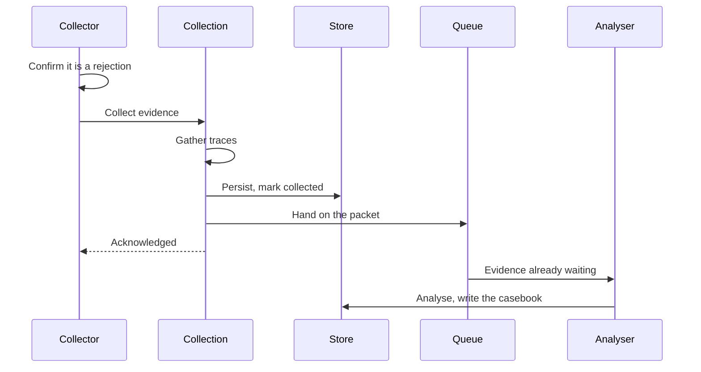
```mermaid
sequenceDiagram
    participant FC as Collector
    participant API as Collection
    participant FS as Store
    participant K2 as Queue
    participant SC as Analyser

    FC->>FC: Confirm it is a rejection
    FC->>API: Collect evidence
    API->>API: Gather traces
    API->>FS: Persist, mark collected
    API->>K2: Hand on the packet
    API-->>FC: Acknowledged
    K2->>SC: Evidence already waiting
    SC->>FS: Analyse, write the casebook
```

### 3.2 The analysis workflow

<!--fig: Analysis, part 1 - entry, evidence, and the runbook short-circuit.-->
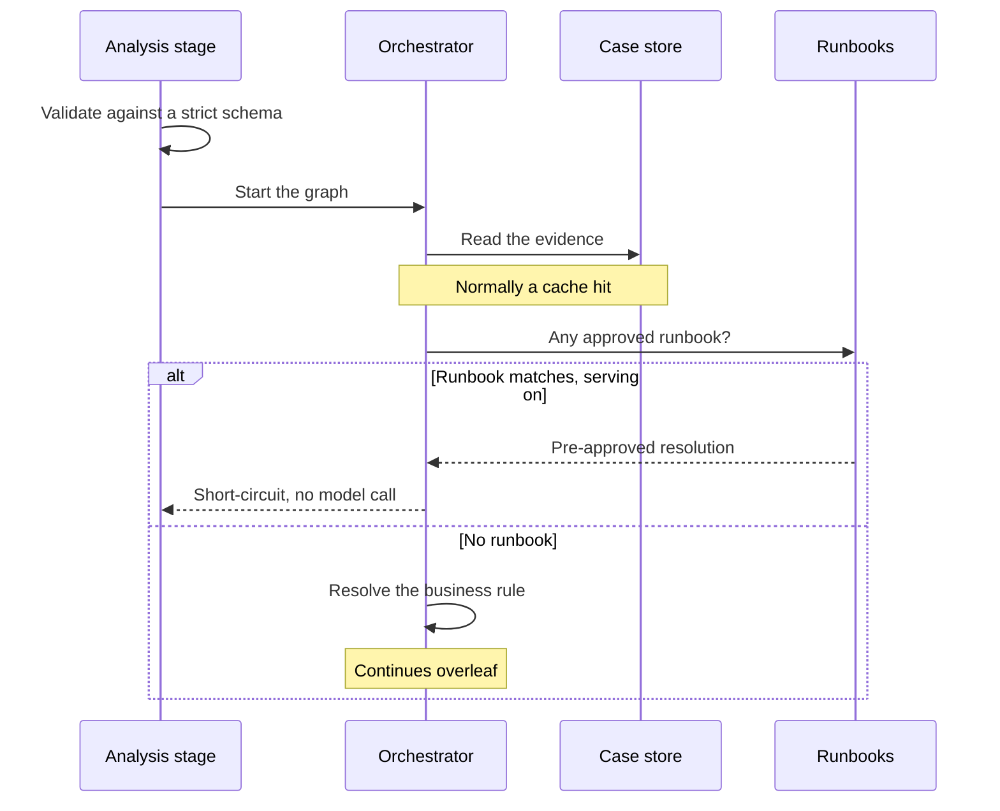
```mermaid
sequenceDiagram
    participant API as Analysis stage
    participant M as Orchestrator
    participant FS as Case store
    participant RB as Runbooks

    API->>API: Validate against a strict schema
    API->>M: Start the graph
    M->>FS: Read the evidence
    Note over M,FS: Normally a cache hit
    M->>RB: Any approved runbook?
    alt Runbook matches, serving on
        RB-->>M: Pre-approved resolution
        M-->>API: Short-circuit, no model call
    else No runbook
        M->>M: Resolve the business rule
        Note over M: Continues overleaf
    end
```

<!--fig: Analysis, part 2 - the agent chain and how its output is persisted.-->
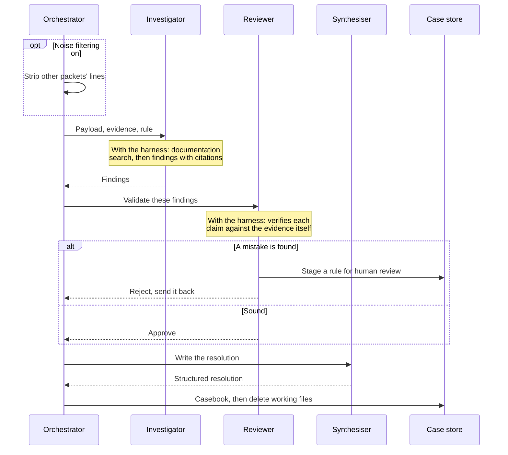
```mermaid
sequenceDiagram
    participant M as Orchestrator
    participant I as Investigator
    participant R as Reviewer
    participant S as Synthesiser
    participant FS as Case store

    opt Noise filtering on
        M->>M: Strip other packets' lines
    end
    M->>I: Payload, evidence, rule
    Note over I: With the harness: documentation<br/>search, then findings with citations
    I-->>M: Findings
    M->>R: Validate these findings
    Note over R: With the harness: verifies each<br/>claim against the evidence itself
    alt A mistake is found
        R->>FS: Stage a rule for human review
        R-->>M: Reject, send it back
    else Sound
        R-->>M: Approve
    end
    M->>S: Write the resolution
    S-->>M: Structured resolution
    M->>FS: Casebook, then delete working files
```

---

## 4. Every path, not just the happy one

Section 3 shows what normally happens. This section is the normative one:
every branch, degradation and duplicate case the system actually implements.
Five views, because one diagram covering all of it would be unreadable.

| View | Answers |
|---|---|
| 4.1 Master flow | What happens to a packet from arrival to finished casebook |
| 4.2 Evidence acquisition | Where evidence comes from, and what happens when it does not arrive |
| 4.3 Agent state machine | Runbooks, the review loop, contract repair, abstention |
| 4.4 Idempotency | What happens when the same packet arrives twice |
| 4.5 Delivery matrix | Which failures acknowledge, which redeliver, which deliberately stall |

### 4.1 Master flow

<!--fig: Master flow, part 1 - the collection worker and its intake guards.-->
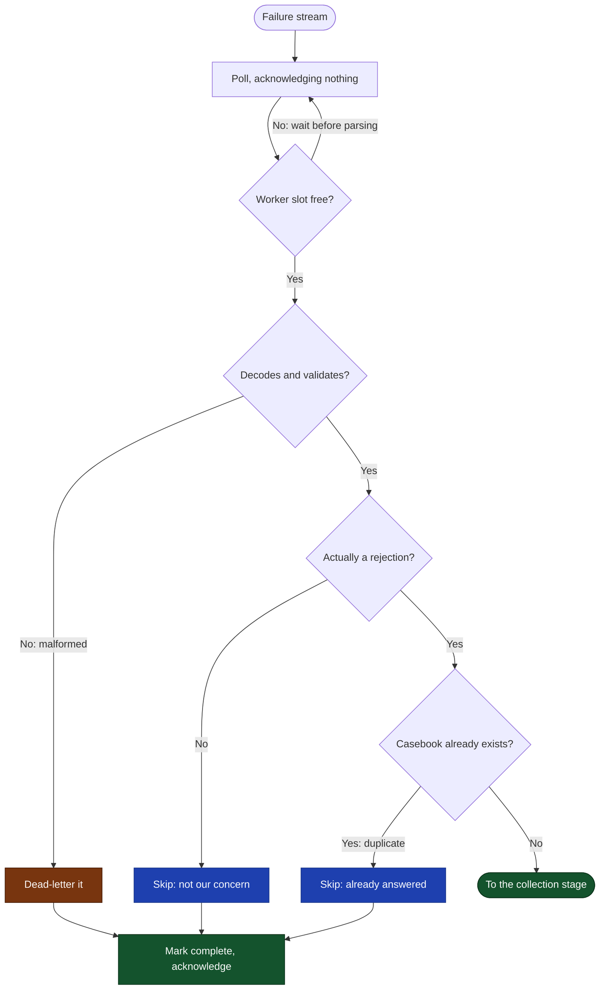
```mermaid
flowchart TD
    classDef skip fill:#1e40af,stroke:#1e3a8a,color:#ffffff
    classDef good fill:#14532d,stroke:#052e16,color:#ffffff
    classDef dlq fill:#78350f,stroke:#451a03,color:#ffffff

    K1(["Failure stream"]) --> POLL["Poll, acknowledging nothing"]
    POLL --> SEM{"Worker slot free?"}
    SEM -->|"No: wait before parsing"| POLL
    SEM -->|Yes| VAL{"Decodes and validates?"}
    VAL -->|"No: malformed"| PP["Dead-letter it"]
    VAL -->|Yes| RJ{"Actually a rejection?"}
    RJ -->|No| SK1["Skip: not our concern"]
    RJ -->|Yes| D1{"Casebook already exists?"}
    D1 -->|"Yes: duplicate"| SK2["Skip: already answered"]
    D1 -->|No| SUB(["To the collection stage"])
    PP --> RC1["Mark complete, acknowledge"]
    SK1 --> RC1
    SK2 --> RC1

    class PP dlq
    class SK1,SK2 skip
    class RC1,SUB good
```

<!--fig: Master flow, part 2 - the collection stage. Bounded work, no model.-->
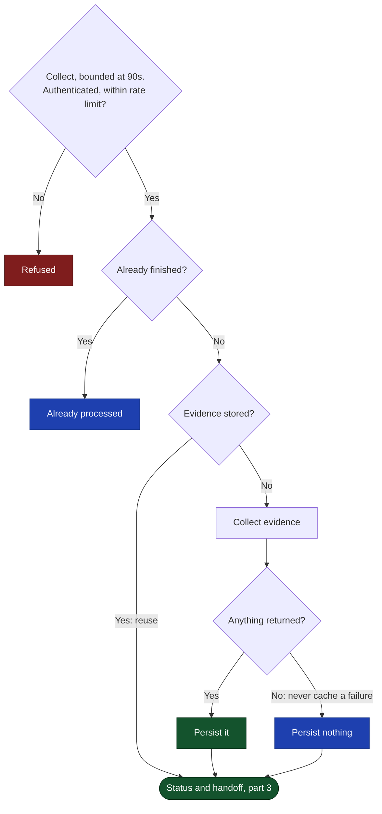
```mermaid
flowchart TD
    classDef skip fill:#1e40af,stroke:#1e3a8a,color:#ffffff
    classDef good fill:#14532d,stroke:#052e16,color:#ffffff
    classDef store fill:#334155,stroke:#0f172a,color:#ffffff
    classDef term fill:#7f1d1d,stroke:#450a0a,color:#ffffff

    AU{"Collect, bounded at 90s.<br/>Authenticated, within rate limit?"}
    AU -->|No| E4["Refused"]
    AU -->|Yes| T1{"Already finished?"}
    T1 -->|Yes| AP1["Already processed"]
    T1 -->|No| ART{"Evidence stored?"}
    ART -->|"Yes: reuse"| ON(["Status and handoff, part 3"])
    ART -->|No| FETCH["Collect evidence"]
    FETCH --> FOK{"Anything returned?"}
    FOK -->|Yes| SAVEA["Persist it"]
    FOK -->|"No: never cache a failure"| NOSAVE["Persist nothing"]
    SAVEA --> ON
    NOSAVE --> ON

    class AP1,NOSAVE skip
    class SAVEA,ON good
    class E4 term
```

<!--fig: Master flow, part 3 - recording the outcome and handing the packet on.-->
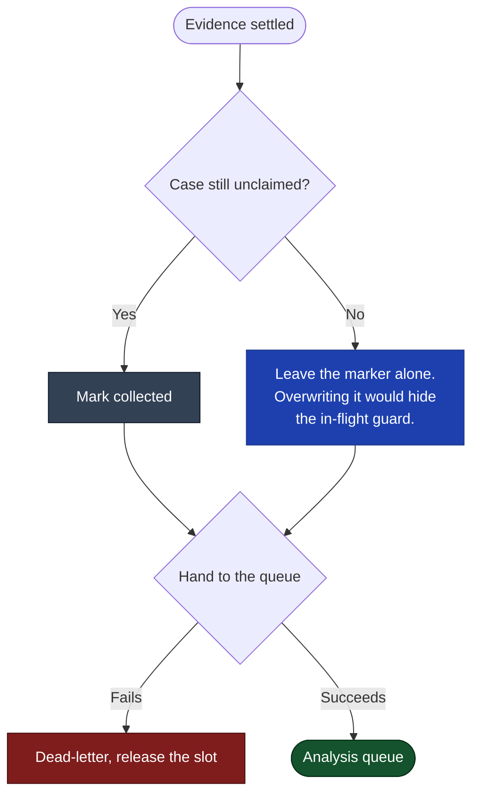
```mermaid
flowchart TD
    classDef skip fill:#1e40af,stroke:#1e3a8a,color:#ffffff
    classDef good fill:#14532d,stroke:#052e16,color:#ffffff
    classDef store fill:#334155,stroke:#0f172a,color:#ffffff
    classDef term fill:#7f1d1d,stroke:#450a0a,color:#ffffff

    IN(["Evidence settled"]) --> STAT{"Case still unclaimed?"}
    STAT -->|Yes| WSTAT["Mark collected"]
    STAT -->|No| KEEP["Leave the marker alone.<br/>Overwriting it would hide<br/>the in-flight guard."]
    WSTAT --> PUB
    KEEP --> PUB
    PUB{"Hand to the queue"}
    PUB -->|Fails| E5["Dead-letter, release the slot"]
    PUB -->|Succeeds| Q(["Analysis queue"])

    class KEEP skip
    class Q good
    class WSTAT store
    class E5 term
```

<!--fig: Master flow, part 4 - claiming a case, and resuming one already in flight.-->
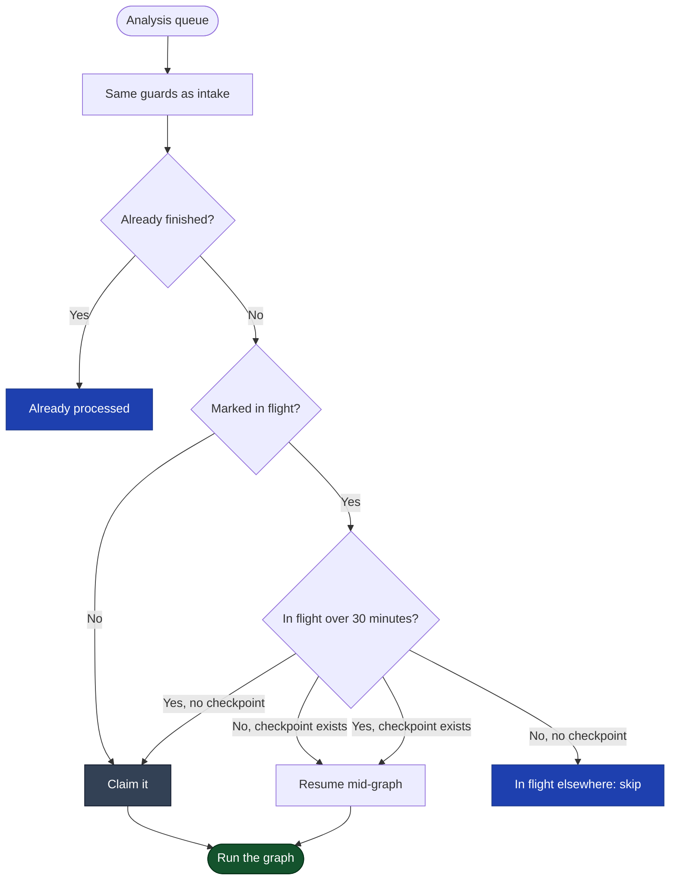
```mermaid
flowchart TD
    classDef skip fill:#1e40af,stroke:#1e3a8a,color:#ffffff
    classDef good fill:#14532d,stroke:#052e16,color:#ffffff
    classDef store fill:#334155,stroke:#0f172a,color:#ffffff

    K2(["Analysis queue"]) --> POLL2["Same guards as intake"]
    POLL2 --> T2{"Already finished?"}
    T2 -->|Yes| AP2["Already processed"]
    T2 -->|No| IP{"Marked in flight?"}
    IP -->|No| STUB["Claim it"]
    IP -->|Yes| STALE{"In flight over 30 minutes?"}
    STALE -->|"No, checkpoint exists"| RES["Resume mid-graph"]
    STALE -->|"No, no checkpoint"| BUSY["In flight elsewhere: skip"]
    STALE -->|"Yes, no checkpoint"| STUB
    STALE -->|"Yes, checkpoint exists"| RES
    STUB --> INV(["Run the graph"])
    RES --> INV

    class AP2,BUSY skip
    class INV good
    class STUB store
```

<!--fig: Master flow, part 5 - outcomes, and the guard against a late result.-->
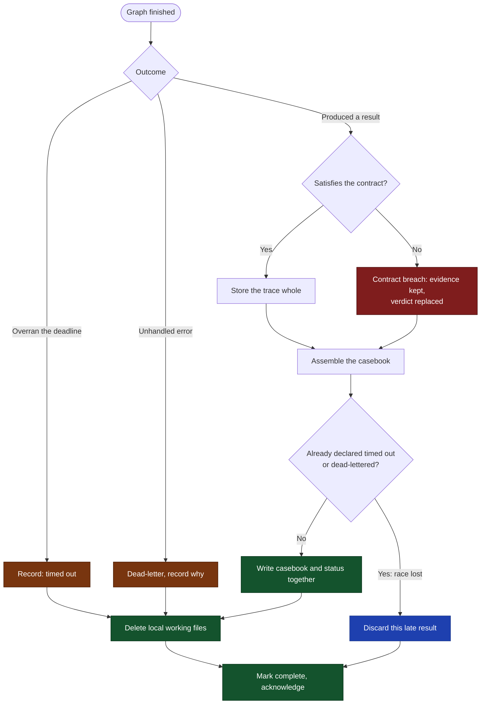
```mermaid
flowchart TD
    classDef skip fill:#1e40af,stroke:#1e3a8a,color:#ffffff
    classDef good fill:#14532d,stroke:#052e16,color:#ffffff
    classDef term fill:#7f1d1d,stroke:#450a0a,color:#ffffff
    classDef dlq fill:#78350f,stroke:#451a03,color:#ffffff

    G(["Graph finished"]) --> OUT{"Outcome"}
    OUT -->|"Overran the deadline"| FT["Record: timed out"]
    OUT -->|"Unhandled error"| DQ["Dead-letter, record why"]
    OUT -->|"Produced a result"| PARSE{"Satisfies the contract?"}
    PARSE -->|No| FSP["Contract breach: evidence kept,<br/>verdict replaced"]
    PARSE -->|Yes| ART2["Store the trace whole"]
    ART2 --> BUILD["Assemble the casebook"]
    FSP --> BUILD
    BUILD --> LATE{"Already declared timed out<br/>or dead-lettered?"}
    LATE -->|"Yes: race lost"| DISC["Discard this late result"]
    LATE -->|No| SAVE["Write casebook and status together"]
    FT --> CLEAN["Delete local working files"]
    DQ --> CLEAN
    SAVE --> CLEAN
    CLEAN --> RC2["Mark complete, acknowledge"]
    DISC --> RC2

    class DISC skip
    class SAVE,CLEAN,RC2 good
    class FSP term
    class FT,DQ dlq
```

### 4.2 Evidence acquisition, and every way it degrades

Evidence sources are tried in a configured order. A source that **fails** and
a source that **returns nothing** both trigger the fallback — both mean "we
did not get evidence here". Sources are never merged; exactly one wins per
collection.

<!--fig: Evidence acquisition, part 1 - reaching the primary source at all.-->
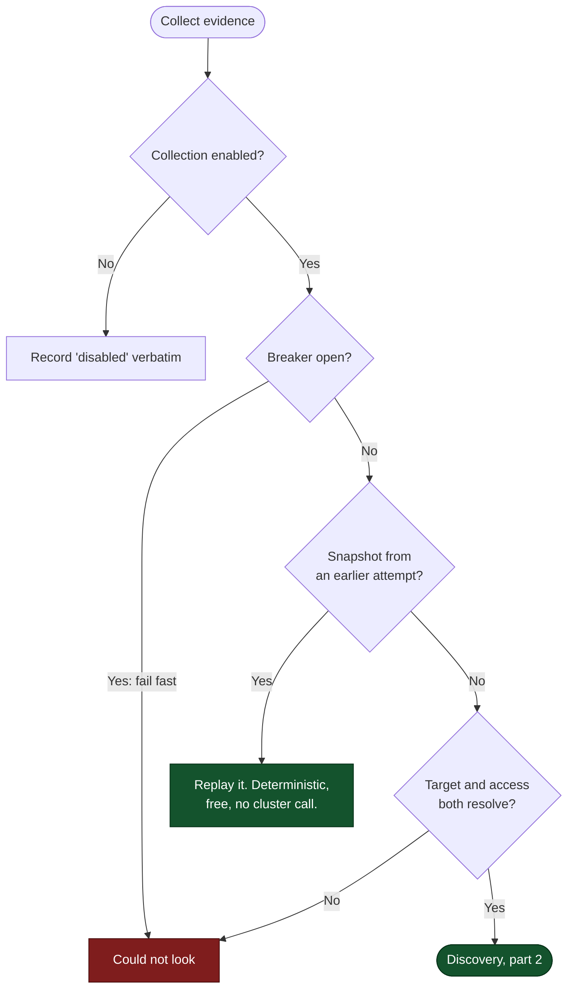
```mermaid
flowchart TD
    classDef bad fill:#7f1d1d,stroke:#450a0a,color:#ffffff
    classDef good fill:#14532d,stroke:#052e16,color:#ffffff
    classDef gap fill:#78350f,stroke:#451a03,color:#ffffff

    A(["Collect evidence"]) --> EN{"Collection enabled?"}
    EN -->|No| DIS["Record 'disabled' verbatim"]
    EN -->|Yes| BRK{"Breaker open?"}
    BRK -->|"Yes: fail fast"| KFAIL["Could not look"]
    BRK -->|No| SNAP{"Snapshot from<br/>an earlier attempt?"}
    SNAP -->|Yes| KOK["Replay it. Deterministic,<br/>free, no cluster call."]
    SNAP -->|No| CLI{"Target and access<br/>both resolve?"}
    CLI -->|No| KFAIL
    CLI -->|Yes| GO(["Discovery, part 2"])

    class KFAIL bad
    class KOK,GO good
```

<!--fig: Evidence acquisition, part 2 - discovering which workloads to read.-->
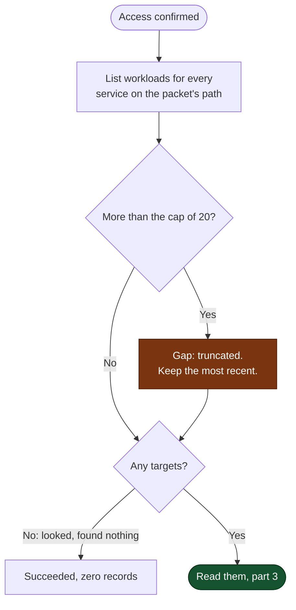
```mermaid
flowchart TD
    classDef good fill:#14532d,stroke:#052e16,color:#ffffff
    classDef gap fill:#78350f,stroke:#451a03,color:#ffffff

    IN(["Access confirmed"]) --> LIST["List workloads for every<br/>service on the packet's path"]
    LIST --> CAP{"More than the cap of 20?"}
    CAP -->|Yes| GAPT["Gap: truncated.<br/>Keep the most recent."]
    CAP -->|No| TGT
    GAPT --> TGT{"Any targets?"}
    TGT -->|"No: looked, found nothing"| KEMPTY["Succeeded, zero records"]
    TGT -->|Yes| READ(["Read them, part 3"])

    class GAPT gap
    class READ good
```

<!--fig: Evidence acquisition, part 3 - reading the targets, and the gaps that result.-->
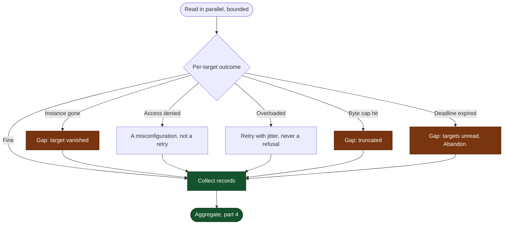
```mermaid
flowchart TD
    classDef bad fill:#7f1d1d,stroke:#450a0a,color:#ffffff
    classDef good fill:#14532d,stroke:#052e16,color:#ffffff
    classDef gap fill:#78350f,stroke:#451a03,color:#ffffff

    READ(["Read in parallel, bounded"]) --> PERR{"Per-target outcome"}
    PERR -->|"Instance gone"| GV["Gap: target vanished"]
    PERR -->|"Access denied"| RBAC["A misconfiguration, not a retry"]
    PERR -->|Overloaded| RETRY["Retry with jitter, never a refusal"]
    PERR -->|"Byte cap hit"| GT2["Gap: truncated"]
    PERR -->|"Deadline expired"| GT3["Gap: targets unread. Abandon."]
    PERR -->|Fine| COLLECT["Collect records"]
    GV --> COLLECT
    RBAC --> COLLECT
    RETRY --> COLLECT
    GT2 --> COLLECT
    GT3 --> COLLECT
    COLLECT --> OUT(["Aggregate, part 4"])

    class GV,GT2,GT3 gap
    class COLLECT,OUT good
```

<!--fig: Evidence acquisition, part 4 - aggregating the reads into a verdict.-->
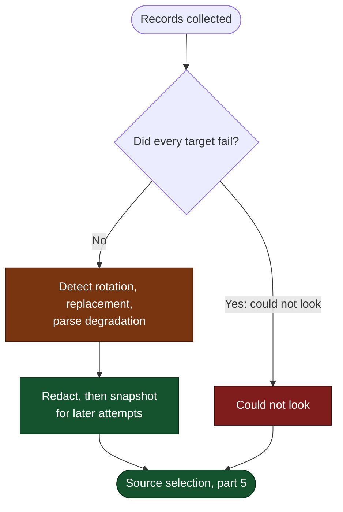
```mermaid
flowchart TD
    classDef bad fill:#7f1d1d,stroke:#450a0a,color:#ffffff
    classDef good fill:#14532d,stroke:#052e16,color:#ffffff
    classDef gap fill:#78350f,stroke:#451a03,color:#ffffff

    IN(["Records collected"]) --> ALLF{"Did every target fail?"}
    ALLF -->|"Yes: could not look"| KFAIL["Could not look"]
    ALLF -->|No| GAPS["Detect rotation, replacement,<br/>parse degradation"]
    GAPS --> SS["Redact, then snapshot<br/>for later attempts"]
    SS --> OK(["Source selection, part 5"])
    KFAIL --> OK

    class KFAIL bad
    class GAPS gap
    class SS,OK good
```

<!--fig: Evidence acquisition, part 5 - fallback, and choosing the winning source.-->
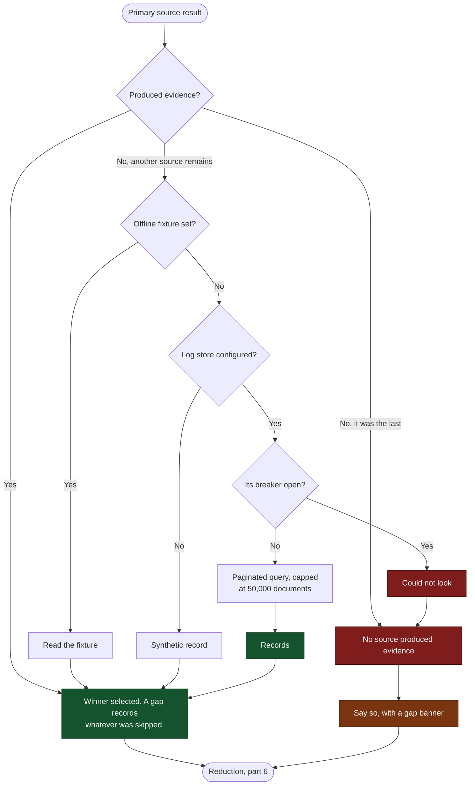
```mermaid
flowchart TD
    classDef bad fill:#7f1d1d,stroke:#450a0a,color:#ffffff
    classDef good fill:#14532d,stroke:#052e16,color:#ffffff
    classDef gap fill:#78350f,stroke:#451a03,color:#ffffff

    IN(["Primary source result"]) --> FB{"Produced evidence?"}
    FB -->|Yes| WIN
    FB -->|"No, another source remains"| ES{"Offline fixture set?"}
    FB -->|"No, it was the last"| NONE
    ES -->|Yes| MOCK["Read the fixture"]
    ES -->|No| HOST{"Log store configured?"}
    HOST -->|No| MOCK2["Synthetic record"]
    HOST -->|Yes| EBRK{"Its breaker open?"}
    EBRK -->|Yes| EFAIL["Could not look"]
    EBRK -->|No| QUERY["Paginated query, capped<br/>at 50,000 documents"]
    QUERY --> EOK["Records"]
    MOCK --> WIN
    MOCK2 --> WIN
    EOK --> WIN["Winner selected. A gap records<br/>whatever was skipped."]
    EFAIL --> NONE["No source produced evidence"]
    NONE --> EMPTY["Say so, with a gap banner"]
    WIN --> OUT(["Reduction, part 6"])
    EMPTY --> OUT

    class EFAIL,NONE bad
    class EMPTY gap
    class EOK,WIN good
```

<!--fig: Evidence acquisition, part 6 - reduction to the copy a model reads.-->
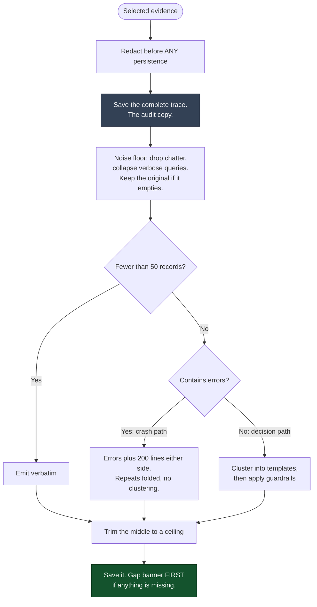
```mermaid
flowchart TD
    classDef good fill:#14532d,stroke:#052e16,color:#ffffff
    classDef store fill:#334155,stroke:#0f172a,color:#ffffff

    IN(["Selected evidence"]) --> RED2["Redact before ANY persistence"]
    RED2 --> RAW["Save the complete trace.<br/>The audit copy."]
    RAW --> NF["Noise floor: drop chatter,<br/>collapse verbose queries.<br/>Keep the original if it empties."]
    NF --> SIZE{"Fewer than 50 records?"}
    SIZE -->|Yes| DIRECT["Emit verbatim"]
    SIZE -->|No| BR{"Contains errors?"}
    BR -->|"Yes: crash path"| ERRP["Errors plus 200 lines either side.<br/>Repeats folded, no clustering."]
    BR -->|"No: decision path"| CLU["Cluster into templates,<br/>then apply guardrails"]
    DIRECT --> CAPC
    ERRP --> CAPC
    CLU --> CAPC["Trim the middle to a ceiling"]
    CAPC --> RDX["Save it. Gap banner FIRST<br/>if anything is missing."]

    class RAW store
    class RDX good
```

> **Why an empty result is not a failure.** The retrieval layer separates
> *could not look* from *looked and found nothing*. Collapsing the two would
> let the investigating agent conclude "no errors occurred" when the truth is
> "the logs were unreachable" — and it would do so confidently, because
> nothing in its input would contradict it. Every gap above is rendered into a
> banner placed **before** the trace, and the presence of that banner caps the
> final confidence at 0.6 no matter what the agent reports.

### 4.3 The agent state machine

The graph is built once and reused. Its checkpoint is keyed on the packet
identity, which is what makes resuming a half-finished investigation possible
at all.

<!--fig: Agent state machine, part 1 - evidence, runbook resolution, routing.-->
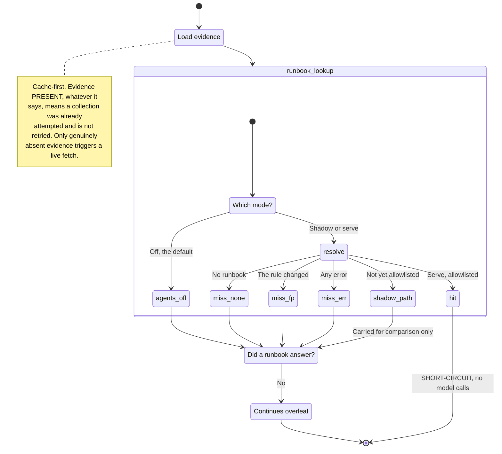
```mermaid
stateDiagram-v2
    [*] --> collect
    collect: Load evidence
    note right of collect
        Cache-first. Evidence PRESENT, whatever it
        says, means a collection was already
        attempted and is not retried. Only genuinely
        absent evidence triggers a live fetch.
    end note

    collect --> runbook_lookup
    state runbook_lookup {
        [*] --> mode_check
        mode_check: Which mode?
        mode_check --> agents_off: Off, the default
        mode_check --> resolve: Shadow or serve
        resolve --> miss_none: No runbook
        resolve --> miss_fp: The rule changed
        resolve --> miss_err: Any error
        resolve --> shadow_path: Not yet allowlisted
        resolve --> hit: Serve, allowlisted
    }

    hit --> [*]: SHORT-CIRCUIT, no model calls
    miss_none --> route
    miss_fp --> route
    miss_err --> route
    agents_off --> route
    shadow_path --> route: Carried for comparison only
    route: Did a runbook answer?
    route --> investigate: No
    investigate: Continues overleaf
    investigate --> [*]
```

<!--fig: Agent state machine, part 2 - the investigate and review loop.-->
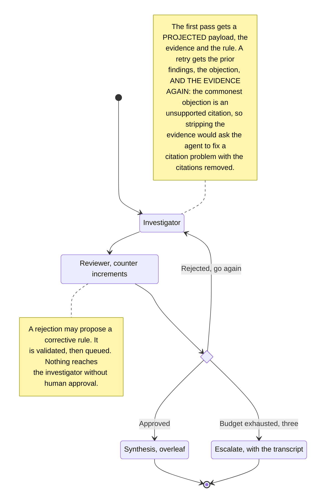
```mermaid
stateDiagram-v2
    [*] --> investigate
    investigate: Investigator
    note left of investigate
        The first pass gets a PROJECTED payload, the
        evidence and the rule. A retry gets the prior
        findings, the objection, AND THE EVIDENCE
        AGAIN: the commonest objection is an
        unsupported citation, so stripping the
        evidence would ask the agent to fix a
        citation problem with the citations removed.
    end note

    investigate --> review
    review: Reviewer, counter increments
    state decision <<choice>>
    review --> decision
    decision --> synthesize: Approved
    decision --> escalate: Budget exhausted, three
    decision --> investigate: Rejected, go again

    note right of review
        A rejection may propose a corrective rule. It
        is validated, then queued. Nothing reaches
        the investigator without human approval.
    end note

    synthesize: Synthesis, overleaf
    escalate: Escalate, with the transcript
    synthesize --> [*]
    escalate --> [*]
```

<!--fig: Agent state machine, part 3 - the output contract, repair, and abstention.-->
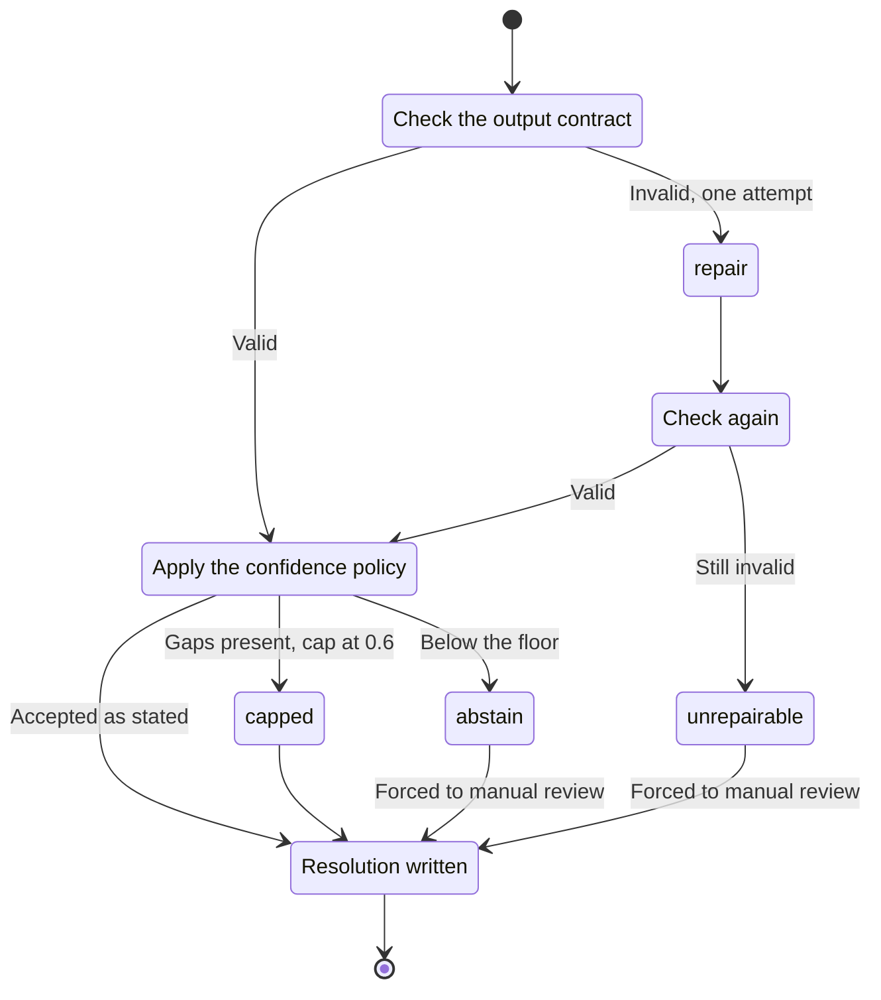
```mermaid
stateDiagram-v2
    [*] --> parse1
    parse1: Check the output contract
    parse1 --> policy: Valid
    parse1 --> repair: Invalid, one attempt
    repair --> parse2
    parse2: Check again
    parse2 --> policy: Valid
    parse2 --> unrepairable: Still invalid
    policy: Apply the confidence policy
    policy --> capped: Gaps present, cap at 0.6
    policy --> abstain: Below the floor
    policy --> ok: Accepted as stated
    capped --> ok
    abstain --> ok: Forced to manual review
    unrepairable --> ok: Forced to manual review
    ok: Resolution written
    ok --> [*]
```

Every model call is wrapped in a retry-then-break policy: three attempts on
transient provider errors, after which the breaker opens and fails fast for a
minute rather than queueing work behind a provider that is down.

### 4.4 Idempotency — the same packet arriving twice

Nine distinct guards, at nine layers, because a duplicate can enter at any of
them.

<!--fig: Nine duplicate-arrival guards, at the nine layers a duplicate can enter.-->
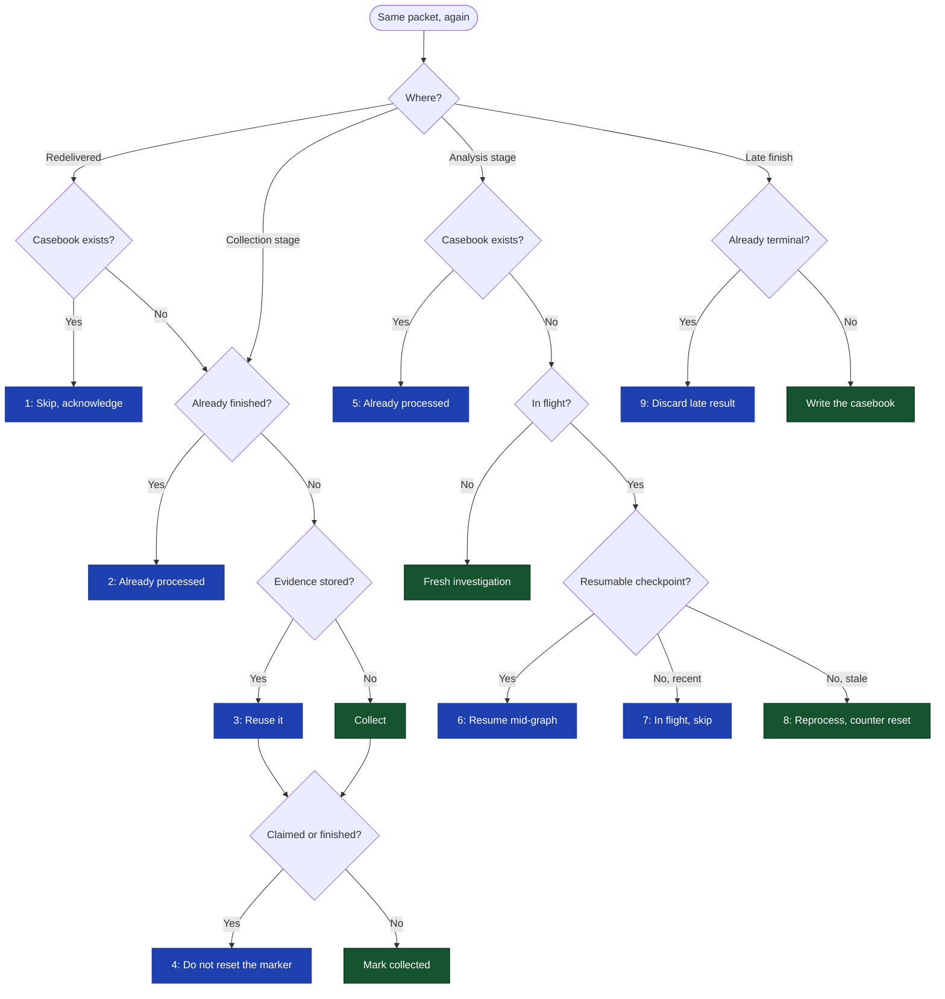
```mermaid
flowchart TD
    classDef skip fill:#1e40af,stroke:#1e3a8a,color:#ffffff
    classDef work fill:#14532d,stroke:#052e16,color:#ffffff

    DUP(["Same packet, again"]) --> WHERE{"Where?"}
    WHERE -->|Redelivered| G1{"Casebook exists?"}
    G1 -->|Yes| S1["1: Skip, acknowledge"]
    G1 -->|No| G2
    WHERE -->|"Collection stage"| G2{"Already finished?"}
    G2 -->|Yes| S2["2: Already processed"]
    G2 -->|No| G3{"Evidence stored?"}
    G3 -->|Yes| S3["3: Reuse it"]
    G3 -->|No| W1["Collect"]
    S3 --> G4
    W1 --> G4{"Claimed or finished?"}
    G4 -->|Yes| S4["4: Do not reset the marker"]
    G4 -->|No| W2["Mark collected"]
    WHERE -->|"Analysis stage"| G5{"Casebook exists?"}
    G5 -->|Yes| S5["5: Already processed"]
    G5 -->|No| G6{"In flight?"}
    G6 -->|No| W3["Fresh investigation"]
    G6 -->|Yes| G7{"Resumable checkpoint?"}
    G7 -->|Yes| S6["6: Resume mid-graph"]
    G7 -->|"No, recent"| S7["7: In flight, skip"]
    G7 -->|"No, stale"| W4["8: Reprocess, counter reset"]
    WHERE -->|"Late finish"| G9{"Already terminal?"}
    G9 -->|Yes| S8["9: Discard late result"]
    G9 -->|No| W5["Write the casebook"]

    class S1,S2,S3,S4,S5,S6,S7,S8 skip
    class W1,W2,W3,W4,W5 work
```

| # | Where | Trigger | Result |
|---|---|---|---|
| 1 | Collection worker | A finished casebook exists | Skip, acknowledge |
| 2 | Collection stage | The case is already finished | Already processed |
| 3 | Collection stage | Evidence already stored | Reuse, no re-collection |
| 4 | Collection stage | The case is claimed or finished | Leave the marker untouched |
| 5 | Analysis stage | A finished casebook exists | Already processed |
| 6 | Analysis stage | Claimed, with a resumable checkpoint | Resume mid-graph |
| 7 | Analysis stage | Claimed recently, no checkpoint | Skip — genuinely in flight |
| 8 | Analysis stage | Claimed but stale, no checkpoint | Reprocess, attempt counter reset |
| 9 | Analysis stage | A terminal failure was already recorded | Discard the late result |

> **Guard 8 resets the attempt counter explicitly.** The checkpoint is keyed on
> packet identity, so a redelivered packet that looks "fresh" can otherwise
> resume a saved checkpoint whose attempt counter is already exhausted — and
> escalate instantly to manual review without doing any work at all.

> **Scope limit, stated plainly.** Guards 3 and 4 rely on local file locking,
> which coordinates processes on one machine and does nothing whatsoever for
> two machines. The system therefore refuses to start with more than one
> replica unless both the case store and the checkpoint store are backed by
> services that *can* coordinate. This is enforced at boot, not discovered in
> production.

### 4.5 Delivery and failure matrix

Nothing is acknowledged per message. The system tracks the **low-water
mark**: the highest point below which every dispatched message has completed.
Three messages dispatched together, with the third finishing first,
acknowledge nothing until the first two land.

<!--fig: Failures that advance. The queue keeps moving in every one of these cases.-->
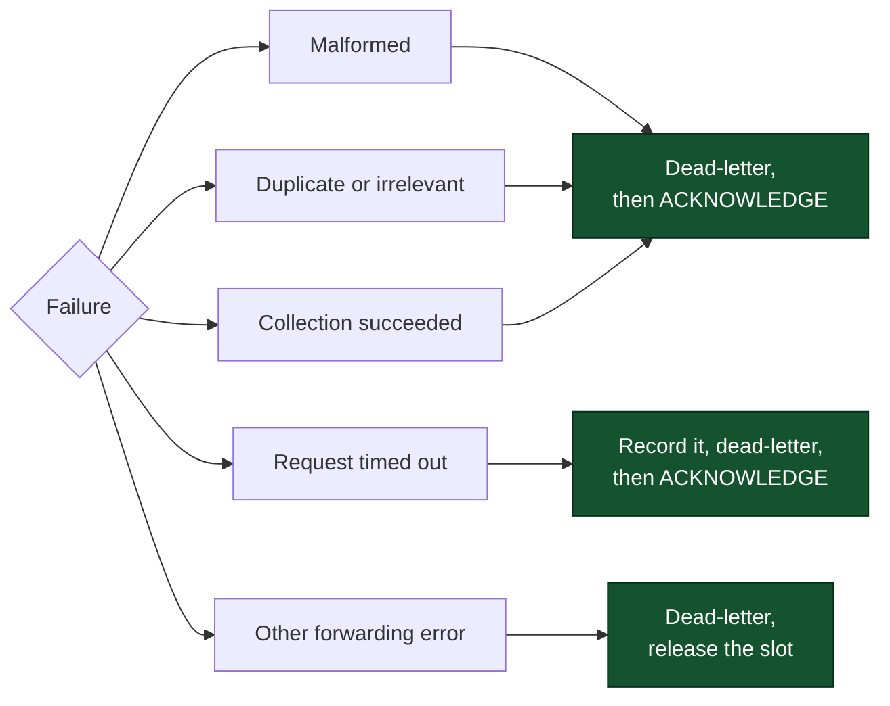
```mermaid
flowchart LR
    classDef good fill:#14532d,stroke:#052e16,color:#ffffff

    F{"Failure"} --> A["Malformed"] --> C1["Dead-letter,<br/>then ACKNOWLEDGE"]
    F --> B["Duplicate or irrelevant"] --> C1
    F --> C["Collection succeeded"] --> C1
    F --> D["Request timed out"] --> D1["Record it, dead-letter,<br/>then ACKNOWLEDGE"]
    F --> E["Other forwarding error"] --> E1["Dead-letter,<br/>release the slot"]

    class C1,D1,E1 good
```

<!--fig: Failures that hold or hand back. Only the first refuses to advance.-->
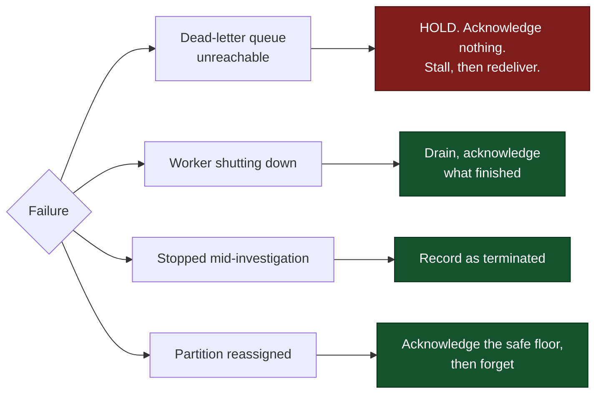
```mermaid
flowchart LR
    classDef good fill:#14532d,stroke:#052e16,color:#ffffff
    classDef bad fill:#7f1d1d,stroke:#450a0a,color:#ffffff

    F{"Failure"} --> G["Dead-letter queue<br/>unreachable"] --> G1["HOLD. Acknowledge nothing.<br/>Stall, then redeliver."]
    F --> H["Worker shutting down"] --> H1["Drain, acknowledge<br/>what finished"]
    F --> I["Stopped mid-investigation"] --> I1["Record as terminated"]
    F --> J["Partition reassigned"] --> J1["Acknowledge the safe floor,<br/>then forget"]

    class H1,I1,J1 good
    class G1 bad
```

The one deliberate stall is the unreachable dead-letter queue. If there is
nowhere left to escalate to, the system holds its position rather than
acknowledging past a message that would then exist nowhere at all. It
self-heals on redelivery once the broker returns. Every other path advances.

---

## 5. The agent ecosystem

Five roles. Only four of them are models, and the most important one is not.

**The orchestrator is not an agent.** The conductor is the compiled graph
itself, and every routing decision is ordinary code. This is the single
largest design commitment in the system: the sequence of steps cannot be
altered by a model, because no model is ever asked what should happen next.

**The noise filter** *(optional)*. Traces are gathered from highly concurrent
services, so a window around the packet's own activity inevitably contains
other packets' lines — including their errors. When enabled, this agent
removes lines belonging to other correlation identifiers before the
investigation begins. When disabled, the investigating agent is instead
hardened against the same problem by instruction: verify the identifier on
any error line before trusting it.

**The Investigator.** The detective. It correlates the reason code with the
business rule the orchestrator pre-resolved for it, cross-references the
reduced trace, and states the technical failure. It holds no tools of its own
on the direct path. Where a service distinguishes packet variants that carry
genuinely different success criteria, the agent is required to state which
variant it is reasoning about before applying that variant's rules —
conflating them is the most expensive mistake available, and stating the
choice makes it reviewable.

**The Reviewer.** The auditor, and the reason the system can be trusted at
all. It checks the Investigator's work specifically for claims that the
evidence does not support. It runs on a cheaper model tier — this is a bounded
verdict task, not an open-ended one. It holds exactly one capability: proposing
a corrective rule for human review. A rejection sends the investigation back
with feedback, up to three attempts, after which the case escalates to a human
with the full transcript attached.

**The Synthesiser.** The resolution writer. It converts validated findings
into plain language and a constrained action enum, and it is the only agent
that can nominate a replay — a nomination which, by default, a human must then
approve.

Separating investigation from review is what makes the output auditable. One
agent producing a confident answer is a guess with good grammar; a second
agent whose entire job is to find the unsupported claim in it, with the
authority to send it back, is a process.

---

## 6. Evidence reduction

Raw traces are far too large for a model's context, and most of their volume
carries no diagnostic signal at all. The reduction pipeline is aggressive but
never silent: every stage that removes something announces how much.

| Stage | What it does | Why |
|---|---|---|
| **Catalog** *(offline)* | Samples historical traces to classify recurring templates as boilerplate, informative, or decision-marker | Frequency across unrelated flows is the strongest available signal for "this line never distinguishes one outcome from another" |
| **Retrieval** | Source-filtered query with stable pagination and a hard document cap | An unbounded query against a busy index is an outage waiting to happen |
| **Redaction** | Removes identity numbers, contact details and addresses; allowlists correlation identifiers | Runs at the one point every source passes through, before *any* persistence — so it cannot be bypassed by adding a source |
| **Audit copy** | The complete trace is written to disk first | Everything downstream is lossy. The unmodified record has to exist somewhere. |
| **Noise floor** | Drops framework chatter below a severity threshold; collapses verbose query echoes to a summary | Roughly half the lines and two-thirds of the bytes in a real trace. Applied only to the model's copy — never to the audit copy. If it would empty the trace, the original is kept. |
| **Branch on error** | If the trace contains errors: keep them plus 200 lines either side, and skip clustering entirely | A crash is a *sequence*. Replacing it with a cluster summary destroys exactly the ordering that explains it. |
| **Clustering** | Otherwise: strip variable content and group structurally identical lines | A rule-rejection trace is repetitive by nature; what matters is which distinct things happened, not how many times |
| **Guardrails** | Force full retention for decision vocabulary, rare templates, and flow boundaries — each bounded | Without bounds the exemptions invert the pipeline. An unbounded "always keep decision lines" rule once produced reduced output larger than its input. |
| **Ceiling** | Trim the middle of the final text, and say so | Head and tail both carry information; the middle repeats |
| **Evaluation** *(offline)* | Measures citation accuracy against known-good cases | The pipeline's own correctness is testable, and is tested before it is trusted |

Two properties are worth calling out for an agentic reader. First, the gap
banner is prepended **after** the size ceiling is applied, so a trace being too
large can never be what removes the warning that the trace is incomplete.
Second, the reduction is deterministic and its output is persisted — the exact
text a model saw can be recovered and re-read months later, which is what
makes a disputed conclusion investigable.

---

## 7. The tool-using harness

There are two ways an agent in this system can run, and they are switchable
**per lane**: the rejection lane and the DLT lane each have their own switch,
so one can run direct while the other runs on the harness.

**Direct.** The prompt carries everything: the evidence, the rule, the
payload projection. The model answers in one turn. Cheap, fast, and entirely
bounded by what the orchestrator thought to include.

**Harness.** The agent runs inside a tool environment with search and read
access to a generated documentation corpus covering every service in the
estate — architecture, per-module documentation, data flows, known error
paths. It explores: globbing for the module that owns a class named in the
trace, grepping the corpus for an error code, reading the data flow to
establish which service the packet was in when it failed. It then writes its
findings to a file, which the orchestrator reads back.

The difference matters. On the direct path the agent can only reason about
evidence someone anticipated it would need. On the harness path it can answer
"which component produces this message, and what is upstream of it?" — a
question nobody knew to pre-fetch the answer to.

Design constraints worth noting:

- **The agent is sandboxed by capability, not by trust.** Shell execution and
  network access are denied outright. Its entire world is a filesystem it can
  search and read, and one file it may write.
- **Each task is a fresh conversation** against a long-lived shared server, so
  no context leaks between cases even under heavy concurrency.
- **Any harness failure degrades to the direct path.** A timeout, a crash, an
  unparseable answer — the node logs it and falls back rather than failing the
  packet. A harness outage therefore costs analysis depth, never availability.
- **The corpus is a startup dependency.** The service reports itself unready
  until the corpus has been fetched and the harness is accepting work, so
  workers do not begin forwarding packets into an environment that cannot yet
  answer them.
- **Investigation retries always take the direct path.** A retry exists to
  carry the reviewer's objection back in, and the file-based contract has no
  slot for it.

Reviewers run on the harness too, and this is the more interesting half: the
reviewing agent independently verifies the investigator's claims against the
same corpus and the same evidence files, rather than judging the investigation
on the strength of its own prose.

**Direct with documentation.** The rejection lane has a third mode, and it is
where that lane is heading. Exploring the corpus is expensive: several model
round-trips per packet, and an answer whose quality depends on what the agent
thought to search for. For a rejection the relevant material is narrow and
knowable in advance -- a packet carries a reason code, and each service
publishes what its reason codes mean and which policy rules raise them. So
instead of an agent searching, a lookup in Python selects the documentation for
that code and that enrolment type, and hands it to the investigator in one
call. The reviewer is given the same text and the same evidence, so it can
check the investigation rather than only read it.

This trades the harness's open-endedness for speed, a bounded prompt, and an
audit trail: each casebook records a hash of the exact documentation the model
was shown, so a change in accuracy can be attributed to a document edit rather
than merely coinciding with one. Where no documentation exists for a code, the
investigator is told so plainly and reasons from the business rule as before --
a gap in the library degrades one answer, never the packet.

---

## 8. Confidence, abstention and provenance

Three mechanisms make the output something an operator can calibrate against
rather than merely read.

**A confidence ceiling tied to evidence quality.** When the evidence is known
to be incomplete, confidence is capped at 0.6 regardless of what the agent
reports. The cap is applied by the system, not requested from the model —
models are poor judges of what they were not shown.

**An abstention floor.** Below a configurable confidence, the action is
replaced with "manual review". The floor ships disabled, because enabling it
before the confidence numbers have been calibrated against recorded outcomes
would trade one unmeasured behaviour for another. The data needed to set it is
being collected by the mechanism below.

**A contract, and one repair attempt.** The synthesiser's output must satisfy
a strict schema. If it does not, the system tries once to repair it; if that
fails, the case is marked as a contract breach and routed to a human — and,
critically, the evidence is still persisted. A breach costs the verdict, never
the trace that would explain it. This state is named distinctly from a genuine
"I could not classify this", because those two used to be indistinguishable
and the difference is the difference between a broken system and a careful one.

**Provenance on every casebook.** Each record carries a fingerprint of the
exact prompt set that produced it. When accuracy moves, it can be *attributed*
to a prompt change rather than merely correlated with one — which is the
difference between an evaluation loop and a hope.

**Ground truth, recorded deliberately.** Operators can attach a verdict —
correct, incorrect, partial — to any finished casebook. This is the only
source of truth the system has about its own accuracy, and everything that
depends on knowing whether it works well (promoting a runbook, enabling the
abstention floor, validating the deployment check) depends on it.

---

## 9. The self-learning loop

When the reviewing agent identifies a *systematic* mistake — not a one-off
error, but reasoning that would recur — it proposes a rule.

<!--fig: The self-learning loop. Only a person can close it.-->
```mermaid
flowchart LR
    classDef human fill:#14532d,stroke:#052e16,color:#ffffff
    classDef auto fill:#334155,stroke:#0f172a,color:#ffffff
    classDef gate fill:#78350f,stroke:#451a03,color:#ffffff

    R["Reviewer rejects,<br/>proposes a rule"] --> V{"Validate: injection<br/>markers, length"}
    V -->|Fails| DROP["Discarded"]
    V -->|Passes| Q["Staged with the case<br/>and the reasoning"]
    Q --> H{"Human review"}
    H -->|Rejected| KEEP["Left staged.<br/>Nothing is lost."]
    H -->|Approved| P["Appended, and<br/>committed to history"]
    P --> NEXT["Applies to every<br/>later investigation"]

    class R,V,Q auto
    class H,P human
    class DROP,KEEP gate
```

The property that matters: **the loop is open by default and closed only by a
person.** A proposal sits in the queue indefinitely and changes nothing. Only
promotion removes it, so a proposal that is skipped, errors, or arrives
concurrently survives rather than being silently dropped. Every promotion is a
version-controlled commit, which means the instruction set has a history and a
bad rule can be identified and reverted.

An agent that can rewrite its own instructions without supervision will
eventually rewrite them somewhere nobody intended. This design accepts slower
learning in exchange for never having to ask where a rule came from.

---

## 10. Runbooks — retiring the agents from solved problems

Most failures are not novel. When the same reason code produces the same
resolution across many cases, running a multi-minute agent loop to rediscover
it is waste.

<!--fig: The runbook lifecycle, part 1 - mining a draft and approving it.-->
```mermaid
flowchart LR
    classDef auto fill:#334155,stroke:#0f172a,color:#ffffff
    classDef human fill:#14532d,stroke:#052e16,color:#ffffff

    A["Casebooks sharing a<br/>reason code"] --> B["Draft a generic<br/>resolution"]
    B --> C{"Case-specific<br/>value left?"}
    C -->|"Yes"| B
    C -->|No| D["Pending review"]
    D --> E{"Human review"}
    E -->|Rejected| D
    E -->|Approved| FF["Approved,<br/>versioned"]

    class A,B,C auto
    class D,E,FF human
```

<!--fig: The runbook lifecycle, part 2 - earning the right to serve traffic.-->
```mermaid
flowchart LR
    classDef auto fill:#334155,stroke:#0f172a,color:#ffffff
    classDef serve fill:#1e40af,stroke:#1e3a8a,color:#ffffff

    FF["Approved,<br/>versioned"] --> G["SHADOW: agents run,<br/>divergence recorded"]
    G --> H{"Right, against<br/>recorded outcomes?"}
    H -->|"Not proven"| G
    H -->|Proven| I["SERVE:<br/>allowlisted"]
    I --> J["Zero model calls.<br/>Sub-second."]

    class FF,G,H auto
    class I,J serve
```

Three safeguards make this safe to switch on:

- **A runbook is bound to the rule it was derived from.** If the underlying
  business rule changes, the binding no longer matches and the runbook stops
  being served — the agents take the case back automatically. A stale runbook
  cannot answer for a rule that no longer exists.
- **Shadow mode earns the promotion.** A candidate runs alongside the agents,
  answering nothing, while its answers are compared against theirs and against
  recorded operator verdicts. Serving is allowlisted per failure type, so a
  code earns its place individually rather than by category.
- **The provenance is preserved.** A runbook-served casebook is marked as such,
  with the runbook's identity and version, so it is never mistaken for an
  agent's reasoning.

---

## 11. Operating posture

Nearly everything beyond the core rejection lane ships **off**. This is
deliberate: each capability is enabled only once there is evidence it behaves,
and the evidence has to come from running it in a mode where it cannot do harm.

| Capability | Default | What turning it on does |
|---|---|---|
| Rejection analysis | **On** | The core lane |
| Crash (dead-letter) analysis | Off | Adds the second lane entirely |
| Noise filtering agent | Off | Adds a model call to clean the trace |
| Tool-using harness | Off | Agents gain documentation search |
| Runbook serving | Off | Approved runbooks answer without a model |
| Abstention floor | Disabled (zero) | Low-confidence findings become manual review |
| Automatic replay | Off | A recommended replay reaches the live system without a human |
| Deployment check | Off | Records whether the failing code has changed |
| Deployment check as a gate | Off | Lets that verdict withhold a replay |
| Parking | Off | Holds a withheld packet until its fix ships |

The layering is the point. "Record a verdict", "let the verdict block an
action", and "hold the packet for later" are three separate switches, not one,
so the verdict can be validated against reality for weeks before it is allowed
to decide anything.

---

## 12. The crash lane

A packet that *crashes* is a different problem from one that is *rejected*. A
rejection is the pipeline working correctly and saying no. A crash is the
pipeline failing to reach a decision at all — an unhandled exception, a
message that could not even be deserialised, a downstream service that was
not there.

These arrive on a dead-letter topic after the producing service has already
exhausted its own retries. The lane mirrors the rejection lane's two-stage
split for the same reason, and shares its evidence pipeline, storage and
confidence policy. It shares neither the data model nor the runbook space.

```
collection stage:  parse the failure headers -> classify -> fingerprint
                   -> persist the evidence -> gather the service's own logs
                   -> record which build is actually running

analysis stage:    corroborate the trace against those logs
                   -> group by fingerprint, decide whether a model is needed
                   -> produce a finding -> DEPLOYMENT CHECK
                   -> replay gate -> park if withheld -> casebook

offline:           release parked packets whose fix has now shipped
```

Nine things are worth knowing about it without reading the full design.

**1. The root cause is the innermost cause, never the outermost.** The failure
metadata names a framework wrapper exception that is identical for every
failure in every service in the organisation. The signal is at the bottom of
the cause chain, not the top. Fingerprinting the top would produce one giant
bucket containing everything.

**2. The search window is anchored on the last attempt, not the first.** A
packet that has exhausted a retry policy may have first failed long before it
was dead-lettered — in observed samples, nearly two days before. Anchoring on
the original timestamp searches a window in which nothing relevant happened
and finds nothing, silently.

**3. A cached recommendation is never served blind.** When a failure matches a
fingerprint already seen, the *model call* is skipped — but the evidence is
still gathered and the trace is still corroborated against it, every time.
Corroboration is this lane's highest-value output and it is packet-specific;
caching it would discard the one thing worth computing.

**4. The correlation identifier is read from the message key first.** The key
survives a payload that cannot be deserialised, which is precisely the case
this lane exists to keep alive. Four strategies are tried in descending order
of reliability, and the casebook records **which one answered** — a value read
off the key and a value found by searching the payload are not the same kind
of fact, and a reader deserves to know which they have. A disagreement between
sources is surfaced as an evidence gap rather than silently resolved.

**5. The obvious identifier field is the wrong one.** The payload carries a
field whose name matches this project's own vocabulary for the correlation id,
but it is a different value entirely. It is explicitly denylisted, because the
failure mode is not an error — it is an empty search window, which reads
exactly like "nothing was logged".

**6. A catalog of published reason codes moves cases out of the expensive
lane.** Many codes that arrive wrapped in a business-exception type are
declared at source as *technical* failures. Without that catalog, a broker
outage reads as a business rejection and costs a model call to reach the
answer "retry once the broker recovers" — which a canned treatment already
says for free. The override is deliberately one-directional: it can move a
case towards the cheap technical treatment, never the reverse, because a code
defect is identified by its exception type and never by a reason code.

**7. Most crashes never reach a model at all.** The taxonomy sorts failures
into classes, and only one of them — a genuine, novel code defect — is worth
an investigation. Infrastructure failures, known transient conditions and
already-fingerprinted repeats all receive fixed treatments.

**8. Corroboration is the mis-cast detector.** The single most valuable thing
this lane produces is the case where the declared exception and the service's
own logs disagree — where the stack trace says one thing and the evidence says
the failure was something else entirely. That is a class of bug that is
extremely expensive to find by hand and nearly free to find this way.

**9. Replay recommendations are gated twice over.** A high-confidence finding
may nominate a replay, but that capability is off by default, canned findings
carry no confidence at all so a missing score can never read as a passing one,
and a separate switch decides whether an approved replay reaches the live
system or queues for a human.

---

## 13. The deployment check — "has this actually been fixed?"

This is the most interesting decision in the system, and worth explaining even
to a reader who cares nothing for the rest.

Before replaying a crashed packet, the useful question is not "was this bug
fixed?" but "**is the fix running?**" A packet replayed against the same build
that broke it will break again, identically, and dead-letter again. The
system therefore joins the stack trace to the source repository through the
version number, and compares that against the version the live workloads are
actually running.

**The version number is the join key.** Around 95% of changes bump it, the
build artifact carries the same value, and the running workload's artifact tag
is readable directly. That chain removes the need for commit hashes, a
deployment tool integration, or any change to the build pipeline.

**The desired state is deliberately not consulted.** A deployment manifest
describes what *should* be running. A replay executes against what *is*
running. A manifest updated but not yet rolled out would report a version that
is not live — precisely the wrong answer. The running workload's own tag is
the only authority, and it doubles as the rollout signal: if it is on the new
version, the rollout reached it.

Four verdicts, always recorded — including when the feature is switched off,
so that "we did not look" and "we looked and found nothing" never read alike:

| Verdict | Condition | Consequence when gating is enabled |
|---|---|---|
| **No change** | Nothing has touched the failure site since the packet failed | Replay withheld — it would reproduce the same dead letter |
| **Not deployed** | A change exists; the version carrying it is not running | Replay withheld, and the packet **parked** until the rollout reaches that version |
| **Fix deployed** | The running build is at or beyond the version carrying the change | No effect — the verdict is a veto only, never a trigger |
| **Unknown** | Unmappable frame, unreachable repository, unparseable version, or no baseline | No effect, ever |

"Not deployed" is the operative one. It converts "replay and see" into "replay
after the next rollout", which is a scheduling decision the system makes and
then acts on by itself.

**The whole call path is checked, not just the failure site.** An exception
surfaces where bad data is *used*, which is often several frames below where
it was produced: one function passes something inconsistent to a second, which
passes it to a third, which throws — and the developer fixes the first.
Checking only the throwing frame finds no change and reports a confident,
false "no change", withholding a replay that would now succeed. It does so
invisibly, because the accuracy report can only measure replays that actually
fired. Every frame up the call path is therefore queried.

**Three asymmetries, all pointing the same way.** A wrong "fix deployed"
causes a replay that fails again; a wrong "not deployed" merely delays one. So
the *highest* candidate version is required when several changes touched the
site and it is unclear which is the fix; the *lowest* running version is
compared, because a replay may land on any workload mid-rollout; and a
positive verdict requires a recorded baseline while a negative one does not.

**"Nothing found" and "could not look" are different answers, and the
difference decides a replay.** An empty result from the repository means "the
server answered, and nothing has touched this file" — which becomes "no
change" and withholds the replay. A null result means "we could not reach the
repository", which becomes "unknown" and changes nothing. Collapsing them
would let a source-control outage read as "the code definitely has not
changed" and stop every replay in the system on no evidence whatsoever. It is
the same distinction the evidence layer and the corroboration step already
make, for the third time.

**Parking cannot become a second replay path.** A packet is parked only when
the replay gate would have said yes *without* the veto — so with automatic
replay switched off, nothing parks at all. And releasing a parked packet goes
back through the same approval gate, so the human-in-the-loop setting still
decides whether it reaches the live system or waits for sign-off.

---

## 14. Known limits

Stated plainly, because a system that reports its own confidence should be
willing to state where it is unproven.

**The deployment check has never run against a real repository or cluster.**
It is merged, unit-tested against recorded fixtures, and completely inert: the
source integration is unconfigured and all three of its switches default off,
so every verdict currently reads "unknown" and nothing behaves differently
from before it existed. A feasibility probe exists precisely to answer the
open questions before it is configured.

**The verdicts have not been validated against reality.** The accuracy report
that would validate them needs replays that actually fired, which is why the
recommended sequence is to run the check in record-only mode for at least two
weeks before allowing it to gate anything.

**The 95% version-bump assumption may not be uniform.** If one team never
bumps versions, the error rate for their repositories is 100%, not 5%. The
sampling that answers this has to be stratified per repository rather than
pooled.

**A "fix deployed" verdict means "this packet will not fail *here* again" —
never "this replay will succeed."** A replay re-runs the packet from the start,
so it traverses every earlier stage first, and bad data produced in a
different service is invisible to a stack trace from this one.

**The crash lane's evidence assumption is unverified at scale.** Whether the
producing services' log lines reliably carry the correlation identifier this
lane searches on is a hard gate on that lane's evidence being useful at all,
and it has not been measured against a real broker.

**Confidence is reported but not yet calibrated.** The abstention floor ships
disabled for exactly this reason: the recorded-outcome mechanism that would
calibrate it is in place, but the data has to accumulate first.

**Single-writer coordination is enforced, not solved.** Multi-replica
deployment requires shared backing services for both the case store and the
checkpoint store. The system refuses to start otherwise rather than degrading
quietly — but the refusal is the safeguard, not a distributed-locking
implementation.

---

## 15. What an agentic engineer might take from this

The system is unremarkable as an LLM application and deliberately so. Its
interesting properties are all about constraint:

- Models are used for judgement, never for control flow.
- Every tool result is resolved deterministically and injected, rather than
  requested by a model that may invent the arguments.
- Every claim is reviewed by a second agent whose only job is to find the
  unsupported one, with the authority to send it back.
- The difference between "no evidence" and "no access to evidence" is
  preserved at every layer that could collapse it — and it is collapsed
  nowhere.
- Confidence is capped by the system based on evidence quality, not accepted
  from the model.
- Every capability that acts on the outside world is off until someone turns
  it on, and "decide" and "act" are always separate switches.
- The learning loop cannot close itself.

None of this makes the agents smarter. It makes their mistakes bounded,
visible, and attributable — which is the property that determines whether a
system like this can be operated at all.
